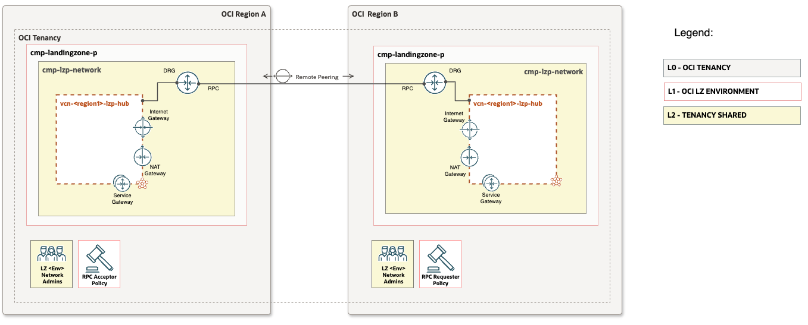
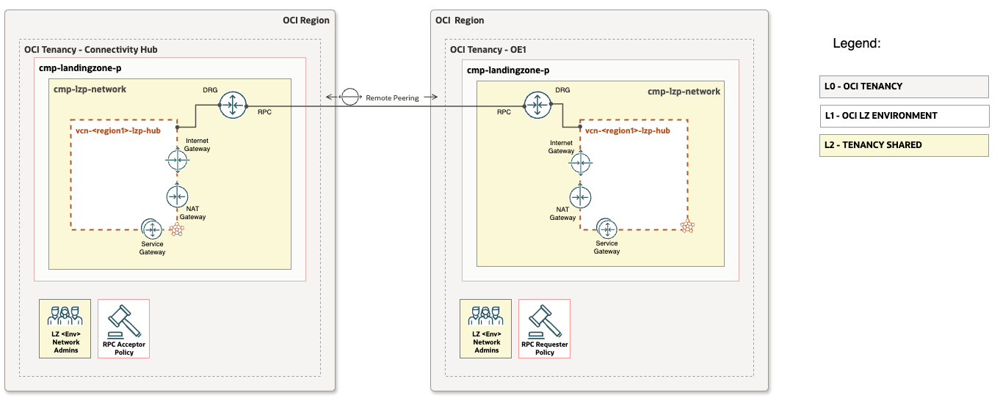

# **[OCI Remote Peering Connections](#)**
## **An OCI Open LZ [Addon](#) for Remote Peering Across Regions and Tenancies using IaC**
&nbsp;
## **Overview**
The IaC-driven configuration enables connectivity between two regions in same tenancy and across multiple tenancies. It includes all necessary RPC configurations, such as IAM policies, RPC setup, and connection establishment. This approach ensures consistency, simplifying administration and reducing complexity in managing RPC across OCI regions and tenancies.

This document provides configuration views for the following use cases:
- Multi-Tenancy-RPC: Establishes a remote peering connection between the same or different regions across multiple tenancies.
- Single-Tenancy-RPC: Establishes a remote peering connection between two regions within a single tenancy.


&nbsp;

### OCI multi tenancy RPC resources

| Resource | Description |
| - | - |
| [IAM Policies](https://docs.oracle.com/en-us/iaas/Content/Network/Tasks/drg-iam.htm#scenario_m__IAM_cross-tenancy) | A set of policies is required to establish connectivity between two tenancies. These policies authorize and admit connectivity from different tenancies, ensuring secure and controlled access to networking resources. |
| [Remote Peering Connection (RPC)](https://docs.oracle.com/en-us/iaas/Content/Network/Tasks/drg-rpc-create.htm#drg-rpc-create) | A Remote Peering Connection (RPC) must be created in both tenancies to establish connectivity between them. This involves configuring a dynamic routing gateway (DRG) in each tenancy and setting up the necessary peerings. |


### OCI X Tenancy RPC Setup
This guide details steps to set up a Remote Peering Connection (RPC) in OCI, ensuring secure, seamless network connectivity across tenancies and multi-region setups for distributed workloads.


## 1. Single Tenancy Multi-Region
Configuration details:
  - The Region A & Region B comprises the following resources.
    - Dynamic Routing Gateway (DRG) and Remote Peering Connection (RPC)



### Steps to Set Up Multi-Region RPC
Any of the Landing Zone [Blueprints](https://github.com/oci-landing-zones/oci-landing-zone-operating-entities/tree/master/blueprints) can be deployed across both tenancies Connectivity Hub and Child/OE to establish a structured and automated framework for configuring cross-tenancy networking.

#### Configuration Update & Execution in Region A
***Step 1: Add the Remote Peering Connection (RPC) Block*** <br>
Modify the network JSON config of Region A by adding the RPC block under the DRG section.

***Step 2: Execute the Terraform Deployment*** <br>
`Plan` and `Apply` the newly added RPC configuration.Collect the RPC OCID upon successful deployment.

#### Configuration Update & Execution in Region B
***Step 1: Add the Remote Peering Connection (RPC) Block***<br>
Modify the network JSON config of Region B by adding the RPC block under the **DRG** section. Set the `peer_id` parameter to the RPC OCID collected from the Region A.

***Step 2: Execute the Terraform Deployment***<br>
`Plan` and `Apply` the newly added RPC configuration. Verify the deployment is successful and that the RPC is established.

> [!NOTE]
> Since this is within the same tenancy across multiple regions, no additional RPC IAM policy is required to administer and establish the connection.

&nbsp;


## 2. Multi-Tenancy-RPC
&nbsp;
Configuration details:
  - The Connectivity Hub tenancy comprises the following resources and components:
    - Dynamic Routing Gateway (DRG) and Remote Peering Connection (RPC)
    - IAM policy (Acceptor) statements to accept the remote peering connection from other/spoke tenancy. 
  - The Child/OE Tenancy comprises the following resources and components
    - Dynamic Routing Gateway (DRG) and Remote Peering Connection (RPC)
    - IAM policy (Requestor) statements to request the remote peering connection to the Connectivity Hub tenancy. 




#### IAM Policy Syntax for Connectivity Hub Tenancy

```
"policies_configuration": {
        "enable_cis_benchmark_checks": "false",
        "supplied_policies": {
            "PCY-RPC-ACCEPTOR": {
                "name": "pcy-rpc-acceptor",
                "description": "Open LZ policy for aaccepting RPC connections in the tenancy.",
                "compartment_id": "TENANCY-ROOT",
                "statements": [
                    "Define group requestorGroup as ocid1.group.oc1..aaaaa...u5scwsqczu7xf67jozkkbl3hj...kjzqq5gxll4ppiwgtq",
                    "Define tenancy Requestor as ocid1.tenancy.oc1..aaaaaaaatvskd4rq2srf5santd4....kskkoueyqx....shsxart4535oeq",
                    "Define compartment acceptorCompartment as ocid1.compartment.oc1..aaaampuojexo4zj....a4u2idgqbyd3ndzyp....3mtxz2z2uq",
                    "Admit group requestorGroup of tenancy Requestor to manage remote-peering-to in compartment cmp-landingzone-rpc:cmp-lzp-network"
                ]
            }
        }
    }
```

#### IAM Policy Syntax for Child/OE Tenancy
```
"policies_configuration": {
        "enable_cis_benchmark_checks": "false",
        "supplied_policies": {
            "PCY-RPC-REQUESTOR": {
                "name": "pcy-rpc-requester",
                "description": "Open LZ policy for aaccepting RPC connections in the tenancy.",
                "compartment_id": "TENANCY-ROOT",
                "statements": [
                    "Define group requestorGroup as ocid1.group.oc1..aaaaaaaaw...zkkbl3hjsnq...xll4ppiwgtq",
                    "Define compartment requestorCompartment as ocid1.compartment.oc1..aaaaaaaack6q...7jmuupbtq23zwx...djhlffoya3ypsphprk5q",
                    "Define tenancy Acceptor as ocid1.tenancy.oc1..aaaaaaaaval...gouqsvea6opiyo...g5c7sggk2pcvbxq",
                    "Allow group requestorGroup to manage remote-peering-from in compartment cmp-landingzone-rpc:cmp-lzp-network",
                    "Endorse group requestorGroup to manage remote-peering-to in tenancy Acceptor"
                ]
            }
        }
    }
```


> [!NOTE]
> Collect the following required OCIDs from both tenancies to configure the necessary policies in each tenancy. The Child/OE tenancy acts as the requester, while the Hub tenancy serves as the acceptor, approving RPC requests from the Child/OE tenancies.
>- `requestorGroup` (Child/OE Tenancy) → OCID of the network administrator group.
>- `Requestor` Tenancy → OCID of the Child/OE tenancy.
>- `acceptorCompartment` (Hub Tenancy) → OCID of the compartment where the RPC is established.
>- `Acceptor` Tenancy → OCID of the Shared/Hub tenancy.
> 
> Refer to the hub_iam.auto.tfvars.json and oe1_iam.auto.tfvars.json files for the complete IAM (Compartments, Groups & Policies) configuration sample template based on One-OE.
>
> For more details, refer to the [OCI Cross Tenancy RPC Policy Documentation](https://docs.oracle.com/en-us/iaas/Content/Network/Tasks/drg-iam.htm#scenario_m__IAM_cross-tenancy). 


### Steps to Set Up Cross-Tenancy RPC
Any of the Landing Zone [Blueprints](https://github.com/oci-landing-zones/oci-landing-zone-operating-entities/tree/master/blueprints) can be deployed across both tenancies Connectivity Hub and Child/OE to establish a structured and automated framework for configuring cross-tenancy networking.

#### Configuration Update & Execution in Connectivity Hub Tenancy
***Step 1: Add the RPC IAM Policy (Acceptor)***<br>
Update the IAM JSON config with the Acceptor policy in the Connectivity Hub tenancy.

***Step 2: Add the Remote Peering Connection (RPC) Block***<br>
Modify the network JSON config of the Connectivity Hub tenancy by adding the RPC block under the DRG section.

***Step 3: Execute the Terraform Deployment***<br>
`Plan` and `Apply` the newly added IAM policy & RPC configuration.Collect the RPC OCID upon successful deployment.

#### Configuration Update & Execution in Child/OE Tenancy
***Step 1: Add the RPC IAM Policy (Requestor)***<br>
Update the IAM JSON config with the Requestor policy in the Child/OE tenancy.

***Step 2: Add the Remote Peering Connection (RPC) Block***<br>
Modify the network JSON config of the Child/OE tenancy by adding the RPC block under the **DRG** section. Set the `peer_id` parameter to the RPC OCID collected from the Connectivity Hub tenancy.

***Step 3: Execute the Terraform Deployment***<br>
`Plan` and `Apply` the newly added IAM policy & RPC configuration. Verify the deployment is successful and that the RPC is established.

> [!IMPORTANT]
>Ensure that the user performing Terraform automation belongs to the group specified in the RPC policy. Otherwise, the connection will not establish. From a One-OE standpoint, this group should be `grp-lzp-network-admins`.
>
> Refer to the runtime directory files hub_network.auto.tfvars.json and oe1_iam.network.tfvars.json files for the complete networking configuration sample template based on One-OE.

&nbsp;

#### Summary
This addon enhances the OCI [One-OE Landing Zone](https://github.com/oci-landing-zones/oci-landing-zone-operating-entities/tree/master/blueprints/one-oe/runtime/one-stack) with IaC-driven Remote Peering Connections (RPC) for two use cases. Multi-Tenancy-RPC links tenancies across regions, and Single-Tenancy-RPC connects regions within a tenancy. It automates IAM policies, DRGs, and RPC setup for secure, scalable, and centralized network management in OCI.

&nbsp;
#### License
Copyright (c) 2025 Oracle and/or its affiliates.

Licensed under the Universal Permissive License (UPL), Version 1.0.

See [LICENSE](/LICENSE.txt) for more details.
