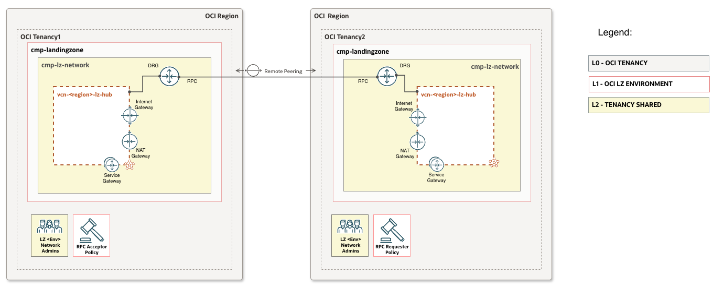

# OCI Remote Peering Connection Add-on

The OCI Remote Peering Connection (X-RPC) add-on extends a current One-OE Landing Zone with the network and, when required, IAM configuration needed to connect VCNs in different OCI regions.

This add-on supports:

- Same-tenancy, cross-region RPC
- Cross-tenancy, cross-region RPC
- Multiple named RPC connections per Landing Zone
- Dynamic environment and platform VCNs, including OKE VCNs produced by registered extensions



## Design Boundary

One-OE remains responsible for the complete Landing Zone, including governance, compartments, identity domains, groups, baseline policies, hub and spoke VCNs, the base DRG, security, and observability.

X-RPC adds only:

- RPC objects and DRG attachments
- RPC-specific DRG route tables, route distributions, import statements, and route rules
- VCN and NSG route surfaces required for reviewed remote CIDRs
- Minimal cross-tenancy IAM policies when the peer is in another tenancy

There is no RPC governance fragment. Same-tenancy RPC requires no additional IAM fragment.

The source of truth is the current generator under [`gen/`](../../gen/). Files under [`runtime/`](./runtime/) are generated, working reference fragments. They are not complete One-OE configurations and must not be used as the implementation source.

## Configuration Model

Define each connection under top-level `remote_peering_connections` in the source configuration used by Blueprint Factory or the LZ Agent.

### Acceptor

The acceptor creates the RPC and omits `peer_id`:

```jsonnet
remote_peering_connections: {
  production: {
    remote_cidrs: ['10.1.0.0/21', '10.1.64.0/21'],
    peer_region_name: 'eu-amsterdam-1',
  },
},
```

### Requestor

The requestor points to the acceptor RPC by OCID or an orchestrator dependency key:

```jsonnet
remote_peering_connections: {
  connectivity_hub: {
    remote_cidrs: ['10.0.0.0/21', '10.0.64.0/21'],
    peer_id: 'ocid1.remotepeeringconnection.oc1.eu-frankfurt-1.example',
    peer_region_name: 'eu-frankfurt-1',
  },
},
```

`remote_cidrs` must contain the reviewed, routable VCN CIDRs on the peer side. Environment names and counts are not fixed; the generator derives local routed VCNs from the customer configuration.

## Cross-Tenancy IAM

For a cross-tenancy acceptor, add the requestor tenancy and foreign requestor group:

```jsonnet
peer_tenancy_ocid: 'ocid1.tenancy.oc1..requestor',
requestor_group_ocid: 'ocid1.group.oc1..requestor-network-admin',
```

For a cross-tenancy requestor, add the acceptor tenancy but do not provide `requestor_group_ocid`:

```jsonnet
peer_tenancy_ocid: 'ocid1.tenancy.oc1..acceptor',
```

The generated IAM policies use these identities:

| Side | Identity reference | Permission direction |
|---|---|---|
| Acceptor | Foreign requestor group OCID | Admit `remote-peering-to` |
| Requestor | Local `'id_lz_common'/'grp-lz-network-admin'` | Allow `remote-peering-from` and endorse `remote-peering-to` |

The requestor group OCID is needed only by the acceptor because the group is foreign there.

## Routing

The builder discovers all local network-producing environments and platforms dynamically. It adds the RPC attachment and the additional route/import rules required for the configured remote CIDRs while preserving the existing One-OE DRG design.

Hub A, Hub B, and Hub C use the common firewall-hub RPC routing model, where RPC traffic follows the existing hub/firewall route path. Hub E uses its direct DRG import-distribution routing model. The add-on does not invent or modify customer-specific Network Firewall security policy; verify that the deployed policy permits the approved traffic.


> [!NOTE]
> The diagram is a working reference for establishing cross-tenancy RPC and designing DRG routing for a specific architecture. Tenancy 1 and Tenancy 2 may use different supported hub and firewall patterns, including firewalls on both sides, on one side, or neither side.

## Generate

The paired Blueprint Factory examples demonstrate a Frankfurt acceptor and Amsterdam requestor:

- [Cross-tenancy acceptor config](../oci-lz-blueprint-factory/examples/05-xrpc-cross-tenancy-acceptor.json)
- [Cross-tenancy requestor config](../oci-lz-blueprint-factory/examples/06-xrpc-cross-tenancy-requester.json)

Generate a complete current One-OE output set from either source config:

```bash
bash gen/generate.sh --config <config-file> <output-directory>
```

For the cross-tenancy deployment order, dependency handoff, and validation steps, see the [execution guide](./execution.md).

## Complete Generated Examples

The [`examples/complete-one-oe/`](./examples/complete-one-oe/) directory publishes complete acceptor and requester One-OE output sets from the paired Blueprint Factory source configurations. These examples provide a manual review and deployment starting point without making generated JSON the implementation source.

Regenerate or verify the examples after any generator, source configuration, formatter, or publication change:

```bash
bash addons/oci-x-rpc/examples/complete-one-oe/regenerate.sh
bash addons/oci-x-rpc/examples/complete-one-oe/verify.sh
```

Edit the source configuration and regenerate rather than editing generated JSON directly.

## Reference Fragments

The generated files under [`runtime/`](./runtime/) show the RPC-only delta for four roles:

- Same-tenancy acceptor network
- Same-tenancy requestor network
- Cross-tenancy acceptor network and IAM
- Cross-tenancy requestor network and IAM

Use the complete files generated from the customer source config for deployment. Use the compact runtime files for review, testing, and semantic comparison.

## References

- [OCI Remote Peering through an upgraded DRG](https://docs.oracle.com/en-us/iaas/Content/Network/Tasks/scenario_e.htm)
- [OCI IAM policies for routing between VCNs](https://docs.oracle.com/en-us/iaas/Content/Network/Tasks/drg-iam.htm)
- [OCI Landing Zones](https://www.oracle.com/cloud/architecture-and-regions/landing-zones/)

## License

Copyright (c) 2024 Oracle and/or its affiliates.

Licensed under the Universal Permissive License (UPL), Version 1.0.
