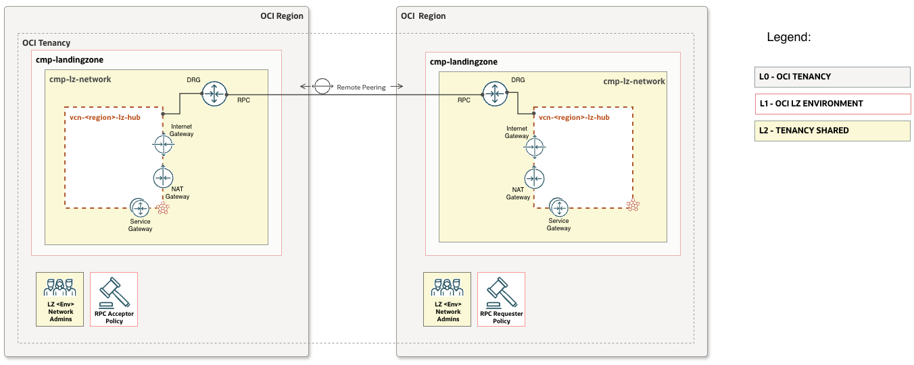

# OCI Remote Peering Connections

## An OCI Open LZ Add-on for Remote Peering Across Regions and Tenancies Using IaC

## Overview

This add-on extends the OCI Landing Zone Operating Entities (One-OE) network configuration with Remote Peering Connections (RPCs). It supports connectivity between regions in the same tenancy and between regions in different tenancies. Cross-tenancy deployments also include the IAM policies required for the requester and acceptor to establish the peering.

This document covers two reference scenarios:

- **Single-tenancy, multi-region RPC:** Connects two OCI regions within the same tenancy.
- **Cross-tenancy, multi-region RPC:** Connects OCI regions in different tenancies.

## RPC Resources

| Resource | Description |
|---|---|
| [Remote Peering Connection (RPC)](https://docs.oracle.com/en-us/iaas/Content/Network/Tasks/drg-rpc-create.htm#drg-rpc-create) | Each participating region requires an RPC associated with its Dynamic Routing Gateway (DRG). The requester uses the acceptor RPC OCID to establish the peering. |
| [Cross-tenancy IAM policies](https://docs.oracle.com/en-us/iaas/Content/Network/Tasks/drg-iam.htm#scenario_m__IAM_cross-tenancy) | Cross-tenancy RPC requires requester-side Allow and Endorse statements and an acceptor-side Admit statement. These additional policies are not required for same-tenancy RPC. |

## 1. Single-Tenancy, Multi-Region RPC

### Configuration Details

- **Region 1 - Acceptor**
  - Represents the primary region in this reference pattern.
  - Contains a DRG and the acceptor RPC.
  - Does not require a peer reference in its RPC configuration.
- **Region 2 - Requester**
  - Represents an additional subscribed region, such as a disaster recovery region.
  - Contains a DRG and the requester RPC.
  - References the Region 1 acceptor RPC OCID to establish the peering.
- No additional cross-tenancy IAM policies are required because both RPCs are in the same tenancy.

Reference network configurations:

- [Region 1 acceptor network](./runtime/same_tenancy_region1_acceptor_network.json)
- [Region 2 requester network](./runtime/same_tenancy_region2_requester_network.json)



### Steps to Set Up a Single-Tenancy, Multi-Region RPC

Any supported Landing Zone [blueprint](https://github.com/oci-landing-zones/oci-landing-zone-operating-entities/tree/master/blueprints) can be deployed in each subscribed region of the tenancy to provide a structured and automated foundation for single-tenancy, multi-region networking. The X-RPC network configuration extends these regional deployments with remote peering.

#### Region 1 - Acceptor

1. Review and adapt the [Region 1 acceptor network configuration](./runtime/same_tenancy_region1_acceptor_network.json).
2. Add the acceptor RPC configuration to the Region 1 DRG network configuration.
3. Run Terraform `plan` and `apply`.
4. After the deployment succeeds, collect the Region 1 acceptor RPC OCID.

#### Region 2 - Requester

1. Review and adapt the [Region 2 requester network configuration](./runtime/same_tenancy_region2_requester_network.json).
2. Add the requester RPC configuration to the Region 2 DRG network configuration and reference the Region 1 acceptor RPC OCID.
3. Run Terraform `plan` and `apply`.
4. Verify that the RPC status is **Peered** and validate the configured routes.

## 2. Cross-Tenancy, Multi-Region RPC

### Configuration Details

- **Tenancy 1 - Acceptor**
  - Contains the Hub A network, DRG, and acceptor RPC.
  - Defines the Tenancy 2 requester tenancy and foreign requester group OCIDs.
  - Includes the Admit policy that authorizes the requester group to establish the peering.
- **Tenancy 2 - Requester**
  - Contains the Hub B network, DRG, and requester RPC.
  - Defines the Tenancy 1 acceptor tenancy OCID.
  - Includes the Allow and Endorse policies required to initiate the peering.

Reference configurations:

- [Tenancy 1 acceptor governance](./runtime/cross_tenancy1_acceptor_governance.json)
- [Tenancy 1 acceptor IAM](./runtime/cross_tenancy1_acceptor_iam.json)
- [Tenancy 1 acceptor network](./runtime/cross_tenancy1_acceptor_network.json)
- [Tenancy 2 requester governance](./runtime/cross_tenancy2_requester_governance.json)
- [Tenancy 2 requester IAM](./runtime/cross_tenancy2_requester_iam.json)
- [Tenancy 2 requester network](./runtime/cross_tenancy2_requester_network.json)


### IAM Policy Syntax for Tenancy 1 - Acceptor

```json
{
    "policies_configuration": {
        "enable_cis_benchmark_checks": "false",
        "supplied_policies": {
            "PCY-RPC-ACCEPTOR": {
                "name": "pcy-rpc-acceptor",
                "description": "Open LZ policy for accepting RPC connections in the tenancy.",
                "compartment_id": "TENANCY-ROOT",
                "statements": [
                    "Define group requestorGroup as ocid1.group.oc1..requester-group-ocid",
                    "Define tenancy Requestor as ocid1.tenancy.oc1..requester-tenancy-ocid",
                    "Admit group requestorGroup of tenancy Requestor to manage remote-peering-to in compartment cmp-landingzone:cmp-lz-network"
                ]
            }
        }
    }
}
```

### IAM Policy Syntax for Tenancy 2 - Requester

```json
{
    "policies_configuration": {
        "enable_cis_benchmark_checks": "false",
        "supplied_policies": {
            "PCY-RPC-REQUESTOR": {
                "name": "pcy-rpc-requester",
                "description": "Open LZ policy for requesting RPC connections in the tenancy.",
                "compartment_id": "TENANCY-ROOT",
                "statements": [
                    "Define tenancy Acceptor as ocid1.tenancy.oc1..acceptor-tenancy-ocid",
                    "Allow group 'id_lz_common'/'grp-lz-network-admin' to manage remote-peering-from in compartment cmp-landingzone:cmp-lz-network",
                    "Endorse group 'id_lz_common'/'grp-lz-network-admin' to manage remote-peering-to in tenancy Acceptor"
                ]
            }
        }
    }
}
```

### Required OCIDs

Collect the following OCIDs before configuring the cross-tenancy policies:

- **Requester group OCID:** OCID of the Tenancy 2 network administrator group. This foreign group OCID is referenced by the Tenancy 1 acceptor policy.
- **Requester tenancy OCID:** OCID of Tenancy 2.
- **Acceptor tenancy OCID:** OCID of Tenancy 1.

In this reference topology, Tenancy 1 remains the acceptor. Create a separate acceptor RPC entry in Tenancy 1 for each additional requester region or tenancy.

For further policy guidance, see [IAM Policies for Routing Between VCNs](https://docs.oracle.com/en-us/iaas/Content/Network/Tasks/drg-iam.htm#scenario_m__IAM_cross-tenancy).

### Steps to Set Up a Cross-Tenancy, Multi-Region RPC

#### Step 1 - Prepare Tenancy 2 Requester Identity

1. Review and adapt the [Tenancy 2 requester IAM configuration](./runtime/cross_tenancy2_requester_iam.json).
2. Set the Tenancy 1 acceptor tenancy OCID.
3. Deploy the Tenancy 2 IAM and governance configurations.
4. Collect the Tenancy 2 network administrator group OCID and tenancy OCID.

#### Step 2 - Deploy Tenancy 1 Acceptor

1. Review and adapt the Tenancy 1 acceptor IAM, governance, and network configurations.
2. Set the Tenancy 2 requester tenancy and network administrator group OCIDs in the acceptor IAM policy.
3. Deploy the Tenancy 1 configurations.
4. After the deployment succeeds, collect the Tenancy 1 acceptor RPC OCID.

#### Step 3 - Complete the Tenancy 2 Requester Network

1. Review and adapt the [Tenancy 2 requester network configuration](./runtime/cross_tenancy2_requester_network.json).
2. Configure the requester RPC reference with the Tenancy 1 acceptor RPC OCID.
3. Deploy the Tenancy 2 network configuration.

#### Step 4 - Validate the Peering

1. Verify that both RPCs report the **Peered** status.
2. Confirm the DRG route-table associations, route-distribution imports, and route rules on both sides.
3. Validate connectivity between the approved CIDR ranges.

For detailed deployment sequencing and validation, see the [OCI X-RPC execution guide](./execution.md).

## Summary

This add-on extends the OCI [One-OE Landing Zone](https://github.com/oci-landing-zones/oci-landing-zone-operating-entities/tree/master/blueprints/one-oe/runtime/one-stack) with IaC-driven RPC configuration for same-tenancy and cross-tenancy, multi-region connectivity. It provides reference network configurations for both scenarios and the additional IAM policies required for cross-tenancy peering.

## License

Copyright (c) 2026 Oracle and/or its affiliates.

Licensed under the Universal Permissive License (UPL), Version 1.0.

See [LICENSE](/LICENSE.txt) for more details.
