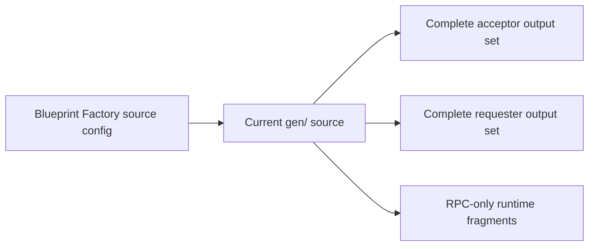

# Complete One-OE X-RPC Examples

This directory contains complete One-OE output sets generated from the current repository source for a representative cross-tenancy RPC topology:

- `acceptor/`: Frankfurt Hub A acceptor
- `requester/`: Amsterdam Hub E requester

These files complement the RPC-only fragments under [`../../runtime/`](../../runtime/). They do not replace the generator or become a second implementation source.

## Source And Output Flow



The source configurations are:

- [Cross-tenancy acceptor](../../../oci-lz-blueprint-factory/examples/05-xrpc-cross-tenancy-acceptor.json)
- [Cross-tenancy requester](../../../oci-lz-blueprint-factory/examples/06-xrpc-cross-tenancy-requester.json)

## Generated Output Sets

The acceptor output contains:

- `governance.json`
- `iam.json`
- `network_pre.json`
- `network.json`
- `security_cis2_pre.json`
- `security_cis2.json`
- `observability_cis2_pre.json`
- `observability_cis2.json`

The requester output contains the same current CIS2 surfaces except `network_pre.json`, which is not required by the selected Hub E topology.

## Regenerate And Verify

From the repository root, regenerate the committed examples with:

```bash
bash addons/oci-x-rpc/examples/complete-one-oe/regenerate.sh
```

Verify that the committed files exactly match canonical generation with:

```bash
bash addons/oci-x-rpc/examples/complete-one-oe/verify.sh
```

Both scripts use canonical `jsonnet` by default. Set `JSONNET_BIN` only when intentionally testing another local renderer; supported CI generation must use canonical `jsonnet`.

## Deployment Boundary

Do not edit generated JSON directly. Update the source configurations with the reviewed customer regions, CIDRs, tenancy OCIDs, requestor group OCID, and acceptor RPC OCID, then regenerate both output sets.

The requester `peer_id` is intentionally a placeholder until the acceptor RPC has been created. Firewall private-IP placeholders and other normal One-OE deployment dependencies must also be resolved through the documented deployment sequence.

Follow the [X-RPC execution guide](../../execution.md) for IAM sequencing, acceptor deployment, RPC OCID handoff, requester deployment, route verification, and traffic validation.

## Validation Status

- Generated with the current `gen/` implementation: yes
- Canonical regeneration and byte-for-byte drift check: automated by `verify.sh`
- Repository generator tests: required before publication
- OCI plan/apply validation of these exact generated output files: pending

The historical JSON configurations were previously validated in OCI, but they use an older One-OE structure. That historical validation must not be represented as validation of these newly generated files.
