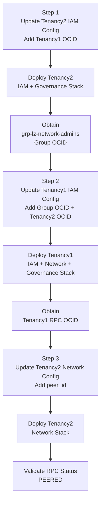

# Cross-Tenancy RPC Execution Guide

## Overview

This guide explains how to configure and establish a **Cross-Tenancy Remote Peering Connection (RPC)** using the **OCI Landing Zone Operating Entities (One-OE)** framework.

The setup enables secure connectivity between **Tenancy1** and **Tenancy2** through OCI DRG Remote Peering Connections (RPCs).

---

# Execution Flow



---

# Step 1 — Deploy Tenancy2 IAM Configuration

The IAM configuration for **Tenancy2** must be deployed first.

This initial deployment creates the networking administrator group whose OCID is required in the **Tenancy1** IAM policy configuration.

Launch the ORM stack and execute the following configuration files:

- [runtime/tenancy2_iam.auto.tfvars.json](./runtime/tenancy2_iam.auto.tfvars.json)

- [runtime/tenancy2_governance.auto.tfvars.json](./runtime/tenancy2_governance.auto.tfvars.json)

Ensure the RPC requester policy includes the correct **Acceptor Tenancy OCID (Tenancy1 OCID)** before deployment.

After successful execution:

- The group `grp-lz-network-admins` will be created.

- Obtain the generated Group OCID.

- This Group OCID will be required while configuring the Tenancy1 IAM policy.

---

## Example — Tenancy2 RPC IAM Policy

```json

"policies_configuration": {

    "enable_cis_benchmark_checks": "false",

    "supplied_policies": {

        "PCY-RPC-REQUESTOR": {

            "name": "pcy-rpc-requester",

            "description": "Open LZ policy for requesting RPC connections in the tenancy.",

            "compartment_id": "TENANCY-ROOT",

            "statements": [

                "Define tenancy Acceptor as <Tenancy1 OCID>",

                "Allow group 'id_lz_common'/'grp-lz-network-admin' to manage remote-peering-from in compartment cmp-landingzone:cmp-lz-network",

                "Endorse group 'id_lz_common'/'grp-lz-network-admin' to manage remote-peering-to in tenancy Acceptor"

            ]

        }

    }

}

```

---

# Step 2 — Deploy Tenancy1 IAM, Network, and Governance Configuration

Once the Tenancy2 IAM deployment is completed:

- Obtain the `grp-lz-network-admins` Group OCID.

- Obtain the Tenancy2 OCID.

Update the Tenancy1 IAM configuration with:

- Requestor Group OCID

- Requestor Tenancy OCID

Launch the ORM stack in **Tenancy1** using the following configuration files:

- [runtime/tenancy1_iam.auto.tfvars.json](./runtime/tenancy1_iam.auto.tfvars.json)

- [runtime/tenancy1_network.auto.tfvars.json](./runtime/tenancy1_network.auto.tfvars.json)

- [runtime/tenancy1_governance.auto.tfvars.json](./runtime/tenancy1_governance.auto.tfvars.json)

---

## Example — Tenancy1 RPC IAM Policy

```json

"policies_configuration": {

    "enable_cis_benchmark_checks": "false",

    "supplied_policies": {

        "PCY-RPC-ACCEPTOR": {

            "name": "pcy-rpc-acceptor",

            "description": "Open LZ policy for accepting RPC connections in the tenancy.",

            "compartment_id": "TENANCY-ROOT",

            "statements": [

                "Define group requestorGroup as <Network Group OCID from Tenancy2>",

                "Define tenancy Requestor as <Tenancy2 OCID>",

                "Admit group requestorGroup of tenancy Requestor to manage remote-peering-to in compartment cmp-landingzone:cmp-lz-network"

            ]

        }

    }

}

```

---

# Step 3 — Complete Tenancy2 Network Deployment

After successful deployment of the Tenancy1 stack:

- Obtain the generated RPC OCID from Tenancy1.

- Update the Tenancy2 network configuration with the RPC peer OCID.

Example:

```json

"peer_id": "ocid1.remotepeeringconnection.oc1..."

```

Launch or update the ORM stack using the following configuration file:

- [runtime/tenancy2_network.auto.tfvars.json](./runtime/tenancy2_network.auto.tfvars.json)

Re-run the ORM stack deployment after updating the `peer_id`.

---

# Step 4 — Validate RPC Connectivity

After successful deployment:

- Verify the RPC status is `PEERED`

- Verify DRG Remote Peering Attachments are connected

- Verify route rules are configured properly

- Validate cross-tenancy network communication

The RPC status can be verified from:

- OCI Console

- DRG Remote Peering Attachments

- Terraform/ORM outputs

---

# Reference Configuration Files

## Tenancy1

- [runtime/tenancy1_iam.auto.tfvars.json](./runtime/tenancy1_iam.auto.tfvars.json)

- [runtime/tenancy1_network.auto.tfvars.json](./runtime/tenancy1_network.auto.tfvars.json)

- [runtime/tenancy1_governance.auto.tfvars.json](./runtime/tenancy1_governance.auto.tfvars.json)

## Tenancy2

- [runtime/tenancy2_iam.auto.tfvars.json](./runtime/tenancy2_iam.auto.tfvars.json)

- [runtime/tenancy2_network.auto.tfvars.json](./runtime/tenancy2_network.auto.tfvars.json)

- [runtime/tenancy2_governance.auto.tfvars.json](./runtime/tenancy2_governance.auto.tfvars.json)

---

> [!IMPORTANT]

> The user executing Terraform/ORM automation must belong to:

>

> - `grp-lz-network-admins`

>

> Otherwise:

>

> - The ORM stack deployment may fail.

> - The OCI Console RPC status may display a `REVOKED` state.

> - Cross-tenancy RPC peering will not be established successfully.

---

# Summary

This implementation enables automated and scalable Cross-Tenancy RPC deployment using the One-OE framework and OCI ORM/Terraform automation.