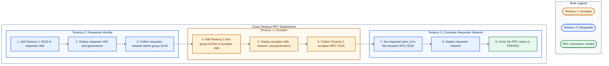

# OCI X-RPC Execution Guide

## Overview

This guide explains how to configure, execute, and efficiently establish both **Same-Tenancy** and **Cross-Tenancy Remote Peering Connections (RPCs)** using the **OCI Landing Zone Operating Entities (One-OE)** framework.

The setup enables secure connectivity between Region 1 and Region 2 in the same tenancy, as well as between **Tenancy 1** and **Tenancy 2**, through OCI DRG Remote Peering Connections.

---

# Cross-Tenancy Execution Flow


```mermaid
flowchart LR
    subgraph PROCESS["Cross-Tenancy RPC Deployment"]
        direction TB

        subgraph REQUESTER_IDENTITY["Tenancy 2 | Requester Identity"]
            direction TB
            A["1. Add Tenancy 1 OCID to requester IAM"]
            B["2. Deploy requester IAM and governance"]
            C["3. Collect requester network-admin group OCID"]
            A --> B --> C
        end

        subgraph ACCEPTOR["Tenancy 1 | Acceptor"]
            direction TB
            D["4. Add Tenancy 2 and group OCIDs to acceptor IAM"]
            E["5. Deploy acceptor IAM, network, and governance"]
            F["6. Collect Tenancy 1 acceptor RPC OCID"]
            D --> E --> F
        end

        subgraph REQUESTER_NETWORK["Tenancy 2 | Complete Requester Network"]
            direction TB
            G["7. Set requester peer_id to the acceptor RPC OCID"]
            H["8. Deploy requester network"]
            I["9. Verify the RPC status is PEERED"]
            G --> H --> I
        end

        C --> D
        F --> G
    end

    subgraph LEGEND["Role Legend"]
        direction TB
        L1(["Tenancy 1 | Acceptor"])
        L2(["Tenancy 2 | Requester"])
        L3(["RPC connection verified"])
    end

    I ~~~ L3

    classDef tenancy1 fill:#fff1d6,stroke:#c65d00,color:#572800,stroke-width:2px;
    classDef tenancy2 fill:#e8f1ff,stroke:#2563eb,color:#102a56,stroke-width:2px;
    classDef verified fill:#e8f7ed,stroke:#16803c,color:#0e4723,stroke-width:2px;
    class A,B,C,G,H,L2 tenancy2;
    class D,E,F,L1 tenancy1;
    class I,L3 verified;

    style PROCESS fill:#ffffff,stroke:#64748b,stroke-width:1.5px,color:#172033
    style REQUESTER_IDENTITY fill:#f6f9ff,stroke:#2563eb,stroke-width:2px,color:#102a56
    style ACCEPTOR fill:#fffaf0,stroke:#c65d00,stroke-width:2px,color:#572800
    style REQUESTER_NETWORK fill:#f6f9ff,stroke:#2563eb,stroke-width:2px,color:#102a56
    style LEGEND fill:#f8fafc,stroke:#64748b,stroke-width:1.5px,color:#172033
```

---

# Same-Tenancy, Multi-Region Execution

Same-tenancy RPC requires network configuration only. No additional cross-tenancy IAM or governance configuration is required.

## Step 1 - Deploy Region 1 As The Acceptor

1. Review and adapt [`same_tenancy1_acceptor_network.json`](./runtime/same_tenancy1_acceptor_network.json) for Region 1.
2. Keep the Region 1 RPC as the acceptor by omitting `peer_id`.
3. `Plan` and `Apply` the Region 1 One-OE network configuration.
4. Collect the RPC OCID created in Region 1.

## Step 2 - Deploy Region 2 As The Requester

1. Review and adapt [`same_tenancy2_requester_network.json`](./runtime/same_tenancy2_requester_network.json) for Region 2.
2. The golden template uses `peer_key` for orchestrated dependency resolution. For a manual deployment, replace `peer_key` with `peer_id` and set it to the Region 1 acceptor RPC OCID:

```json
"peer_id": "ocid1.remotepeeringconnection.oc1..."
```

Do not keep both `peer_key` and `peer_id` in the same RPC object.

3. `Plan` and `Apply` the Region 2 One-OE network configuration.

## Step 3 - Validate The Same-Tenancy RPC

- Verify the RPC status is `PEERED`.
- Verify both DRG RPC attachments are connected.
- Verify the expected DRG and VCN route rules exist in both regions.
- Validate approved network traffic in both directions.

---

# Cross-Tenancy Execution

In this reference design, **Tenancy 1 always acts as the acceptor** and **Tenancy 2 acts as the requester**. If additional requester regions or tenancies are connected, create a separate acceptor RPC entry in Tenancy 1 for each peer.

# Step 1 - Deploy Tenancy 2 IAM Configuration

The IAM configuration for **Tenancy 2** must be deployed first.

This initial deployment creates the network administrator group whose OCID is required in the **Tenancy 1** IAM policy configuration.

Launch the ORM stack and execute the following configuration files:

- [`cross_tenancy2_requester_iam.json`](./runtime/cross_tenancy2_requester_iam.json)
- [`cross_tenancy2_requester_governance.json`](./runtime/cross_tenancy2_requester_governance.json)

Ensure the RPC requester policy includes the correct **Acceptor Tenancy OCID (Tenancy 1 OCID)** before deployment.

After successful execution:

- The group `grp-lz-network-admin` is created.
- Collect the generated group OCID.
- Use this group OCID in the Tenancy 1 acceptor IAM policy.

---

## Example - Tenancy 2 RPC IAM Policy

```json
"policies_configuration": {
    "enable_cis_benchmark_checks": "false",
    "supplied_policies": {
        "PCY-RPC-REQUESTOR": {
            "name": "pcy-rpc-requester",
            "description": "Open LZ policy for requesting RPC connections in the tenancy.",
            "compartment_id": "TENANCY-ROOT",
            "statements": [
                "Define tenancy Acceptor as <Tenancy 1 OCID>",
                "Allow group 'id_lz_common'/'grp-lz-network-admin' to manage remote-peering-from in compartment cmp-landingzone:cmp-lz-network",
                "Endorse group 'id_lz_common'/'grp-lz-network-admin' to manage remote-peering-to in tenancy Acceptor"
            ]
        }
    }
}
```

---

# Step 2 - Deploy Tenancy 1 IAM, Network, And Governance Configuration

After the Tenancy 2 IAM deployment:

- Collect the `grp-lz-network-admin` group OCID.
- Collect the Tenancy 2 OCID.
- Update the Tenancy 1 acceptor IAM configuration with both values.

Launch the ORM stack in **Tenancy 1** using:

- [`cross_tenancy1_acceptor_iam.json`](./runtime/cross_tenancy1_acceptor_iam.json)
- [`cross_tenancy1_acceptor_network.json`](./runtime/cross_tenancy1_acceptor_network.json)
- [`cross_tenancy1_acceptor_governance.json`](./runtime/cross_tenancy1_acceptor_governance.json)

---

## Example - Tenancy 1 RPC IAM Policy

```json
"policies_configuration": {
    "enable_cis_benchmark_checks": "false",
    "supplied_policies": {
        "PCY-RPC-ACCEPTOR": {
            "name": "pcy-rpc-acceptor",
            "description": "Open LZ policy for accepting RPC connections in the tenancy.",
            "compartment_id": "TENANCY-ROOT",
            "statements": [
                "Define group requestorGroup as <Network Group OCID from Tenancy 2>",
                "Define tenancy Requestor as <Tenancy 2 OCID>",
                "Admit group requestorGroup of tenancy Requestor to manage remote-peering-to in compartment cmp-landingzone:cmp-lz-network"
            ]
        }
    }
}
```

After a successful deployment, collect the RPC OCID created in Tenancy 1.

---

# Step 3 - Complete The Tenancy 2 Network Deployment

The golden requester template uses `peer_key` for orchestrated dependency resolution. For a manual deployment, replace `peer_key` with `peer_id` and set it to the Tenancy 1 acceptor RPC OCID:

```json
"peer_id": "ocid1.remotepeeringconnection.oc1..."
```

Do not keep both `peer_key` and `peer_id` in the same RPC object.

Launch or update the ORM stack using:

- [`cross_tenancy2_requester_network.json`](./runtime/cross_tenancy2_requester_network.json)

Re-run the ORM stack after updating `peer_id`.

---

# Step 4 - Validate Cross-Tenancy RPC Connectivity

After successful deployment:

- Verify the RPC status is `PEERED`.
- Verify DRG Remote Peering Attachments are connected.
- Verify route rules are configured correctly.
- Validate approved cross-tenancy network communication.

The RPC status can be verified through:

- OCI Console
- DRG Remote Peering Attachments
- Terraform/ORM outputs

---

# Reference Configuration Files

## Cross-Tenancy Tenancy 1 - Acceptor

- [`cross_tenancy1_acceptor_iam.json`](./runtime/cross_tenancy1_acceptor_iam.json)
- [`cross_tenancy1_acceptor_network.json`](./runtime/cross_tenancy1_acceptor_network.json)
- [`cross_tenancy1_acceptor_governance.json`](./runtime/cross_tenancy1_acceptor_governance.json)

## Cross-Tenancy Tenancy 2 - Requester

- [`cross_tenancy2_requester_iam.json`](./runtime/cross_tenancy2_requester_iam.json)
- [`cross_tenancy2_requester_network.json`](./runtime/cross_tenancy2_requester_network.json)
- [`cross_tenancy2_requester_governance.json`](./runtime/cross_tenancy2_requester_governance.json)

## Same-Tenancy, Multi-Region

- [`same_tenancy1_acceptor_network.json`](./runtime/same_tenancy1_acceptor_network.json)
- [`same_tenancy2_requester_network.json`](./runtime/same_tenancy2_requester_network.json)

---

> [!IMPORTANT]
> The user executing Terraform/ORM automation must belong to `grp-lz-network-admin`. Otherwise, the ORM stack deployment may fail, the OCI Console RPC status may display `REVOKED`, and cross-tenancy peering may not be established successfully.

---

# Summary

This implementation provides scalable same-tenancy multi-region and cross-tenancy RPC deployment using the One-OE framework and OCI ORM/Terraform automation.
