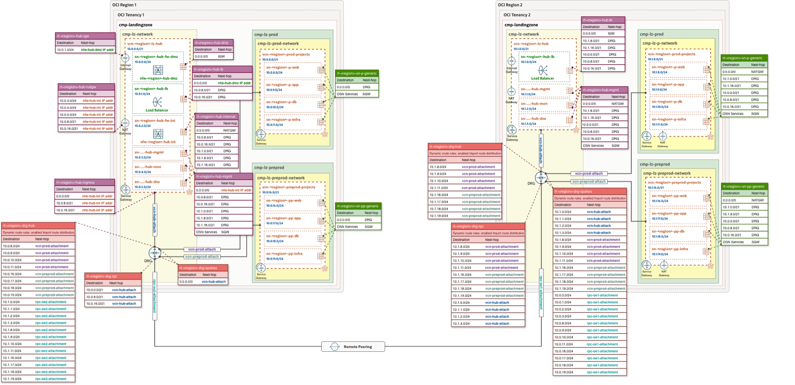

# **[OCI Remote Peering Connections](#)**
## **An OCI Open LZ [Addon](#) for Remote Peering Across Regions and Tenancies using IaC**
&nbsp;
## **DRG Route Table Design and Sample JSON Files**

### 1. DRG Routing Design

The diagram below illustrates a sample routing setup for a multi-tenancy/multi-region RPC configuration. The left side represents Tenancy 1, the acceptor, using **Hub Model A**, while the right side represents Tenancy 2, the requester, using **Hub Model B**.

> [!NOTE]
> The diagram serves as a reference for designing DRG routing based on specific architecture requirements. Tenancy 1 and Tenancy 2 may use different supported DRG and firewall routing designs. The published sample uses firewalls on both sides with Hub A and Hub B.

&nbsp;
### 2. Sample JSON Configuration for RPC

#### Cross-Tenancy Configuration

- **Tenancy 1 - Acceptor**
  - [`cross_tenancy1_acceptor_governance.json`](./cross_tenancy1_acceptor_governance.json) provides the standard One-OE governance baseline.
  - [`cross_tenancy1_acceptor_iam.json`](./cross_tenancy1_acceptor_iam.json) defines the compartments, groups, baseline policies, and cross-tenancy Admit policy required by the acceptor.
  - [`cross_tenancy1_acceptor_network.json`](./cross_tenancy1_acceptor_network.json) defines the Hub A and spoke network, acceptor RPC, DRG attachments, route tables, route distributions, and route rules.
  - For Hub A details, see the [OCI Open LZ Hub A documentation](https://github.com/oci-landing-zones/oci-landing-zone-operating-entities/tree/master/addons/oci-hub-models/hub_a).

- **Tenancy 2 - Requester**
  - [`cross_tenancy2_requester_governance.json`](./cross_tenancy2_requester_governance.json) provides the standard One-OE governance baseline.
  - [`cross_tenancy2_requester_iam.json`](./cross_tenancy2_requester_iam.json) defines the compartments, groups, baseline policies, and cross-tenancy Allow and Endorse policies required by the requester.
  - [`cross_tenancy2_requester_network.json`](./cross_tenancy2_requester_network.json) defines the Hub B and spoke network, requester RPC, DRG attachments, route tables, route distributions, and route rules.
  - For Hub B details, see the [OCI Open LZ Hub B documentation](https://github.com/oci-landing-zones/oci-landing-zone-operating-entities/tree/master/addons/oci-hub-models/hub_b).

Tenancy 1 remains the acceptor in this reference topology. Each additional requester region or tenancy requires its own acceptor RPC entry in Tenancy 1.

#### Same-Tenancy, Multi-Region Configuration

In this reference pattern, Region 1 represents the primary region and always acts as the RPC acceptor. Region 2 represents an additional subscribed region, such as a DR region, and acts as the requester. Additional subscribed regions can follow the Region 2 requester pattern.

- [`same_tenancy_region1_acceptor_network.json`](./same_tenancy_region1_acceptor_network.json) provides the Region 1 Hub A network with the acceptor RPC. As Region 1 is the acceptor, its RPC configuration does not require a peer reference.
- [`same_tenancy_region2_requester_network.json`](./same_tenancy_region2_requester_network.json) provides the Region 2 Hub B network with the requester RPC. The requester references the Region 1 acceptor RPC to establish the peering.

> [!NOTE]
> For orchestrated deployments, configure the requester with `peer_key` to resolve the acceptor RPC dependency. For manual deployments, use `peer_id` with the acceptor RPC OCID collected from Region 1. Configure only the field appropriate to the deployment method.

Same-tenancy RPC requires no additional cross-tenancy IAM or governance configuration. Only the two network templates are published for this scenario.

> [!NOTE]
> The reference JSON configuration files are based on the current One-OE structure. Review and replace all placeholder tenancy OCIDs, group OCIDs, RPC references, firewall private IP OCIDs, CIDRs, regions, and other customer-specific values before deployment. Standard One-OE security and observability configurations remain part of the Landing Zone deployment and are not duplicated here.

For deployment order and validation, see the [OCI X-RPC execution guide](../execution.md).

For customer-specific dynamic generation, see the [X-RPC Blueprint Factory and LZ Agent guide](./x-rpc-blueprint-factory.md).

#### License
Copyright (c) 2026 Oracle and/or its affiliates.

Licensed under the Universal Permissive License (UPL), Version 1.0.

See [LICENSE](/LICENSE.txt) for more details.
