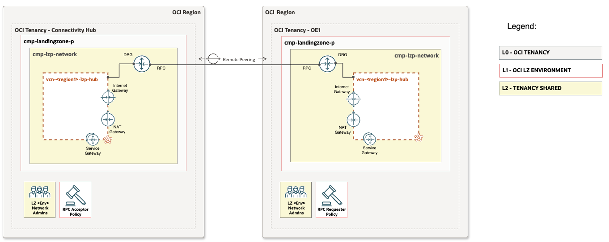

# **[OCI Cross Tenancy Remote Peering Connection configuration](#)**
## **An OCI Open LZ [Addon](#) to setup the cross tenancy remote peering conection uisng IaC**

&nbsp; 

&nbsp;

## **Overview**
This configuration enables to establish connectivity between two regions in same tenancy and across multiple tenancies, managed by a central network team. It includes all necessary RPC configurations, such as policy creation, RPC setup, and connection establishment. This approach ensures consistency, simplifies administration, and eliminates the complexity of managing RPC across multiple OCI tenancies.

This document provides configuration views for the following use cases:
- Multi-Tenancy-RPC: Establishes a remote peering connection between the same or different regions across multiple tenancies.
- Single-Tenancy-RPC: Establishes a remote peering connection between two regions within a single tenancy.


&nbsp;

### OCI multi tenancy RPC resources

| Resource | Description |
| - | - |
| [IAM Policies](https://docs.oracle.com/en-us/iaas/Content/Identity/Concepts/policies.htm) | A set of policies is required to establish connectivity between two tenancies. These policies authorize and admit connectivity from different tenancies, ensuring secure and controlled access to networking resources. |
| [Remote Peering Connection (RPC)](https://docs.oracle.com/en-us/iaas/Content/Network/Tasks/drg-rpc-create.htm#drg-rpc-create) | A Remote Peering Connection (RPC) must be created in both tenancies to establish connectivity between them. This involves configuring a dynamic routing gateway (DRG) in each tenancy and setting up the necessary peerings. |


&nbsp;

### OCI X Tenancy RPC Setup
This guide provides step-by-step instructions for setting up a cross-tenancy Remote Peering Connection (RPC) in OCI. By following this guide, organizations can securely establish network connectivity between multiple tenancies, enabling seamless interconnectivity for distributed workloads. 

&nbsp;

## 1. Multi-Tenancy-RPC
&nbsp;
Configuration details:
  - Primary/Shared Hub tenancy conisits of the following resources and components
    - Dynamic Routing Gateway (DRG) and Remote Peering Connection (RPC)
    - IAM policy (Acceptor) statements to accept the remote peering connection from other/spoke tenancy. 
  - Child/Spoke Tenancy conisits of the following resources and components
    - Dynamic Routing Gateway (DRG) and Remote Peering Connection (RPC)
    - IAM policy (Requestor) statements to request the remote peering connection to the Primary/Shared Hub tenancy. 



&nbsp;

#### IAM Policy Syntax for Primary/Shared Hub Tenancy

```
"policies_configuration": {
        "enable_cis_benchmark_checks": "false",
        "supplied_policies": {
            "PCY-RPC-ACCEPTOR": {
                "name": "pcy-rpc-acceptor",
                "description": "Open LZ policy for aaccepting RPC connections in the tenancy.",
                "compartment_id": "TENANCY-ROOT",
                "statements": [
                    "Define group requestorGroup as ocid1.group.oc1..aaaaa...u5scwsqczu7xf67jozkkbl3hj...kjzqq5gxll4ppiwgtq",
                    "Define tenancy Requestor as ocid1.tenancy.oc1..aaaaaaaatvskd4rq2srf5santd4....kskkoueyqx....shsxart4535oeq",
                    "Define compartment acceptorCompartment as ocid1.compartment.oc1..aaaampuojexo4zj....a4u2idgqbyd3ndzyp....3mtxz2z2uq",
                    "Admit group requestorGroup of tenancy Requestor to manage remote-peering-to in compartment cmp-landingzone-rpc:cmp-lzp-network"
                ]
            }
        }
    }
```

#### IAM Policy Syntax for Child/Spoke Tenancy
```
"policies_configuration": {
        "enable_cis_benchmark_checks": "false",
        "supplied_policies": {
            "PCY-RPC-REQUESTOR": {
                "name": "pcy-rpc-requester",
                "description": "Open LZ policy for aaccepting RPC connections in the tenancy.",
                "compartment_id": "TENANCY-ROOT",
                "statements": [
                    "Define group requestorGroup as ocid1.group.oc1..aaaaaaaaw...zkkbl3hjsnq...xll4ppiwgtq",
                    "Define compartment requestorCompartment as ocid1.compartment.oc1..aaaaaaaack6q...7jmuupbtq23zwx...djhlffoya3ypsphprk5q",
                    "Define tenancy Acceptor as ocid1.tenancy.oc1..aaaaaaaaval...gouqsvea6opiyo...g5c7sggk2pcvbxq",
                    "Allow group requestorGroup to manage remote-peering-from in compartment cmp-landingzone-rpc:cmp-lzp-network",
                    "Endorse group requestorGroup to manage remote-peering-to in tenancy Acceptor"
                ]
            }
        }
    }
```

&nbsp;

> [!NOTE]
> Collect the following required OCIDs from both tenancies to configure the necessary policies in each tenancy. The Child/Spoke tenancy acts as the requester, while the Hub tenancy serves as the acceptor, approving RPC requests from the Child/Spoke tenancies.
>- `requestorGroup` (Child/Spoke Tenancy) → OCID of the network administrator group.
>- `Requestor` Tenancy → OCID of the Child/Spoke tenancy.
>- `acceptorCompartment` (Hub Tenancy) → OCID of the compartment where the RPC is established.
>- `Acceptor` Tenancy → OCID of the Shared/Hub tenancy.
> 
> Refer to the iam_hub.auto.tfvars.json and iam_oe1.auto.tfvars.json files for the complete IAM (Compartments, Groups & Policies) configuration sample template based on One-OE.
>
> For more details, refer to the [OCI Cross Tenancy RPC Policy Documentation](https://docs.oracle.com/en-us/iaas/Content/Network/Tasks/drg-iam.htm#scenario_m__IAM_cross-tenancy). 

&nbsp;

### Steps to Set Up Cross-Tenancy RPC
The expectation is to have the **One-OE Landing Zone:** [One-OE Landing Zone Repository](https://github.com/oci-landing-zones/oci-landing-zone-operating-entities/tree/master/blueprints/one-oe/runtime/one-stack) deployed in both tenancies: Primary/Shared Hub and Child/Spoke. This ensures a structured and automated approach to configuring cross-tenancy networking.

#### Configuration Update & Execution in Primary/Shared Hub Tenancy
***Step 1: Add the RPC IAM Policy (Acceptor)*** :- Update the IAM JSON config with the Acceptor policy in the Primary/Shared Hub tenancy.

***Step 2: Add the Remote Peering Connection (RPC) Block*** :- Modify the network JSON config of the Primary/Shared Hub tenancy by adding the RPC block under the DRG section.

***Step 3: Execute the Terraform Deployment*** :- `Plan` and `Apply` the newly added IAM policy & RPC configuration.Collect the RPC OCID upon successful deployment.

#### Configuration Update & Execution in Child/Spoke Tenancy
***Step 1: Add the RPC IAM Policy (Requestor)*** :- Update the IAM JSON config with the Requestor policy in the Child/Spoke tenancy.

***Step 2: Add the Remote Peering Connection (RPC) Block*** :- Modify the network JSON config of the Child/Spoke tenancy by adding the RPC block under the **DRG** section. Set the `peer_id` parameter to the RPC OCID collected from the Primary/Shared Hub tenancy.

***Step 3: Execute the Terraform Deployment*** :- `Plan` and `Apply` the newly added IAM policy & RPC configuration. Verify the deployment is successful and that the RPC is established.

> [!IMPORTANT]
> Ensure that the user performing Terraform automation belongs to the group specified in the RPC policy. Otherwise, the connection will not establish. From a One-OE standpoint, this group should be `grp-lzp-network-admins`.

&nbsp;

### OCI Single-Tenancy RPC Setup
This guide provides instructions to establish a remote peering connection between two regions within a single tenancy, ensuring secure and seamless connectivity for distributed workloads.

&nbsp;

## 1. Single Tenancy Multi-Region
Configuration details:
  - Region A & Region B conisits of the following resources.
    - Dynamic Routing Gateway (DRG) and Remote Peering Connection (RPC)


&nbsp;

### Steps to Set Up Cross-Tenancy RPC
The expectation is to have the [One-OE Landing Zone Repository](https://github.com/oci-landing-zones/oci-landing-zone-operating-entities/tree/master/blueprints/one-oe/runtime/one-stack) deployed in both tenancies: Primary/Shared Hub and Child/Spoke. This ensures a structured and automated approach to configuring cross-tenancy networking.

#### Configuration Update & Execution in Region A
***Step 1: Add the Remote Peering Connection (RPC) Block*** :- Modify the network JSON config of Region A by adding the RPC block under the DRG section.

***Step 3: Execute the Terraform Deployment*** :- `Plan` and `Apply` the newly added RPC configuration.Collect the RPC OCID upon successful deployment.

#### Configuration Update & Execution in Region B
***Step 2: Add the Remote Peering Connection (RPC) Block*** :- Modify the network JSON config of Region B by adding the RPC block under the **DRG** section. Set the `peer_id` parameter to the RPC OCID collected from the Region A.

***Step 3: Execute the Terraform Deployment*** :- `Plan` and `Apply` the newly added RPC configuration. Verify the deployment is successful and that the RPC is established.

> [!NOTE]
> Since this is within the same tenancy across multiple regions, no additional IAM policy is required to administer and enforce the connection.

&nbsp;

#### Summary


&nbsp;
#### License
Copyright (c) 2025 Oracle and/or its affiliates.

Licensed under the Universal Permissive License (UPL), Version 1.0.

See [LICENSE](/LICENSE.txt) for more details.
