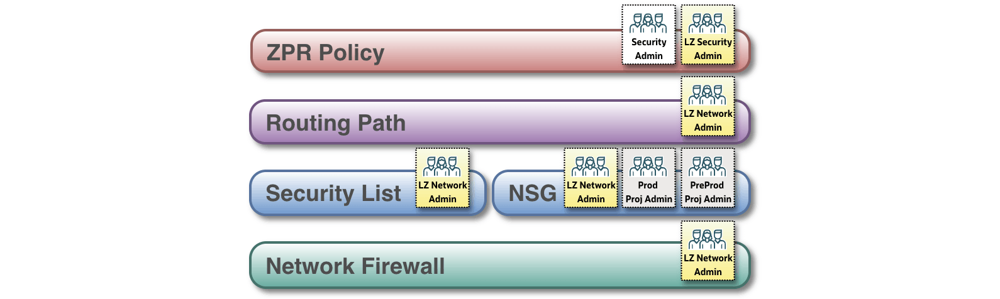
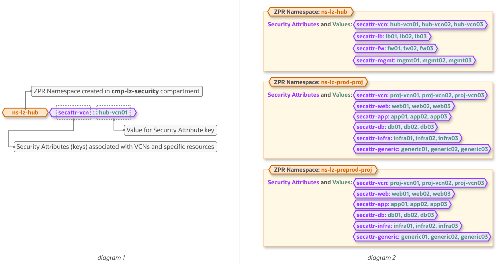
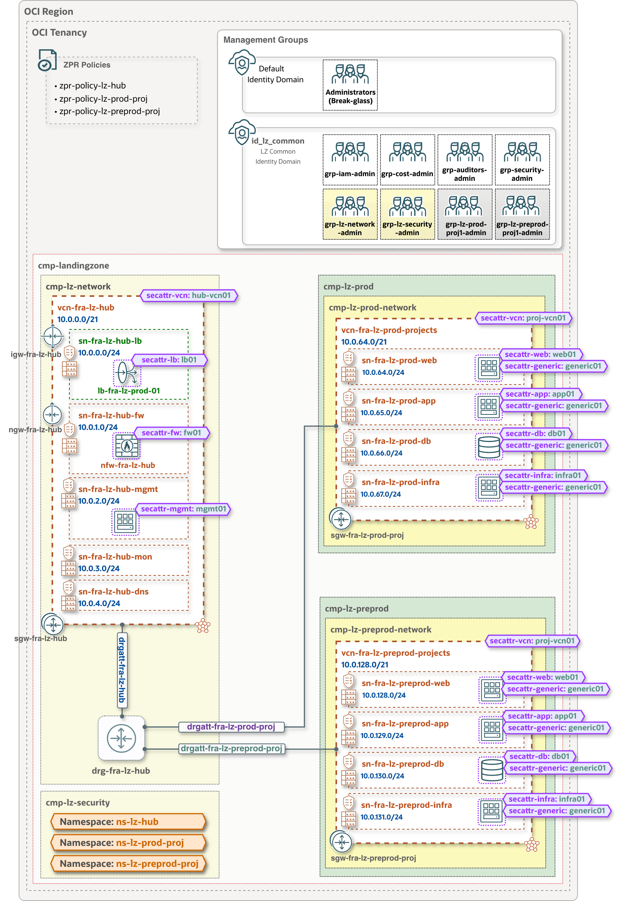
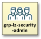
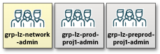

## **[OCI ZPR Addon for Operating Entities Landing Zone](#)**

### **Overview**
This addon integrates OCI **Zero Trust Packet Routing (ZPR)** into the One-OE Landing Zone as an additional network security and governance layer.

The One-OE Landing Zone already uses multiple controls to secure network communication, including **routing, Security Lists, Network Security Groups (NSGs), and Network Firewall**. These controls are primarily managed by the Network and Project administration teams.

The ZPR addon complements these existing controls by introducing an independent, **attribute-based policy layer** managed by the Security administration team. This enables the Security team to enforce organization-wide security and compliance requirements without depending on, or replacing, the underlying network configuration.

ZPR also controls the permitted routing path, ensuring that the traffic follows the network path defined by the ZPR policy rather than using an alternative route, even if that route would otherwise provide connectivity. 
**Note:** ZPR does not create the route itself - the required route must already exist in the underlying route tables; ZPR only determines whether traffic using that network path is authorized.

&nbsp;

A key objective of this addon is to provide a clear segregation of duties between the Network, Project, and Security teams. The diagram below shows the IAM groups responsible for managing each network security layer.

- **Network** and **Project** teams manage network connectivity and traditional network security controls, including routing, Security Lists, NSGs, and Network Firewall.

- **Security** teams manage and govern ZPR Namespaces, Security Attributes, and ZPR Policies that define which protected endpoints are permitted to communicate.

&nbsp;

This model enables each team to independently manage its own security controls, while maintaining a unified enforcement model across all layers.  
Network communication is permitted only when every applicable control allows the traffic, and **a permissive rule in one layer does not override a more restrictive rule in another layer**.

The animations below illustrate this multi-layer enforcement model:

- **First use case - communication allowed:**
The Security team allows communication between the two endpoints through ZPR, while routing, Security Lists or NSGs, and Network Firewall also permit the traffic. Because all applicable controls allow the communication - a logical AND, the destination endpoint can be reached.

&nbsp;

&nbsp;

- **Second use case - communication blocked:**
Routing, Security Lists or NSGs, and Network Firewall allow the traffic, but the Security team does not permit the communication through ZPR policies. Because all applicable controls must allow the traffic, the communication is blocked and the destination endpoint cannot be reached.

&nbsp;

&nbsp;

### ZPR addon structure

A ZPR Namespace is a logical container for a set of related security attributes. Namespaces help organize security attributes and provide a clear administrative boundary for managing and securing them.

A Security Attribute is a label that can be assigned to supported OCI resources and referenced in ZPR policies to control communication between endpoints based on their assigned attributes.

**Diagram 1** presents the structure of a ZPR Namespace and its Security Attribute key-value relationship. **Diagram 2** shows how this structure is implemented in the ZPR addon, including the exact Namespaces, Security Attributes, and values defined in the JSON configuration template.

&nbsp;

The architecture diagram below illustrates the ZPR resources deployed by the ZPR addon as part of the One-OE Landing Zone, including:
- **ZPR Policies**, defined at the tenancy root level.
- **ZPR Namespaces**, each containing its associated Security Attributes and residing in the `cmp-lz-security` compartment.
- **Security Attribute associations**, illustrating how the defined Security Attributes are assigned to Landing Zone workloads and OCI resources.

&nbsp;

> [!NOTE]
> - Although the architecture diagram depicts Security Attributes alongside the workloads to illustrate their association with each resource, the Security Attributes themselves are defined within their respective ZPR Namespaces (see diagram 2) and all reside in the `cmp-lz-security` compartment.
>  - The VM in the `mgmt` subnet and the environment-specific workloads shown in the architecture diagram are included for illustration purposes only and are not part of the standard One-OE deployment.

&nbsp;

The ZPR addon provides the following segregation of duties:
| Groups&nbsp;&nbsp;&nbsp;&nbsp;&nbsp;&nbsp;&nbsp;&nbsp;&nbsp;&nbsp;&nbsp;&nbsp;&nbsp;&nbsp;&nbsp;&nbsp;&nbsp;&nbsp;&nbsp;&nbsp;&nbsp;&nbsp;&nbsp;&nbsp;&nbsp;&nbsp;&nbsp;&nbsp;&nbsp;&nbsp;&nbsp;&nbsp;&nbsp;&nbsp;&nbsp;&nbsp;&nbsp;&nbsp;&nbsp;&nbsp;            | Permissions and Scope |
|:-|:-|
|  | **grp-security-admin** provides tenancy-wide administration of ZPR. Members of this group can manage all ZPR Namespaces, Security Attributes, and ZPR Policies in the tenancy, including the creation of new ZPR Policies. |
|  | **grp-lz-security-admin** manages the ZPR Namespaces and Security Attributes created in the `cmp-lz-security` compartment, as well as the ZPR Policies associated with the deployed One-OE Landing Zone. This group does not have permissions to manage other ZPR Policies in the tenancy. Creation of new ZPR Policies must be performed by the **grp-security-admin** group. |
|  | **grp-lz-network-admin**, **grp-lz-prod-proj1-admin** and **grp-lz-preprod-proj1-admin** can associate the relevant Security Attributes with the network resources and workloads they are responsible for managing. These groups do not manage the ZPR Namespaces or ZPR Policies themselves. |

All the required IAM policies to enforce this segregation of duties are defined in `oneoe_iam.json` and are already included in the deployed One-OE Landing Zone.

&nbsp;

### ZPR addon configuration & deployment

> [!NOTE]
> This guidance provides the ZPR JSON template configuration and reference architecture for a One-OE deployment based on the [Hub B model](https://github.com/oci-landing-zones/oci-landing-zone-operating-entities/blob/master/addons/oci-hub-models/hub_b/readme.md). While Hub B is used as the reference implementation, the overall process applies to all supported [Hub models](https://github.com/oci-landing-zones/oci-landing-zone-operating-entities/blob/master/addons/oci-hub-models/readme.md). 
> ZPR configurations for additional Hub models will be available soon.

&nbsp;

Input configuration for ZPR addon 

| JSON configuration | Configuration-defined components | 
|:-|:-|
| **ZPR addon configuration**  [oneoe_hub_b_zpr.json](oneoe_iam.json) | • ZPR Namespaces  • Security Attributes  • ZPR Policies |

**Prerequisite**: The One-OE Landing Zone must already be deployed before deploying the ZPR addon.

The ZPR addon is deployed as a separate OCI Resource Manager (ORM) stack on top of the existing One-OE Landing Zone. The saved output file generated by the initial One-OE deployment stack is required as a dependency for the ZPR addon stack. 
For more information, see [Invoking the OCI Landing Zones Orchestrator Terraform module
](https://github.com/oci-landing-zones/terraform-oci-modules-orchestrator#how-to-invoke-the-orchestrator)
&nbsp;

#### Deploy with OCI Resource Manager (ORM)

Click&nbsp; [](https://cloud.oracle.com/resourcemanager/stacks/create?zipUrl=https://github.com/oci-landing-zones/terraform-oci-modules-orchestrator/archive/refs/tags/v2.1.3.zip&zipUrlVariables={"input_config_files_urls":"https://raw.githubusercontent.com/oci-landing-zones/oci-landing-zone-operating-entities/master/blueprints/one-oe/runtime/one-stack/oneoe_iam.json,https://raw.githubusercontent.com/oci-landing-zones/oci-landing-zone-operating-entities/master/blueprints/one-oe/runtime/one-stack/oneoe_network_hub_b_pre.json,https://raw.githubusercontent.com/oci-landing-zones/oci-landing-zone-operating-entities/master/blueprints/one-oe/runtime/one-stack/oneoe_observability_cis1_pre.json,https://raw.githubusercontent.com/oci-landing-zones/oci-landing-zone-operating-entities/master/blueprints/one-oe/runtime/one-stack/oneoe_security_cis1_pre.json,https://raw.githubusercontent.com/oci-landing-zones/oci-landing-zone-operating-entities/master/blueprints/one-oe/runtime/one-stack/oneoe_governance.json"})&nbsp; button and follow these steps:

  1. Accept the terms and wait for the stack configuration to load.
  2. Set the working directory to “rms-facade”.
  3. Specify the preferred stack name.
  4. Select Terraform version 1.5.x, then click **Next**.
  5. Use the loaded [oneoe_hub_b_zpr.json](oneoe_iam.json) JSON configuration template, or replace it with your JSON/YAML configuration file.
  6. Under **Dependencies Source for URL-based Configurations**, select the saved output file from the initial One-OE Landing Zone deployment stack.
  7. Deselect **Run apply** and click **Create** to create the ZPR addon stack.

After the stack is created and the required configuration and dependencies have been validated, run **Plan** and then **Apply** to deploy the ZPR addon.

&nbsp;

> [!IMPORTANT]
The ZPR addon creates all required ZPR resources and policies for a `One-OE + Hub B` deployment. However, it **does not** configure Security Attribute associations for the respective workloads or resources, such as Network Firewalls, Load Balancers, compute instances, or databases. As a result, deploying the ZPR addon alone **does not** immediately enforce or block network traffic based on ZPR policies.
>
> To make the ZPR controls fully functional, the required Security Attribute associations **must be** implemented separately, either through an additional deployment stack or manual configuration.

&nbsp;

#### Summary
The OCI ZPR addon adds an attribute-based, zero-trust security layer to the One-OE Landing Zone. It strengthens governance by allowing Security teams to centrally define and enforce communication policies independently of network administration. By limiting access to explicitly authorized endpoints, ZPR helps reduce lateral movement and contain the blast radius of a security incident.

&nbsp; 

#### License
Copyright (c) 2026 Oracle and/or its affiliates.

Licensed under the Universal Permissive License (UPL), Version 1.0.

See [LICENSE](/LICENSE.txt) for more details.