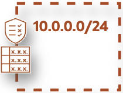

# **The OCI Open LZ &ndash; [Add-ons](#)**

&nbsp; 

Welcome to the **OCI Open LZ Addons**.  

An **add-on** is Landing Zone complementary element, or mechanisms that provide a specific capability to the overall landing zone environment. It can be in form of solutions designs, documentation, IaC configurations, etc.  Find below the list of landing zone add-ons available.

&nbsp; 

|  |  Deployable add-ons  | Description |
|:--:|:-|:-|
|  | **[OCI Network Hubs](/addons/oci-hub-models/readme.md)** | A set of **OCI Network Hub topologies** applicable to any landing zone or OCI deployment. |
|  | **[OCI Private DNS](/addons/oci-private-dns/README.md)** | A set of **OCI Private DNS configurations** applicable to any landing zone or OCI deployment. |
|  | **[OCI Remote Peering Connections](./oci-x-rpc/README.md)** | Setup Remote Peering Connections between regions and tenancies. |
|  | **[OCI Sovereign Landing Zones](./oci-sovereign-landing-zone/readme.md)**| A set of **OCI Sovereign Controls** applicable to any OCI LZ deployment. |
|  | **[OCI Secure Desktops](/addons/oci-secure-desktops/readme.md)** | Guidelines to enable and configure **OCI Secure Desktops** in your Landing Zone. 
|  | **[OCI TBAC](./oci-tbac/README.md)**| Use roles to manage IAM permissions for projects onboarding with **Tag-Based Access Controls**.|
|  | **[OCI FinOps](./oci-finops/README.md)**| A set of **OCI FinOps** configurations with FOCUS to enable cost visibility, governance, and optimization. |

&nbsp; 

|  | Guidance add-ons | Description |
|:--:|:-|:-|
|  | **[OCI Learn LZ](/addons/oci-learn-lz/readme.md)** | A Landing Zone **training** to learn how to design and run a Landing Zone without code. |
|  | **[Landing Zone AI Guidance](/addons/lz-ai/README.md)** | Guidelines to use **AI coding agents** for OCI Landing Zone Operating Entities design and review. |
|  &nbsp;&nbsp;&nbsp;&nbsp;&nbsp;&nbsp;&nbsp;&nbsp;&nbsp;&nbsp;&nbsp; | **[Subnetting Guide](/addons/oci-lz-subnetting/readme.md)** | Guidelines to design your network subnetting between tenancies, landing zone & workload environments, and regions, **improving your landing zone scalability and planning for your future growth**. |
|  |  **[Oracle Access Governance](/addons/oci-oag/README.md)** &nbsp;&nbsp;&nbsp;&nbsp;&nbsp;&nbsp;&nbsp;&nbsp;&nbsp;&nbsp;&nbsp;&nbsp;&nbsp;&nbsp;&nbsp;&nbsp;&nbsp;&nbsp;&nbsp;&nbsp;&nbsp;&nbsp;&nbsp;&nbsp;&nbsp;&nbsp;&nbsp;&nbsp;&nbsp;&nbsp;&nbsp;&nbsp;&nbsp;&nbsp;&nbsp;&nbsp;&nbsp;&nbsp;&nbsp;&nbsp;&nbsp;&nbsp;&nbsp;&nbsp;&nbsp;&nbsp;&nbsp;&nbsp;&nbsp;&nbsp;&nbsp;&nbsp;&nbsp;&nbsp;&nbsp; | Guidelines to increase the **security governance** of your Landing Zones with OAG. |

&nbsp; 

&nbsp; 

# License

Copyright (c) 2026 Oracle and/or its affiliates.

Licensed under the Universal Permissive License (UPL), Version 1.0.

See [LICENSE](/LICENSE.txt) for more details.
