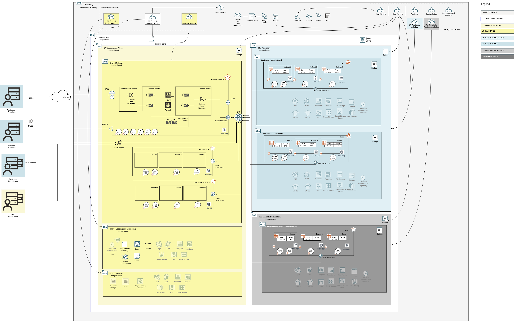
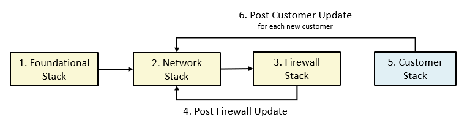

# SaaS Landing Zone Architecture POD Model Blueprint

## 
### Overview

This repository contains the configuration files for OCI SaaS (Software-as-a-Service) Vendor Landing Zone Architecture Pod Model blueprint based on OCI Core Landing Zone (formerly known as OCI CIS Landing Zone) principles. This Blueprint is designed for SaaS vendors and managed service providers to onboard OCI in a streamlined manner that aligns with the CIS OCI Benchmark and best practices for SaaS vendors and managed services vendors.  The Pod model is designed so that each customer gets a copy or application stack.  This pattern can be seen in SaaS and managed services industries where each customer's environment is independent of another, and the only parts shared are the management plane. 

The following architecture diagram depicts a single tenancy blueprint, separating the management plane (red color) from the customer plane (blue and grey) compartments.

### Enclosing Compartment

The enclosing compartment (white) represents the environment of the SaaS offering or a single SaaS offering. The former would separate the production environment from the test environment, and the latter would be SaaS Application 1 and SaaS Application 2. It achieves this by representing the scope for OCI IAM and guard rails used in the SaaS respective environment.  

### Management Plane

The management plane compartment (light yellow) is designed to house the OCI resources that provide the functions and processes that determine which path the data and OCI resources that make up the application are managed. A management plane is similar to a cloud provider's control plane and they are shared resources that are used by all application stacks running in the customer plane compartment (blue). There are three types of functions and processes defined in this blueprint.

#### Management Groups

**Security Administrators:** manage security services and resources including Vaults, Keys, Logging, Vulnerability Scanning, Web Application Firewall, Bastion, Service Connector Hub.

**Network Administrators:** manage OCI network family, including VCNs, Load Balancers, DRGs, VNICs, IP addresses.

**Shared Services Administrators:** manage OCI services that are used amond the different ISV customers as the Resource Manager Stacks with the configurations and state files, OCI Contaner and Image registry, shared Object Storage buckets, Compute instances, API gateway, Kubernetes clusters, Functions and/or any other service that might serve for management aplications for the operation of the different ISV customers.

#### Networking Compartment
The network compartment (yellow) is designed to house the shared Virtual Cloud Networks (VCNs) used to secure and route network traffic to and from the application stack including the Central Hub VCN for centralizing the control and inspection of any incoming/outgoing network traffic and also the needed VCNs for Security and Shared services.

### Customers Plane Compartment
The ISV Customers comaprtment (light blue) holds the different dedicated compartments for each customer which will give to them the needed isolation to hold their workloads. T

#### Customer Groups

**Customer Administrators:** manage application stacks deployments and related resources in the Customer Compartment.  OCI resources include Compartments, Network, Compute images, Database OCI Functions, Kubernetes clusters, Streams, Object Storage, Block Storage, File Storage, Keys, and Budgets.

**Snowflake Customer Administrators:** manage application stacks deployments and related resources in the Snowflake Customer Compartment.  OCI resources include Compartments, Network, Compute images, Database OCI Functions, Kubernetes clusters, Streams, Object Storage, Block Storage, File Storage, Keys, and Budgets.

### Tenancy Level

#### Tenancy Level Groups

**IAM Administrators:** manage IAM services and resources including compartments, groups, dynamic groups, policies, identity providers, authentication policies, network sources, tag defaults. However, this group is not allowed to manage the out-of-box Administrators and Credential Administrators groups. It's also not allowed to touch the out-of-box Tenancy Admin Policy policy.

**Credential Administrators:** manage users capabilities and users credentials in general, including API keys, authentication tokens and secret keys.

**Cost Administrators:** manage budgets and usage reports.

**Auditors:** entitled with read-only access across the tenancy and the ability to use cloud-shell to run the cis_reports.py script.

**Announcement Readers:** for reading announcements displayed in OCI Console.

#### Tenancy Level Resources

**Oracle Cloud Guard:** activity, configuration, and threat detector recipes are defined at the tenancy level to examine your resources for security weaknesses and to monitor operators and users for risky activities.

**Policies:** IAM policies which grants access to the tenancy level wide administrator groups as the IAM, credentials, cost administrator groups, announcement readers, auditors and the specific ISV enclosing, and shared services compartments. It will also contain OCI services needed policies.

**Events:** The events related to CRUD (Create, Read, Update or Delete) state changes of tenancy level resources, as Budget events or Cloud Guard events or reported problems.

**Budgets:** The budgets configured will emit events when reaching the percentage or amount of money configured for a given budget. It will fire an event thatn can be integrated with the OCI Notification services.

**Subscriptions:** The OCI notification subscription will let the subscribers to receive information about an specific topic, as budget topic. By default the subscription type will be by e-mail.

[Click here](design/images/SaaS-pod-architecture_v2.drawio) to download the drawio version.

## Configuration Files

The blueprint is described in configuration files (JSON documents) that can be deployed as-is or changed based on specific requirements. Changes must be done following the requirements and specifications of the respective underlying Terraform module. The idea behind describing Landing Zones as JSON documents is making them fully customizable and declarable in a standard and widespread document format (JSON), while leveraging Terraform's Infrastructure as Code paradigm.

The configuration files are organized in different folders, according to the broader area they belong. The folder structure is the following:

- mgmt-plane: a top level folder for management plane, management groups and Root level resources.
    - bootstrap:
        - [bootstrap.json](runtime/mgmt-plane/bootstrap/bootstrap.json), containing an OCI private bucket allowing for the automation of the composite deployment model. The bucket stores the dependency files that are produced and consumed by the different stacks. 
    - iam: 
        - [iam_config.json](runtime/mgmt-plane/iam/iam_config.json), with the IAM configuration, including compartments, groups and policies.
    - governance: 
        - [budgets_config.json](runtime/mgmt-plane/governance/budgets_config.json), with budgets configuration.
    - security: 
        - [cloud_guard_config.json](runtime/mgmt-plane/security/cloud_guard_config.json), with Cloud Guard configuration.
        - [security_zones_config.json](runtime/mgmt-plane/security/security_zones_config.json), with Security Zones configuration.
        - [scanning_config.json](runtime/mgmt-plane/security/scanning_config.json), with scanning configuration.
    - observability: 
        - [observability_config.json](runtime/mgmt-plane/observability/observability_config.json), with logging, streams, notifications, events, alarms and service connector hub configurations.
    - network: 
        - [network_initial_config.json](runtime/mgmt-plane/network/network_initial_config.json), containing the initial network configuration, with VCNs, subnets, route tables, security lists, network security groups, VCN gateways and DRG.
        - [network_post_firewall_config.json](runtime/mgmt-plane/network/network_post_firewall_config.json), adding route table rule to Network Load Balancer private IP and DRG attachments to the initial network configuration. This configuration is to be executed after the Firewall appliance and OCI Network Load Balancer are provisioned.
        - [network_post_each_customer_config.json](runtime/mgmt-plane/network/network_post_each_customer_config.json), adding route table rules and DRG route table distributions for each on-boarded customer. This configuration is to be executed after each customer onboarding.
    - firewall: [firewall_config.json](runtime/mgmt-plane/firewall/firewall_config.json), with firewall appliance and OCI Network Load Balancer configurations.

- customers: a top level folder for each customer configuration.
    - customer1: [compartments_config.json](runtime/customers/customer1/ccompartments_config.json), [budgets_config.json](runtime/customers/customer1/budgets_config.json), [network_three_tier_config.json](runtime/customers/customer1/network_three_tier_config.json) with sample resources configurations for a customer, including IAM, budget and networking, respectively. Use these files as templates to onboard other customers.

**THESE CONFIGURATION FILES ARE DESIGNED TO BE USED AS TEMPLATES, OWNED AND MODIFIED AT WILL BY CUSTOMERS THAT ARE DEPLOYING THE MODEL.**

## How to Deploy

The blueprint (or any customization) configurations are deployed in separate stacks. A stack is a set of configurations that are managed by a single Terraform execution and thus reflected in a single Terraform state file. The decision factor for how many stacks lies on how the organization wants to manage the environment, especially which roles are expected to deploy which parts of the blueprint. 

On a high level, there are two broader sets of stacks for the ISV blueprint build out: **management plane deployment** and **customer onboarding**.

**Management plane deployment** is composed of the following stacks, that must be executed as the presented order below:
1. **Foundational stack**: assembles bootstrap, IAM, governance, security and observability configuration files in a single stack. As mentioned before, it can be further split depending on deployment requirements. 
2. **Network stack**: manages the management plane network configuration, including all the routing to customer VCNs.
3. **Firewall stack**: manages a pair of PAN (Palo Alto Networks) firewalls, *sandwiched* by a pair of OCI network load balancers.

**Customer onboarding** is made of customer-specific stacks always followed by an update to the Management Plane Network Stack for network routing.

### The OCI Landing Zones Orchestrator

The [OCI Landing Zones Orchestrator](https://github.com/oci-landing-zones/terraform-oci-landing-zones-orchestrator) is a convenience tool for deploying JSON-based landing zones. It also supports YAML documents or Terraform tfvars files with HCL (Hashicorp Language) objects. The only requirement is that the documents/HCL objects are defined according to the requirements and specifications set forth by the OCI Landing Zone core modules, that are available in the following repositories:

- [Identity & Access Management](https://github.com/oracle-quickstart/terraform-oci-cis-landing-zone-iam)
- [Networking](https://github.com/oracle-quickstart/terraform-oci-cis-landing-zone-networking)
- [Governance](https://github.com/oracle-quickstart/terraform-oci-cis-landing-zone-governance)
- [Security](https://github.com/oracle-quickstart/terraform-oci-cis-landing-zone-security)
- [Observability & Monitoring](https://github.com/oracle-quickstart/terraform-oci-cis-landing-zone-observability)
- [Secure Workloads](https://github.com/oracle-quickstart/terraform-oci-secure-workloads)

Next we show how to deploy the blueprint with the Orchestrator per the stacks defined above:

#### Management Plane
The following stacks are executed once each. After stack #4, the management plane network is ready to onboard customers.
 1. [Foundational Stack](design/docs/MPLANE-FOUNDATIONAL.md)
 2. [Network Stack](design/docs/MPLANE-NETWORKING.md#stage1)
 3. [Firewall Stack](design/docs/MPLANE-FIREWALL.md)
 4. [Network Stack Post Firewall Update](design/docs/MPLANE-NETWORKING.md#stage2)

#### Customer Onboarding
The following are executed for each new customer.

 5. [Customer Onboarding Stack](design/docs/CUSTOMER-ONBOARDING.md)
 6. [Network Stack Post Customer Update](design/docs/MPLANE-NETWORKING.md#stage3)

 The diagram below depicts the deployment sequencing. Note that the Network stack must be updated once after Firewall deployment and after each new customer onboarding.

 

