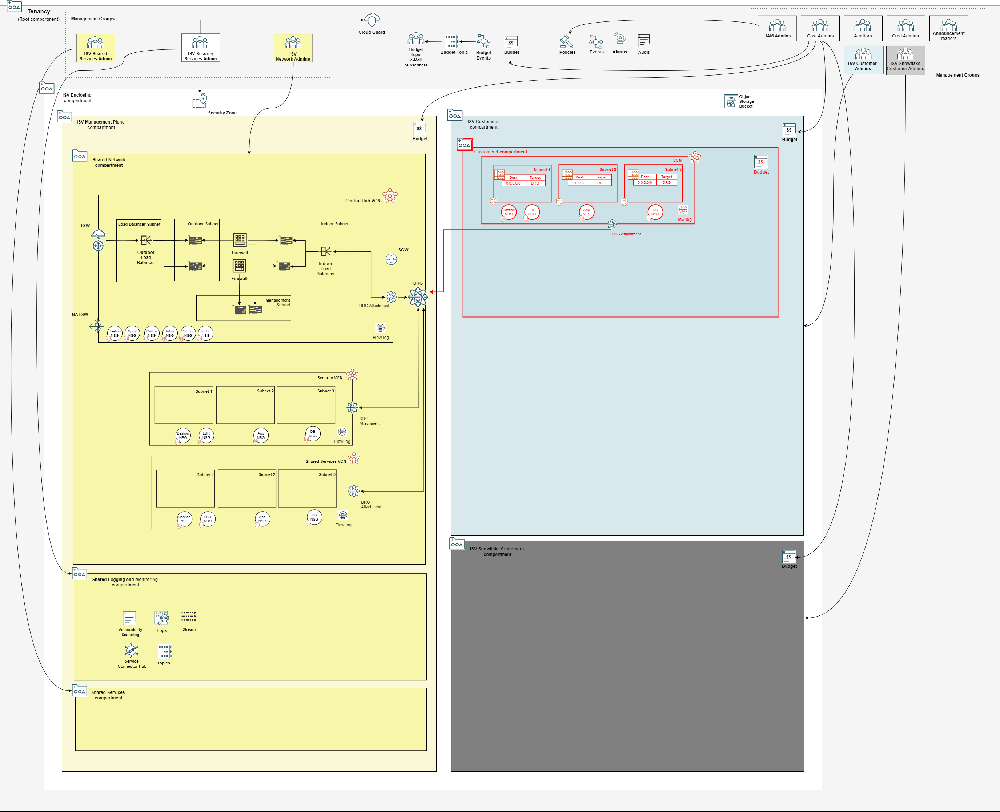

## Customer Onboarding Stack Deployment

A stack that deploys IAM, budget and network configuration for one customer. It initiates the onboarding process of a customer into the tenancy. Each customer is expected to have its own stack. 

### Typically Deployed By

Customers administrators.

### Deployment Sequence

1. [Mgmt Plane Foundational - IAM, Logging, Governance](./MPLANE-FOUNDATIONAL.md)
2. [Mgmt Plane Networking 1st stage - Mgmt Plane VCNs](./MPLANE-NETWORKING.md#stage1)
3. [Mgmt Plane Networking - Firewall](./MPLANE-FIREWALL.md)
4. [Mgmt Plane Networking 2nd stage - Network routing post firewall deployment](./MPLANE-NETWORKING.md#stage2)
5. **Customer Onboarding (this stack)**
6. [Mgmt Plane Networking 3rd stage - Network routing post customer onboarding](./MPLANE-NETWORKING.md#stage3)

### Stack Configuration

Input Configuration Files | Input Dependency Files | Generated Output
--------------------------|------------------------|------------------
[compartments_config.json](../customers/customer1/compartments_config.json), [budgets_config.json](../customers/customer1/budgets_config.json), [network_three_tier_config.json](../customers/customer1/network_three_tier_config.json) | iam/output/compartments_output.json, network/output/network_output.json  | customer1/output/compartments_output.json, customer1/output/network_output.json

### Stack Creation

[](https://cloud.oracle.com/resourcemanager/stacks/create?zipUrl=https://github.com/oci-landing-zones/terraform-oci-modules-orchestrator/archive/refs/heads/main.zip&zipUrlVariables={"input_config_files_urls":"https://raw.githubusercontent.com/andrecorreaneto/oci-landing-zone-configuration/test/customers/customer1/compartments_config.json,https://raw.githubusercontent.com/andrecorreaneto/oci-landing-zone-configuration/test/customers/customer1/budgets_config.json,https://raw.githubusercontent.com/andrecorreaneto/oci-landing-zone-configuration/test/customers/customer1/network_three_tier_config.json","url_dependency_source_oci_bucket":"isv-terraform-runtime-bucket","url_dependency_source":"ocibucket","url_dependency_source_oci_objects":"iam/output/compartments_output.json,network/output/network_output.json","save_output":true,"oci_object_prefix":"customer1/output"})

### What Gets Deployed

The resources in red color are added.

