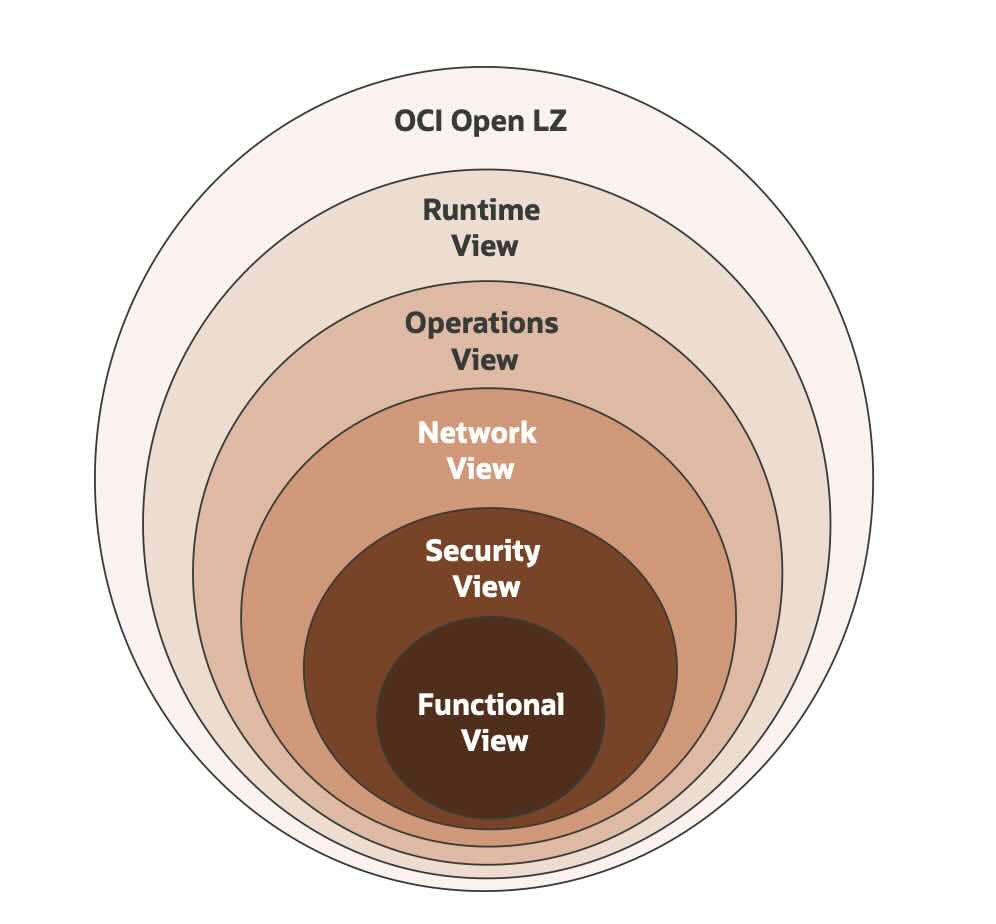

# **The OCI Open LZ &ndash; Multi-OE [Blueprint](#)**

### A Blueprint to Simplify the Onboarding of Organizations, Business Units, and Subsidiaries into OCI

&nbsp; 

**Table of Contents**

[1. Introduction](#1-introduction) 
[2. Functional View](#2-functional-view) 
[3. Security View](#3-security-view) 
[4. Network View](#4-network-view) 
[5. Operations View](#5-operations-view) 
[6. Runtime View](#6-runtime-view)

&nbsp; 

# **1. Introduction**

The OCI Open LZ is a set of public and open assets to onboard OCI, available in a dedicated [Git Repository](https://github.com/oracle-quickstart/terraform-oci-open-lz), containing a complete design **blueprint**, several **IaC** configuration **examples**, and **enablement** activities.

This document is a subset of the OCI Open LZ, and it provides an executive summary of the **Multi-OE blueprint**. The complete blueprint is presented in detail in the [PDF](/blueprints/multi-oe/design/OCI_Open_LZ_Multi-OE-Blueprint.pdf) format and supported by a [Drawio](/blueprints/multi-oe/design/OCI_Open_LZ_Multi-OE-Blueprint.drawio) containing all design diagrams, for reuse while tailoring new landing zones.

For more approaches and assets on OCI Landing Zones refer to the [OCI Landing Zone Framework](https://github.com/oracle-devrel/technology-engineering/blob/main/landing-zones/README.md).

&nbsp; 

## **1.1 Purpose**
The purpose of this document is to:

1. Provide a landing zone design ready to **onboard an enterprise organization** and its functional divisions - identified as **operating entities (OE)** with their teams, departments, and projects.
2. Provide a **cloud-native operating model** to simplify and scale **day 2 operations**.
3. **Enable customers, partners**, and the **general IT community** to **create their own landing zones** with lower efforts through a comprehensive Oracle Cloud Infrastructure (OCI) reference architecture. To support this objective, all the architecture diagrams are provided in a reusable format.
4. Provide **tailoring guidelines** to help adjust the model. This asset can be used directly, tailored, or used as inspiration to create a new one - as it is not a prescribed solution

&nbsp; 
&nbsp; 

## **1.2 Vision**

Welcome to the **OCI Open LZ**, the **Op**erating **En**tities **L**anding **Z**one, a **runnable [blueprint](#)**, to simplify the onboarding of organizations, business units, and subsidiaries into OCI. The following diagram presents its seven key characteristics.

&nbsp; 

&nbsp; 

| # | CHARECTERISTICS| DESCRIPTION   | 
|---|---|---|
| 1 | **Enterprise Organization / Horizontal Scaling**| The OCI Open LZ is designed to simplify the OCI onboarding of an enterprise organization, and its Operating Entities (OE) with their teams, departments, and projects.
| 2 | **Project-Driven Structure / Vertical Scaling** | The OCI Open LZ is ready to onboard several projects and environments, as a base for their related workloads.
| 3 | **Multi-Cloud / Multi-Region** | The OCI Open LZ can exist in several OCI regions and be connected to other landing zones in other CSPs.
| 4 | **Segregation of Duties**  | All OCI Open LZ elements can be segregated in terms of identity and access management. There is an enterprise segregation of resources for shared elements and OE-dedicated elements. An OE can have several OE departments or project owners, which will be responsible for their resources, organized by projects.
| 5 | **Isolation of Resources**| The OCI Open LZ has an isolation of resources at the network level. The network structure is organized by OE, into environments (production and non-production) and resources in those environments are isolated at the project level, where each project layer has its security posture.
| 6 | **Cloud Native Operating Model** | The OCI Open LZ can be operated with a complete GitOps operating model on day 2, using control version repositories as the single source of truth for operations and code. The OCI Open LZ uses Infrastructure as Code (IaC) and IaC configurations on git-versioned repositories.
| 7 | **Automation Patterns** | The OCI Open LZ has a set of operations scenarios for provisioning and changing resources, providing the building blocks to design and automate any other repeatable operations.

&nbsp; 

If **cloud landing zones** are analogous to **airports**, the OCI Open LZ [Blueprint](#) is a highly secure and scalable airport with the possibility of having different terminals (OEs), that can be &ndash; but don't have to be &ndash; operated independently by different companies/subsidiaries. Each terminal can have a different security posture (domestic, international, etc.), teams, and resources, and communication between those terminals, inside or outside the airport, is possible, automated, and secured. 

&nbsp; 

## **1.3 Scope and Organization**

This OCI Open LZ is presented with several design views built on top of each other, as an incremental and repeatable approach, that can be used and tailored by any customer or partner setting up an OCI landing zone. Each view is explored in a dedicated chapter:
1.  The **Functional View** presents the fundamental organizational entities of the OCI Open LZ and how they relate to each other. 
2.  The **Security View** presents the core building blocks of the tenancy organization, identity and access management, and security posture. 
3.  The **Network View**, designed on top of the security, presents how network elements are structured and connected to communicate with each other. 
4.  The **Operations View** presents the dynamic perspective of the OCI Open LZ, proposing a design for provisioning and changing the previous elements with a GitOps operating model, proposing a repository structure - with a clear separation between configuration areas (for operations) and code areas (for developers) - ready for day 1 and day 2 operations. 
5.  The **Runtime View** presents the OCI Open LZ operations artifacts to demonstrate how day 2 operations can run. These elements are ready to be run with a configurable IaC approach.

&nbsp; 

The OCI Open LZ and its views provide a consistent design to simplify the onboarding of OCI with an existing blueprint, that can be changed and tailored toward different objectives. Note the order in which these views are presented is itself a best practice, and it's crucial to reproduce the approach with lower efforts and less rework. Therefore, changing security elements will impact the network elements, and any change in these will impact operations. Any change in operations will naturally impact the runtime of the OCI Open LZ.

&nbsp; 

&nbsp; 

While the previous diagram presents the recommended steps of the journey to create a tailored landing zone, such as the OCI Open LZ, the diagram below presents the layered perspective to emphasize that each inner layers impact the design or considerations of any outer layer.

&nbsp; 

&nbsp; 

It's out of the scope the workload elements as they can follow the same reference design and operating model, and the monitoring view, which will be added in the future as an incremental update.

Before proceeding, it’s highly recommended OCI foundational knowledge for its core services and resources, such as Compartments, Groups, Policies, DRG, VCNs, Subnets, Route tables, Security Lists, Network Security Groups, among others. For the operations view it’s recommended intermediate knowledge of version control systems, pipelines, and infrastructure-as-code (IaC).

&nbsp; 
&nbsp; 

# **2. Functional View**
This chapter presents the key entities of the OCI Open LZ and how they relate to each other. These entities are presented below in an Entity Relationship Diagram (ERD) format. All elements and relations are presented and described in detail in the [OCI Open LZ PDF - Functional View](/blueprints/multi-oe/design/OCI_Open_LZ_Multi-OE-Blueprint.pdf). 
 
&nbsp; 

&nbsp; 
&nbsp; 

# **3. Security View**
This chapter presents the following elements:
1. **Tenancy Structure** presents the compartment structure to support resource grouping, separation of duties, and budget control and billing.
2. **Identity and Access Management** defines the groups, dynamic groups, and policies for the related duties and compartments.
3. **Configuration and Posture Management** (IAM) describes the additional configurations for native security tooling used in this pattern.
4. **Design Considerations** presents guidelines complementing or extending this design.

&nbsp; 

The diagram below presents the tenancy structure for Levels 1 and 2, separating the shared resources area (in pale yellow) operated by the parent company, and the N possible operating entities areas (in blue tones), that each OE will be responsible for operating their resources on environments.

&nbsp; 

&nbsp; 

For more details on the tenancy structure levels (L3-L5), related IAM with OCI Groups and Policies, and security posture applied refer to the [OCI Open LZ PDF - Security View](/blueprints/multi-oe/design/OCI_Open_LZ_Multi-OE-Blueprint.pdf). 

&nbsp; 
&nbsp; 

# **4. Network View**

This chapter presents all the network elements of the OCI Open LZ, and it’s organized into five sections:
1. **Network Structure** presents all the most significant network components, their relations, and objectives.
2. **Network Security** presents the network areas and their related security posture.
3. **Network Connectivity** presents how the OCI Open LZ can be connected to on-premises and other cloud providers and describes the most significant network traffic (the network use cases) with a north-south and east-west pattern.
4. **DNS** presents the naming resolution use cases and how DNS zones and records are solved to handle domain DNS queries.
5. **Design Consideration** presents topics to consider when using, adjusting, or changing this design.

The following diagram presents an example of the central network components and an OE named "OE01" network components. 

&nbsp; 

&nbsp; 

The OCI Open LZ has four network areas which are presented and described in the next diagram and table, respectively.

&nbsp; 

&nbsp; 

&nbsp; 

In terms of connectivity, the following diagram presents how the blueprint connects with on-premises and/or other cloud service providers. 

&nbsp; 

&nbsp; 

An example of East-West connectivity is presented in the diagram below.

&nbsp; 

&nbsp; 

For more details on the network design including all the descriptions for each element, their security posture, the most significant traffic scenarios (e.g., North-South and East-West), and DNS, please refer to the [OCI Open LZ PDF - Network View](/blueprints/multi-oe/design/OCI_Open_LZ_Multi-OE-Blueprint.pdf). 

&nbsp; 
&nbsp; 

# **5. Operations View**

This chapter presents what cloud-native operations look like with the OCI Open LZ pattern and it's organized into four sections:
1. **Cloud-Native Operations** presents an overview of what modern cloud operations look like. These concepts are used throughout this chapter and are key to building the target OCI Open LZ operating model and Runtime View.
2. **Provisioning and Change** identifies the key operations building blocks, i.e., the operations scenarios (what), the responsible teams to execute them (who), and how to automate these operations (how).
3. **Operating Model** builds on top he the previous section and presents the target operating model for the OCI Open LZ using a set of git repositories - that act as the single source of truth for operations. This section provides the operational controls required to operate at scale, as simple automation of operations scenarios described in "Provisioning and Change" section is not enough.
4. **Design Considerations** presents the design rationale to use when tailoring or extending this pattern.

&nbsp; 
## **5.1 Cloud-Native Operations**

Cloud-native operations on cloud resources should be very near the development practices, and therefore the target operating model, for dev or ops, should be identical, or very similar, centered on **version control repositories**. This approach upholds the principle that **the repository is the only source of truth**. In the operations world, this is known as GitOps (a concept created by [Weaveworks](https://medium.com/weaveworks/gitops-operations-by-pull-request-14e8b659b058)), due to the popularity of GitHub, and it requires the desired state or operation on the system to be stored such that authorized readers can view the entire audit trail of changes. All changes to the desired state are fully traceable commits associated with committer information, commit IDs, and time stamps. This means that **the infrastructure is now a set of versioned artifacts** and can be audited using the standards of software development and delivery. Find in the table below some examples of why choose this operating model.

&nbsp; 

&nbsp; 

The GitOps model can be used with two operational patterns: 
1. **Declarative Operations** instead of focusing on the steps to achieve the end goal focuses on specifying the end goal, the desired final state (i.e., target infrastructure). Through a purpose-built program, it is interpreted to realize it. With Terraform this goal is defined in the tfvars files and will be used to create and update infrastructure in OCI according to the target state. The OCI Open LZ focuses on this model, using terraform code repositories and operations repositories for versioning the tfvars.
2. **Procedural Operations** focus on operating playbooks that are used to interact with specific resources and their lifecycle or configurations. It's a classic process, with a set of activities required to achieve the goal. These playbooks and related configurations (one playbook with the generic code to N configurations) should be versioned on repositories. There are several technologies for this, being Ansible a popular one. This type of operation is compatible with the target operating model present in the Operational Model, using generic ansible code repositories and operations configuration repositories for versioning the specific configuration. For extending the OCI Open LZ with this type of operation refer to Design Considerations decision D14.

The diagram below presents the elements that normally participate in a GitOps operating model, using declarative operations with Terraform or procedural operations with Ansible.

&nbsp; 

&nbsp; 

The diagram below presents a runtime view of these elements, and the following table describes those elements and presents the OCI Open LZ runtime technology decision - in the last column. These decisions are made to deliver a tangible OCI Open LZ runnable solution in the next chapter (refer to the Runtime View), and do not represent a prescription or a recommendation, they are just a reference that can be reviewed and used and adjusted toward different technologies. The OCI Open LZ pattern can be replicated or adjusted to use other versioning control or CI/CD systems.

&nbsp; 

&nbsp; 

## **5.2 Provisioning and Changing**

The objective of this section is to present the most significant elements that are part of the provisioning and change of cloud resources. These are divided into three areas:
1. **The What**: The operation scenarios, or the most significant operation use cases associated with the creation or update of a set of resources.
2. **The Who**: The actors that are responsible for the execution of those operations scenarios.
3. **The How**: How the operation scenario will be automated.

&nbsp; 

### 5.2.1 Cloud Operations Teams (Who)
It's important to remember that the OCI Open LZ pattern has a distributed operating model with two types of teams: 
1. **A central team (CT_OPS)** is responsible to create and operate the core landing zone resources, known as shared services, and onboarding Operating Entities (OE). 
1. **The OEs operations teams (OE_OPS)** , there will be one per OE,  will have the autonomy to operate (create and change) their resources on top of standard pre-defined structures.
These teams will operate the provisioning of resources for landing zone and OE-related workload tasks, and they will be members of multiple IAM groups to fulfill their tasks

These teams will operate the provisioning of resources for landing zone and OE-related workload tasks, and they will be members of multiple IAM groups to fulfill their tasks.

&nbsp; 

### 5.2.2 Operations Scenarios
The operations scenarios are one of the most important elements of this design, as they represent the use cases and its key operations activities on the OCI Open LZ that create or update resources. An operation scenario is normally triggered by a service request, on a ticketing system.

An operations scenario in a more formal definition should be seen as an operational process, which is a set of correlated activities executed as one unit of work, with its own frequency. A scenario can contain one to several activities, and the level of automation may vary depending on each target system. Each operation scenario has also an owner, which will be responsible for its execution. The owner will be the operations team which has associated OCI Groups and policies that allow the management of those resources.

Five operations scenarios are identified in the OCI Open LZ. Find below the **OP.02 Manage OE** example, which presents the objective, owner, pre-requirements, security and network resources, design diagram in the scope of the operation, IaC configurations, Terraform modules to be used, interlock, and frequency. This type of description will be the cloud operator execution sheet.

&nbsp; 

&nbsp; 

For more details on the actors/teams and remaining operation scenarios, please refer to the [OCI Open LZ PDF - Operations View](/blueprints/multi-oe/design/OCI_Open_LZ_Multi-OE-Blueprint.pdf). 

&nbsp; 

## **5.3 Operating Model**

The previous section introduced the **actors** (who) that will execute each **operation scenario** (what) to operate the OCI Open LZ with a declarative approach using Terraform. This section introduces the **OCI Open LZ GitOps operating mode**l, a key element to enable continuous declarative operations using Git repositories as the **single source of truth** for OCI Open LZ operations. This operating model is ready for **day 2 operation** on the OCI Open LZ.

As stated in Cloud-Native Operations section, the OCI Open LZ follows a Git-centric solution to be tangible, nevertheless, **this pattern can be adjusted towards another versioning control system and orchestration technologies**.

The following diagram presents a set of artifacts involved in this operating model, the **Git repositories**, and the **pipelines** to automate each operation scenario

&nbsp; 

&nbsp; 

Note that there will be two types of repositories:
1. The **operations repositories** will contain only IaC configurations.
2. The **code repository** will be used to run these configurations repeatedly. The lifecycle of this repository is out of the scope of this document

This separation is crucial and is presented in detail with all the repositories and their structure in the [OCI Open LZ PDF - Operations View](/blueprints/multi-oe/design/OCI_Open_LZ_Multi-OE-Blueprint.pdf). Find below an example of how an **OE Repository** can be structured. The first column's color code matches the ERD's color code in the Functional View and the architecture diagrams presented in the Security View and Network View.

&nbsp; 

&nbsp; 

The diagram below presents a high-level example component model for the operations team, with the five steps above and key artifacts used: configurations, git repositories, and Terraform modules. The five-step flow is an example of the OP.02 Managing an OE. Note that the configurations on LZ_OPS_CENTRAL_REPO will match the resources on the OCI Open LZ tenancy.

&nbsp; 

&nbsp; 

As stated at the beginning of the chapter, this approach upholds the principle that **Git is the only source of truth**. The operation scenarios executed on the system are stored in Git such that authorized readers can view the entire audit trail of changes. All changes to the desired state will be fully traceable with commits associated with committer information, commit IDs, and time stamps. This means that **the OCI Open LZ infrastructure is a set of versioned artifacts** and can be audited using the standards of software development and delivery.

For a complete view of the operations design for the OCI Open LZ, and how to tailor a GitOps operating model to your needs, please refer to the [OCI Open LZ PDF - Operations View](/blueprints/multi-oe/design/OCI_Open_LZ_Multi-OE-Blueprint.pdf).

&nbsp; 
&nbsp; 

# **6. Runtime View**
This chapter presents the **implementation** for the **day two execution** of the **operations scenarios** identified in the previous sections.

&nbsp; 

## 6.1. Segregating Operational Responsibilities

The **operations scenarios** are one of the most important elements of this blueprint, as they represent the use cases and its key activities on the OCI Open LZ that create or update resources. 

An operation scenario is normally triggered by a service request, on a ticketing system. In a more formal definition, it should be seen as an operational process, which is a set of correlated activities executed as one unit of work, with its own frequency. The owner of each scenario will be the cloud operations team which has associated OCI Groups and Policies that allow the management of those resources. 

Note the distribution of operations between cloud operations teams is a design topic on the OCI Open LZ Operations View. 

&nbsp; 

## 6.2 Central Operations Team - Operations Scenarios

Per OCI Open LZ Design, this team is responsible for managing the landing zone share resources and OEs network resources, and can execute the following operations:

- [**OP.01 – Manage Shared Services:**](/blueprints/multi-oe/generic_v1/runtime/op01_manage_shared_services/readme.md) Creates or changes the shared elements of the landing zone and applies posture management.
- [**OP.02 – Manage OE:**](/blueprints/multi-oe/generic_v1/runtime/op02_manage_oes/oe01/readme.md) Onboards or changes an OE, creating the OE structures that will be used by the OE to create resources.
  
Each scenario has its **runtime configurations** ready for execution with **Terraform CLI** or **Oracle Resource Manager** (ORM).

&nbsp; 

## 6.3. OE Operations Teams - Operations Scenarios

Per OCI Open LZ Design, these teams, one per OE, are responsible for managing the OE resources such as projects and PoC, and can execute the following operations:

- [**OP.03 – Manage Department:**](/blueprints/multi-oe/generic_v1/runtime/op03_manage_department/readme.md) Creates and changes a new department structure to receive department projects.
- [**OP.04 - Manage Project Environment:**](/blueprints/multi-oe/generic_v1/runtime/op04_manage_projects/readme.md) Creates or changes a project with the related environments and application layers.
- **OP.05 – Manage PoC Project:** Creates or changes a PoC project in the OE Sandbox environment.

Each scenario has its **runtime configurations** ready for execution with **Terraform CLI** or **Oracle Resource Manager** (ORM).

&nbsp; 
&nbsp; 
&nbsp; 

# License

Copyright (c) 2024 Oracle and/or its affiliates.

Licensed under the Universal Permissive License (UPL), Version 1.0.

See [LICENSE](/LICENSE.txt) for more details.
