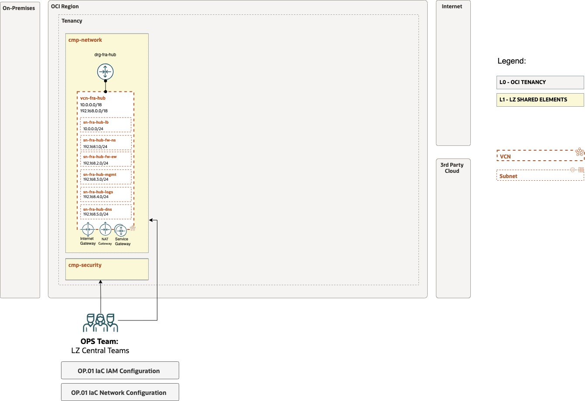

# Hub network configuration explained

## **Table of Contents**

[1. Introduction](#1-introduction)</br>
[2. Hub VCN](#2-hub-vcn)</br>
[3. Subnets](#3-subnets)</br>
[4. Route Tables](#4-route-tables)</br>
[5. Security Lists](#5-security-lists) </br>
[6. Network Security Groups](#6-network-security-groups) </br>
[7. VCN gateways](#7-vcn-gateways) </br>
[8. Dynamic Routing Gateways and attachments](#8-dynamic-routing-gateways-and-attachments) </br>
[9. Load Balancer](#9-load-balancer)
[10. Network Firewall](#10-network-firewall)


&nbsp; 

## **1. Introduction**

Here we'll explain in detail the network configuration that implements the OCI Open LZ design example, so you can understand the different objects used in the OCI Network Core Module and how all the pieces plugs together.

The network configuration is based in the following diagram:



## **2. Hub VCN**

The Hub VCN is the central part of the network design for the different incoming/outgoing traffic for OCI. This is where we're going to control and inspect the network flows.

The VCN contains the subnets, route tables, security lists, network security groups and gateways.

A VCN example without the sub-elements, is:

```
{
    "network_configuration": {
        "default_compartment_id": "CMP-NETWORK-KEY",
        "default_enable_cis_checks": false,
        "network_configuration_categories": {
            "shared": {
                "category_compartment_id": "CMP-NETWORK-KEY",
                "vcns": {
                    "VCN-FRA-HUB-KEY": {
                        "block_nat_traffic": false,
                        "cidr_blocks": [
                            "10.0.0.0/18",
                            "192.168.0.0/18"
                        ],
                        "dhcp_options": {},
                        "display_name": "vcn-fra_hub",
                        "dns_label": "hub",
                        "is_attach_drg": false,
                        "is_create_igw": false,
                        "is_ipv6enabled": false,
                        "is_oracle_gua_allocation_enabled": false,
                        "network_security_groups": {},
                        "route_tables": {},
                        "security_lists": {},
                        "subnets": {},
                        "vcn_specific_gateways": {}
                    }
                },
```

Notice that the "network_configuration" is the main object that we'll use in the OCI network core module, and we're seating all the elements in the "CMP-NETWORK-KEY" compartment, previously created in the identity JSON configuration file.

In this example, we're assigning the "10.0.0.0/18" and "192.168.0.0/18" CIDR blocks to the VCN, that we are going to use to create the different subnets in the VCN.

## **3. Subnets**

We create the different Hub subnets shown in the OCI Open LZ design. The number of subnets to use depends on your requirements. For instance, if you're going to use a native OCI Network Firewall or if you're going to use 3rd party Network Firewalls. In this case, we'll use a couple of OCI Network Firewalls, one for the North-South (NS) traffic, and other for the East-West (EW) traffic, each on its own subnet.

In our case:

| Subnet | Type | CIDR | Description |
|---|---|---|---|
| sn-fra-hub-lb | Public | 10.0.0.0/24 | Holds the public Load Balancer(s) to handle incoming traffic from the internet.
| sn-fra-hub-fw-ns | Private | 192.168.1.0/24 | Network Firewall, North-South traffic. Public subnet to allow incoming traffic from the internet.
| sn-fra-hub-fw-ew | Private | 192.168.1.0/24 | Network Firewall, East-West traffic.
| sn-fra-hub-mgmt | Private | 192.168.3.0/24 | Overall management tasks.
| sn-fra-hub-logs | Private | 192.168.4.0/24 | For SIEM (Security Information and Event Management).
| sn-fra-hub-dns | Private | 192.168.5.0/24 | For connecting customer DNS servers to OCI. DNS Listeners and Forwarders.

Example of subnet configuration:

```
"subnets": {
    "SN-FRA-HUB-LB-KEY": {
        "availability_domain": null,
        "cidr_block": "10.0.0.0/24",
        "dhcp_options_key": "default_dhcp_options",
        "display_name": "sn-fra-hub-lb",
        "dns_label": "hublb",
        "prohibit_internet_ingress": false,
        "prohibit_public_ip_on_vnic": false,
        "route_table_key": "RT-01-HUB-VCN-LB-KEY",
        "security_list_keys": [
            "SL-01-HUB-VCN-KEY"
        ]
    },
    "SN-FRA-HUB-FW-NS-KEY": {
        "cidr_block": "192.168.1.0/24",
        "dhcp_options_key": "default_dhcp_options",
        "display_name": "sn-fra-hub-fw-ns",
        "dns_label": "hubfwns",
        "prohibit_internet_ingress": true,
        "prohibit_public_ip_on_vnic": true,
        "route_table_key": "RT-02-HUB-VCN-NFWNS-KEY",
        "security_list_keys": [
            "SL-02-HUB-VCN-KEY"
        ]
    },
    "SN-FRA-HUB-FW-EW-KEY": {
        "cidr_block": "192.168.2.0/24",
        "dhcp_options_key": "default_dhcp_options",
        "display_name": "sn-fra-hub-fw-ew",
        "dns_label": "hubfwew",
        "prohibit_internet_ingress": true,
        "prohibit_public_ip_on_vnic": true,
        "route_table_key": "RT-03-HUB-VCN-NFWEW-KEY",
        "security_list_keys": [
            "SL-02-HUB-VCN-KEY"
        ]
    },
    "SN-FRA-HUB-FW-MGMT-KEY": {
        "cidr_block": "192.168.3.0/24",
        "dhcp_options_key": "default_dhcp_options",
        "display_name": "sn-fra-hub-mgmt",
        "dns_label": "hubmgmt",
        "prohibit_internet_ingress": true,
        "prohibit_public_ip_on_vnic": true,
        "route_table_key": "RT-05-HUB-VCN-OSN-KEY",
        "security_list_keys": [
            "SL-02-HUB-VCN-KEY"
        ]
    },
    "SN-FRA-HUB-FW-LOGS-KEY": {
        "cidr_block": "192.168.4.0/24",
        "dhcp_options_key": "default_dhcp_options",
        "display_name": "sn-fra-hub-logs",
        "dns_label": "hublogs",
        "prohibit_internet_ingress": true,
        "prohibit_public_ip_on_vnic": true,
        "route_table_key": "RT-05-HUB-VCN-OSN-KEY",
        "security_list_keys": [
            "SL-02-HUB-VCN-KEY"
        ]
    },
    "SN-FRA-HUB-FW-LOGS-DNS": {
        "cidr_block": "192.168.5.0/24",
        "dhcp_options_key": "default_dhcp_options",
        "display_name": "sn-fra-hub-dns",
        "dns_label": "hubdns",
        "prohibit_internet_ingress": true,
        "prohibit_public_ip_on_vnic": true,
        "route_table_key": "RT-05-HUB-VCN-OSN-KEY",
        "security_list_keys": [
            "SL-02-HUB-VCN-KEY"
        ]
    }
},
```

## **4. Route Tables**

We use the route tables to allow the network flow from the Hub subnets to their different destinations that can be: gateways (internet, NAT, service), spoke VCNs, on-premises, etc.

The route tables, within their rules, used in our example are:

| Route Table | Destination | Target Type | Target | Description |
|---|---|---|---|---|
| rt-00-hub-vcn | 0.0.0.0/0 | Private IP | NFW NS IP OCID (192.168.1.10) | Route for outgoing access.
| rt-00-hub-vcn | 10.0.0.0/24 | Private IP | NFW NS IP OCID (192.168.1.10) | Route incoming traffic to Hub LB subnet.
| rt-01-hub-vcn | 0.0.0.0/0 | Internet Gateway | ig_fra_hub | Route for internet access.
| rt-01-hub-vcn | 148.20.57.8/29| DRG | drg-fra-hub | Route for IPSec VPN.
| rt-02-hub-vcn | 0.0.0.0/0 | NAT Gateway | ng-fra-hub | Route for North-South NFW to NAT GW.
| rt-03-hub-vcn | - | - | - | Route Table for East-West NFW for communication between spokes (to be completed in POST.OP01.01).
| rt-04-hub-vcn | 0.0.0.0/0 | Private IP | NFW NS IP OCID (192.168.1.10) | Route Table for NAT GW.
| rt-05-hub-vcn | All FRA Services in OSN | Service Gateway | sg-fra-hub | Route Service Gateway.

To define the route tables in the JSON configuration we use:

```
"route_tables": {
    "RT-00-HUB-VCN-INGRESS-KEY": {
        "display_name": "rt_00_hub_vcn",
        "route_rules": {}
    },
    "RT-01-HUB-VCN-LB-KEY": {
        "display_name": "rt_01_hub_vcn",
        "route_rules": {
            "drg_route": {
                "description": "Route for IPSec VPN",
                "destination": "148.20.57.8/29",
                "destination_type": "CIDR_BLOCK",
                "network_entity_key": "DRG-FRA-HUB-KEY"
            },
            "internet_route": {
                "description": "Route for internet access",
                "destination": "0.0.0.0/0",
                "destination_type": "CIDR_BLOCK",
                "network_entity_key": "IG-FRA-HUB-KEY"
            }
        }
    },
    "RT-02-HUB-VCN-NFWNS-KEY": {
        "display_name": "rt_02_hub_vcn",
        "freeform_tags": null,
        "route_rules": {
            "ngw_route": {
                "description": "Route for North-South NFW to NAT GW",
                "destination": "0.0.0.0/0",
                "destination_type": "CIDR_BLOCK",
                "network_entity_key": "NG-FRA-HUB-KEY"
            }
        }
    },
    "RT-03-HUB-VCN-NFWEW-KEY": {
        "display_name": "rt_03_hub_vcn",
        "freeform_tags": null,
    },
    "RT-04-HUB-VCN-NATGW-KEY": {
        "display_name": "rt_04_hub_vcn",
        "freeform_tags": null,
        "route_rules": {
            "nat_route": {}
        }
    },
    "RT-05-HUB-VCN-OSN-KEY": {
        "display_name": "rt_05_hub_vcn",
        "freeform_tags": null,
        "route_rules": {
            "sgw_route": {
                "description": "Route for sgw",
                "destination": "all-services",
                "destination_type": "SERVICE_CIDR_BLOCK",
                "network_entity_key": "SG-FRA-HUB-KEY"
            }
        }
    }
},
```

When we need to on-board new spokes, as with the on-boarding of a new Operating Entity with its VCNs, we'll need to run the POST.OP01.01, where we'll have, among other tasks, to update the route tables to be able to manage the incoming/outgoing traffic to/from the spokes VCNs.

## **5. Security Lists**

Security lists acts as virtual firewall at packet level to control the ingress and egress traffic throuth security rules. Its rules applies to all the VNICs in any subnet that the security list is associated with.

Each VCN comes with a default security list. If we don't specify any, OCI will create one and it will be outside of the Open LZ configuration control. Thus, we can specify a default security list with or without security rules, just to be able to override this default behaviour and assign, or not, to any specific subnet in the VCN. 

It's important to notice that it is recommended to use security lists with stateless rules in subnets where we're deploying OCI Network Firewall for performance reasons. The security lists will be evaluated **before** the firewall rules.

To define a default security list, you can use the following configuration example:

```
"default_security_list": {
    "display_name": "defseclist-fra-hub-vcn",
    "egress_rules": [],
    "ingress_rules": [
        {
            "stateless": false,
            "protocol": "ICMP",
            "description": "ICMP type 3 code 4",
            "src": "0.0.0.0/0",
            "src_type": "CIDR_BLOCK",
            "icmp_type": 3,
            "icmp_code": 4
        },
        {
            "stateless": false,
            "protocol": "ICMP",
            "description": "ICMP type 3",
            "src": "10.0.0.0/18",
            "src_type": "CIDR_BLOCK",
            "icmp_type": 3,
            "icmp_code": -1
        },
        {
            "stateless": false,
            "protocol": "ICMP",
            "description": "ICMP type 3",
            "src": "192.168.0.0/18",
            "src_type": "CIDR_BLOCK",
            "icmp_type": 3,
            "icmp_code": -1
        }
    ]
},
"security_lists": {
    "SL-01-HUB-VCN-KEY": {
        "display_name": "sl-01-hub-vcn",
        "egress_rules": [
            {
                "description": "egress to 0.0.0.0/0 over ALL protocols",
                "dst": "0.0.0.0/0",
                "dst_type": "CIDR_BLOCK",
                "protocol": "ALL",
                "stateless": false
            }
        ],
        "freeform_tags": null,
        "ingress_rules": [
            {
                "description": "ingress from 0.0.0.0/0 ALL ports",
                "protocol": "TCP",
                "src": "0.0.0.0/0",
                "src_type": "CIDR_BLOCK",
                "stateless": false
            }
        ]
    },
    "SL-02-HUB-VCN-KEY": {
        "display_name": "sl-02-hub-vcn",
        "egress_rules": [
            {
                "description": "egress to 0.0.0.0/0 over TCP",
                "dst": "0.0.0.0/0",
                "dst_type": "CIDR_BLOCK",
                "protocol": "ALL",
                "stateless": false
            }
        ],
        "ingress_rules": [
            {
                "description": "ingress from 0.0.0.0/0 over all ports",
                "protocol": "ALL",
                "src": "0.0.0.0/0",
                "src_type": "CIDR_BLOCK",
                "stateless": false
            }
        ]
    }
},
```

The security lists used in our example are:

| Security List | Rule Type | Stateless? | Source(ingress)/Destination(egress) | Protocol | Source Port Range | Destination Port Range | Type and Code | Description |
|---|---|---|---|---|---|---|---|---|
| sl-01-hub-vcn | Ingress | No | 0.0.0.0/0 | All | All | All | | Ingress from 0.0.0.0/0 all ports.
| sl-01-hub-vcn | Egress | No | 0.0.0.0/0 | All | All| | All | | Egress to 0.0.0.0/0 over all protocols.
| sl-02-hub-vcn | Ingress | No | 0.0.0.0/0 | All | All | All | | Ingress from 0.0.0.0/0 over all ports.
| sl-02-hub-vcn | Egress | No | 0.0.0.0/0 | TCP | All | All | | Egress to 0.0.0.0/0 over all protocols.

You can define them in the configuration with:

```
"default_security_list": {
    "display_name": "defseclist_fra_hub_vcn",
    "egress_rules": [],
    "ingress_rules": [
        {
            "stateless": false,
            "protocol": "ICMP",
            "description": "ICMP type 3 code 4",
            "src": "0.0.0.0/0",
            "src_type": "CIDR_BLOCK",
            "icmp_type": 3,
            "icmp_code": 4
        },
        {
            "stateless": false,
            "protocol": "ICMP",
            "description": "ICMP type 3",
            "src": "10.0.0.0/18",
            "src_type": "CIDR_BLOCK",
            "icmp_type": 3,
            "icmp_code": -1
        },
        {
            "stateless": false,
            "protocol": "ICMP",
            "description": "ICMP type 3",
            "src": "192.168.0.0/18",
            "src_type": "CIDR_BLOCK",
            "icmp_type": 3,
            "icmp_code": -1
        }
    ]
},
"security_lists": {
    "SL-01-HUB-VCN-KEY": {
        "display_name": "sl-01-hub-vcn",
        "egress_rules": [
            {
                "description": "egress to 0.0.0.0/0 over ALL protocols",
                "dst": "0.0.0.0/0",
                "dst_type": "CIDR_BLOCK",
                "protocol": "ALL",
                "stateless": false
            }
        ],
        "freeform_tags": null,
        "ingress_rules": [
            {
                "description": "ingress from 0.0.0.0/0 ALL ports",
                "protocol": "TCP",
                "src": "0.0.0.0/0",
                "src_type": "CIDR_BLOCK",
                "stateless": false
            }
        ]
    },
    "SL-02-HUB-VCN-KEY": {
        "display_name": "sl-02-hub-vcn",
        "egress_rules": [
            {
                "description": "egress to 0.0.0.0/0 over TCP",
                "dst": "0.0.0.0/0",
                "dst_type": "CIDR_BLOCK",
                "protocol": "ALL",
                "stateless": false
            }
        ],
        "ingress_rules": [
            {
                "description": "ingress from 0.0.0.0/0 over all ports",
                "protocol": "ALL",
                "src": "0.0.0.0/0",
                "src_type": "CIDR_BLOCK",
                "stateless": false
            }
        ]
    }
},
```

## **6. Network Security Groups**

Network Security Groups (NSGs) acts also as virtual firewalls to control traffic at packet level. The difference with Security Lists is that the NSGs applies only to a set of VNICs of your choice in a single VCN, contrary to the Security Lists that applies over ALL the VNICs. NSGs are supported only for some specific OCI services. Oracle recommends to use NSGs over security lists.

The network security groups used in our example are:

| Network Security Group | Rule Type | Stateless? | Source | Protocol | Source Port Range | Destination Port Range | Type and Code | Description |
|---|---|---|---|---|---|---|---|---|
| nsg-01-hub-vcn | Ingress | No | 0.0.0.0/0 | TCP | All | All | | Ingress from 0.0.0.0/0 over TCP 22
| nsg-01_hub-vcn | Egress | No | 0.0.0.0/0 | All | | | | Egress to 0.0.0.0/0 over all protocols
| nsg-02_hub-vcn | Ingress | No | 0.0.0.0/0 | TCP | All | 443 | | Ingress from 0.0.0.0/0 over HTTP 443
| nsg-02_hub-vcn | Ingress | No | 0.0.0.0/0 | TCP | All | 80 | | Ingress to 0.0.0.0/0 over HTTP 80
| nsg-02_hub-vcn | Ingress | No | 0.0.0.0/0 | TCP | All | 22 | | Ingress to 0.0.0.0/0 over TCP 22
| nsg-02_hub-vcn | Egress | No | 0.0.0.0/0 | TCP | All | All | | Egress to 0.0.0.0/0 over TCP
| nsg-03_hub-vcn | Ingress | No | 0.0.0.0/0 | TCP | All | 80 | | Ingress to 0.0.0.0/0 over HTTP 80
| nsg-03_hub-vcn | Ingress | No | 0.0.0.0/0 | TCP | All | 22 | | Ingress to 0.0.0.0/0 over TCP 22
| nsg-03_hub-vcn | Egress | No | 0.0.0.0/0 | TCP | All | All | | Egress to 0.0.0.0/0 over TCP


The network security groups are defined in the configuration with:

```
"network_security_groups": {
    "NSG-01-HUB-VCN-KEY": {
        "display_name": "nsg-01-hub-vcn",
        "egress_rules": {
            "anywhere": {
                "description": "egress to 0.0.0.0/0 over TCP",
                "dst": "0.0.0.0/0",
                "dst_type": "CIDR_BLOCK",
                "protocol": "TCP",
                "stateless": false
            }
        },
        "ingress_rules": {
            "ssh_22": {
                "description": "ingress from 0.0.0.0/0 over TCP22",
                "dst_port_max": 22,
                "dst_port_min": 22,
                "protocol": "TCP",
                "src": "0.0.0.0/0",
                "src_type": "CIDR_BLOCK",
                "stateless": false
            }
        }
    },
    "NSG-02-HUB-VCN-KEY": {
        "display_name": "nsg-02-hub-vcn",
        "egress_rules": {
            "anywhere": {
                "description": "egress to 0.0.0.0/0 over TCP",
                "dst": "0.0.0.0/0",
                "dst_type": "CIDR_BLOCK",
                "protocol": "TCP",
                "stateless": false
            }
        },
        "ingress_rules": {
            "http_80": {
                "description": "ingress from 0.0.0.0/0 over HTTP8080",
                "dst_port_max": 80,
                "dst_port_min": 80,
                "protocol": "TCP",
                "src": "0.0.0.0/0",
                "src_type": "CIDR_BLOCK",
                "stateless": false
            },
            "https_443": {
                "description": "ingress from 0.0.0.0/0 over HTTPs443",
                "dst_port_max": 443,
                "dst_port_min": 443,
                "protocol": "TCP",
                "src": "0.0.0.0/0",
                "src_type": "CIDR_BLOCK",
                "stateless": false
            },
            "ssh_22": {
                "description": "ingress from 0.0.0.0/0 over TCP22",
                "dst_port_max": 22,
                "dst_port_min": 22,
                "protocol": "TCP",
                "src": "0.0.0.0/0",
                "src_type": "CIDR_BLOCK",
                "stateless": false
            }
        }
    },
    "NSG-03-HUB-VCN-KEY": {
        "display_name": "nsg-03-hub-vcn",
        "egress_rules": {
            "anywhere": {
                "description": "egress to 0.0.0.0/0 over TCP",
                "dst": "0.0.0.0/0",
                "dst_type": "CIDR_BLOCK",
                "protocol": "TCP",
                "stateless": false
            }
        },
        "ingress_rules": {
            "http_8080": {
                "description": "ingress from 0.0.0.0/0 over HTTP8080",
                "dst_port_max": 80,
                "dst_port_min": 80,
                "protocol": "TCP",
                "src": "0.0.0.0/0",
                "src_type": "CIDR_BLOCK",
                "stateless": false
            },
            "ssh_22": {
                "description": "ingress from 0.0.0.0/0 over TCP22",
                "dst_port_max": 22,
                "dst_port_min": 22,
                "protocol": "TCP",
                "src": "0.0.0.0/0",
                "src_type": "CIDR_BLOCK",
                "stateless": false
            }
        }
    }
},
```

## **7. VCN Gateways**

We have 3 kinds of specific VCN gateways: Internet Gateways, NAT Gateways and Service Gateways. The Intenet Gateway allow us to receive Internet incoming traffic to public subnets for internet facing applications or direct access to services. NAT gateways would allow to different OCI instances or services to access to the public internet masking their source IP addresses to access other services or internet destinations. Service Gateways allows to OCI instances or services to access to the Oracle Services Network.

In our example, we use the Internet, NAT and Service Gateways as:

| Name | Gateway Type | Services | Route Table |
|---|---|---|---|
| ig-fra-hub | Internet Gateway | | |
| ng-fra-hub | NAT Gateway | | rt-04-hub-vcn |
| sg-fra-hub | Service Gateway | All FRA Services in OSN | |

```
"vcn_specific_gateways": {
    "internet_gateways": {
        "IG-FRA-HUB-KEY": {
            "display_name": "ig_frankfurt_hub",
            "enabled": true
        }
    },
    "nat_gateways": {
        "NG-FRA-HUB-KEY": {
            "display_name": "ng_fra_hub",
            "enabled": true,
            "route_table_key": "RT-04-HUB-VCN-NATGW-KEY"
        }
    },
    "service_gateways": {
        "SG-FRA-HUB-KEY": {
            "display_name": "sg_frankfurt_hub",
            "services": "all-services"
        }
    }
}
```

## **8. Dynamic Routing Gateways and attachments**

Dynamic Routing Gateways (DRGs) acts as virtual routers, allowing to path traffic between on-premisses networks and VCNs or route traffic between VCNs. We can build different network topologies with different types of network attachments. Each DRG attachment, has an associated route table used to route packets entering the DRG to the next hop. We can have static routes or dynamically imported route tables from VCNs. For more information refer to the [documentation](https://docs.oracle.com/en-us/iaas/Content/Network/Tasks/managingDRGs.htm).

In our example, we use the Hub & Spoke network topology, to centralize the network incoming traffic through the Hub and the Spokes, which are used to share all the network subnets for specific OEs and environments in our example. Always that we on-board a new OE, some spokes are created for its different environments and are attached to the Hub DRG with a DRG Attachment.

| DRG Name | Attachment Name | Attachment Type | Attached element | DRG Route Table
|---|---|---|---|---|
| drg-fra-hub | drg_frankfurt_hub_vcn_frankfurt_hub | VCN | vcn_frankfurt_hub | Autogenerated Drg Route Table for VCN attachments 

```
"non_vcn_specific_gateways": {
    "dynamic_routing_gateways": {
        "DRG-FRA-HUB-KEY": {
            "display_name": "drg-fra-hub",
            "drg_attachments": {
                "DRGATT-FRA-HUB-VCN-FRA-HUB-KEY": {
                    "display_name": "drgatt-fra-hub-vcn-fra-hub",
                    "drg_route_table_key": "DRG-RT-FRA-HUB-KEY",
                    "network_details": {
                        "attached_resource_key": "VCN-FRA-HUB-KEY",
                        "type": "VCN",
                        "route_table_key": "RT-00-HUB-VCN-INGRESS-KEY"
                    }
                }
            },
            "drg_route_distributions": {
                "IMPORT-HUB-RTD-KEY": {
                    "display_name": "import-hub-rtd",
                    "distribution_type": "IMPORT",
                    "statements": {
                        "drg_route_distribution_vcn": {
                            "priority": 1,
                            "action": "ACCEPT",
                            "match_criteria": {
                                "match_type": "DRG_ATTACHMENT_TYPE",
                                "attachment_type": "VCN"
                            }
                        }
                    }
                }
            },
            "drg_route_tables": {
                "DRG-RT-FRA-HUB-KEY": {
                    "display_name": "drg-rt-hub",
                    "import_drg_route_distribution_key": "IMPORT-HUB-RTD-KEY",
                    "is_ecmp_enabled": false,
                    "route_tables": {}
                }
            }
        }
    },
```

When we on-board new Operating Entity spokes VCNs, we'll need to create in a postoperation (POST.01.01), the DRG Attachments for the newly created VCNs for the spokes as such as any DRG route tables needed for these attachments.

## **9. Load Balancer**

OCI Load Balancer provides automated traffic distribution from one entry point to multiple servers reacheable from your VCNs. The service offers public or private IP address and provisioned bandwidth. You can get more information about the OCI Load Balancer service in the [documentation](https://docs.oracle.com/en-us/iaas/Content/Balance/Concepts/balanceoverview.htm).

In the case of the Hub, we'll be provisioning a public load balancer so we can accept the incoming traffic from the Internet. The traffic will be sent to the Network Firewall located in the same Hub to proper packet inspection to check if it meets with the network security policies before it is being sent to the Load Balancer backend sets located in any of the Spokes which will attend the incoming request for an specific web application.

In our example, we will create a Public Load Balancer in the Hub for incoming request coming from the Internet to be forwarded, through the NS NFW, to the corresponding spoke, where we'll have Private Load Balancers to spread the requests between the application VMs in the spoke.

We'll create a default backend set, without any backends. When we need to on-board a new public facing application existing in an Operating Entity spoke, we'll create a new backend for that spoke (OE Private Load Balancer with the application path), and we'll create a routing policy to route in the listener the request depending on the path.

It is a good practice to have this default backend to filter all the incoming requests to non-existing applications, saving in this way some compute resources. We can also complement with some rules sets to filter further, for instance, by HTTP method used, but we would not use it in this example.

The listener created will be for port 80 (HTTP) just for simplicity.

The Load Balancer deployed in our Hub example has the following characteristics:

| Load Balancer Name | Type | Shape | Subnet | Backend Sets | Backends | Listener | Port/Protocol | Routing Policy | Hostaname | Use SSL |
|---|---|---|---|---|---|---|---|---|---|---|
| lb-hub-01 | Public | Flexible | sn-fra-hub-lb | default-backend-set-00 | - | lb1-lsnr1-80 | 80/HTTP | - | - | No |

The configuration block looks like:

```
"non_vcn_specific_gateways": {
...
"l7_load_balancers": {
"LB-HUB-01-KEY": {
    "backend_sets": {
        "LB-HUB-BCK-END-SET-00": {
            "health_checker": {
                "interval_ms": 10000,
                "is_force_plain_text": true,
                "port": 80,
                "protocol": "HTTP",
                "retries": 3,
                "return_code": 200,
                "timeout_in_millis": 3000,
                "url_path": "/"
            },
            "name": "default-backend-set-00",
            "policy": "LEAST_CONNECTIONS"
        }
    },
    "display_name": "lb-hub-01",
    "ip_mode": "IPV4",
    "is_private": false,
    "listeners": {
        "LB1-LSNR-1-80": {
            "connection_configuration": {
                "idle_timeout_in_seconds": 1200
            },
            "default_backend_set_key": "LB-HUB-BCK-END-SET-01",
            "name": "lb1-lsnr1-80",
            "port": "80",
            "protocol": "HTTP",
        }
    },
    "network_security_group_keys": [
        "NSG-02-HUB-VCN-KEY"
    ],
    "shape": "flexible",
    "shape_details": {
        "maximum_bandwidth_in_mbps": 100,
        "minimum_bandwidth_in_mbps": 10
    },
    "subnet_ids": [],
    "subnet_keys": [
        "SN-FRAN-HUB-LB-KEY"
    ]
}
}
```

## **10. Network Firewall**

OCI Network Firewall is a next-generation managed network firewall and intrusion detection and prevention service for your OCI VCNs. You can check the official [documentation](https://docs.oracle.com/en-us/iaas/Content/network-firewall/home.htm). Network firewall service gives you visibility into traffic entering your cloud environment (North-south network traffic), as well traffic between VCNs/subnets (East-West network traffic).

A network firewall is a highly available and scalable instance that you create in a subnet of your choice. The firewall applies business logic specified in an attached firewall *policy*. A firewall creation requires an attached policy. 
The firewall will deny all traffic until you configure rules in the attached policy.

VCN security lists and network security groups rules associated with the firewall subnet and VNICs are evaluated *before* the firewall, so be sure that these rules allow the traffic to enter the firewall. It is recommended that this security lists and network security groups, has stateless security rules for performance reasons.

A policy contains the rules that control how an associated firewall inspects, allows, or denies network traffic. You can use different components such as lists, secrets and decryption profiles to help you build rules for the policy. A policy can be associated to many firewalls.

Notice that you can't edit directly a network firewall policy while attached to a network firewall. You can create a new one and replace with the existing one in a network firewall to make changes take place so we encorage you, as a **best-practice**, to have a couple of policies at least per Network Firewall. As you cannot edit a policy being used, you can edit the second policy with the new changes that you want to do, commit those changes, and then modify the firewall with the use of this new modified policy in a second commit operation. In this way, you always will have a backup, with the original policy, where to fall back in case that the new changes in the policy don't work as expected.

The network firewalls used has the following characteristics:

| Network Firewall Name | Type | Subnet | IP | Network Firewall Policy |
|---|---|---|---|---|
| nfw-fra-hub-ns | Regional | sn-fra-hub-fw-ns | 192.168.1.10 | nfw-policy-fra-hub-ns-pol1 |
| nfw-fra-hub-ew | Regional | sn-fra-hub-fw-ew | 192.168.2.10 | nfw-policy-fra-hub-ew-pol1 |

The policies used has the following characteristics:

| Network Firewall Policy Name | Security Rules | Action | Sources | Destinations | Applications | URLs |
|---|---|---|---|---|---|---|
| nfw-policy-fra-hub-ns-pol1 | SecurityRuleA | Allow | Any | Any | nfw-app-list-fra-hub-ns-1 | Any |
| nfw-policy-fra-hub-ns-pol1 | SecurityRuleB | Inspect (Intrusion Detection) | nfw-ip-list-fra-hub-ns | Any | nfw-app-list-fra-hub-ns-1 | nfw-url-list-fra-hub-ns-1 |
| nfw-policy-fra-hub-ns-pol1 | SecurityRuleC | Allow | Any | Any | Any | nfw-url-list-fra-hub-ns-2 |
| nfw-policy-fra-hub-ew-pol1 | SecurityRuleA | Allow | Any | Any | Any | Any |
| nfw-policy-fra-hub-ew-pol1 | SecurityRuleB | Inspect (Intrusion Detection) | nfw-ip-list-fra-hub-ew | Any | nfw-app-list-fra-hub-ew-1 | nfw-url-list-fra-hub-ew-1 |

NOTE: We'd have the same values (as original copies) in the secondary policies (finished with -pol2).

The security rules are supported with the use of the following lists of IPs, destinations, applications or URLs:

| Application List Name | Protocol | Port range |
|---|---|---|
| nfw-app-list-fra-hub-ns-1 | TCP/UDP | 22,80-8080 |
| nfw-app-list-fra-hub-ew-1 | TCP/UDP | 80-8080 |

| URL List Name | URLs |
|---|---|
| nfw-url-list-fra-hub-ns-1 | testapp1.example.com |
| nfw-url-list-fra-hub-ns-2 | pypi.python.org </br> www.google.com |
| nfw-url-list-fra-hub-ew-1 | testapp1.example.com |
| nfw-url-list-fra-hub-ew-2 | pypi.python.org </br> www.google.com |

| IP Address List Name | IP Address/CIDR |
|---|---|
| nfw-ip-list-fra-hub-ns | 10.0.0.155,172.168.7.10 |
| nfw-ip-list-fra-hub-ew | 172.168.7.10 |

The configuration block looks like:

```
"network_firewalls_configuration": {
    "network_firewalls": {
        "NFW-FRA-HUB-NS-KEY": {
            "display_name": "nfw-fra-hub-ns",
            "ipv4address": "192.168.1.10",
            "subnet_key": "SN-FRA-HUB-FW-NS-KEY",
            "network_firewall_policy_key": "NFW-POLICY-FRA-HUB-NS-POL1-KEY"
        },
        "NFW-FRA-HUB-EW-KEY": {
            "display_name": "nfw-fra-hub-ew",
            "ipv4address": "192.168.2.10",
            "subnet_key": "SN-FRA-HUB-FW-EW-KEY",
            "network_firewall_policy_key": "NFW-POLICY-FRA-HUB-EW-POL2-KEY"
            }
    },
    "network_firewall_policies": {
        "NFW-POLICY-FRA-HUB-NS-POL1-KEY": {
            "display_name": "nfw_policy_fra_hub_ns_pol1",
            "application_lists": {
                "nfw_app_list_fra_hub_ns_1": {
                    "application_list_name": "nfw_app_list_fra_hub_ns_1",
                    "application_values": {
                        "nfw_app_list_fra_hub_ns_1_1": {
                            "maximum_port": 8080,
                            "minimum_port": 80,
                            "type": "TCP"
                        },
                        "nfw_app_list_fra_hub_ns_1_2": {
                            "maximum_port": 22,
                            "minimum_port": 22,
                            "type": "TCP"
                        }
                    }
                }
            },
            "ip_address_lists": {
                "nfw_ip_list_fra_hub_ns": {
                    "ip_address_list_name": "nfw_ip_list_fra_hub_ns",
                    "ip_address_list_value": [
                        "172.168.7.10",
                        "10.0.0.155"                                            
                    ]
                }
            },
            "security_rules": {
                "SecurityRuleA": {
                    "action": "ALLOW",
                    "name": "SecurityRuleA",
                    "conditions": {
                        "prd_cond1_A": {
                            "applications": ["nfw_app_list_fra_hub_ns_1"],
                            "destinations": [],
                            "sources": [],
                            "urls": []
                        }
                    }
                },
                "SecurityRuleC": {
                    "action": "ALLOW",
                    "name": "SecurityRuleC",
                    "conditions": {
                        "prd_cond1_A": {
                            "applications": [],
                            "destinations": [],
                            "sources": [],
                            "urls": ["nfw_url_list_fra_hub_ns_2"]
                        }
                    }
                },
                "SecurityRuleB": {
                    "action": "INSPECT",
                    "inspection": "INTRUSION_DETECTION",
                    "name": "SecurityRuleB",
                    "conditions": {
                        "prd_cond1_B": {
                            "applications": [
                                "nfw_app_list_fra_hub_ns_1"
                            ],
                            "destinations": [],
                            "sources": [
                                "nfw_ip_list_fra_hub_ns"
                            ],
                            "urls": [
                                "nfw_url_list_fra_hub_ns_1"
                            ]
                        }
                    }
                }
            },
            "url_lists": {
                "nfw_url_list_fra_hub_ns_1": {
                    "url_list_name": "nfw_url_list_fra_hub_ns_1",
                    "url_list_values": {
                        "nfw_url_list_fra_hub_ns_1_1": {
                            "pattern": "testapp1.example.com",
                            "type": "SIMPLE"
                        }
                    }
                },
                "nfw_url_list_fra_hub_ns_2": {
                    "url_list_name": "nfw_url_list_fra_hub_ns_2",
                    "url_list_values": {
                        "nfw_url_list_fra_hub_ns_2_1": {
                            "pattern": "pypi.python.org",
                            "type": "SIMPLE"
                        },
                        "nfw_url_list_fra_hub_ns_2_2": {
                            "pattern": "www.google.com",
                            "type": "SIMPLE"
                        }
                    }
                }
            }
        },
        "NFW-POLICY-FRA-HUB-NS-POL2-KEY": {
            "display_name": "nfw_policy_fra_hub_ns_pol2",
            "application_lists": {
                "nfw_app_list_fra_hub_ns_1": {
                    "application_list_name": "nfw_app_list_fra_hub_ns_1",
                    "application_values": {
                        "nfw_app_list_fra_hub_ns_1_1": {
                            "maximum_port": 8080,
                            "minimum_port": 80,
                            "type": "TCP"
                        },
                        "nfw_app_list_fra_hub_ns_1_2": {
                            "maximum_port": 22,
                            "minimum_port": 22,
                            "type": "TCP"
                        }
                    }
                }
            },
            "ip_address_lists": {
                "nfw_ip_list_fra_hub_ns": {
                    "ip_address_list_name": "nfw_ip_list_fra_hub_ns",
                    "ip_address_list_value": [
                        "172.168.7.10",
                        "10.0.0.155"                                            
                    ]
                }
            },
            "security_rules": {
                "SecurityRuleA": {
                    "action": "ALLOW",
                    "name": "SecurityRuleA",
                    "conditions": {
                        "prd_cond1_A": {
                            "applications": ["nfw_app_list_fra_hub_ns_1"],
                            "destinations": [],
                            "sources": [],
                            "urls": []
                        }
                    }
                },
                "SecurityRuleC": {
                    "action": "ALLOW",
                    "name": "SecurityRuleC",
                    "conditions": {
                        "prd_cond1_A": {
                            "applications": [],
                            "destinations": [],
                            "sources": [],
                            "urls": ["nfw_url_list_fra_hub_ns_2"]
                        }
                    }
                },
                "SecurityRuleB": {
                    "action": "INSPECT",
                    "inspection": "INTRUSION_DETECTION",
                    "name": "SecurityRuleB",
                    "conditions": {
                        "prd_cond1_B": {
                            "applications": [
                                "nfw_app_list_fra_hub_ns_1"
                            ],
                            "destinations": [],
                            "sources": [
                                "nfw_ip_list_fra_hub_ns"
                            ],
                            "urls": [
                                "nfw_url_list_fra_hub_ns_1"
                            ]
                        }
                    }
                }
            },
            "url_lists": {
                "nfw_url_list_fra_hub_ns_1": {
                    "url_list_name": "nfw_url_list_fra_hub_ns_1",
                    "url_list_values": {
                        "nfw_url_list_fra_hub_ns_1_1": {
                            "pattern": "testapp1.example.com",
                            "type": "SIMPLE"
                        }
                    }
                },
                "nfw_url_list_fra_hub_ns_2": {
                    "url_list_name": "nfw_url_list_fra_hub_ns_2",
                    "url_list_values": {
                        "nfw_url_list_fra_hub_ns_2_1": {
                            "pattern": "pypi.python.org",
                            "type": "SIMPLE"
                        },
                        "nfw_url_list_fra_hub_ns_2_2": {
                            "pattern": "www.google.com",
                            "type": "SIMPLE"
                        }
                    }
                }
            }
        },
        "NFW-POLICY-FRA-HUB-EW-POL1-KEY": {
            "display_name": "nfw_policy_fra_hub_ew_pol1",
            "application_lists": {
                "nfw_app_list_fra_hub_ew_1": {
                    "application_list_name": "nfw_app_list_fra_hub_ew_1",
                    "application_values": {
                        "nfw_app_list_fra_hub_ns_1_1": {
                            "maximum_port": 8080,
                            "minimum_port": 80,
                            "type": "TCP"
                        }
                    }
                }
            },
            "ip_address_lists": {
                "nfw_ip_list_fra_hub_ew": {
                    "ip_address_list_name": "nfw_ip_list_fra_hub_ew",
                    "ip_address_list_value": [
                        "172.168.7.10"
                    ]
                }
            },
            "security_rules": {
                "SecurityRuleA": {
                    "action": "ALLOW",
                    "name": "SecurityRuleA",
                    "conditions": {
                        "prd_cond1_A": {
                            "applications": [],
                            "destinations": [],
                            "sources": [],
                            "urls": []
                        }
                    }
                },
                "SecurityRuleB": {
                    "action": "INSPECT",
                    "inspection": "INTRUSION_DETECTION",
                    "name": "SecurityRuleB",
                    "conditions": {
                        "prd_cond1_B": {
                            "applications": [
                                "nfw_app_list_fra_hub_ew_1"
                            ],
                            "destinations": [],
                            "sources": [
                                "nfw_ip_list_fra_hub_ew"
                            ],
                            "urls": [
                                "nfw_url_list_fra_hub_ew_1"
                            ]
                        }
                    }
                }
            },
            "url_lists": {
                "nfw_url_list_fra_hub_ew_1": {
                    "url_list_name": "nfw_url_list_fra_hub_ew_1",
                    "url_list_values": {
                        "nfw_url_list_fra_hub_ew_1_1": {
                            "pattern": "testapp1.example.com",
                            "type": "SIMPLE"
                        }
                    }
                },
                "nfw_url_list_fra_hub_ns_2": {
                    "url_list_name": "nfw_url_list_fra_hub_ew_2",
                    "url_list_values": {
                        "nfw_url_list_fra_hub_ew_2_1": {
                            "pattern": "pypi.python.org",
                            "type": "SIMPLE"
                        },
                        "nfw_url_list_fra_hub_ew_2_2": {
                            "pattern": "www.google.com",
                            "type": "SIMPLE"
                        }
                    }
                }
            }
        },
        "NFW-POLICY-FRA-HUB-EW-POL2-KEY": {
            "display_name": "nfw_policy_fra_hub_ew_pol2",
            "application_lists": {
                "nfw_app_list_fra_hub_ew_1": {
                    "application_list_name": "nfw_app_list_fra_hub_ew_1",
                    "application_values": {
                        "nfw_app_list_fra_hub_ew_1_1": {
                            "maximum_port": 8080,
                            "minimum_port": 80,
                            "type": "TCP"
                        }
                    }
                }
            },
            "ip_address_lists": {
                "nfw_ip_list_fra_hub_ew": {
                    "ip_address_list_name": "nfw_ip_list_fra_hub_ew",
                    "ip_address_list_value": [
                        "192.168.2.1"
                    ]
                }
            },
            "security_rules": {
                "SecurityRuleA": {
                    "action": "ALLOW",
                    "name": "SecurityRuleA",
                    "conditions": {
                        "prd_cond1_A": {
                            "applications": [],
                            "destinations": [
                                "nfw_ip_list_fra_hub_ew"
                            ],
                            "sources": [],
                            "urls": [
                                "nfw_url_list_fra_hub_ew_1"
                            ]
                        }
                    }
                },
                "SecurityRuleB": {
                    "action": "INSPECT",
                    "inspection": "INTRUSION_DETECTION",
                    "name": "SecurityRuleB",
                    "conditions": {
                        "prd_cond1_B": {
                            "applications": [
                                "nfw_app_list_fra_hub_ew_1"
                            ],
                            "destinations": [],
                            "sources": [
                                "nfw_ip_list_fra_hub_ew"
                            ],
                            "urls": [
                                "nfw_url_list_fra_hub_ew_1"
                            ]
                        }
                    }
                }
            },
            "url_lists": {
                "nfw_url_list_fra_hub_ew_1": {
                    "url_list_name": "nfw_url_list_fra_hub_ew_1",
                    "url_list_values": {
                        "nfw_url_list_fra_hub_ew_1_1": {
                            "pattern": "www.oracle.com",
                            "type": "SIMPLE"
                        },
                        "nfw_url_list_fra_hub_ew_1_2": {
                            "pattern": "www.google.com",
                            "type": "SIMPLE"
                        }
                    }
                },
                "nfw_url_list_fra_hub_ew_2": {
                    "url_list_name": "nfw_url_list_fra_hub_ew_2",
                    "url_list_values": {
                        "nfw_url_list_fra_hub_ew_2_2": {
                            "pattern": "www.facebook.com",
                            "type": "SIMPLE"
                        }
                    }
                }
            }
        }
    }
},
```

Remember that after running OP.02, it is needed that Central Operations Team runs their POST.OP.01.03 "Add OE DRG attachments and routing" to have a functional, and interconnected spokes with the Hub VCN.

# License

Copyright (c) 2024 Oracle and/or its affiliates.

Licensed under the Universal Permissive License (UPL), Version 1.0.

See [LICENSE](/LICENSE.txt) for more details.
