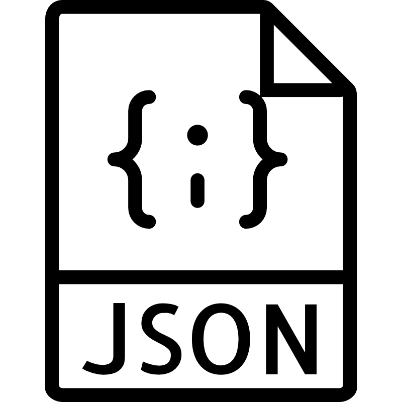

# **The OCI Open LZ &ndash; [Multi-OE Blueprints](#)**

### Simplifying the Onboarding of Organizations, Business Units, and Subsidiaries into OCI

&nbsp; 

Welcome to the **OCI Open LZ Multi-OE Blueprints**.

These blueprints onboard several **Operating Entities (OEs)** with shared services and OE-dedicated **environments**, **platforms**, and **projects** in one tenancy.

There are two models available:
1. **Generic Model**: fits organizational scopes such as LoBs, OpCos, departments, products, brands, or partners in one tenancy. It can be used directly or tailored.
2. **Service Provider Model**: Designed for managed service providers to onboard OCI in a streamlined manner, with two specializations available: 
    - **Pod model**, where each customer gets a copy or application stack. This pattern can be seen in SaaS and managed services industries where each customer's environment is independent of another, and the only part shared is the management plane. 
    - **Multi-tenant model**, where customer workloads are executed on shared infrastructure, but isolated from each other through mechanisms available in the underlying technology stack, like Kubernetes namespaces in Kubernetes clusters, for example. _In this context, the term **multi-tenant** refers to application design allowing customer workloads to share a common infrastructure, and does not refer to customer workloads executed in different OCI tenancies._

&nbsp; 

Find below the guides to your design and deployment activities.

&nbsp;

| # | Description | Format | Generic Model | Service Provider Model |
|---|---|:-:|:-:|:-:|
| 1 | High-level Design - Drawio |  | [Available](/blueprints/multi-oe/generic/design/OCI_Open_LZ_Multi-OE-Blueprint.drawio) | [Available](/blueprints/multi-oe/service-providers/design/images/open-lz-multi-oe-service-providers.drawio) |
| 2 | Runtime Deployment - Terraform + JSON |  | [Available](/blueprints/multi-oe/generic/runtime/readme.md) | [Available](/blueprints/multi-oe/service-providers/runtime/readme.md) |

&nbsp; 

&nbsp; 

# License

Copyright (c) 2026 Oracle and/or its affiliates.

Licensed under the Universal Permissive License (UPL), Version 1.0.

See [LICENSE](/LICENSE.txt) for more details.
