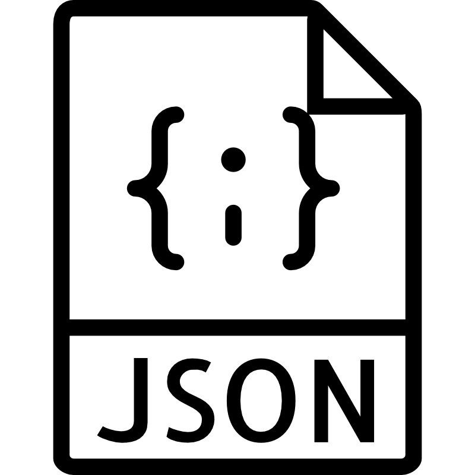

# **The OCI Open LZ &ndash; [Multi-OE Blueprints](#)**

### Simplifying the Onboarding of Organizations, Business Units, and Subsidiaries into OCI

&nbsp; 

Welcome to the **OCI Open LZ Multi-OE Blueprints**. 

These blueprints helps onboards **several** **Operating Entities (OE)** with shared services and dedicated **environments**, **platforms**, and **projects** for each OE, in **one tenancy**. 

There are two models available:
1. **Generic Model**: It fits any organizational scope, with several Organization Units - such as LoBs, OpCos, Departments, Products, Brands, or Partners - in one tenancy. It can be used directly or tailored. **Note this model will be updated to version 2 soon**, matching the [One-OE](/blueprints/one-oe/runtime/) and [Multi-Tenancy Blueprint](/blueprints/multi-tenancy/readme.md) elements, with the same design and IaC building blocks such as Landing Zone Environment and Platforms. Reach out to review the new model before its published. 
   
2. **Service Provider Model**: Designed for managed service providers to onboard OCI in a streamlined manner, with two specializations available: 
    - **Pod model**, where each customer gets a copy or application stack. This pattern can be seen in SaaS and managed services industries where each customer's environment is independent of another, and the only part shared is the management plane. 
    - **Multi-tenant model**, where customer workloads are executed on shared infrastructure, but isolated from each other through mechanisms available in the underlying technology stack, like Kubernetes namespaces in Kubernetes clusters, for example.

&nbsp; 

Find below the guides to your design and deployment activities.

&nbsp;

| # | Description | Format   | Generic Model&nbsp;v1 | Generic Model&nbsp;v2 | Service Provider  Model
|---|---|:-:|:-:|:-:|:-:|
| 1 | High-level Design - MD |   |  [Available](/blueprints/multi-oe/generic_v1/design/readme.md) | *Available Soon* | [Available](/blueprints/multi-oe/service-providers/design/readme.md)
| 2 | High-level Design - Drawio |  | [Available](/blueprints/multi-oe/generic_v1/design/OCI_Open_LZ_Multi-OE-Blueprint.drawio) | [Available](/blueprints/multi-oe/generic_v2/design/OCI_Open_LZ_Multi-OE-Blueprint.drawio) | [Available](https://github.com/oci-landing-zones/oci-landing-zone-operating-entities/blob/content/blueprints/multi-oe/service-providers/design/images/open-lz-multi-oe-service-providers.drawio) |
| 3 | High-level Design - PDF |  | [Available](/blueprints/multi-oe/generic_v1/design/OCI_Open_LZ_Multi-OE-Blueprint.pdf) | -- | --
| 4 |  Multi-stack Deployment for Distributed Declarative IaC Operations - Terraform + JSON |  | [Available](/blueprints/multi-oe/generic_v1/runtime/readme.md) | *Available Soon* | [Available](/blueprints/multi-oe/service-providers/runtime/readme.md)

&nbsp; 

&nbsp; 

# License

Copyright (c) 2025 Oracle and/or its affiliates.

Licensed under the Universal Permissive License (UPL), Version 1.0.

See [LICENSE](/LICENSE.txt) for more details.
