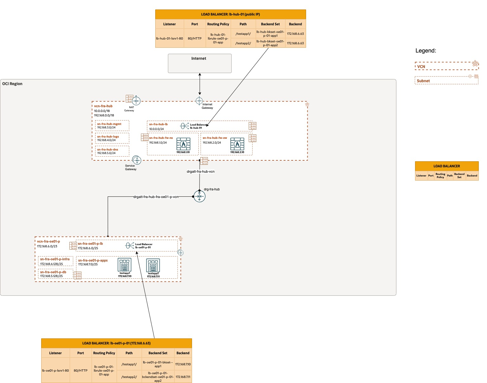

# POST.OP.01.05 – Update HUB LB with OEs Internet facing applications

## **Table of Contents**

[1. Summary](#1-summary)</br>
[2. Network Configuration changes](#2-network-configuration-changes)</br>


&nbsp; 

## **1. Summary**

| |  |
|---|---| 
| **OP. ID** | POST.OP.01.05 |
| **OP. NAME** | Update Hub LB with new OEs Internet facing apps | 
| **OBJECTIVE** | Publish OEs apps in the Hub Load Balancer to make them accesible. |
| **TARGET RESOURCES** | - **Networking**: Hub Load Balancer. |
| **NETWORK CONFIG** |[open_lz_oe_01_network.auto.tfvars.json](../final_configs_after_postops/open_lz_shared_network.auto.tfvars.json) |
| **TERRAFORM MODULES**| [CIS Landing Zone Network](https://github.com/oci-landing-zones/terraform-oci-modules-networking)  |
| **DETAILS** |  For more details refer to the [OCI Open LZ Multi-OE Design document](/blueprints/multi-oe/design/OCI_Open_LZ_Multi-OE-Blueprint.pdf).|
| **PRE-ACTIVITIES** | [OP.04 Manage Project](../../op04_manage_projects/readme.md). |
| **POST-ACTIVITIES** | N/A |
| **RUN WITH ORM** | 1. [](https://cloud.oracle.com/resourcemanager/stacks/create?zipUrl=https://github.com/oci-landing-zones/terraform-oci-modules-orchestrator/archive/refs/tags/v2.0.3.zip&zipUrlVariables={"input_config_files_urls":"https://raw.githubusercontent.com/oracle-quickstart/terraform-oci-open-lz/master/examples/oci-open-lz/op01_manage_shared_services/open_lz_shared_identity.auto.tfvars.json,https://raw.githubusercontent.com/oracle-quickstart/terraform-oci-open-lz/master/examples/oci-open-lz/op01_manage_shared_services/open_lz_shared_network.auto.tfvars.json"})  </br>2. Accept terms,  wait for the configuration to load. </br>3. Set the working directory to “rms-facade”. </br>4. Set the stack name you prefer.</br>5. Set the terraform version to 1.2.x. Click Next. </br>6. Accept the default configurations. Click Next. Optionally, replace with your json/yaml config files. </br>8. Un-check run apply. Click Create.|
| **CONFIG & RUN - TERRAFORM CLI** | Follow the steps mentioned in the [OP.01](../readme.md). |

&nbsp; 

## **2. Network Configuration Changes**

When we want that an OE application, publish on its production or non-production environment, has access from the Internet, we need to create a routing policy in the Hub Load Balancer corresponding listener (HTTP or other, like HTTPS), to the corresponding OE spoke environment internal Load Balancer as a backend and with the correct URI path.

Let's try to modify the existing configuration with an example. Let's imagine that we've the default configuration in the Hub Load Balancer, that its a default backend with no backend sets to send all traffic to an inexisting backend set. Let's add the OE01 production spoke apps *testapp1* and *testapp2*. 

In this example both applications used as backend the same OE01 load balancer (that under the hood has its own 2 backend sets to 2 different VMs, each one where it runs the apps). Each app has its own path */testapp1/* and */testapp2/*.

The summary of the example can be seen in the following diagram:



The Load Balancer configuration would have the following characteristics:

| Load Balancer Name | Type | Shape | Subnet | Backend Sets | Backends | Listener | Port/Protocol | Routing Policy | Hostaname | Use SSL |
|---|---|---|---|---|---|---|---|---|---|---|
| lb-hub-01 | Public | Flexible | sn-fra-hub-lb | default-backend-set-00 | - | lb1-lsnr1-80 | 80/HTTP | lb-hub-01-lbrule-oe01-p-01-app | - | No |

We're adding the Routing Policy called *"lb-hub-01-lbrule-oe01-p-01-app"*, which has:

| Routing policy | Path | Backend Set | Backend |
|---|---|---|---|
| lb-hub-01-lbrule-oe01-p-01-app | /testapp1/ | lb-hub-bkset-oe01-p-01-app1 | 172.168.6.63 (as an example) |
| lb-hub-01-lbrule-oe01-p-01-app | /testapp2/ | lb-hub-bkset-oe01-p-01-app2 | 172.168.6.63 (as an example) |

The configuration will look like this:

```
(...)
"l7_load_balancers": {
    "LB-HUB-KEY": {
        "backend_sets": {
            "LB-HUB-BKSET-00": {
                "health_checker": {
                    "interval_ms": 10000,
                    "is_force_plain_text": true,
                    "port": 80,
                    "protocol": "HTTP",
                    "retries": 3,
                    "return_code": 200,
                    "timeout_in_millis": 3000,
                    "url_path": "/"
                },
                "name": "lb-hub-bkset-00",
                "policy": "LEAST_CONNECTIONS"
            },
            "LB-HUB-BKSET-01": {
                "backends": {
                    "LB-HUB-BKSET-01-BE-01": {
                        "ip_address": "172.168.6.63",
                        "port": 80
                    }
                },
                "health_checker": {
                    "interval_ms": 10000,
                    "is_force_plain_text": true,
                    "port": 80,
                    "protocol": "HTTP",
                    "retries": 3,
                    "return_code": 200,
                    "timeout_in_millis": 3000,
                    "url_path": "/testapp1/"
                },
                "name": "lb-hub-bkset-oe01-p-01-app1",
                "policy": "LEAST_CONNECTIONS"
            },
            "LB-HUB-BKSET-02": {
                "backends": {
                    "LB-HUB-BKSET-01-BE-02": {
                        "ip_address": "172.168.6.63",
                        "port": 80
                    }
                },
                "health_checker": {
                    "interval_ms": 10000,
                    "is_force_plain_text": true,
                    "port": 80,
                    "protocol": "HTTP",
                    "retries": 3,
                    "return_code": 200,
                    "timeout_in_millis": 3000,
                    "url_path": "/testapp2/"
                },
                "name": "lb-hub-bkset-oe01-p-01-app2",
                "policy": "LEAST_CONNECTIONS"
            }
        },
        "display_name": "lb-hub-01",
        "ip_mode": "IPV4",
        "is_private": false,
        "listeners": {
            "LB1-LSNR-1-80": {
                "connection_configuration": {
                    "idle_timeout_in_seconds": 1200
                },
                "default_backend_set_key": "LB-HUB-BKSET-00",
                "name": "lb-hub-01-lsnr1-80",
                "port": "80",
                "protocol": "HTTP",
                "routing_policy_key": "LB1-ROUTE-POLICY-1-OE01-P-TESTAPP-KEY"
            }
        },
        "network_security_group_keys": [
            "NSG-02-HUB-VCN-KEY"
        ],
        "routing_policies": {
            "LB1-ROUTE-POLICY-1-OE01-P-TESTAPP-KEY": {
                "name": "lb-hub-01-lbrule-oe01-p-01-app",
                "condition_language_version": "V1",
                "rules": {
                    "lbrouterule_testapp1": {
                        "actions": {
                            "action-1": {
                                "backend_set_key": "LB-HUB-BKSET-01",
                                "name": "FORWARD_TO_BACKENDSET"
                                }
                        },
                        "condition": "all(http.request.url.path sw (i '/testapp1/'))",
                        "name": "testapp1"                                            
                    },
                    "lbrouterule_testapp2": {
                        "actions": {
                            "action-2": {
                                "backend_set_key": "LB-HUB-BKSET-02",
                                "name": "FORWARD_TO_BACKENDSET"
                            }
                        },
                        "condition": "all(http.request.url.path sw (i '/testapp2/'))",
                        "name": "testapp2"                                            
                    }                                        
                }
            }
        },
        "shape": "flexible",
        "shape_details": {
            "maximum_bandwidth_in_mbps": 100,
            "minimum_bandwidth_in_mbps": 10
        },
        "subnet_ids": [],
        "subnet_keys": [
            "SN-FRA-HUB-LB-KEY"
        ]
    }
}
(...)
```

After updating your network configuration, remember to run the plan/apply to update your OP.01 operation configuration.

# License

Copyright (c) 2024 Oracle and/or its affiliates.

Licensed under the Universal Permissive License (UPL), Version 1.0.

See [LICENSE](/LICENSE.txt) for more details.
