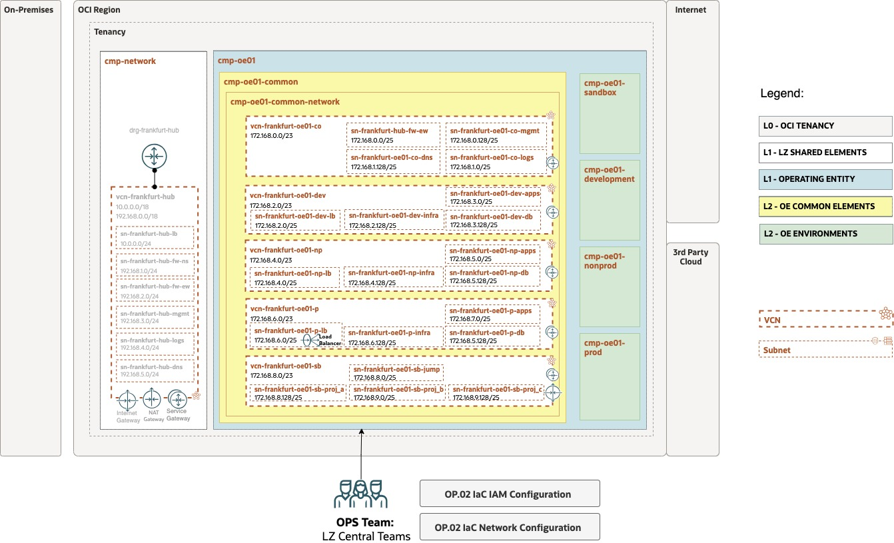

# OE01 network configuration explained

## **Table of Contents**

[1. Introduction](#1-introduction)</br>
[2. Hub VCN](#2-Hub-vcn)</br>
[3. Subnets](#3-subnets)</br>
[4. Route Tables](#4-route-tables)</br>
[5. Security Lists](#5-security-lists) </br>
[6. Network Security Groups](#6-network-security-groups) </br>
[7. VCN gateways](#7-vcn-gateways) </br>
[8. Load Balancer](#9-load-balancer) </br>

&nbsp; 

## **1. Introduction**

Here we'll explain in detail the network configuration that implements the OCI Open LZ design example for the OP.02 Manage Operating Entity (OE) operation example, so you can understand the different objects used in the OCI Network Core Module and how all the pieces plugs together.

The network configuration is based in the following diagram:



## **2. OE VCNs**

In the Open LZ example, onboarding a new OE implies to create a spoke VCN for each OE operating environment. We'll create one common VCN, and VCNs for development, non production, production and sandbox environments. All the VCNs will be attached to the Hub DRG, except the sandbox one, intended to be used as an isolated environment to evaluate OCI services and functionality. 

The VCN attachments to the Hub VCN is a task that can be done in this configuration or as part of the OP.01 configuration. In this case the attachment will be done as a post operation of the OP.01 (POST.OP01.03) to finish the onboarding there, and let the Central Operations Team to manage from that configuration file as an update in the Hub VCN route tables are needed also to allow the North-South traffic to/from the OE VCNs and East-West traffic to allow the connectivity between OE environment VCNs if any.

The VCNs contains the subnets, route tables, security lists, network security groups and gateways.

A VCN example without the sub-elements, is:

```
  "network_configuration": {
        "default_compartment_id": "CMP-OE01-COMMON-NETWORK-KEY",
        "default_enable_cis_checks": false,
        "network_configuration_categories": {
            "oe01": {
                "category_compartment_id": "CMP-OE01-COMMON-NETWORK-KEY",
                "vcns": {
                    "VCN-FRA-OE01-CO-KEY": {
                        "block_nat_traffic": false,
                        "cidr_blocks": [
                            "172.168.0.0/23"
                        ],
                        "dhcp_options": {...},
                        "display_name": "vcn_fra_oe01_co",
                        "dns_label": "oe01co",
                        "is_attach_drg": false,
                        "is_create_igw": false,
                        "is_ipv6enabled": false,
                        "is_oracle_gua_allocation_enabled": false,
                        "network_security_groups": {...},
                        "route_tables": {...},
                        "security_lists": {...},
                        "subnets": {...}.
                        "vcn_specific_gateways": {...},
                    },
                    "VCN-FRA-OE01-DEV-KEY": {
                        "block_nat_traffic": false,
                        "cidr_blocks": [
                            "172.168.2.0/23"
                        ],
                        "dhcp_options": {...},
                        "display_name": "vcn-fra-oe01-dev",
                        "dns_label": "oe01dev",
                        "is_attach_drg": false,
                        "is_create_igw": false,
                        "is_ipv6enabled": false,
                        "is_oracle_gua_allocation_enabled": false,
                        "network_security_groups": {...},
                        "route_tables": {...},
                        "security_lists": {...},
                        "subnets": {...},
                        "vcn_specific_gateways": {...},
                    },
                    "VCN-FRA-OE01-NP-KEY": {
                        "block_nat_traffic": false,
                        "cidr_blocks": [
                            "172.168.4.0/23"
                        ],
                        "dhcp_options": {...},
                        "display_name": "vcn-fra-oe01-np",
                        "dns_label": "oe01np",
                        "is_attach_drg": false,
                        "is_create_igw": false,
                        "is_ipv6enabled": false,
                        "is_oracle_gua_allocation_enabled": false,
                        "network_security_groups": {...},
                        "route_tables": {...},
                        "security_lists": {...},
                        "subnets": {...},
                        "vcn_specific_gateways": {...},
                    },
                    "VCN-FRA-OE01-P-KEY": {
                        "block_nat_traffic": false,
                        "cidr_blocks": [
                            "172.168.6.0/23"
                        ],
                        "dhcp_options": {...},
                        "display_name": "vcn-fra-oe01-p",
                        "dns_label": "oe01p",
                        "is_attach_drg": false,
                        "is_create_igw": false,
                        "is_ipv6enabled": false,
                        "is_oracle_gua_allocation_enabled": false,
                        "network_security_groups": {...},
                        "route_tables": {...},                        
                        "security_lists": {...},
                        "subnets": {...},                           
                        "vcn_specific_gateways": {...},
                    },
                    "VCN-FRA-OE01-SB-KEY": {
                        "block_nat_traffic": false,
                        "cidr_blocks": [
                            "172.168.8.0/23"
                        ],
                        "dhcp_options": {...},
                        "display_name": "vcn-fra-oe01-sb",
                        "dns_label": "oe01sb",
                        "is_attach_drg": false,
                        "is_create_igw": false,
                        "is_ipv6enabled": false,
                        "is_oracle_gua_allocation_enabled": false,
                        "network_security_groups": {...},
                        },
                        "route_tables": {...},
                        "security_lists": {...},
                        "subnets": {...},                
                        "vcn_specific_gateways": {...},
                    }
                },
            }
        }
    }
```

Notice that the "network_configuration" is the main object that we'll use in the OCI network core module, and we're seating all the elements in the "CMP-OE01-COMMON-NETWORK-KEY" compartment, previously created in the identity JSON configuration file for the OE onboarding.

In this example, we're creating the following CIDR blocks for each VCN:

| VCN Name | CIDR Block |
|---|---|
| vcn-fra-oe01-co | 172.168.0.0/23 |
| vcn-fra-oe01-dev | 172.168.2.0/23 |
| vcn-fra-oe01-np | 172.168.4.0/23 |
| vcn-fra-oe01-p | 172.168.6.0/23 |
| vcn-fra-oe01-sb | 172.168.8.0/23 | 

## **3. Subnets**

We create the different OE VCN subnets shown in the OCI Open LZ design. The number of subnets to use depends on your requirements. 

In our case:

| VCN | Subnet | Type | CIDR | Description |
|---|---|---|---|---|
| vcn-fra-oe01-co | sn-fra-oe01-fw-ew | Private | 172.168.0.0/25 | Common VCN for the OE where to centralize network control & inspection with an EW Network Firewall |
| vcn-fra-oe01-co | sn-fra-oe01-co-mgmt | Private | 172.168.0.128/25 | Common VCN for the OE common management tasks subnet |
| vcn-fra-oe01-co | sn-fra-oe01-co-logs | Private | 172.168.1.0/25 | Common VCN for the OE to centralize logs gathering |
| vcn-fra-oe01-co | sn-fra-oe01-co-dns | Private | 172.168.1.128/25 | Common VCN for the OE where to put DNS listener/forwarders |
| vcn-fra-oe01-dev | sn-fra-oe01-dev-lb | Private | 172.168.2.0/25 | OE01 development VCN, Load Balancer subnet |
| vcn-fra-oe01-dev | sn-fra-oe01-dev-infra | Private | 172.168.2.128/25 | OE01 development VCN, Infrastructure subnet |
| vcn-fra-oe01-dev | sn-fra-oe01-dev-apps | Private | 172.168.3.0/25 | OE01 development VCN, Applications subnet |
| vcn-fra-oe01-dev | sn-fra-oe01-dev-db | Private | 172.168.3.128/25 | OE01 development VCN, Databases subnet |
| vcn-fra-oe01-np | sn-fra-oe01-np-lb | Private | 172.168.4.0/25 | OE01 non-prod VCN, Load Balancer subnet |
| vcn-fra-oe01-np | sn-fra-oe01-np-infra | Private | 172.168.4.128/25 | OE01 non-prod VCN, Infrastructure subnet |
| vcn-fra-oe01-np | sn-fra-oe01-np-apps | Private | 172.168.5.0/25 | OE01 non-prod VCN, Applications subnet |
| vcn-fra-oe01-np | sn-fra-oe01-np-db | Private | 172.168.5.128/25 | OE01 non-prod VCN, Databases subnet |
| vcn-fra-oe01-p | sn-fra-oe01-p-lb | Private | 172.168.6.0/25 | OE01 prod VCN, Load Balancer subnet |
| vcn-fra-oe01-p | sn-fra-oe01-p-infra | Private | 172.168.6.128/25 | OE01 prod VCN, Infrastructure subnet |
| vcn-fra-oe01-p | sn-fra-oe01-p-apps | Private | 172.168.7.0/25 | OE01 prod VCN, Applications subnet |
| vcn-fra-oe01-p | sn-fra-oe01-p-db | Private | 172.168.7.128/25 | OE01 prod VCN, Databases subnet |
| vcn-fra-oe01-sb | sn-fra-oe01-sb-jump | Public | 172.168.8.0/25 | OE01 sandbox VCN, Jumphosts subnet |
| vcn-fra-oe01-sb | sn-fra-oe01-sb-proj-a | Private | 172.168.8.128/25 | OE01 sandbox VCN, Project A subnet |
| vcn-fra-oe01-sb | sn-fra-oe01-sb-proj-b | Private | 172.168.9.0/25 | OE01 sandbox VCN, Project B subnet |
| vcn-fra-oe01-sb | sn-fra-oe01-sb-proj-c | Private | 172.168.9.128/25 | OE01 sandbox VCN, Project C subnet |

Example of subnets configuration:

```
"vcns": {
"VCN-FRA-OE01-CO-KEY": {
    ...
    "subnets": {
        "SN-FRA-OE01-CO-FW-EW-KEY": {
            "cidr_block": "172.168.0.0/25",
            "dhcp_options_key": "default_dhcp_options",
            "display_name": "sn-fra-oe01-co-fw-ew",
            "dns_label": "oe01cofwew",
            "prohibit_internet_ingress": true,
            "prohibit_public_ip_on_vnic": true,
            "route_table_key": "RT-01-OE01-CO-VCN-KEY",
            "security_list_keys": [
                "SECLIST-02-OE01-CO-VCN-KEY"
            ]
        },
        "SN-FRA-OE01-CO-MGMT-KEY": {
            "cidr_block": "172.168.0.128/25",
            "dhcp_options_key": "default_dhcp_options",
            "display_name": "sn-fra-oe01-co-mgmt",
            "dns_label": "oe01comgmt",
            "prohibit_internet_ingress": true,
            "prohibit_public_ip_on_vnic": true,
            "route_table_key": "RT-01-OE01-CO-VCN-KEY",
            "security_list_keys": [
                "SECLIST-02-OE01-CO-VCN-KEY"
            ]
        },
        "SN-FRA-OE01-CO-LOGS-KEY": {
            "cidr_block": "172.168.1.0/25",
            "dhcp_options_key": "default_dhcp_options",
            "display_name": "sn-fra-oe01-co-logs",
            "dns_label": "oe01cologs",
            "prohibit_internet_ingress": true,
            "prohibit_public_ip_on_vnic": true,
            "route_table_key": "RT-01-OE01-CO-VCN-KEY",
            "security_list_keys": [
                "SECLIST-02-OE01-CO-VCN-KEY"
            ]
        },
        "SN-FRA-OE01-CO-DNS": {
            "cidr_block": "172.168.1.128/25",
            "dhcp_options_key": "default_dhcp_options",
            "display_name": "sn-fra-oe01-co-dns",
            "dns_label": "oe01codns",
            "prohibit_internet_ingress": true,
            "prohibit_public_ip_on_vnic": true,
            "route_table_key": "RT-01-OE01-CO-VCN-KEY",
            "security_list_keys": [
                "SECLIST-02-OE01-CO-VCN-KEY"
            ]
        }
    },
...
"VCN-FRA-OE01-DEV-KEY": {
    ...
    "subnets": {
        "SN-FRA-OE01-DEV-LB-KEY": {
            "cidr_block": "172.168.2.0/25",
            "dhcp_options_key": "default_dhcp_options",
            "display_name": "sn-fra-oe01-dev-lb",
            "dns_label": "oe01devlb",
            "prohibit_internet_ingress": true,
            "prohibit_public_ip_on_vnic": true,
            "route_table_key": "RT-01-OE01-DEV-VCN-KEY",
            "security_list_keys": [
                "SECLIST-02-OE01-DEV-VCN-KEY"
            ]
        },
        "SN-FRA-OE01-DEV-INFRA-KEY": {
            "cidr_block": "172.168.2.128/25",
            "dhcp_options_key": "default_dhcp_options",
            "display_name": "sn-fra-oe01-dev-infra",
            "dns_label": "oe01devinfra",
            "prohibit_internet_ingress": true,
            "prohibit_public_ip_on_vnic": true,
            "route_table_key": "RT-01-OE01-DEV-VCN-KEY",
            "security_list_keys": [
                "SECLIST-02-OE01-DEV-VCN-KEY"
            ]
        },
        "SN-FRA-OE01-DEV-APPS-KEY": {
            "cidr_block": "172.168.3.0/25",
            "dhcp_options_key": "default_dhcp_options",
            "display_name": "sn-fra-oe01-dev-apps",
            "dns_label": "oe01devapps",
            "prohibit_internet_ingress": true,
            "prohibit_public_ip_on_vnic": true,
            "route_table_key": "RT-01-OE01-DEV-VCN-KEY",
            "security_list_keys": [
                "SECLIST-02-OE01-DEV-VCN-KEY"
            ]
        },
        "SN-FRA-OE01-DEV-DB-KEY": {
            "cidr_block": "172.168.3.128/25",
            "dhcp_options_key": "default_dhcp_options",
            "display_name": "sn-fra-oe01-dev-db",
            "dns_label": "oe01devdb",
            "prohibit_internet_ingress": true,
            "prohibit_public_ip_on_vnic": true,
            "route_table_key": "RT-01-OE01-DEV-VCN-KEY",
            "security_list_keys": [
                "SECLIST-02-OE01-DEV-VCN-KEY"
            ]
        }
    },
...
"VCN-FRA-OE01-NP-KEY": {
    ...
    "subnets": {
        "SN-FRA-OE01-NP-LB-KEY": {
            "cidr_block": "172.168.4.0/25",
            "dhcp_options_key": "default_dhcp_options",
            "display_name": "sn-fra-oe01-np-lb",
            "dns_label": "oe01nplb",
            "prohibit_internet_ingress": true,
            "prohibit_public_ip_on_vnic": true,
            "route_table_key": "RT-01-OE01-NP-VCN-KEY",
            "security_list_keys": [
                "SECLIST-02-OE01-NP-VCN-KEY"
            ]
        },
        "SN-FRA-OE01-NP-INFRA-KEY": {
            "cidr_block": "172.168.4.128/25",
            "dhcp_options_key": "default_dhcp_options",
            "display_name": "sn-fra-oe01-np-infra",
            "dns_label": "oe01npinfra",
            "prohibit_internet_ingress": true,
            "prohibit_public_ip_on_vnic": true,
            "route_table_key": "RT-01-OE01-NP-VCN-KEY",
            "security_list_keys": [
                "SECLIST-02-OE01-NP-VCN-KEY"
            ]
        },
        "SN-FRA-OE01-NP-APPS-KEY": {
            "cidr_block": "172.168.5.0/25",
            "dhcp_options_key": "default_dhcp_options",
            "display_name": "sn-fra-oe01-np-apps",
            "dns_label": "oe01npapps",
            "prohibit_internet_ingress": true,
            "prohibit_public_ip_on_vnic": true,
            "route_table_key": "RT-01-OE01-NP-VCN-KEY",
            "security_list_keys": [
                "SECLIST-02-OE01-NP-VCN-KEY"
            ]
        },
        "SN-FRA-OE01-NP-DB-KEY": {
            "cidr_block": "172.168.5.128/25",
            "dhcp_options_key": "default_dhcp_options",
            "display_name": "sn-fra-oe01-np-db",
            "dns_label": "oe01npdb",
            "prohibit_internet_ingress": true,
            "prohibit_public_ip_on_vnic": true,
            "route_table_key": "RT-01-OE01-NP-VCN-KEY",
            "security_list_keys": [
                "SECLIST-02-OE01-NP-VCN-KEY"
            ]
        }
    },
    "vcn_specific_gateways": {
        "service_gateways": {
            "SG-FRA-OE01-NP-KEY": {
                "display_name": "sg_frankfurt_oe01_np",
                "services": "objectstorage"
            }
        }
    }
},
"VCN-FRA-OE01-P-KEY": {
    ...
    "subnets": {
        "SN-FRA-OE01-P-LB-KEY": {
            "cidr_block": "172.168.6.0/25",
            "dhcp_options_key": "default_dhcp_options",
            "display_name": "sn-fra-oe01-p-lb",
            "dns_label": "oe01plb",
            "prohibit_internet_ingress": true,
            "prohibit_public_ip_on_vnic": true,
            "route_table_key": "RT-01-OE01-P-VCN-KEY",
            "security_list_keys": [
                "SECLIST-02-OE01-P-VCN-KEY"
            ]
        },
        "SN-FRA-OE01-P-INFRA-KEY": {
            "cidr_block": "172.168.6.128/25",
            "dhcp_options_key": "default_dhcp_options",
            "display_name": "sn-fra-oe01-p-infra",
            "dns_label": "oe01pinfra",
            "prohibit_internet_ingress": true,
            "prohibit_public_ip_on_vnic": true,
            "route_table_key": "RT-01-OE01-P-VCN-KEY",
            "security_list_keys": [
                "SECLIST-02-OE01-P-VCN-KEY"
            ]
        },
        "SN-FRA-OE01-P-APPS-KEY": {
            "cidr_block": "172.168.7.0/25",
            "dhcp_options_key": "default_dhcp_options",
            "display_name": "sn-fra-oe01-p-apps",
            "dns_label": "oe01papps",
            "prohibit_internet_ingress": true,
            "prohibit_public_ip_on_vnic": true,
            "route_table_key": "RT-01-OE01-P-VCN-KEY",
            "security_list_keys": [
                "SECLIST-02-OE01-P-VCN-KEY"
            ]
        },
        "SN-FRA-OE01-P-DB-KEY": {
            "cidr_block": "172.168.7.128/25",
            "dhcp_options_key": "default_dhcp_options",
            "display_name": "sn-fra-oe01-p-db",
            "dns_label": "oe01pdb",
            "prohibit_internet_ingress": true,
            "prohibit_public_ip_on_vnic": true,
            "route_table_key": "RT-01-OE01-P-VCN-KEY",
            "security_list_keys": [
                "SECLIST-02-OE01-P-VCN-KEY"
            ]
        }
    },
    ...
"VCN-FRA-OE01-SB-KEY": {
    ...
    "subnets": {
        "SN-FRA-OE01-SB-JUMP-KEY": {
            "cidr_block": "172.168.8.0/25",
            "dhcp_options_key": "default_dhcp_options",
            "display_name": "sn-fra-oe01-sb-jump",
            "dns_label": "oe01sbjump",
            "prohibit_internet_ingress": false,
            "prohibit_public_ip_on_vnic": false,
            "route_table_key": "RT-01-OE01-SB-VCN-KEY",
            "security_list_keys": [
                "SECLIST-02-OE01-SB-VCN-KEY"
            ]
        },
        "SN-FRA-OE01-SB-PROJ-A-KEY": {
            "cidr_block": "172.168.8.128/25",
            "dhcp_options_key": "default_dhcp_options",
            "display_name": "sn-fra-oe01-sb-proj-a",
            "dns_label": "oe01sbproja",
            "prohibit_internet_ingress": true,
            "prohibit_public_ip_on_vnic": true,
            "route_table_key": "RT-01-OE01-SB-VCN-KEY",
            "security_list_keys": [
                "SECLIST-02-OE01-SB-VCN-KEY"
            ]
        },
        "SN-FRA-OE01-SB-PROJ-B-KEY": {
            "cidr_block": "172.168.9.0/25",
            "dhcp_options_key": "default_dhcp_options",
            "display_name": "sn-fra-oe01-sb-proj-b",
            "dns_label": "oe01sbprojb",
            "prohibit_internet_ingress": true,
            "prohibit_public_ip_on_vnic": true,
            "route_table_key": "RT-01-OE01-SB-VCN-KEY",
            "security_list_keys": [
                "SECLIST-02-OE01-SB-VCN-KEY"
            ]
        },
        "SN-FRA-OE01-SB-PROJ-C-KEY": {
            "cidr_block": "172.168.9.128/25",
            "dhcp_options_key": "default_dhcp_options",
            "display_name": "sn-fra-oe01-sb-proj-c",
            "dns_label": "oe01sbprojc",
            "prohibit_internet_ingress": true,
            "prohibit_public_ip_on_vnic": true,
            "route_table_key": "RT-01-OE01-SB-VCN-KEY",
            "security_list_keys": [
                "SECLIST-02-OE01-SB-VCN-KEY"
            ]
        }
    ...
```

## **4. Route Tables**

We use the route tables to allow the network flow from the OE01 subnets to their different destinations that can be: Hub (North-South traffic) another spoke VCNs (East-West traffic) or the VCN's Service Gateway to reach the Oracle Services Network services.

The route tables used in our example are:

| VCN | Route Table | Destination | Target Type | Target | Description |
|---|---|---|---|---|---|
| vcn-fra-oe01-co | rt-01-oe01-co-vcn | All FRA services in OSN | Service Gateway | sg-fra-oe01-co | Route to Service Gateway |
| vcn-fra-oe01-co | rt-01-oe01-co-vcn | 0.0.0.0/0 | Dynamic Routing Gateway | drg-fra-hub OCID | Route to Service Gateway |
| vcn-fra-oe01-dev | rt-01-oe01-dev-vcn | All FRA services in OSN | Service Gateway | sg-fra-oe01-dev | Route to Service Gateway |
| vcn-fra-oe01-dev | rt-01-oe01-dev-vcn | 0.0.0.0/0 | Dynamic Routing Gateway | drg-fra-hub OCID | Route to Service Gateway |
| vcn-fra-oe01-np | rt-01-oe01-np-vcn | All FRA services in OSN | Service Gateway | sg-fra-oe01-np | Route to Service Gateway |
| vcn-fra-oe01-np | rt-01-oe01-np-vcn | 0.0.0.0/0 | Dynamic Routing Gateway | drg-fra-hub OCID | Route to Service Gateway |
| vcn-fra-oe01-p | rt-01-oe01-p-vcn | All FRA services in OSN | Service Gateway | sg-fra-oe01-p | Route to Service Gateway |
| vcn-fra-oe01-p | rt-01-oe01-p-vcn | 0.0.0.0/0 | Dynamic Routing Gateway | drg-fra-hub OCID | Route to Service Gateway |

It is important to highlight that for the VCNs route table it is needed that the *"HUB DRG OCID"* is replaced before running the configuration with the corresponding HUB DRG OCID obteined from the OP.01 operations.

To define the route tables in the JSON configuration we use:

```
"VCN-FRANKFURT-OE01-CO-KEY": {
(...)
    "route_tables": {
        "RT-01-OE01-CO-VCN-KEY": {
            "display_name": "rt-01-oe01-co-vcn",
                "route_rules": {
                    "sgw_route": {
                        "description": "Route for sgw",
                        "destination": "all-services",
                        "destination_type": "SERVICE_CIDR_BLOCK",
                        "network_entity_key": "SG-FRANKFURT-OE01-CO-KEY"
                    }
            }
        }
    },
(...)
"VCN-FRANKFURT-OE01-DEV-KEY": {
(..:)
    "route_tables": {
    "RT-01-OE01-DEV-VCN-KEY": {
        "display_name": "rt-01-oe01-dev-vcn",
        "route_rules": {
            "sgw_route": {
                "description": "Route for sgw",
                "destination": "all-services",
                "destination_type": "SERVICE_CIDR_BLOCK",
                "network_entity_key": "SG-FRANKFURT-OE01-DEV-KEY"
            },
            "drg_route": {
                "description": "Route to DRG",
                "destination": "0.0.0.0/0",
                "destination_type": "CIDR_BLOCK",
                "network_entity_id": "<HUB DRG OCID>"
            }
        }
    }
"VCN-FRANKFURT-OE01-NP-KEY": {
(...)
    "route_tables": {
        "RT-01-OE01-NP-VCN-KEY": {
            "display_name": "rt-01-oe01-np-vcn",
            "route_rules": {
                "sgw_route": {
                    "description": "Route for sgw",
                    "destination": "all-services",
                    "destination_type": "SERVICE_CIDR_BLOCK",
                    "network_entity_key": "SG-FRANKFURT-OE01-NP-KEY"
                },
                "drg_route": {
                    "description": "Route to DRG",
                    "destination": "0.0.0.0/0",
                    "destination_type": "CIDR_BLOCK",
                    "network_entity_id": "<HUB DRG OCID>"
                }
            }
        }
    },
(...)
"VCN-FRANKFURT-OE01-P-KEY": {
(...)
    "route_tables": {
    "RT-01-OE01-P-VCN-KEY": {
        "display_name": "rt-01-oe01-p-vcn",
            "route_rules": {
                "sgw_route": {
                    "description": "Route for sgw",
                    "destination": "all-services",
                    "destination_type": "SERVICE_CIDR_BLOCK",
                    "network_entity_key": "SG-FRANKFURT-OE01-P-KEY"
                },
                "drg_route": {
                    "description": "Route to DRG",
                    "destination": "0.0.0.0/0",
                    "destination_type": "CIDR_BLOCK",
                    "network_entity_id": "<HUB DRG OCID>"
                }
        }
    }
},
(...)
```

## **5. Security Lists**

Security lists acts as virtual firewall at packet level to control the ingress and egress traffic throuth security rules. Its rules applies to all the VNICs in any subnet that the security list is associated with.

Each VCN comes with a default security list. If we don't specify any, OCI will create one and it will be outside of the Open LZ configuration control. Thus, we can specify a default security list with or without security rules, just to be able to override this default behaviour and assign, or not, to any specific subnet in the VCN. 

We recomend to create specific security list for the subnets.

In our example we'll use OCI Network Firewall (NFW) service at the Hub level for network traffic control and inspection. Any Security List or Network Security Groups rules will be evaluated before on each subnet/vnic before the NFW. In our example, we'll simple configure the Security List to accept any incoming/outgoing traffic, leveraging these controls to the North-South and East-West NFWs just for simplicity. Adapt this to your specific design.

To define a default security list, you can use the following configuration example:

```
"VCN-FRANKFURT-OE01-CO-KEY": {
(...)
    "default_security_list": {
        "display_name": "defseclist_fra_oe01_co_vcn",
        "egress_rules": [],
        "ingress_rules": [
            {
                "stateless": false,
                "protocol": "ICMP",
                "description": "ICMP type 3 code 4",
                "src": "0.0.0.0/0",
                "src_type": "CIDR_BLOCK",
                "icmp_type": 3,
                "icmp_code": 4
            }
        ]
    },
(...)
"VCN-FRANKFURT-OE01-DEV-KEY": {
(...)
    "default_security_list": {
        "display_name": "defseclist_fra_oe01_dev_vcn",
        "egress_rules": [],
        "ingress_rules": [
            {
                "stateless": false,
                "protocol": "ICMP",
                "description": "ICMP type 3 code 4",
                "src": "0.0.0.0/0",
                "src_type": "CIDR_BLOCK",
                "icmp_type": 3,
                "icmp_code": 4
            }
        ]
    },
(...)
"VCN-FRANKFURT-OE01-NP-KEY": {
(...)
    "default_security_list": {
        "display_name": "defseclist_fra_oe01_p_vcn",
        "egress_rules": [],
        "ingress_rules": [
            {
                "stateless": false,
                "protocol": "ICMP",
                "description": "ICMP type 3 code 4",
                "src": "0.0.0.0/0",
                "src_type": "CIDR_BLOCK",
                "icmp_type": 3,
                "icmp_code": 4
            }
        ]
    },
"VCN-FRANKFURT-OE01-P-KEY": {
    "default_security_list": {
        "display_name": "defseclist_fra_oe01_p_vcn",
        "egress_rules": [],
        "ingress_rules": [
            {
                "stateless": false,
                "protocol": "ICMP",
                "description": "ICMP type 3 code 4",
                "src": "0.0.0.0/0",
                "src_type": "CIDR_BLOCK",
                "icmp_type": 3,
                "icmp_code": 4
            }
        ]
    }, 
(...)
```

The security lists used in our example are:

| VCN | Security List | Rule Type | Stateless? | Source/Destination | Protocol | Source Port Range | Destination Port Range | Type and Code | Description |
|---|---|---|---|---|---|---|---|---|---|
| vcn-fra-oe01-co | sl-01-oe01-co-vcn | Ingress | No | 0.0.0.0/0 | All | All | All | | Ingress from 0.0.0.0/0 over any protocol |
| vcn-fra-oe01-co | sl-01-oe01-co-vcn | Egress | No | 0.0.0.0/0 | All | All | All | | Egress to 0.0.0.0/0 over all protocols |
| vcn-fra-oe01-co | sl-02-oe01-co-vcn | Ingress | No | 0.0.0.0/0 | All | All | All | | Ingress from 0.0.0.0/0 over any protocol |
| vcn-fra-oe01-co | sl-02-oe01-co-vcn | Egress | No | 0.0.0.0/0 | All | All | All | | Egress to 0.0.0.0/0 over all protocols |
| vcn-fra-oe01-co | sl-02-oe01-co-vcn | Egress | No | All FRA Services in OSN | All | All | All | | Egress rule for OSN |
| vcn-fra-oe01-dev | sl-01-oe01-dev-vcn | Ingress | No | 0.0.0.0/0 | All | All | All | | Ingress from 0.0.0.0/0 over any protocol |
| vcn-fra-oe01-dev | sl-01-oe01-dev-vcn | Egress | No | 0.0.0.0/0 | All | All | All | | Egress to 0.0.0.0/0 over all protocols |
| vcn-fra-oe01-dev | sl-02-oe01-dev-vcn | Ingress | No | 0.0.0.0/0 | All | All | All | | Ingress from 0.0.0.0/0 over any protocol |
| vcn-fra-oe01-dev | sl-02-oe01-dev-vcn | Egress | No | 0.0.0.0/0 | All | All | All | | Egress to 0.0.0.0/0 over all protocols |
| vcn-fra-oe01-dev | sl-02-oe01-dev-vcn | Egress | No | All FRA Services in OSN | All | All | All | | Egress rule for OSN |
| vcn-fra-oe01-np | sl-01-oe01-np-vcn | Ingress | No | 0.0.0.0/0 | All | All | All | | Ingress from 0.0.0.0/0 over any protocol |
| vcn-fra-oe01-np | sl-01-oe01-np-vcn | Egress | No | 0.0.0.0/0 | All | All | All | | Egress to 0.0.0.0/0 over all protocols |
| vcn-fra-oe01-np | sl-02-oe01-np-vcn | Ingress | No | 0.0.0.0/0 | All | All | All | | Ingress from 0.0.0.0/0 over any protocol |
| vcn-fra-oe01-np | sl-02-oe01-np-vcn | Egress | No | 0.0.0.0/0 | All | All | All | | Egress to 0.0.0.0/0 over all protocols |
| vcn-fra-oe01-np | sl-02-oe01-np-vcn | Egress | No | All FRA Services in OSN | All | All | All | | Egress rule for OSN |
| vcn-fra-oe01-p | sl-01-oe01-p-vcn | Ingress | No | 0.0.0.0/0 | All | All | All | | Ingress from 0.0.0.0/0 over any protocol |
| vcn-fra-oe01-p | sl-01-oe01-p-vcn | Egress | No | 0.0.0.0/0 | All | All | All | | Egress to 0.0.0.0/0 over all protocols |
| vcn-fra-oe01-p | sl-02-oe01-p-vcn | Ingress | No | 0.0.0.0/0 | All | All | All | | Ingress from 0.0.0.0/0 over any protocol |
| vcn-fra-oe01-p | sl-02-oe01-p-vcn | Egress | No | 0.0.0.0/0 | All | All | All | | Egress to 0.0.0.0/0 over all protocols |
| vcn-fra-oe01-p | sl-02-oe01-p-vcn | Egress | No | All FRA Services in OSN | All | All | All | | Egress rule for OSN |

You can define them in the configuration like this (we just put the prod environment as an example):

```
"security_lists": {
"VCN-FRANKFURT-OE01-P-KEY": {
(...)
    "security_lists": {
    "SECLIST-01-OE01-P-VCN-KEY": {
        "display_name": "sl-01-oe01-p-vcn",
        "egress_rules": [
            {
                "description": "egress to 0.0.0.0/0 over ALL protocols",
                "dst": "0.0.0.0/0",
                "dst_type": "CIDR_BLOCK",
                "protocol": "ALL",
                "stateless": false
            }
        ],
        "freeform_tags": null,
        "ingress_rules": [
            {
                "description": "ingress from 0.0.0.0/0 ALL ports",
                "protocol": "ALL",
                "src": "0.0.0.0/0",
                "src_type": "CIDR_BLOCK",
                "stateless": false
            }
        ]
    },
    "SECLIST-02-OE01-P-VCN-KEY": {
        "display_name": "sl-02-oe01-p-vcn",
        "egress_rules": [
            {
                "description": "egress to 0.0.0.0/0 over TCP",
                "dst": "0.0.0.0/0",
                "dst_type": "CIDR_BLOCK",
                "protocol": "ALL",
                "stateless": false
            },
            {
                "description": "egress rule for OSN",
                "dst": "all-fra-services-in-oracle-services-network",
                "dst_type": "SERVICE_CIDR_BLOCK",
                "protocol": "ALL",
                "stateless": false
            }
        ],
        "ingress_rules": [
            {
                "description": "ingress from 0.0.0.0/0 ALL ports",
                "protocol": "ALL",
                "src": "0.0.0.0/0",
                "src_type": "CIDR_BLOCK",
                "stateless": false
            }
        ]
    }
},
```

## **6. Network Security Groups**

Network Security Groups (NSGs) acts also as virtual firewalls to control traffic at packet level. The difference with Security Lists is that the NSGs applies only to a set of VNICs of your choice in a single VCN, contrary to the Security Lists that applies over ALL the VNICs. NSGs are supported only for some specific OCI services. Oracle recommends to use NSGs over security lists.

In our example we'll use OCI Network Firewall (NFW) service at the Hub level for network traffic control and inspection. Any Security List or Network Security Groups rules will be evaluated before on each subnet/vnic before the NFW. In our example, we'll simple configure the Security List to accept any incoming/outgoing traffic, leveraging these controls to the North-South and East-West NFWs just for simplicity. Adapt this to your specific design.

The network security groups used in our example are:

| VCN | Network Security Group | Rule Type | Stateless? | Source | Protocol | Source Port Range | Destination Port Range | Type and Code | Description |
|---|---|---|---|---|---|---|---|---|---|
| vcn-fra-oe01-co | nsg_01_hub_vcn | Ingress | No | 0.0.0.0/0 | TCP | All | All | | Ingress from 0.0.0.0/0 over TCP 22
| nsg_01_hub_vcn | Egress | No | 0.0.0.0/0 | All | | | | Egress to 0.0.0.0/0 over all protocols
| nsg_02_hub_vcn | Ingress | No | 0.0.0.0/0 | TCP | All | 443 | | Ingress from 0.0.0.0/0 over HTTP 443
| nsg_02_hub_vcn | Ingress | No | 0.0.0.0/0 | TCP | All | 80 | | Ingress to 0.0.0.0/0 over HTTP 80
| nsg_02_hub_vcn | Ingress | No | 0.0.0.0/0 | TCP | All | 22 | | Ingress to 0.0.0.0/0 over TCP 22
| nsg_02_hub_vcn | Egress | No | 0.0.0.0/0 | TCP | All | All | | Egress to 0.0.0.0/0 over TCP
| nsg_03_hub_vcn | Ingress | No | 0.0.0.0/0 | TCP | All | 80 | | Ingress to 0.0.0.0/0 over HTTP 80
| nsg_03_hub_vcn | Ingress | No | 0.0.0.0/0 | TCP | All | 22 | | Ingress to 0.0.0.0/0 over TCP 22
| nsg_03_hub_vcn | Egress | No | 0.0.0.0/0 | TCP | All | All | | Egress to 0.0.0.0/0 over TCP

The network security groups are defined in the configuration with:

```
"network_security_groups": {
    "NSG-01-HUB-VCN-KEY": {
        "display_name": "nsg_01_hub_vcn",
        "egress_rules": {
            "anywhere": {
                "description": "egress to 0.0.0.0/0 over TCP",
                "dst": "0.0.0.0/0",
                "dst_type": "CIDR_BLOCK",
                "protocol": "TCP",
                "stateless": false
            }
        },
        "ingress_rules": {
            "ssh_22": {
                "description": "ingress from 0.0.0.0/0 over TCP22",
                "dst_port_max": 22,
                "dst_port_min": 22,
                "protocol": "TCP",
                "src": "0.0.0.0/0",
                "src_type": "CIDR_BLOCK",
                "stateless": false
            }
        }
    },
    "NSG-02-HUB-VCN-KEY": {
        "display_name": "nsg_02_hub_vcn",
        "egress_rules": {
            "anywhere": {
                "description": "egress to 0.0.0.0/0 over TCP",
                "dst": "0.0.0.0/0",
                "dst_type": "CIDR_BLOCK",
                "protocol": "TCP",
                "stateless": false
            }
        },
        "ingress_rules": {
            "http_80": {
                "description": "ingress from 0.0.0.0/0 over HTTP8080",
                "dst_port_max": 80,
                "dst_port_min": 80,
                "protocol": "TCP",
                "src": "0.0.0.0/0",
                "src_type": "CIDR_BLOCK",
                "stateless": false
            },
            "https_443": {
                "description": "ingress from 0.0.0.0/0 over HTTPs443",
                "dst_port_max": 443,
                "dst_port_min": 443,
                "protocol": "TCP",
                "src": "0.0.0.0/0",
                "src_type": "CIDR_BLOCK",
                "stateless": false
            },
            "ssh_22": {
                "description": "ingress from 0.0.0.0/0 over TCP22",
                "dst_port_max": 22,
                "dst_port_min": 22,
                "protocol": "TCP",
                "src": "0.0.0.0/0",
                "src_type": "CIDR_BLOCK",
                "stateless": false
            }
        }
    },
    "NSG-03-HUB-VCN-KEY": {
        "display_name": "nsg_03_hub_vcn",
        "egress_rules": {
            "anywhere": {
                "description": "egress to 0.0.0.0/0 over TCP",
                "dst": "0.0.0.0/0",
                "dst_type": "CIDR_BLOCK",
                "protocol": "TCP",
                "stateless": false
            }
        },
        "ingress_rules": {
            "http_8080": {
                "description": "ingress from 0.0.0.0/0 over HTTP8080",
                "dst_port_max": 80,
                "dst_port_min": 80,
                "protocol": "TCP",
                "src": "0.0.0.0/0",
                "src_type": "CIDR_BLOCK",
                "stateless": false
            },
            "ssh_22": {
                "description": "ingress from 0.0.0.0/0 over TCP22",
                "dst_port_max": 22,
                "dst_port_min": 22,
                "protocol": "TCP",
                "src": "0.0.0.0/0",
                "src_type": "CIDR_BLOCK",
                "stateless": false
            }
        }
    }
},
```

## **7. VCN Gateways**

We have 3 kinds of specific VCN gateways: Internet Gateways, NAT Gateways and Service Gateways. The Intenet Gateway allow to use to receive Internet incoming traffic to public subnets for internet facing applications or direct access to services. NAT gateways would allow to different OCI instances or services to access to the public internet masking their source IP addresses to access other services or internet destinations. Service Gateways allows to OCI instances or services to access to the Oracle Services Network.

In our example, we use the Internet and Service Gateways as:

| VCN | Name | Gateway Type | Services |
|---|---|---|---|
| vcn-fra-oe01-co | sg-fra-oe01-co | Service Gateway | All FRA Services in OSN | 
| vcn-fra-oe01-dev | sg-fra-oe01-dev | Service Gateway | All FRA Services in OSN | 
| vcn-fra-oe01-np | sg-fra-oe01-np | Service Gateway | All FRA Services in OSN | 
| vcn-fra-oe01-p | sg-fra-oe01-p | Service Gateway | All FRA Services in OSN | 

All the OE VCNs (except Sandbox) will have the same kind of Service Gateway. Any incoming/outgoing traffic (North-South), will be managed in the Hub VCN with the specific Internet/NAT gateways.

An example of configuration (same for all the OE VCNs) is:

```
"VCN-FRANKFURT-OE01-CO-KEY": {
    "vcn_specific_gateways": {
        "service_gateways": {
            "SG-FRA-OE01-CO-KEY": {
                "display_name": "sg-fra-oe01-co",
                "services": "all-services"
            }
        }
    }
```

## **8. Load Balancer**

OCI Load Balancer provides automated traffic distribution from one entry point to multiple servers reacheable from your VCNs. The service offers public or private IP address and provisioned bandwidth. You can get more information about the OCI Load Balancer service in the [documentation](https://docs.oracle.com/en-us/iaas/Content/Balance/Concepts/balanceoverview.htm).

In the case of the OE's, we'll be provisioning a private load balancer for each OE environment spoke VCN so we can manage the OE published applications. For that aplications with Internet facing exposure, we'll have to configure the application in the Hub public Load Balancer with a backend set and path to the OE environment specific Load Balancer VIP and path.

In our example, we're configuring a couple of applications running in two different VMs in the production environment (testapp1 & testapp2). We have a backend set (backend-set-01) that, depending on the URI path, a routing policy will send the request to one of the VMs or the other. For the non-prod environment we're also creating a backend set but in this case just with one possible backend VM (testapp3). We've created these examples to test later the inter-VCN connectivity between apps (testapp1 <-> testapp2) and also the intra-VCN applications (East-West traffic) with access from the OE01 prod enviroment to an app in the non-prod environment (testapp3).

Adapt the Load Balancer configuration to your design. Typically backends offers high availability for applications, having for a same app 2 or more backend VMs for scaling and high availability. You can also customize the balancing policy that best fits your needs (least connections, round robin...).

The Load Balancers deployed in our OE examples has the following characteristics:

| VCN | Load Balancer Name | Type | Shape | Subnet | Backend Sets | Backends | Listener | Port/Protocol | Routing Policy | Hostname | Use SSL |
|---|---|---|---|---|---|---|---|---|---|---|---|
| vcn-fra-oe01-dev | lb-oe01-dev-01 | Private | Flexible | sn-fra-oe01-dev-lb | default-backend-set-00 | - | lb1-oe01-dev-lsnr1-80 | 80/HTTP | - | - | No |
| vcn-fra-oe01-np | lb-oe01-np-01 | Private | Flexible | sn-fra-oe01-np-lb | default-backend-set-00, backend-set-01 | 172.168.5.10 | lb1-oe01-np-lsnr1-80 | 80/HTTP | lbrule_testapp | - | No |
| vcn-fra-oe01-p | lb-oe01-p-01 | Private | Flexible | sn-fra-oe01-p-lb | default-backend-set-00, backend-set-01 | 172.168.7.10, 172.168.7.11 | lb1-oe01-p-lsnr1-80 | 80/HTTP | lbrule_testapp | - | No |


The configuration block looks like:

```
"non_vcn_specific_gateways": {
    "l7_load_balancers": {
        "LB-OE01-P-01-KEY": {
            "backend_sets": {
                "LB-OE01-P-01-BCKENDSET-00-KEY": {
                    "health_checker": {
                        "interval_ms": 10000,
                        "is_force_plain_text": true,
                        "port": 80,
                        "protocol": "HTTP",
                        "retries": 3,
                        "return_code": 200,
                        "timeout_in_millis": 3000,
                        "url_path": "/"
                    },
                    "name": "default-backend-set-00",
                    "policy": "LEAST_CONNECTIONS"
                },
                "LB-OE01-P-01-BCKENDSET-01-KEY": {
                    "backends": {
                        "LB-OE01-P-01-BCKEND-01-KEY": {
                            "ip_address": "172.168.7.10",
                            "port": 80
                        }
                    },
                    "health_checker": {
                        "interval_ms": 10000,
                        "is_force_plain_text": true,
                        "port": 80,
                        "protocol": "HTTP",
                        "retries": 3,
                        "return_code": 200,
                        "timeout_in_millis": 3000,
                        "url_path": "/testapp1/"
                    },
                    "name": "backend-set-01",
                    "policy": "LEAST_CONNECTIONS"
                },
                "LB-OE01-P-01-BCKENDSET-02-KEY": {
                    "backends": {
                        "LB-OE01-P-01-BCKEND-02-KEY": {
                            "ip_address": "172.168.7.11",
                            "port": 80
                        }
                    },
                    "health_checker": {
                        "interval_ms": 10000,
                        "is_force_plain_text": true,
                        "port": 80,
                        "protocol": "HTTP",
                        "retries": 3,
                        "return_code": 200,
                        "timeout_in_millis": 3000,
                        "url_path": "/testapp2/"
                    },
                    "name": "backend-set-02",
                    "policy": "LEAST_CONNECTIONS"
                }
            },
            "display_name": "lb-oe01-p-01",
            "ip_mode": "IPV4",
            "is_private": true,
            "listeners": {
                "LB-OE01-P-01-LSNR-1-80": {
                    "connection_configuration": {
                        "idle_timeout_in_seconds": 1200
                    },
                    "default_backend_set_key": "LB-01-P-01-BCKENDSET-00-KEY",
                    "name": "lb-oe01-p-lsnr1-80",
                    "port": "80",
                    "protocol": "HTTP",
                    "routing_policy_key": "LB-01-P-01-ROUTE-POLICY-1-KEY"
                }
            },
            "network_security_group_keys": [
                "NSG-02-OE01-P-VCN-KEY"
            ],
            "routing_policies": {
                "LB-OE01-P-01-ROUTE-POLICY-1-KEY": {
                    "name": "lbrule_testapp",
                    "condition_language_version": "V1",
                    "rules": {
                        "lbrouterule_testapp1": {
                            "actions": {
                                "action-1": {
                                    "backend_set_key": "LB-OE01-P-01-BCKENDSET-01-KEY",
                                    "name": "FORWARD_TO_BACKENDSET"
                                    }
                            },
                            "condition": "all(http.request.url.path sw (i '/testapp1/'))",
                            "name": "testapp1"                                            
                        },
                        "lbrouterule_testapp2": {
                            "actions": {
                                "action-2": {
                                    "backend_set_key": "LB-OE01-P-01-BCKENDSET-02-KEY",
                                    "name": "FORWARD_TO_BACKENDSET"
                                }
                            },
                            "condition": "all(http.request.url.path sw (i '/testapp2/'))",
                            "name": "testapp2"                                            
                        }                                        
                    }
                }
            },
            "shape": "flexible",
            "shape_details": {
                "maximum_bandwidth_in_mbps": 100,
                "minimum_bandwidth_in_mbps": 10
            },
            "subnet_ids": [],
            "subnet_keys": [
                "SN-FRANKFURT-OE01-P-LB-KEY"
            ]
        },
        "LB-OE01-NP-01-KEY": {
            "backend_sets": {
                "LB-OE01-NP-01-BCKENDSET-00-KEY": {
                    "health_checker": {
                        "interval_ms": 10000,
                        "is_force_plain_text": true,
                        "port": 80,
                        "protocol": "HTTP",
                        "retries": 3,
                        "return_code": 200,
                        "timeout_in_millis": 3000,
                        "url_path": "/"
                    },
                    "name": "default-backend-set-00",
                    "policy": "LEAST_CONNECTIONS"
                },
                "LB-OE01-NP-01-BCKENDSET-01-KEY": {
                    "backends": {
                        "LB-OE01-NP-01-BCKEND-01-KEY": {
                            "ip_address": "172.168.5.10",
                            "port": 80
                        }
                    },
                    "health_checker": {
                        "interval_ms": 10000,
                        "is_force_plain_text": true,
                        "port": 80,
                        "protocol": "HTTP",
                        "retries": 3,
                        "return_code": 200,
                        "timeout_in_millis": 3000,
                        "url_path": "/testapp3/"
                    },
                    "name": "backend-set-01",
                    "policy": "LEAST_CONNECTIONS"
                }
            },
            "display_name": "lb-oe01-np-01",
            "ip_mode": "IPV4",
            "is_private": true,
            "listeners": {
                "LB-OE01-NP-01-LSNR-1-80": {
                    "connection_configuration": {
                        "idle_timeout_in_seconds": 1200
                    },
                    "default_backend_set_key": "LB-OE01-NP-01-BCKENDSET-00-KEY",
                    "name": "lb-oe01-np-lsnr1-80",
                    "port": "80",
                    "protocol": "HTTP",
                    "routing_policy_key": "LB-OE01-NP-01-ROUTE-POLICY-1-KEY"
                }
            },
            "network_security_group_keys": [
                "NSG-02-OE01-NP-VCN-KEY"
            ],
            "routing_policies": {
                "LB-OE01-NP-01-ROUTE-POLICY-1-KEY": {
                    "name": "lbrule_testapp",
                    "condition_language_version": "V1",
                    "rules": {
                        "lbrouterule_testapp3": {
                            "actions": {
                                "action-1": {
                                    "backend_set_key": "LB-OE01-NP-01-BCKENDSET-01-KEY",
                                    "name": "FORWARD_TO_BACKENDSET"
                                    }
                            },
                            "condition": "all(http.request.url.path sw (i '/testapp3/'))",
                            "name": "testapp3"                                            
                        }                                   
                    }
                }
            },
            "shape": "flexible",
            "shape_details": {
                "maximum_bandwidth_in_mbps": 100,
                "minimum_bandwidth_in_mbps": 10
            },
            "subnet_ids": [],
            "subnet_keys": [
                "SN-FRANKFURT-OE01-NP-LB-KEY"
            ]
        },
        "LB-OE01-DEV-01-KEY": {
            "backend_sets": {
                "LB-OE01-DEV-01-BCKENDSET-00-KEY": {
                    "health_checker": {
                        "interval_ms": 10000,
                        "is_force_plain_text": true,
                        "port": 80,
                        "protocol": "HTTP",
                        "retries": 3,
                        "return_code": 200,
                        "timeout_in_millis": 3000,
                        "url_path": "/"
                    },
                    "name": "default-backend-set-00",
                    "policy": "LEAST_CONNECTIONS"
                }
            },
            "display_name": "lb-oe01-dev-01",
            "ip_mode": "IPV4",
            "is_private": true,
            "listeners": {
                "LB-OE01-DEV-01-LSNR-1-80": {
                    "connection_configuration": {
                        "idle_timeout_in_seconds": 1200
                    },
                    "default_backend_set_key": "LB-OE01-DEV-01-BCKENDSET-00-KEY",
                    "name": "lb-oe01-dev-lsnr1-80",
                    "port": "80",
                    "protocol": "HTTP"              
                }
            },
            "network_security_group_keys": [
                "NSG-02-OE01-DEV-VCN-KEY"
            ],
            "shape": "flexible",
            "shape_details": {
                "maximum_bandwidth_in_mbps": 100,
                "minimum_bandwidth_in_mbps": 10
            },
            "subnet_ids": [],
            "subnet_keys": [
                "SN-FRANKFURT-OE01-DEV-LB-KEY"
            ]
        }
    }
}
```

# License

Copyright (c) 2024 Oracle and/or its affiliates.

Licensed under the Universal Permissive License (UPL), Version 1.0.

See [LICENSE](LICENSE) for more details.
