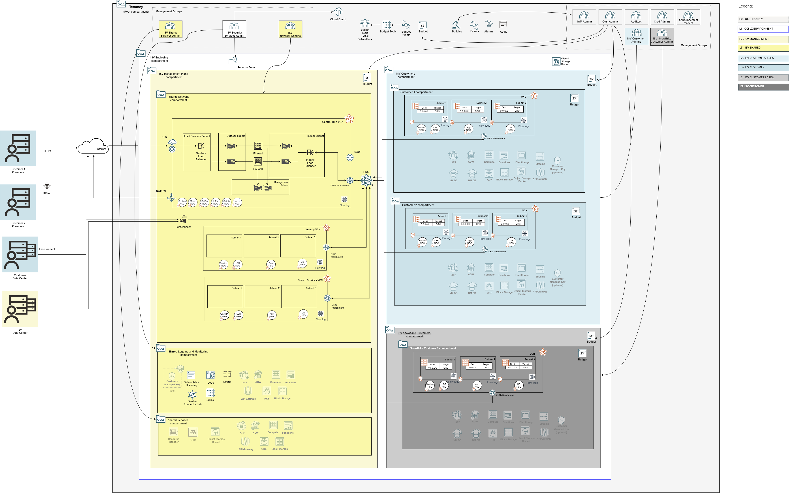

# **The OCI Open LZ &ndash; Multi-OE SaaS [Blueprint](#)**

### A Blueprint to Simplify the Onboarding of Organizations, Business Units, and Subsidiaries into OCI

&nbsp; 

**Table of Contents**

[1. Introduction](#1-introduction) 
[2. Security View](#3-security-view) 
[3. Runtime View](#6-runtime-view)

&nbsp; 

# **1. Introduction**

This blueprint contains the design and IaC configuration files for an OCI SaaS (Software-as-a-Service) Vendor Landing Zone based on OCI Core Landing Zone (formerly known as OCI CIS Landing Zone) principles. This Blueprint is designed for SaaS vendors and managed service providers to onboard OCI in a streamlined manner that aligns with the CIS OCI Benchmark and best practices for SaaS vendors and managed services vendors.  The Pod model is designed so that each customer gets a copy or application stack.  This pattern can be seen in SaaS and managed services industries where each customer's environment is independent of another, and the only parts shared are the management plane. 

&nbsp; 

# 2. Security View

This chapter presents the following elements:
1. **Tenancy Structure** presents the compartment structure to support resource grouping, separation of duties, and budget control and billing.
2. **Identity and Access Management** defines the groups, dynamic groups, and policies for the related duties and compartments.
3. **Posture Management** describes the additional configurations for native security tooling to set a strong security posture.

&nbsp; 

## 2.1 Tenancy Structure

The following architecture diagram depicts a single tenancy blueprint, separating the management plane (red color) from the customer plane (blue and grey) compartments. [Click here](https://github.com/oci-landing-zones/oci-landing-zone-operating-entities/blob/content/blueprints/multi-oe/saas/OCI_Open_LZ_Multi-OE_SaaS_Blueprint.drawio) to download the drawio version.

&nbsp; 

&nbsp; 

### 2.1.1 Enclosing Compartment

The enclosing compartment (white) represents the environment of the SaaS offering or a single SaaS offering. The former would separate the production environment from the test environment, and the latter would be SaaS Application 1 and SaaS Application 2. It achieves this by representing the scope for OCI IAM and guard rails used in the SaaS respective environment.  

### 2.1.2 Management Plane Compartment

The management plane compartment (light yellow) is designed to house the OCI resources that provide the functions and processes that determine which path the data and OCI resources that make up the application are managed. A management plane is similar to a cloud provider's control plane and they are shared resources that are used by all application stacks running in the customer plane compartment (blue). There are three types of functions and processes defined in this blueprint.

### 2.1.3 Networking Compartment
The network compartment (yellow) is designed to house the shared Virtual Cloud Networks (VCNs) used to secure and route network traffic to and from the application stack including the Central Hub VCN for centralizing the control and inspection of any incoming/outgoing network traffic and also the needed VCNs for Security and Shared services.

### 2.1.4 Customers Plane Compartment
The ISV Customers comaprtment (light blue) holds the different dedicated compartments for each customer which will give to them the needed isolation to hold their workloads. T

&nbsp; 

## 2.2 Identity and Access Management

### 2.2.1 Tenancy Level Groups

**IAM Administrators:** manage IAM services and resources including compartments, groups, dynamic groups, policies, identity providers, authentication policies, network sources, tag defaults. However, this group is not allowed to manage the out-of-box Administrators and Credential Administrators groups. It's also not allowed to touch the out-of-box Tenancy Admin Policy policy.

**Credential Administrators:** manage users capabilities and users credentials in general, including API keys, authentication tokens and secret keys.

**Cost Administrators:** manage budgets and usage reports.

**Auditors:** entitled with read-only access across the tenancy and the ability to use cloud-shell to run the cis_reports.py script.

**Announcement Readers:** for reading announcements displayed in OCI Console.

&nbsp; 

### 2.2.2 Management Groups

**Security Administrators:** manage security services and resources including Vaults, Keys, Logging, Vulnerability Scanning, Web Application Firewall, Bastion, Service Connector Hub.

**Network Administrators:** manage OCI network family, including VCNs, Load Balancers, DRGs, VNICs, IP addresses.

**Shared Services Administrators:** manage OCI services that are used amond the different ISV customers as the Resource Manager Stacks with the configurations and state files, OCI Contaner and Image registry, shared Object Storage buckets, Compute instances, API gateway, Kubernetes clusters, Functions and/or any other service that might serve for management aplications for the operation of the different ISV customers.

&nbsp; 

### 2.2.3 Customer Groups

**Customer Administrators:** manage application stacks deployments and related resources in the Customer Compartment.  OCI resources include Compartments, Network, Compute images, Database OCI Functions, Kubernetes clusters, Streams, Object Storage, Block Storage, File Storage, Keys, and Budgets.

**Snowflake Customer Administrators:** manage application stacks deployments and related resources in the Snowflake Customer Compartment.  OCI resources include Compartments, Network, Compute images, Database OCI Functions, Kubernetes clusters, Streams, Object Storage, Block Storage, File Storage, Keys, and Budgets.

&nbsp; 

## 2.3 Posture Management

**Oracle Cloud Guard:** activity, configuration, and threat detector recipes are defined at the tenancy level to examine your resources for security weaknesses and to monitor operators and users for risky activities.

**Policies:** IAM policies which grants access to the tenancy level wide administrator groups as the IAM, credentials, cost administrator groups, announcement readers, auditors and the specific ISV enclosing, and shared services compartments. It will also contain OCI services needed policies.

**Events:** The events related to CRUD (Create, Read, Update or Delete) state changes of tenancy level resources, as Budget events or Cloud Guard events or reported problems.

**Budgets:** The budgets configured will emit events when reaching the percentage or amount of money configured for a given budget. It will fire an event thatn can be integrated with the OCI Notification services.

**Subscriptions:** The OCI notification subscription will let the subscribers to receive information about an specific topic, as budget topic. By default the subscription type will be by e-mail.

&nbsp; 

# 4. Runtime View
This chapter is presented [here](/blueprints/multi-oe/saas/runtime/readme.md) and guides the **deployment** activities for the **day two execution** of this model.

