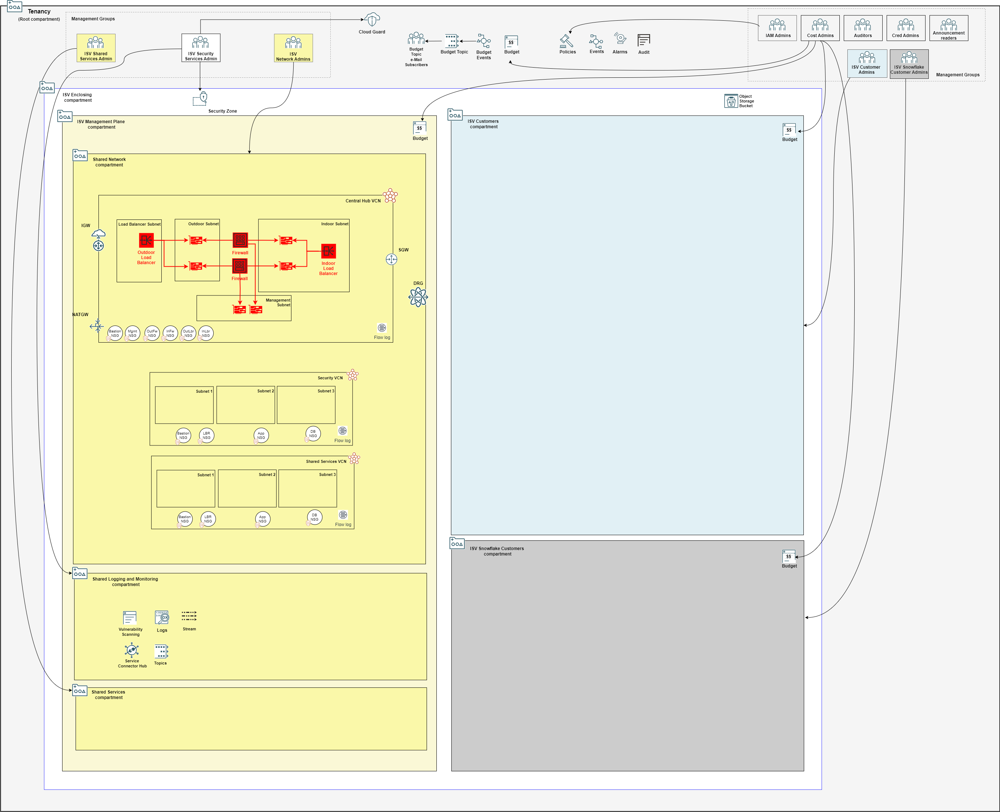

## Management Plane Firewall Stack Deployment

The firewall stack deploys a pair of Palo Alto Network firewalls from OCI Marketplace, *sandwiched* by a pair of OCI network load balancers. 

The marketplace image deployed is the latest available version of "Palo Alto Networks VM-Series Next Generation Firewall", BYOL license type.

### Typically Deployed By

Management plane network administrators.

### Deployment Sequence

1. [Mgmt Plane Foundational - IAM, Logging, Governance](./MPLANE-FOUNDATIONAL.md)
2. [Mgmt Plane Networking 1st stage - Mgmt Plane VCNs](./MPLANE-NETWORKING.md#stage1)
3. **Mgmt Plane Networking - Firewall (this stack)**
4. [Mgmt Plane Networking 2nd stage - Network routing post firewall deployment](./MPLANE-NETWORKING.md#stage2)
5. [Customer Onboarding](./CUSTOMER-ONBOARDING.md)

**Stack #5 must be repeated for each NEW customer onboarding.**

### Stack Configuration

Input Configuration Files | Input Dependency Files | Generated Output
--------------------------|------------------------|------------------
[firewall_config.json](../mgmt-plane/firewall/firewall_config.json) | iam/output/compartments_output.json, network/output/network_output.json  | firewall/output/instances_output.json

### Stack Creation

[](https://cloud.oracle.com/resourcemanager/stacks/create?zipUrl=https://github.com/oci-landing-zones/terraform-oci-modules-orchestrator/archive/refs/heads/main.zip&zipUrlVariables={"input_config_files_urls":"https://raw.githubusercontent.com/oci-landing-zones/oci-landing-zone-operating-entities/refs/heads/master/blueprints/multi-oe/saas/runtime/runtime/mgmt-plane/firewall/firewall_config.json","url_dependency_source_oci_bucket":"isv-terraform-runtime-bucket","url_dependency_source":"ocibucket","url_dependency_source_oci_objects":"iam/output/compartments_output.json,network/output/network_output.json","save_output":true,"oci_object_prefix":"firewall/output"})

### What Gets Deployed

The resources in red color are added.

