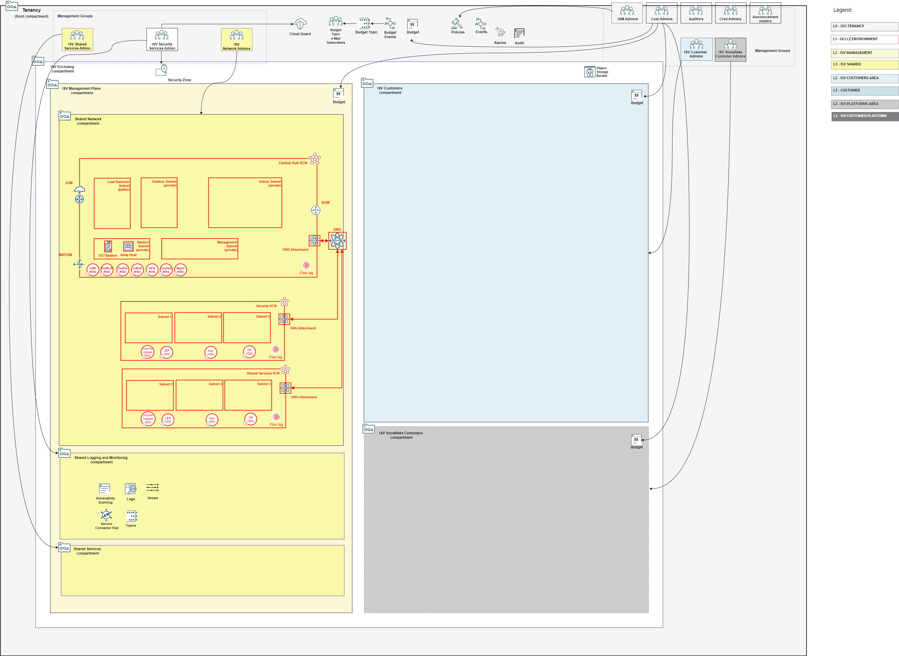
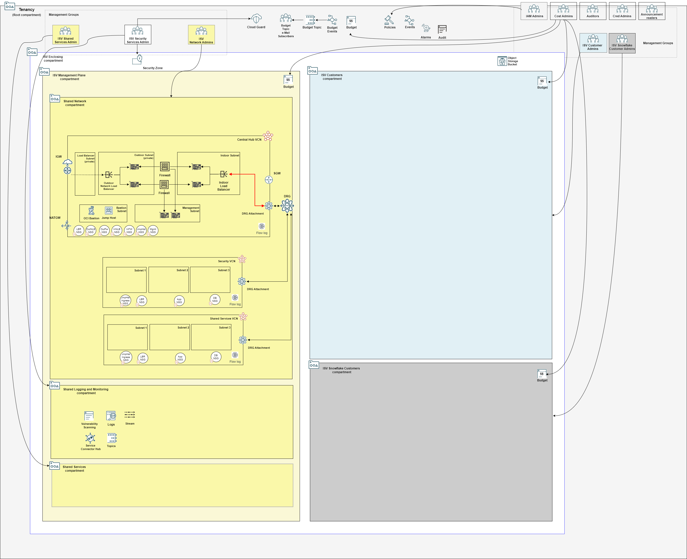

## Management Plane Network Stack Deployment

The network stack manages the management plane networking configuration, including all the routing to customer VCNs.

The mgmt plane template VCNs are pre-configured with the following CIDR ranges:

- **central-hub-vcn**: 192.168.0.0/26
- **security-vcn**: 192.168.0.64/26
- **shared-services-vcn**: 192.168.0.128/26

The CIDR ranges can be changed in configuration files [network_initial_config.json](../mgmt-plane/network/network_initial_config.json) and [network_post_firewall_config.json](../mgmt-plane/network/network_post_firewall_config.json).

### Typically Deployed By

Management plane network administrators.

### Overall Deployment Sequence

This stack is executed in two different stages with a **PROGRESSIVELY UPDATED input configuration file**.

1. [Mgmt Plane Foundational - IAM, Logging, Governance](./MPLANE-FOUNDATIONAL.md)
2. **Mgmt Plane Networking 1st stage - Mgmt Plane VCNs and DRG (this stack)**
3. [Mgmt Plane Networking - Firewall](./MPLANE-FIREWALL.md)
4. **Mgmt Plane Networking 2nd stage - Network routing post firewall deployment (this stack)**
5. [Customer Onboarding](./CUSTOMER-ONBOARDING.md)

**Stack #5 must be repeated for each NEW customer onboarding.**

### <a name="stage1">Network Stack 1st Stage</a> 

#### Stack Configuration

Input Configuration Files | Input Dependency Files | Generated Output
--------------------------|------------------------|------------------
[network_initial_config.json](../mgmt-plane/network/network_initial_config.json), [flow_logs_config.json](../mgmt-plane/network/flow_logs_config.json), [bastion_service_config.json](../mgmt-plane/network/bastion_service_config.json)*, [jump_host_config.json](../mgmt-plane/network/jump_host_config.json)** | iam/output/compartments_output.json | network/output/network_output.json

\* in a real deployment, make sure to replace the value in *cidr_block_allow_list* attribute (192.168.0.0/32) by the IP addresses allowed to connect to OCI Bastion service. Be as much specific as possible.

\*\* in a real deployment, make sure to assign your SSH public key to *default_ssh_public_key_path* attribute.

#### Stack Creation

Click the button to create the stack with all variables pre-filled.

[](https://cloud.oracle.com/resourcemanager/stacks/create?zipUrl=https://github.com/oci-landing-zones/terraform-oci-modules-orchestrator/archive/refs/heads/main.zip&zipUrlVariables={"input_config_files_urls":"https://raw.githubusercontent.com/oci-landing-zones/oci-landing-zone-operating-entities/refs/heads/master/blueprints/multi-oe/saas/runtime/mgmt-plane/network/network_initial_config.json,https://raw.githubusercontent.com/oci-landing-zones/oci-landing-zone-operating-entities/refs/heads/master/blueprints/multi-oe/saas/runtime/mgmt-plane/network/flow_logs_config.json,https://raw.githubusercontent.com/oci-landing-zones/oci-landing-zone-operating-entities/refs/heads/master/blueprints/multi-oe/saas/runtime/mgmt-plane/network/bastion_service_config.json,https://raw.githubusercontent.com/oci-landing-zones/oci-landing-zone-operating-entities/refs/heads/master/blueprints/multi-oe/saas/runtime/mgmt-plane/network/jump_host_config.json","url_dependency_source_oci_bucket":"isv-terraform-runtime-bucket","url_dependency_source":"ocibucket","url_dependency_source_oci_objects":"iam/output/compartments_output.json","save_output":true,"oci_object_prefix":"network/output"})

In the Resource Manager Service (RMS) **Create stack - Stack Information** screen that shows up, check the *I have reviewed and accept the Oracle Terms of Use* box, make sure to select *terraform-oci-modules-orchestrator-main/rms-facade* in the **Working directory** drop down, as shown in the image below. 


Give the stack a meaningful name in the *Name* field (*isv-saas-networking*, for instance), and follow the RMS workflow to complete the stack creation. 

The **Create stack - Configure variables** screen shows the variables pre-filled.

In the final **Create stack - Review** screen, make sure to uncheck the *Run Apply* button, so you have a chance to inspect the Terraform plan output.


Within the stack, perform a *Plan*, inspect its output, and finally run an *Apply* to actually deploy the resources.

#### What Gets Deployed

The resources in red color are added.




### <a name="stage2">Network Stack 2nd Stage</a>

**THE 2ND STAGE IS NOT A NEW STACK, BUT AN UPDATE TO NETWORK STACK INITIAL DEPLOYMENT, NOW INCLUDING THE CONFIGURATIONS DEPLOYED BY THE NETWORK FIREWALL STACK.**

**AFTER THIS STAGE THE MANAGEMENT PLANE IS CONSIDERED READY TO ONBOARD CUSTOMERS.**

This stage updates the initial network configuration with route rules to the Network Load Balancers deployed by the [Mgmt Plane Networking - Firewall](./MPLANE-FIREWALL.md) stack. 

Specifically:

**THESE CONFIGURATION SNIPPETS ARE SHOWN HERE FOR CLARITY PURPOSES. THEY ARE ALL ALREADY ADDED IN [network_post_firewall_config.json](../mgmt-plane/network/network_post_firewall_config.json).**

1. An ingress route table **IS ADDED** for routing traffic to Central Hub VCN's Service Gateway and to the Indoor Network Load Balancer.
```
...
"HUB-INGRESS-ROUTE" : {
    "display_name" : "central-hub-vcn-ingress-route-table",
    "route_rules" : {
        "TO-OSN-RULE" : {
            "description"        : "Traffic destined to Oracle Services Network goes to Service Gateway.",
            "destination"        : "all-services",
            "destination_type"   : "SERVICE_CIDR_BLOCK",
            "network_entity_key" : "CENTRAL-HUB-VCN-SGW"
        },
        "TO-ANYWHERE-RULE" : {
            "description"        : "All remaining traffic goes to Indoor NLB.",
            "destination"        : "0.0.0.0/0",
            "destination_type"   : "CIDR_BLOCK",
            "network_entity_key" : "INDOOR-NLB"
        }
    }
}
...
```  
This route table is associated as the ingress route table to *central-hub-vcn-attachment* DRG attachment. 
```
...
"CENTRAL-HUB-VCN-ATTACH" : {
    "display_name" : "central-hub-vcn-attachment",
    "drg_route_table_key" : "HUB-VCN-DRG-ROUTE",
    "network_details" : {
        "attached_resource_key" : "CENTRAL-HUB-VCN",
        "type" : "VCN",
        "route_table_key" : "HUB-INGRESS-ROUTE"
    }
}
...   
``` 
The effect is directing traffic entering the DRG through this attachment to either the Service Gateway or to the Indoor Network Load Balancer (that further routes traffic to the firewall Indoor interfaces).   

2. (Not shown in diagram) A route rule is added to the LBR subnet route table, directing all traffic destined to the customer VCNs (here's represented by the overarching CIDR block 10.0.0.0/16) to the Outdoor Network Load Balancer.
```
...
"LBR-SUB-ROUTE" : {
    "display_name" : "lbr-subnet-route-table",
    "route_rules" : {
        "OUTDOOR-NLB-RULE" : {
            "network_entity_key" : "OUTDOOR-NLB",
            "description"        : "Traffic destined to customer VCNs goes to Outdoor NLB.",
            "destination"        : "10.0.0.0/16",
            "destination_type"   : "CIDR_BLOCK"
        },
        ...
    }
}
...              
```

#### Updated Stack Configuration

In order to update the initial network configuration, edit the existing network stack, replacing the existing Input Configuration Files and Input Dependency Files with the files in the table below:

Input Configuration Files | Input Dependency Files | Generated Output
--------------------------|------------------------|------------------
[network_post_firewall_config.json](../mgmt-plane/network/network_post_firewall_config.json) (replacing *network_initial_config.json*), [flow_logs_config.json](../mgmt-plane/network/flow_logs_config.json), [bastion_service_config.json](../mgmt-plane/network/bastion_service_config.json), [jump_host_config.json](../mgmt-plane/network/jump_host_config.json) | iam/output/compartments_output.json, firewall/output/nlbs_output.json (contains the references to NLB OCIDs)  | network/output/network_output.json

#### What Gets Deployed

The resources in red color are added.


