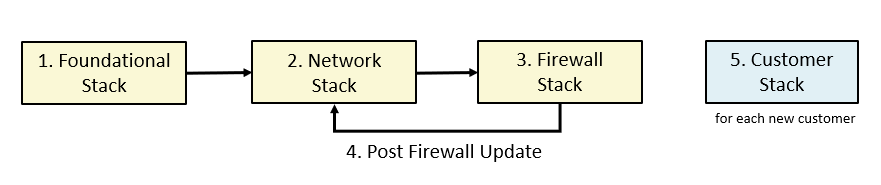

# **The OCI Open LZ &ndash; Multi-OE SaaS [Blueprint](#)**

&nbsp; 

## Configuration Files

The blueprint is described in configuration files (JSON documents) that can be deployed as-is or changed based on specific requirements. Changes must be done following the requirements and specifications of the respective underlying Terraform module. The idea behind describing Landing Zones as JSON documents is making them fully customizable and declarable in a standard and widespread document format (JSON), while leveraging Terraform's Infrastructure as Code paradigm.

The configuration files are organized in different folders, according to the broader area they belong. The folder structure is the following:

- mgmt-plane: a top level folder for management plane, management groups and Root level resources.
    - bootstrap:
        - [bootstrap.json](mgmt-plane/bootstrap/bootstrap.json), containing an OCI private bucket allowing for the automation of the composite deployment model. The bucket stores the dependency files that are produced and consumed by the different stacks. 
    - iam: 
        - [iam_config.json](mgmt-plane/iam/iam_config.json), with the IAM configuration, including compartments, groups and policies.
    - governance: 
        - [budgets_config.json](mgmt-plane/governance/budgets_config.json), with budgets configuration.
    - security: 
        - [cloud_guard_config.json](mgmt-plane/security/cloud_guard_config.json), with Cloud Guard configuration.
        - [security_zones_config.json](mgmt-plane/security/security_zones_config.json), with Security Zones configuration.
        - [scanning_config.json](mgmt-plane/security/scanning_config.json), with scanning configuration.
    - observability: 
        - [observability_config.json](mgmt-plane/observability/observability_config.json), with logging, streams, notifications, events, alarms and service connector hub configurations.
    - network: 
        - [network_initial_config.json](mgmt-plane/network/network_initial_config.json), containing the initial network configuration, with VCNs, subnets, route tables, security lists, network security groups, VCN gateways and DRG.
        - [network_post_firewall_config.json](mgmt-plane/network/network_post_firewall_config.json), adding route table rule to Network Load Balancer private IP and DRG attachments to the initial network configuration. This configuration is to be executed after the Firewall appliance and OCI Network Load Balancer are provisioned.
        - [network_post_each_customer_config.json](mgmt-plane/network/network_post_each_customer_config.json), adding route table rules and DRG route table distributions for each on-boarded customer. This configuration is to be executed after each customer onboarding.
    - firewall: [firewall_config.json](mgmt-plane/firewall/firewall_config.json), with firewall appliance and OCI Network Load Balancer configurations.

- customers: a top level folder for each customer configuration.
    - customer1: [compartments_config.json](customers/customer1/compartments_config.json), [budgets_config.json](customers/customer1/budgets_config.json), [network_three_tier_config.json](customers/customer1/network_three_tier_config.json) with sample resources configurations for a customer, including IAM, budget and networking, respectively. Use these files as templates to onboard other customers.

**THESE CONFIGURATION FILES ARE DESIGNED TO BE USED AS TEMPLATES, OWNED AND MODIFIED AT WILL BY CUSTOMERS THAT ARE DEPLOYING THE MODEL.**

&nbsp; 

## How to Deploy

The blueprint (or any customization) configurations are deployed in separate stacks. A stack is a set of configurations that are managed by a single Terraform execution and thus reflected in a single Terraform state file. The decision factor for how many stacks lies on how the organization wants to manage the environment, especially which roles are expected to deploy which parts of the blueprint. 

On a high level, there are two broader sets of stacks for the ISV blueprint build out: **management plane deployment** and **customer onboarding**.

**Management plane deployment** is composed of the following stacks, that must be executed as the presented order below:
1. **Foundational stack**: assembles bootstrap, IAM, governance, security and observability configuration files in a single stack. As mentioned before, it can be further split depending on deployment requirements. 
2. **Network stack**: manages the management plane network configuration, including all the routing to customer VCNs.
3. **Firewall stack**: manages a pair of PAN (Palo Alto Networks) firewalls, *sandwiched* by a pair of OCI network load balancers.

**Customer onboarding** is made of customer-specific stacks always followed by an update to the Management Plane Network Stack for network routing.

### The OCI Landing Zones Orchestrator

The [OCI Landing Zones Orchestrator](https://github.com/oci-landing-zones/terraform-oci-modules-orchestrator) is a convenience tool for deploying JSON-based landing zones. It also supports YAML documents or Terraform tfvars files with HCL (Hashicorp Language) objects. The only requirement is that the documents/HCL objects are defined according to the requirements and specifications set forth by the OCI Landing Zone core modules, that are available in the following repositories:

- [Identity & Access Management](https://github.com/oracle-quickstart/terraform-oci-cis-landing-zone-iam)
- [Networking](https://github.com/oci-landing-zones/terraform-oci-modules-networking)
- [Governance](https://github.com/oci-landing-zones/terraform-oci-modules-governance)
- [Security](https://github.com/oci-landing-zones/terraform-oci-modules-security)
- [Observability & Monitoring](https://github.com/oci-landing-zones/terraform-oci-modules-observability)
- [Secure Workloads](https://github.com/oracle-quickstart/terraform-oci-secure-workloads)

Next we show how to deploy the blueprint with the Orchestrator per the stacks defined above:

#### Management Plane
The following stacks are executed once each. After stack #4, the management plane network is ready to onboard customers.
 1. [Foundational Stack](docs/MPLANE-FOUNDATIONAL.md)
 2. [Network Stack](docs/MPLANE-NETWORKING.md#stage1)
 3. [Firewall Stack](docs/MPLANE-FIREWALL.md)
 4. [Network Stack Post Firewall Update](docs/MPLANE-NETWORKING.md#stage2)

#### Customer Onboarding
The following are executed for each new customer.

 5. [Customer Onboarding Stack](docs/CUSTOMER-ONBOARDING.md)
 6. [Network Stack Post Customer Update](docs/MPLANE-NETWORKING.md#stage3)

 The diagram below depicts the deployment sequencing. Note that the Network stack must be updated once after Firewall deployment and after each new customer onboarding.

 

