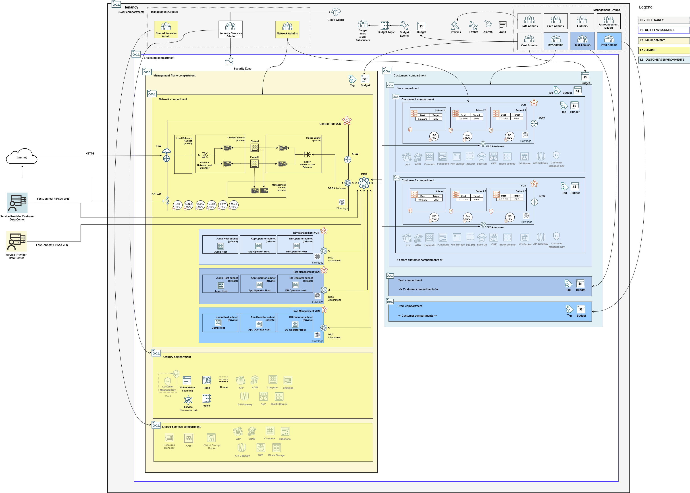
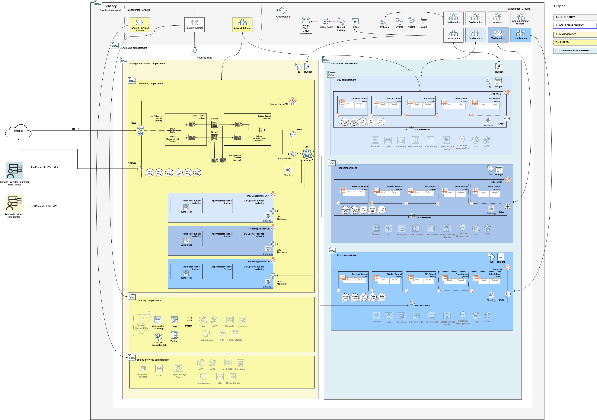

# The OCI Open LZ Service Providers Blueprint

Simplifying the onboarding of service providers into OCI.

# 1. Introduction

This blueprint defines a tenancy model for service providers that is based on OCI Core Landing Zone (formerly known as OCI CIS Landing Zone) principles. It is designed for managed service providers to onboard OCI in a streamlined manner that aligns with the CIS OCI Benchmark and best practices. Two variations are provided:

- **Pod model**: each customer gets a copy of the application stack and has its own separate data stack. This pattern can be seen in SaaS and managed services industries where each customer's environment is independent of another, and the only shared part is the management plane. 

Click [here](images/architecture-pod.svg) for the .svg version that can be edited in [draw io](https://www.drawio.com/).

- **Multi-tenant model**: the application stack is shared by the service provider customers. Customer segregation is defined through constraints available in the framework that underpins the application layer. Typically, the service provider manages a single multi-tenant application stack that is split in multiple customer spaces. 

Click [here](images/architecture-mt.svg) for the .svg version that can be edited in [draw io](https://www.drawio.com/).

# 2. Main Tenets

**Segregation of Duties**: IAM compartments, groups and policies provide for separation of duties across distinct aspects of the tenancy infrastructure. The defined groups are expected to be used on day 2 and beyond for managing the infrastructure.

**Application Layer separated from Management Plane**: Both models have a management plane that hosts shared services for the application layer and for itself, including network security, application management and observability. Tenancy administrators utilize the management plane for deploying management tools, security services and consolidating tenancy wide logging. Additionally, the management plane hosts the Hub network for all application supporting spoke networks.

**Network Traffic Screening**: A network firewall deployed in the Hub VCN provides screening for North/South and East/West traffic. End user application requests as well as admin requests flow through the firewall for evaluation.

**Well Defined Access Paths for Application Management**: the pattern enforces specific network access paths for application management in the different lifecycle environments, mitigating unintentional mistakes when dealing with multiple environments. 

**Consolidated Logging**: the pattern enforces tenancy wide logging consolidation in the management plane for further consumption by SIEM services.

**Cloud Security Posture Monitoring**: detective and preventative security controls are enforced by Cloud Guard and Security Zones, respectively.

**Operational Awareness**: OCI services fire events to alert users about specific changes in the infrastructure.

**Cost Management**: Budgets provide pro-active cost management, emitting events when consumption reaches determined thresholds. Additionally, the blueprints provide the building blocks for a charge back model, based either on compartments or tags.

**Streamlined Customer Onboarding**: automation streamlines customer onboarding, bringing repeatability and consistency to the process.

# 3. Tenancy Structure

The blueprint separates the management plane from the application layer using compartments.

## 2.1 Enclosing Compartment

The enclosing compartment (in white color) sets the boundaries of the service provider landing zone. The enclosing compartment can be a single landing zone hosting multiple lifecycle environments, with a shared management plane and lifecycle environments denoted by multiple embedded compartments for the application layer. The enclosing compartment can also represent an entire lifecycle environment, with entirely distinct management planes and application layers. 

## 2.2 Management Plane Compartment

The management plane compartment (in light yellow color) is designed to host shared services for the application layer and for the management plane itself, including network security, observability, monitoring and DevOps. 

### 2.2.1 Network Compartment

The Network compartment (in firm yellow color) is designed to host the Virtual Cloud Networks (VCNs) that support the management plane services, including a Hub VCN for inspection of any incoming/outgoing network traffic to/from the application layer, as well as any VCNs for other eventual supporting services, like OCI functions, OKE clusters, management tools, etc.

### 2.2.2 Security Compartment

The Security compartment (in firm yellow color, below the Network compartment) is designed to host any services related to security, observability and monitoring in general, including Vaults, Logs, Streams, Connector Hub, to name a few.

### 2.2.3 Shared Services Compartment

The Shared Services compartment (in firm yellow color, below the Security compartment) is designed to host any services or tooling that are neither network nor security. Examples are a 3rd-party Kubernetes management solution, Oracle Enterprise Manager or a DevOps framework. 

## 2.3 Customers Compartment

The Customers compartment (in light blue color) is designed to host the service provider application, including the data layer. In the Pod model, each customer is assigned its own compartment and executes a copy of the application within a dedicated application network. In the multi-tenant model, a common application infrastructure is shared among customers.

### 2.3.1 Application Lifecycle Compartment (Dev, Test, Prod)

The Application Lifecycle compartment (in light blue color) is designed to host an application lifecycle environment, like Dev, Test, Prod. In the Pod model, it encloses the various customer compartments wherein the application copy is deployed. In the multi-tenant model, it encloses the shared application infrastructure for that environment along with the data management layer.

## 3. Administration Groups

Following CIS OCI Benchmark recommendations on segregation of duties, the blueprint defines multiple IAM groups for managing different aspects of the tenancy infrastructure:

**IAM Administrators:** manage IAM services and resources including compartments, groups, dynamic groups, policies, identity providers, authentication policies, network sources, tag defaults. However, this group is not allowed to manage the out-of-box Administrators and Credential Administrators groups. It's also not allowed to touch the out-of-box Tenancy Admin policy.

**Credential Administrators:** manage users capabilities and users credentials in general, including API keys, authentication tokens and secret keys.

**Cost Administrators:** manage budgets and usage reports.

**Auditors:** entitled with read-only access across the tenancy and the ability to use cloud-shell to run the [CIS compliance checker script](https://github.com/oci-landing-zones/oci-cis-landingzone-quickstart/blob/main/compliance-script.md).

**Announcement Readers:** for reading announcements displayed in OCI Console.

**Network Administrators:** manage OCI network family, including VCNs, Load Balancers, DRGs, VNICs, IP addresses, etc.

**Security Administrators:** manage security services and resources including Vaults, Keys, Logging, Vulnerability Scanning, Web Application Firewall, Bastion, Service Connector Hub, etc.

**Shared Services Administrators:** manage OCI services that support the overall solution, but are neither network nor security related, for example, a 3rd-party Kubernetes management solution, Oracle Enterprise Manager or a DevOps framework.

### 2.2.3 Environment Administration Groups

**Dev Environment Administrators:** manage application stacks deployments and related resources in Dev Compartment. OCI resources include Compartments, Network, Compute images, Database OCI Functions, Kubernetes clusters, Streams, Object Storage, Block Storage, File Storage, Keys, Budgets, and others.

**Test Environment Administrators:** manage application stacks deployments and related resources in Test Compartment.

**Prod Environment Administrators:** manage application stacks deployments and related resources in Prod Compartment.

# 4. Runtime View

Proceed to [Service Providers Landing Zone Runtime](../runtime/readme.md) for instructions how to deploy this blueprint.

