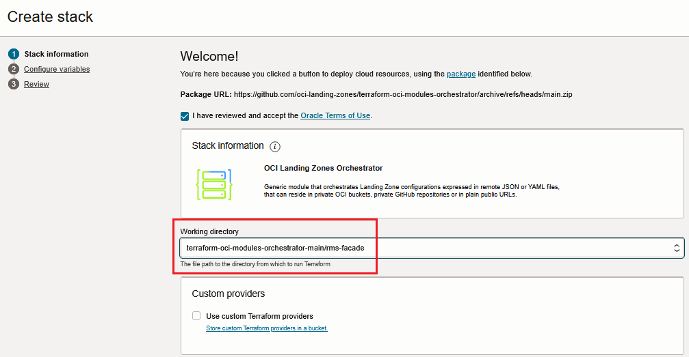
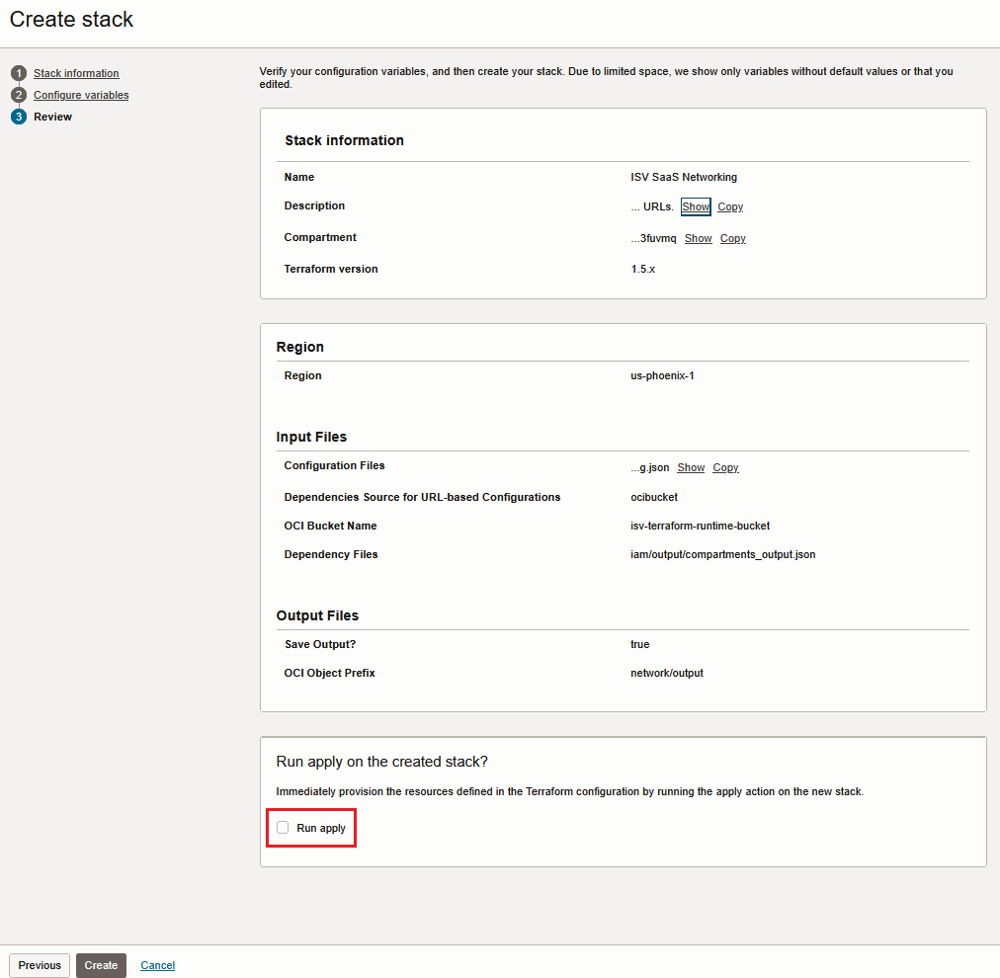
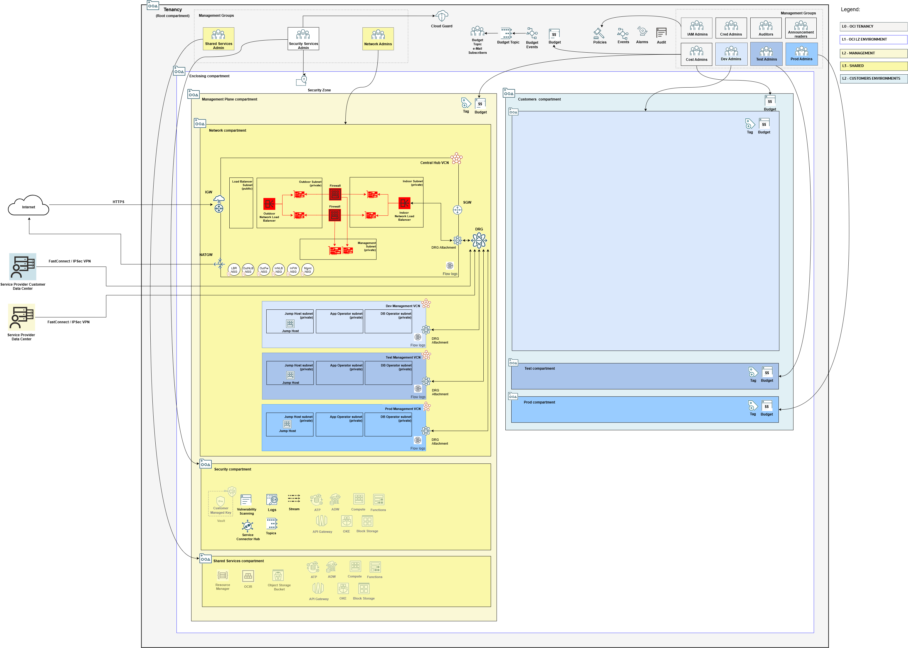

## Management Plane Firewall Stack Deployment

The firewall stack deploys a pair of Palo Alto Network firewalls from OCI Marketplace, *sandwiched* by a pair of OCI network load balancers. 

The marketplace image deployed is the latest available version of "Palo Alto Networks VM-Series Next Generation Firewall", BYOL license type. These can be adjusted in [firewall_config.json](../mgmt-plane/firewall/firewall_config.json).

**IMPORTANT: The stack does not configure any firewall policies. After deploying this stack, you must log in the firewall nodes and configure policies for allowing network traffic. Without firewall policies configuration, all Internet traffic as well as any traffic between management plane VCNs and customer VCNs are blocked.**

After deploying this stack, see [Basic Firewall Configuration](./PALO-INTRA-CONFIG.md) for configuring a basic firewall policy to unblock traffic.

### Overall Deployment Sequence

1. [Mgmt Plane Foundational - IAM, Security, Governance](./MPLANE-FOUNDATIONAL.md)
2. [Mgmt Plane Networking 1st stage - Mgmt Plane VCNs](./MPLANE-NETWORKING.md#stage1)
3. **Mgmt Plane Networking - Firewall (this stack)**
4. [Mgmt Plane Networking 2nd stage - Network routing post firewall deployment](./MPLANE-NETWORKING.md#stage2)
5. Either [Pod Model - Customer Onboarding](./POD-CUSTOMER-ONBOARDING.md) or [Multi-Tenant Shared](./MT-SHARED-OKE.md)/[Mgmt Plane Tooling](./MPLANE-TOOLING.md)/[Multi-Tenant Model - Customer Onboarding](./MT-CUSTOMER-ONBOARDING.md).

### Stack Configuration

Input Configuration Files | Input Dependency Files | Generated Output
--------------------------|------------------------|------------------
[firewall_config.json](../mgmt-plane/firewall/firewall_config.json)* | mgmt-plane/iam/output/compartments_output.json, mgmt-plane/network/output/network_output.json  | mgmt-plane/firewall/output/instances_output.json

\* Make sure to assign your SSH public key to *default_ssh_public_key_path* attribute in *firewall_config.json*.

### Stack Creation

**Deploying this stack as-is requires [Deployment Bootstrap](../readme.md#deployment-bootstrap)**.

[](https://cloud.oracle.com/resourcemanager/stacks/create?zipUrl=https://github.com/oci-landing-zones/terraform-oci-modules-orchestrator/archive/refs/tags/v2.0.8.zip&zipUrlVariables={"configuration_source":"ocibucket","oci_configuration_bucket":"landing-zone-runtime-bucket","oci_configuration_objects":"mgmt-plane/firewall/firewall_config.json","oci_dependency_objects":"mgmt-plane/iam/output/compartments_output.json,mgmt-plane/network/output/network_output.json","save_output":true,"oci_object_prefix":"mgmt-plane/firewall/output"})

In the Resource Manager Service (RMS) **Create stack - Stack Information** screen that shows up, check the *I have reviewed and accept the Oracle Terms of Use* box, make sure to select *terraform-oci-modules-orchestrator-main/rms-facade* in the **Working directory** drop down, as shown in the image below. 

Give the stack a meaningful name in the *Name* field (*isv-firewall*, for instance), and follow the RMS workflow to complete the stack creation. 

The **Create stack - Configure variables** screen shows the variables pre-filled.

In the final **Create stack - Review** screen, make sure to uncheck the *Run Apply* button, so you have a chance to inspect the Terraform plan output.

Within the stack, perform a *Plan*, inspect its output, and finally run an *Apply* to actually deploy the resources.

### What Gets Deployed

The resources in red color are added.

**IMPORTANT**: the firewall instances are NOT bootstrapped/configured in the automation.

