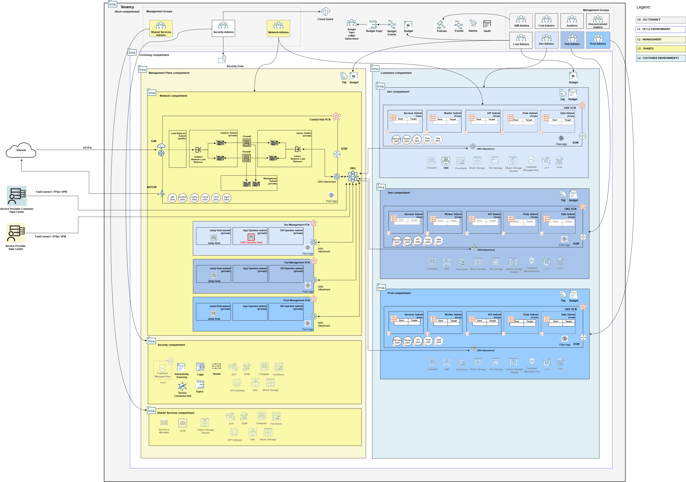

## Management Plane Tooling Stack Deployment

A stack that deploys necessary tooling for managing the application resources serving customers. It deploys a Compute instance using "Oracle-Linux-Cloud-Developer-8.10-2025.01.31-0" image. As part of deployment, it attempts to install OCI CLI, kubectl and Ansible in it via cloud-init. Additionally, it downloads pre-configured Kubernetes manifests and Ansible playbooks for deploying Calico policy, setting up RBAC policy and onboarding customers.

### Overall Deployment Sequence

1. [Mgmt Plane Foundational - IAM, Security, Governance](./MPLANE-FOUNDATIONAL.md)
2. [Mgmt Plane Networking 1st stage - Mgmt Plane VCNs](./MPLANE-NETWORKING.md#stage1)
3. [Mgmt Plane Networking - Firewall](./MPLANE-FIREWALL.md)
4. [Mgmt Plane Networking 2nd stage - Network routing post firewall deployment](./MPLANE-NETWORKING.md#stage2)
5. [Multi-tenant OKE - Oracle Kubernetes Engine](./MT-SHARED-OKE.md)
6. **Mgmt Plane Tooling (this stack)**
7. [Multi-Tenant Model - Customer Onboarding](./MT-CUSTOMER-ONBOARDING.md)

### Stack Configuration

Input Configuration Files | Input Dependency Files | Generated Output
--------------------------|------------------------|------------------
[oke_operator_host_config.json](../mgmt-plane/tooling/oke_operator_host_config.json)* | mgmt-plane/iam/output/compartments_output.json, mgmt-plane/network/output/network_output.json | mgmt-plane/tooling/output/instances_output.json

\* Make sure to assign your SSH public key to *default_ssh_public_key_path* attribute in *oke_operator_host_config.json*.

### Stack Creation

**Deploying this stack as-is requires [Deployment Bootstrap](../readme.md#deployment-bootstrap)**.

[](https://cloud.oracle.com/resourcemanager/stacks/create?zipUrl=https://github.com/oci-landing-zones/terraform-oci-modules-orchestrator/archive/refs/tags/v2.0.10.zip&zipUrlVariables={"configuration_source":"ocibucket","oci_configuration_bucket":"landing-zone-runtime-bucket","oci_configuration_objects":"mgmt-plane/tooling/oke_operator_host_config.json","oci_dependency_objects":"mgmt-plane/iam/output/compartments_output.json,mgmt-plane/network/output/network_output.json","save_output":true,"oci_object_prefix":"mgmt-plane/tooling/output"})

In the Resource Manager Service (RMS) **Create stack - Stack Information** screen that shows up, check the *I have reviewed and accept the Oracle Terms of Use* box, make sure to select *terraform-oci-modules-orchestrator-main/rms-facade* in the **Working directory** drop down, as shown in the image below. 

Give the stack a meaningful name in the *Name* field (*isv-mgmt-tooling*, for instance), and follow the RMS workflow to complete the stack creation. 

The **Create stack - Configure variables** screen shows the variables pre-filled.

In the final **Create stack - Review** screen, make sure to uncheck the *Run Apply* button, so you have a chance to inspect the Terraform plan output.

Within the stack, perform a *Plan*, inspect its output, and finally run an *Apply* to actually deploy the resources.

### What Gets Deployed

The resources in red color are added.

