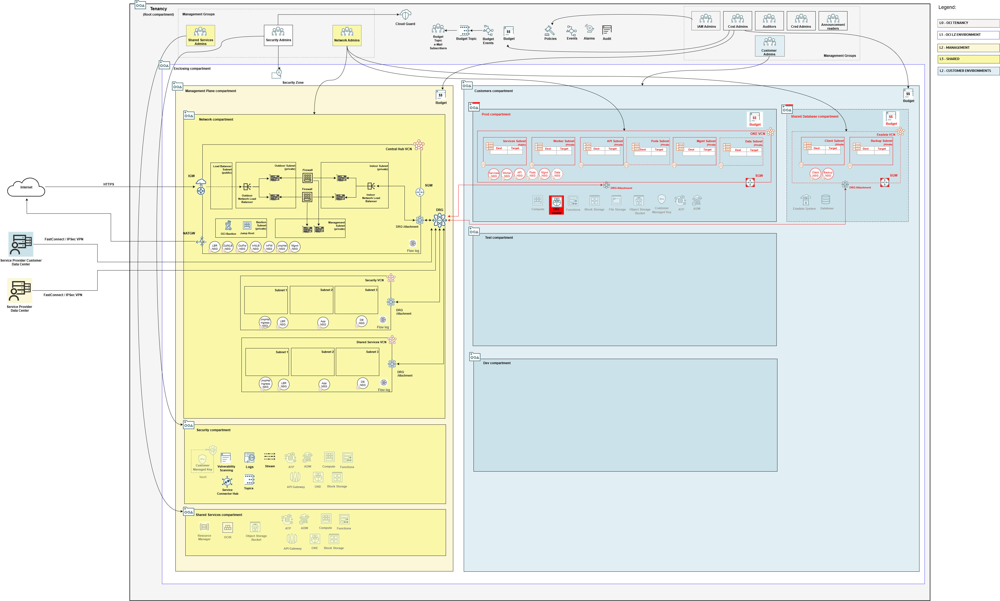

## Multi-Tenant Model Shared Stack Deployment - Database Service

A stack that deploys database shared infrastructure in the Multi-Tenant model. It contains IAM, budget, network configuration, and Database Service configuration. Different database services can be used, depending on customer requirements. The following services have supported deployment templates:

- **Exadata Cloud Service**: 
    - [network_exacs_config.json](../mt/shared/db/network_exacs_config.json). The sample VCN is pre-configured with 172.16.0.0/24 CIDR range.

### Overall Deployment Sequence

1. [Mgmt Plane Foundational - IAM, Security, Governance](./MPLANE-FOUNDATIONAL.md)
2. [Mgmt Plane Networking 1st stage - Mgmt Plane VCNs](./MPLANE-NETWORKING.md#stage1)
3. [Mgmt Plane Networking - Firewall](./MPLANE-FIREWALL.md)
4. [Mgmt Plane Networking 2nd stage - Network routing post firewall deployment](./MPLANE-NETWORKING.md#stage2)
5. **Multi-Tenant Shared**
    1. **Database Service (this stack)**
    2. [OKE - Oracle Kubernetes Engine](./MT-SHARED-OKE.md)
6. [Multi-Tenant Model - Customer Onboarding](./MT-CUSTOMER-ONBOARDING.md)

### Database Service Stack Configuration

Input Configuration Files | Input Dependency Files | Generated Output
--------------------------|------------------------|------------------
[iam_config.json](../mt/shared/db/iam_config.json)   [budgets_config.json](../mt/shared/db/budgets_config.json)   [network_exacs_config.json](../mt/shared/db/network_exacs_config.json) | iam/output/compartments_output.json, network/output/network_output.json | mt-shared-exa/output/compartments_output.json, mt-shared-db/output/network_output.json

### Stack Creation

[](https://cloud.oracle.com/resourcemanager/stacks/create?zipUrl=https://github.com/oci-landing-zones/terraform-oci-modules-orchestrator/archive/refs/heads/main.zip&zipUrlVariables={"input_config_files_urls":"https://raw.githubusercontent.com/oci-landing-zones/oci-landing-zone-operating-entities/refs/heads/multi-tenant-pattern/blueprints/multi-oe/service-providers/runtime/mt/shared/db/iam_config.json,https://raw.githubusercontent.com/oci-landing-zones/oci-landing-zone-operating-entities/refs/heads/multi-tenant-pattern/blueprints/multi-oe/service-providers/runtime/mt/shared/db/budgets_config.json,https://raw.githubusercontent.com/oci-landing-zones/oci-landing-zone-operating-entities/refs/heads/multi-tenant-pattern/blueprints/multi-oe/service-providers/runtime/mt/shared/db/network_exacs_config.json","url_dependency_source_oci_bucket":"isv-terraform-runtime-bucket","url_dependency_source":"ocibucket","url_dependency_source_oci_objects":"iam/output/compartments_output.json,network/output/network_output.json","save_output":true,"oci_object_prefix":"mt-shared-db/output"})

In the Resource Manager Service (RMS) **Create stack - Stack Information** screen that shows up, check the *I have reviewed and accept the Oracle Terms of Use* box, make sure to select *terraform-oci-modules-orchestrator-main/rms-facade* in the **Working directory** drop down, as shown in the image below. 

Give the stack a meaningful name in the *Name* field (*isv-shared-database*, for instance), and follow the RMS workflow to complete the stack creation. 

The **Create stack - Configure variables** screen shows the variables pre-filled.

In the final **Create stack - Review** screen, make sure to uncheck the *Run Apply* button, so you have a chance to inspect the Terraform plan output.

Within the stack, perform a *Plan*, inspect its output, and finally run an *Apply* to actually deploy the resources.

### What Gets Deployed

The resources in red color are added.

