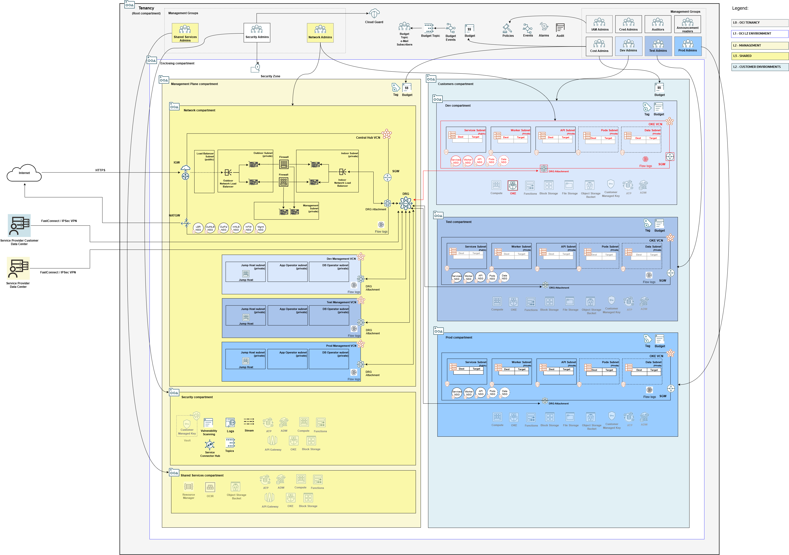

## Multi-Tenant Model Shared Stack Deployment

A stack that deploys OKE (oracle Kubernetes Engine) shared infrastructure in the Multi-Tenant model. It contains network and Kubernetes cluster configurations.

The sample OKE VCN is pre-configured with 10.0.128.0/22 CIDR range, that can be changed in configuration files [network_oke_npn_config.json](../mt/shared/network_oke_npn_config.json) or [network_oke_flannel_config.json](../mt/shared/network_oke_flannel_config.json), depending on the chosen networking model for OKE.

### Overall Deployment Sequence

1. [Mgmt Plane Foundational - IAM, Security, Governance](./MPLANE-FOUNDATIONAL.md)
2. [Mgmt Plane Networking 1st stage - Mgmt Plane VCNs](./MPLANE-NETWORKING.md#stage1)
3. [Mgmt Plane Networking - Firewall](./MPLANE-FIREWALL.md)
4. [Mgmt Plane Networking 2nd stage - Network routing post firewall deployment](./MPLANE-NETWORKING.md#stage2)
5. **Multi-tenant OKE - Oracle Kubernetes Engine (this stack)**
6. [Multi-Tenant Model - Customer Onboarding](./MT-CUSTOMER-ONBOARDING.md)

### Stack Configuration

Input Configuration Files | Input Dependency Files | Generated Output
--------------------------|------------------------|------------------
[network_oke_npn_config.json](../mt/shared/network_oke_npn_config.json)   [network_oke_npn_with_exadata_config.json](../mt/shared/network_oke_npn_with_exadata_config.json)   [oke_npn_cluster_config.json](../mt/shared/oke_npn_cluster_config.json)   [oke_operator_host_config.json](../mgmt-plane/network/oke_operator_host_config.json)   [network_oke_flannel_config.json](../mt/shared/network_oke_flannel_config.json)   [network_oke_flannel_with_exadata_config.json](../mt/shared/network_oke_flannel_with_exadata_config.json)   [oke_flannel_cluster_config.json](../mt/shared/oke_flannel_cluster_config.json) | iam/output/compartments_output.json, network/output/network_output.json | mt-shared-oke/output/network_output.json

The provided networking templates support the following distinct configurations:
Input Configuration File | OKE networking | Data Layer
-------------------------|----------------|-------------
[network_oke_npn_config.json](../mt/shared/network_oke_npn_config.json) | Native (NPN) | Non-Exadata (Autonomous Database, OCI Base DB, MySQL, Postgres, etc.)
[network_oke_npn_with_exadata_config.json](../mt/shared/network_oke_npn_with_exadata_config.json) | Native (NPN) | OCI Exadata Cloud Service
[network_oke_flannel_config.json](../mt/shared/network_oke_flannel_config.json) | Flannel | Non-Exadata (Autonomous Database, OCI Base DB, MySQL, Postgres, etc.)
[network_oke_flannel_with_exadata_config.json](../mt/shared/network_oke_flannel_with_exadata_config.json) | Flannel | OCI Exadata Cloud Service

The sample stack below favors OKE Native networking and non-Exadata data management layer ([network_oke_npn_config.json](../mt/shared/network_oke_npn_config.json)). Replace the file according to your requirements per table above. 

### Stack Creation

[](https://cloud.oracle.com/resourcemanager/stacks/create?zipUrl=https://github.com/oci-landing-zones/terraform-oci-modules-orchestrator/archive/refs/heads/main.zip&zipUrlVariables={"input_config_files_urls":"https://raw.githubusercontent.com/oci-landing-zones/oci-landing-zone-operating-entities/refs/heads/multi-tenant-pattern/blueprints/multi-oe/service-providers/runtime/mt/shared/network_oke_npn_config.json,https://raw.githubusercontent.com/oci-landing-zones/oci-landing-zone-operating-entities/refs/heads/multi-tenant-pattern/blueprints/multi-oe/service-providers/runtime/mt/shared/oke_npn_cluster_config.json,https://raw.githubusercontent.com/oci-landing-zones/oci-landing-zone-operating-entities/refs/heads/multi-tenant-pattern/blueprints/multi-oe/service-providers/runtime/mt/shared/oke_operator_host_config.json","url_dependency_source_oci_bucket":"isv-terraform-runtime-bucket","url_dependency_source":"ocibucket","url_dependency_source_oci_objects":"iam/output/compartments_output.json,network/output/network_output.json","save_output":true,"oci_object_prefix":"mt-shared-oke/output"})

In the Resource Manager Service (RMS) **Create stack - Stack Information** screen that shows up, check the *I have reviewed and accept the Oracle Terms of Use* box, make sure to select *terraform-oci-modules-orchestrator-main/rms-facade* in the **Working directory** drop down, as shown in the image below. 

Give the stack a meaningful name in the *Name* field (*isv-shared-oke*, for instance), and follow the RMS workflow to complete the stack creation. 

The **Create stack - Configure variables** screen shows the variables pre-filled.

In the final **Create stack - Review** screen, make sure to uncheck the *Run Apply* button, so you have a chance to inspect the Terraform plan output.

Within the stack, perform a *Plan*, inspect its output, and finally run an *Apply* to actually deploy the resources.

### What Gets Deployed

The resources in red color are added.

