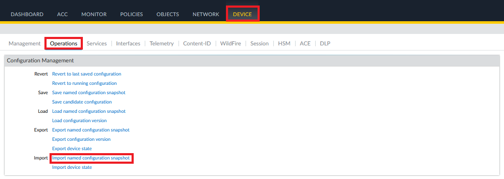

# Basic Firewall Configuration

A [basic sample configuration](../mgmt-plane/firewall/panf_base_config.xml) is provided, **to be applied in both nodes**. When applied, it unblocks traffic from the VCNs to the Internet and across VCNs.

## Required Changes to Provided Configuration

**Note**: the procedure below must be performed twice, once to each deployed Palo Alto node.

### Case 1 - VCNs CIDRs are not changed

If the VCNs are deployed with the same CIDR ranges as in the originally provided stacks, the following changes are needed in the [basic sample configuration](../mgmt-plane/firewall/panf_base_config.xml):

- line 25: IP address of the second interface (Untrust) / mask. Example: *\<entry name="192.168.0.14/29"/\>*
- line 45: IP address of the third Interface (Trust) / mask. Example: *\<entry name="192.168.0.22/29"/\>*

### Case 2 - VCNs CIDRs are changed

If CIDR ranges in the provided stacks are modified, the following changes are needed in the [basic sample configuration](../mgmt-plane/firewall/panf_base_config.xml):

**Note**: Only RFC 1918 private ranges are supported.

- line 25: IP address of the second interface (Untrust) / mask. Example: *\<entry name="192.168.0.14/29"/\>*
- line 45: IP address of the third Interface (Trust) / mask. Example: *\<entry name="192.168.0.22/29"/\>*
- line 67 - The Trust subnet CIDR / mask. Example: *\<entry name="192.168.0.16/29"/\>*
- line 68 - The Untrust subnet CIDR / mask. Example: *\<entry name="192.168.0.8/29"/\>*
- lines 266,308,322 - The Trust Subnet Router: The OCI Router IP which is the first IP in the subnet. Example: If the subnet CIDR is *192.168.0.16/29* then the line is *\<ip-address\>192.168.0.17\</ip-address\>*
- lines 280, 294 - The Untrust Subnet Router: The OCI Router IP which is the first IP in the subnet. Example: If the subnet CIDR is *192.168.0.8/29* then the line is *\<ip-address\>192.168.0.9\</ip-address\>*
- line 287 - The External LB subnet CIDR / mask. Example: *\<destination\>192.168.0.0/29\</destination\>*


## Firewall Initial Steps

Before loading the provided configuration, execute the following initial configuration.

### Setting Up the Admin Password

See [Network Path to Firewall Management Interface](#network-path-to-firewall-management-interface) for connecting to a node management interface via SSH.

1. Connect to the firewall node management interface via SSH:
    ```
    > ssh -i <PALO-NODE-SSH-PRIVATE-KEY> admin@<PALO-NODE-MGMT-INTERFACE-IP-ADDRESS>
    ```

2. Set the admin password:
    ```
    > configure
    > set mgt-config users admin password
    (Enter the password)
    (Confirm the password)
    > exit
    > exit
    ```

### Enabling Jumbo Frame Support

1. Connect to the firewall node management interface via SSH
    ```
    > ssh -i <PALO-NODE-SSH-PRIVATE-KEY> admin@<PALO-NODE-MGMT-INTERFACE-IP-ADDRESS>
    ```

2. Enable jumbo frames:
    ```
    > set system setting jumbo-frame on
    (Confirm with y)
    ```

## Uploading the Modified Basic Configuration

The provided *XML* has to be modified for each Palo Alto instance. Load the modified file to each node with the procedure below.

### Option 1 - Uploading via Web Interface

1. Connect to the web interface with *https://\<PALO-NODE-MGMT-INTERFACE-IP-ADDRESS\>*. Use the user admin and the password configured at the above step. 

**Note**: If using an OCI Bastion SSH port forwarding session from your local machine, the URL becomes *https://localhost*. See [Network Path to Firewall Management Interface](#network-path-to-firewall-management-interface) for details.

2. Go to **Device -> Operation -> Import named configuration snapshot** and select the modified XML file. 




### Option 2 - Uploading via Command Line Interface

**Note**: the steps must be performed from the command line of a Unix-based system.

1. Connect to the firewall node management interface via SSH
    ```
    > ssh -i <PALO-NODE-SSH-PRIVATE-KEY> admin@<PALO-NODE-MGMT-INTERFACE-IP-ADDRESS>
    ```
2. Enable the SCP server and exit:
    ```
    > configure
    > set mgt-config users admin preferences enable-scp-server yes
    > exit
    > exit
    ```
3. Copy the config file to firewall node.
    ```
    > scp -i <PALO-NODE-SSH-PRIVATE-KEY> panf-basic-config.xml admin@<PALO-NODE-MGMT-INTERFACE-IP-ADDRESS>:/scp/config/panf-basic-config.xml
    ```

## Applying the Configuration

1. Connect to the firewall node management interface via SSH:
    ```
    > ssh -i <PALO-NODE-SSH-PRIVATE-KEY> admin@<PALO-NODE-MGMT-INTERFACE-IP-ADDRESS>
    ```
5. Load the config file and restart the system:
    ```
    > configure
    > load config partial mode merge from-xpath /config/devices to-xpath /config/devices from panf_base_config.xml
    > commit
    > exit
    > request restart system
    (Confirm with y)
    ```    

### <a name="network-path-to-firewall-management-interface">Network Path to Firewall Management Interface</a>

This blueprint deploys Palo Alto Network Firewall nodes in private subnets. As such, SSH access to the management interfaces is available via the Jump Host deployed by [Mgmt Plane Networking 1st stage - Mgmt Plane VCNs](./MPLANE-NETWORKING.md#stage1), which in turn can be accessed through an OCI Bastion Service managed SSH session. **OCI Bastion must be manually provisioned by users in _Management VCN's Jump Host subnet_, where the jump host is deployed.** With OCI Bastion service deployed, make an SSH connection to the jump host, and from the jump host, ssh connect to the management interface.

The Admin Web UI is accessible through an SSH Port Forwarding Session in OCI Bastion Service. Here, **OCI Bastion must be manually provisioned by users in _Central Hub VCN's Management subnet_, where the management interface is deployed**. With OCI Bastion service deployed, start a port forward session for the management interface in your local machine, and use the browser to navigate to ```https://localhost```.