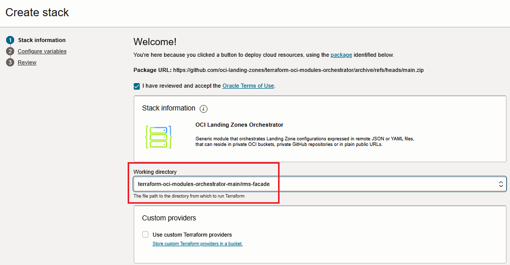
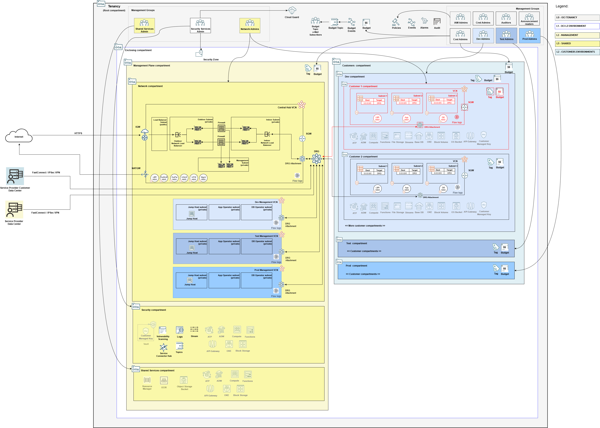

## Pod Model Customer Onboarding Stack Deployment

A stack that deploys IAM, budget and network configuration for a single customer. It initiates the onboarding process of a customer into the tenancy. Each customer is expected to have its own stack.

The sample customer VCNs are pre-configured with the following CIDR ranges: 

- **three-tier-vcn**: 10.0.0.0/26
- **oke-vcn**: 10.0.1.0/24

The *three-tier-vcn* can be changed in configuration file [network_three_tier_config.json](../pod/customer1/network_three_tier_config.json), while *oke-vcn* can be changed in [network_oke_config.json](../pod/customer1/network_oke_config.json).

### Overall Deployment Sequence

1. [Mgmt Plane Foundational - IAM, Logging, Governance](./MPLANE-FOUNDATIONAL.md)
2. [Mgmt Plane Networking 1st stage - Mgmt Plane VCNs](./MPLANE-NETWORKING.md#stage1)
3. [Mgmt Plane Networking - Firewall](./MPLANE-FIREWALL.md)
4. [Mgmt Plane Networking 2nd stage - Network routing post firewall deployment](./MPLANE-NETWORKING.md#stage2)
5. **Pod Model Customer Onboarding (this stack)**

### Stack Configuration

Input Configuration Files | Input Dependency Files | Generated Output
--------------------------|------------------------|------------------
[compartments_config.json](../pod/customer1/compartments_config.json)   [budgets_config.json](../pod/customer1/budgets_config.json)   [network_three_tier_config.json](../pod/customer1/network_three_tier_config.json)   [network_oke_config.json](../pod/customer1/network_oke_config.json)* | iam/output/compartments_output.json, network/output/network_output.json  | customer1/output/compartments_output.json, customer1/output/network_output.json

* *network_oke_config.json* contains the network declaration for a VCN suited to OKE deployments. It is not included automatically in the stack creation below. If the customer application is Kubernetes-based, replace *network_three_tier_config.json* with *network_oke_config.json*.

### Stack Creation

[](https://cloud.oracle.com/resourcemanager/stacks/create?zipUrl=https://github.com/oci-landing-zones/terraform-oci-modules-orchestrator/archive/refs/heads/main.zip&zipUrlVariables={"input_config_files_urls":"https://raw.githubusercontent.com/oci-landing-zones/oci-landing-zone-operating-entities/refs/heads/master/blueprints/multi-oe/service-providers/runtime/pod/customer1/compartments_config.json,https://raw.githubusercontent.com/oci-landing-zones/oci-landing-zone-operating-entities/refs/heads/master/blueprints/multi-oe/service-providers/runtime/pod/customer1/budgets_config.json,https://raw.githubusercontent.com/oci-landing-zones/oci-landing-zone-operating-entities/refs/heads/master/blueprints/multi-oe/service-providers/runtime/pod/customer1/network_three_tier_config.json","url_dependency_source_oci_bucket":"isv-terraform-runtime-bucket","url_dependency_source":"ocibucket","url_dependency_source_oci_objects":"iam/output/compartments_output.json,network/output/network_output.json","save_output":true,"oci_object_prefix":"customer1/output"})

In the Resource Manager Service (RMS) **Create stack - Stack Information** screen that shows up, check the *I have reviewed and accept the Oracle Terms of Use* box, make sure to select *terraform-oci-modules-orchestrator-main/rms-facade* in the **Working directory** drop down, as shown in the image below. 

Give the stack a meaningful name in the *Name* field (*isv-saas-customer1*, for instance), and follow the RMS workflow to complete the stack creation. 

The **Create stack - Configure variables** screen shows the variables pre-filled.

In the final **Create stack - Review** screen, make sure to uncheck the *Run Apply* button, so you have a chance to inspect the Terraform plan output.

Within the stack, perform a *Plan*, inspect its output, and finally run an *Apply* to actually deploy the resources.

### What Gets Deployed

The resources in red color are added.

