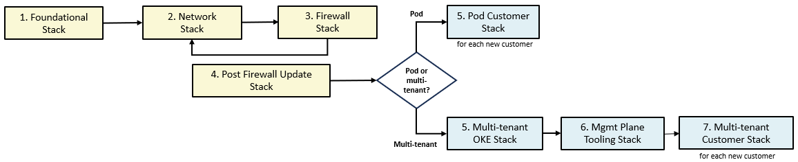

# **The OCI Open LZ &ndash; Multi-OE Service Providers [Blueprint](#)**

&nbsp; 

## Configuration Files

The blueprint is defined in configuration files expressed as JSON documents that can be deployed as-is (for demonstration purposes only) or changed based on specific requirements (for real deployments). 

Changes must be done following the requirements and specifications of the underlying Terraform modules that drive the JSON documents. The idea behind defining Landing Zones as JSON documents is making them fully customizable and declarable in a standard and widespread document format, while leveraging Terraform's Infrastructure as Code paradigm.

The configuration files are organized in different folders, according to the broader area they belong. 

**THESE CONFIGURATION FILES CAN BE DEPLOYED AS-IS BY FOLLOWING INSTRUCTIONS IN [How to Deploy](#howtodeploy) SECTION BELOW. HOWEVER, THEY ARE DESIGNED TO BE USED AS TEMPLATES FOR REAL WORLD DEPLOYMENTS, OWNED AND MODIFIED AT WILL BY CUSTOMERS THAT ARE DEPLOYING THE MODEL.**

- mgmt-plane: a top level folder for management plane, management groups and Root level resources.
    - bootstrap:
        - [bootstrap.json](mgmt-plane/bootstrap/bootstrap.json), containing an OCI private bucket allowing for the automation of the composite deployment model. The bucket stores the dependency files that are produced and consumed by the different stacks.
            - **IMPORTANT:** this file is only required for the automated example available (beginning in [MPLANE-FOUNDATIONAL.md](./docs/MPLANE-FOUNDATIONAL.md)). If you plan on storing your configuration files in a OCI bucket, have the bucket created beforehand and do not include this file in your stack.
    - iam: 
        - [iam_config.json](mgmt-plane/iam/iam_config.json), with the IAM configuration, including compartments, groups and policies.
    - governance: 
        - [budgets_config.json](mgmt-plane/governance/budgets_config.json), with budgets configuration.
    - security: 
        - [cloud_guard_config.json](mgmt-plane/security/cloud_guard_config.json), with Cloud Guard configuration.
        - [security_zones_config.json](mgmt-plane/security/security_zones_config.json), with Security Zones configuration.
        - [scanning_config.json](mgmt-plane/security/scanning_config.json), with Compute scanning configuration.
    - observability: 
        - [observability_config.json](mgmt-plane/observability/observability_config.json), with logging, streams, notifications, events, alarms and service connector hub configurations.
    - network: 
        - [network_initial_config.json](mgmt-plane/network/network_initial_config.json), containing the initial network configuration, with mgmt plane VCNs, subnets, route tables, security lists, network security groups, VCN gateways, DRG and DRG attachments.
            - **IMPORTANT:** The mgmt plane VCNs are pre-configured with the following CIDR ranges:
                - **central-hub-vcn**: 192.168.0.0/26
                - **security-vcn**: 192.168.0.64/26
                - **shared-services-vcn**: 192.168.0.128/26 
        - [network_post_firewall_config.json](mgmt-plane/network/network_post_firewall_config.json), adding the DRG ingress route table for the central hub VCN. This configuration is to be executed after the Firewall appliance and OCI Network Load Balancer are provisioned.
        - [flow_logs_config.json](mgmt-plane/network/flow_logs_config.json), with flow logs configuration for all VCNs in the mgmt plane.
        - [jump_host_config.json](mgmt-plane/network/jump_host_config.json), with a jump host configuration, defining a central SSH client to any hosts that are eventually deployed.
            - **IMPORTANT:** in a real deployment, make sure to assign your SSH public key to *default_ssh_public_key_path* attribute.
    - firewall: [firewall_config.json](mgmt-plane/firewall/firewall_config.json), with firewall appliance and OCI Network Load Balancer configurations.
        - **IMPORTANT:** in a real deployment, make sure to assign your SSH public key to *default_ssh_public_key_path* attribute.

- pod: containing customer configurations for the Pod model.
    - customer1: [compartments_config.json](pod/customer1/ccompartments_config.json), [budgets_config.json](pod/customer1/budgets_config.json), [network_three_tier_config.json](pod/customer1/network_three_tier_config.json), [network_oke_flannel_config.json](pod/customer1/network_oke_flannel_config.json), [oke_flannel_cluster_config.json](pod/customer1/oke_flannel_cluster_config.json) with sample resources configurations for one customer, including IAM, budget, networking (supporting traditional three tier apps or Kubernetes-based apps), respectively; and an OKE cluster. Use these files as templates to onboard other customers.
        - **IMPORTANT:** customer1 template has CIDR range 10.0.0.0/26 for the three-tier vcn and 10.0.1.0/24 for the OKE VCN. 

- mt: containing shared and customer configurations for the Multi-Tenant model.     
    - shared:
        - [network_oke_flannel_config.json](mt/shared/network_oke_flannel_config.json), a network template for Flannel-based OKE cluster with a data management layer set to host non-Exadata databases.
        - [network_oke_flannel_with_exadata_config.json](mt/shared/network_oke_flannel_with_exadata_config.json), a network template for Flannel-based OKE cluster with a data management layer set to host OCI Exadata Cloud Service databases.
        - [oke_flannel_cluster_config.json](mt/shared/oke_flannel_cluster_config.json), a template for Flannel-based OKE cluster deployment.
        - [network_oke_npn_config.json](mt/shared/network_oke_npn_config.json), a network template for NPN-based (Native Pod Networking) OKE cluster with a data management layer set to host non-Exadata databases.
        - [network_oke_npn_with_exadata_config.json](mt/shared/network_oke_npn_with_exadata_config.json), a network template for NPN-based (Native Pod Networking) OKE cluster with a data management layer set to host OCI Exadata Cloud Service databases.
        - [oke_npn_cluster_config.json](mt/shared/oke_npn_cluster_config.json), a template for NPN-based (Native Pod Networking) OKE cluster deployment.
    - customers:
        - [rbac-play.yml](mt/customers/rbac-play.yml), an Ansible playbook for managing role and role binding definitions. This is optional. Use it when utilizing narrower roles (bound to OCI groups/users with constrained permissions) for managing Kubernetes clusters. 
        - [rbac-tasks.yml](mt/customers/rbac-tasks.yml), defining Ansible tasks for managing role and role binding definitions. It is part of *rbac-play.yml*. 
        - [customer-play.yml](mt/customers/customer-play.yml), an Ansible playbook for onboarding customers into a Kubernetes cluster. It must be updated and executed for any new customer.  
        - [customer-tasks.yml](mt/customers/customer-tasks.yml), defining Ansible tasks for managing namespaces, quota policies and network policies. Each customer is assigned a namespace, a quota policy and a network policy. It is part of *customer-play*.yml.
          

&nbsp; 

## <a name="howtodeploy">How to Deploy</a>

The blueprint (or any customization) is deployed in separate stacks. A stack is a group of configuration files given as inputs to Terraform, reflected in a single Terraform state file. The decision factor for how many stacks lies on how the organization wants to manage the environment, especially which roles are expected to deploy which parts of the blueprint. 

On a high level, there are two broader sets of stacks for the blueprint build out: **management plane deployment** and **customer onboarding**.

**Management plane deployment** is composed of the following stacks, that must be executed as the presented order below:
1. **Foundational stack**: assembles IAM, governance, security and observability configuration files in a single stack. As mentioned before, it can be further split depending on organizational deployment requirements. 
2. **Network stack**: manages the management plane network configuration, including all the routing to customer VCNs.
3. **Firewall stack**: manages a pair of Palo Alto Networks firewalls, *sandwiched* by a pair of OCI network load balancers.

**Customer onboarding** is composed of customer-specific stacks.

### The OCI Landing Zones Orchestrator

The [OCI Landing Zones Orchestrator](https://github.com/oci-landing-zones/terraform-oci-modules-orchestrator) is a convenience tool for deploying JSON-based landing zones. It also supports YAML documents or Terraform tfvars files with HCL (Hashicorp Language) objects. The only requirement is that the documents/HCL objects are defined according to the requirements and specifications set forth by the OCI Landing Zone core modules, that are available in the following repositories:

- [Identity & Access Management](https://github.com/oracle-quickstart/terraform-oci-cis-landing-zone-iam)
- [Networking](https://github.com/oci-landing-zones/terraform-oci-modules-networking)
- [Governance](https://github.com/oci-landing-zones/terraform-oci-modules-governance)
- [Security](https://github.com/oci-landing-zones/terraform-oci-modules-security)
- [Observability & Monitoring](https://github.com/oci-landing-zones/terraform-oci-modules-observability)
- [Secure Workloads](https://github.com/oracle-quickstart/terraform-oci-secure-workloads)

Next we show how to deploy the blueprint with the Orchestrator per the stacks defined above. 

**IMPORTANT: For demonstrations purposes, the pre-configured stacks pull the configuration files from their public URLs in this repository. For real deployments, users should taylor the configuration files, store them and have the Orchestrator pulling them from a private repository, like a private OCI bucket or a private GitHub repository.**  

#### Management Plane
The following stacks are executed once each. After stack #4, the management plane network is ready to onboard customers.
1. [Foundational Stack](docs/MPLANE-FOUNDATIONAL.md)
2. [Network Stack](docs/MPLANE-NETWORKING.md#stage1)
3. [Firewall Stack](docs/MPLANE-FIREWALL.md)
4. [Network Stack Post Firewall Update](docs/MPLANE-NETWORKING.md#stage2)

#### Customer Onboarding - Pod Model
The following is executed for each new customer in the Pod Model:

5. [Customer Onboarding Stack - Pod Model](docs/POD-CUSTOMER-ONBOARDING.md)

#### Customer Onboarding - Multi-Tenant Model
Onboarding customers in the Multi-Tenant model has one shared infrastructure configuration and customer-specific configurations further deployed on the shared infrastructure.

5. [Shared Stack - Multi-Tenant Model](docs/MT-SHARED-OKE.md)
6. [Customer Onboarding Stack - Multi-Tenant Model](docs/MT-CUSTOMER-ONBOARDING.md)
 
 The diagram below depicts the deployment sequencing. Note that the Network stack must be updated once after Firewall deployment (step 4). Also note that the customer stack (step 5 in Pod model and step 6 in multi-tenant model) must be executed for each new customer.

 

