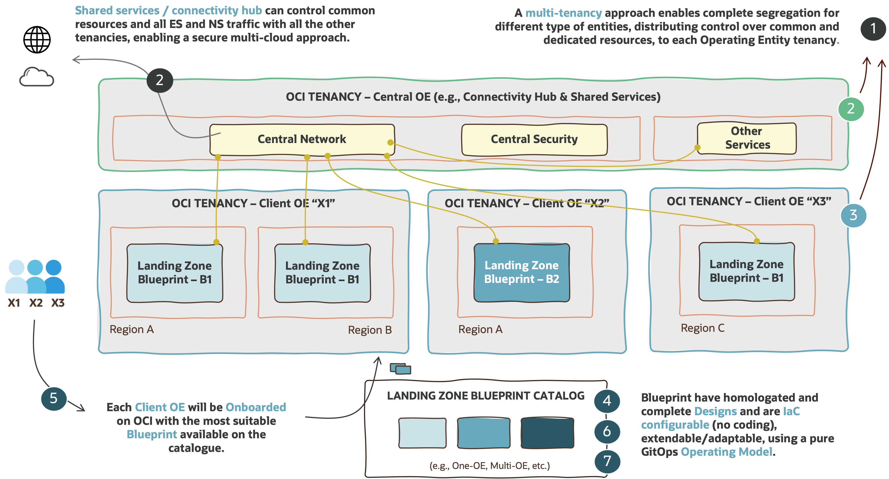

# **The OCI Open LZ &ndash; Multi-Tenancy [Blueprint](#)**

### A Blueprint to Simplify the Onboarding of Organizations, Business Units, and Subsidiaries into OCI

&nbsp; 

**Table of Contents**

[1. Introduction](#1-introduction) 
[2. Functional View](#2-functional-view) 
[3. Security View](#3-security-view) 
[4. Network View](#4-network-view) 
[5. Operations View](#5-operations-view) 
[6. Runtime View](#6-runtime-view)

&nbsp; 

# **1. Introduction**

The OCI Open LZ is a set of public and open assets to onboard OCI, available in a dedicated [Git Repository](https://github.com/oci-landing-zones/oci-landing-zone-operating-entities), containing several design **blueprints**, **IaC** configuration **examples**, and **enablement** activities.

This document is a subset of the OCI Open LZ, and it provides an executive summary of the **Multi-Tenancy blueprint**. 

&nbsp; 

## **1.1 Purpose**

The purpose of this document is to:
1. Provide a **multitenancy landing zone design** ready to onboard organization units (OU) and its functional divisions with their teams and projects. These OUs will be identified as **Operating Entities (OE)**, as there is an operating team (customer or partner) responsible for the management of a set of resources.
2. Provide a **cloud-native operating model** to simplify and scale **day two operations**.
3. **Enable customers, partners**, and the **general IT community** to **create their landing zones** with lower efforts through a comprehensive Oracle Cloud Infrastructure (OCI) reference architecture. To support this objective, all the architecture diagrams are provided in a reusable format.
4. **Provide tailoring guidelines** to help adjust the model. This asset can be used directly, tailored, or used as inspiration to create a new one - as it is not a prescribed solution.

&nbsp; 
&nbsp; 

## **1.2 Vision**

The OCI Multi-Tenancy Landing Zone, is a secure cloud environment, designed with best practices to simplify the **onboarding of organization units** (e.g., Line-of-Business, Operating Entities, OpCos, Subsidiaries, Brands, Products, Departments, etc.) into **several OCI tenancies** and enable the continuous operations of their cloud resources. This blueprint expands the One-OE and Multi-OE blueprints and key entities to simplify large organizational deployments. Find below some of its key characteristics.

&nbsp; 

&nbsp; 

| # | CHARACTERISTICS| DESCRIPTION   | 
|---|---|---|
| 1 | **Two Entity Types** | There are two types of entities in this blueprint, the ones that provide shared services to their customers (Operating Entities - OEs), and the OEs themselves. 
| 1 | **Central Shared Services Tenancies**| This type of tenancy is used for central shared services to all OEs tenancies. The Connectivity Hub (CH) is an example of this type of services. All OEs tenancies can be connected to the CH, which will control network traffic in and out of OCI.
| 1 | **Operating Entities  Tenancies**| Operating Entities tenancies can choose between a catalog of standard blueprints, according to their needs. In this case the One-OE or Multi-OE Blueprints are used, but on a customer scenario these options can be adjusted to any other Landing Zone blueprint. It is recommented that all tenancies follow a blueprint standard, but there are some cases described below where this cannot be enforced.
| 2 | **Project-Driven Structure / Vertical Scaling** | The Landing Zone blueprint is ready to onboard several types of in form of Projects and Platforms. Platforms can be cross-environment or dedicated to an environment.
| 3 | **Multi-Cloud / Multi-Region** | The Landing Zone blueprint can exist in several OCI regions and be connected to other landing zones in other CSPs. It can also participate in a Multi-tenancy Landing Zone.
| 4 | **Segregation of Duties**  | The Landing Zone blueprint elements are segregated in terms of identity and access management. There is a segregation of resources for shared services elements and environments. Each of these elements and sub-elements can have dedicated owners.
| 5 | **Isolation of Resources**| The Landing Zone blueprint has an isolation of resources at the network level in the different tenancies and among tenancies. The network structure is organized by environments (production and non-production) and resources in those environments are isolated at the platform or project level, with their own security posture.
| 6 | **Cloud Native Operating Model** | The Landing Zone blueprint can be operated with a complete GitOps operating model on day two, using control version repositories as the single source of truth for operations and code. The OCI Open LZ uses a 100% declarative Infrastructure as Code (IaC) approach, with IaC configurations on git-versioned repositories.
| 7 | **Automation Patterns** | The Landing Zone blueprint has a set of operations scenarios for provisioning and changing resources, providing the building blocks to design and automate any other repeatable operations.

&nbsp; 

If **cloud landing zones** are analogous to **airports**, the OCI Open LZ [One-OE Blueprint](#) is a highly secure and scalable airport with the possibility of having different terminals (Environments) with dedicated security posture (domestic, international, etc.) and potentially operated by different teams, where communication between those terminals, inside or outside the airport, is highly controlled and secured. 

&nbsp; 

## **1.3 Scope and Organization**

This One-OE Blueprint is presented with several design views built on top of each other, as an incremental and repeatable approach, that can be used and tailored by any customer or partner setting up an OCI Landing Zone. Each view is explored in a dedicated chapter:
1.	The **Functional View** presents the key concepts and user stories used in the design. 
2.	The **Security View** presents the core building blocks of the tenancy organization and security design. 
3.	The **Network View**, designed on top of the security, presents how network elements are structured, segregated, and connected to communicate with each other. 
4.	The **Operations Vie**w presents the dynamic elements with monitoring and an operating model ready for day 1 and day 2 operations – for provisioning and changing the OCI resources. 
5.	The **Runtime View** presents the executable elements with the operations artifacts to demonstrate how day 2 operations can run using IaC configurations.

This approach and its views provide a consistent design to simplify the onboarding of OCI with an existing blueprint, that can be changed and tailored toward different objectives. Note the order in which these views are presented is itself a best practice, and it's crucial to reproduce the approach with lower efforts and less rework. Therefore, changing security elements will impact the network elements, and any change in these will impact operations. Any change in the operations view will naturally impact the runtime elements.

Before proceeding, it’s highly recommended OCI foundational knowledge of its core services and resources, such as Compartments, Groups, Policies, DRG, VCNs, Subnets, Route tables, Security Lists, Network Security Groups, among others. For the operations view it’s recommended intermediate knowledge of version control systems, pipelines, and infrastructure-as-code (IaC).

&nbsp; 
&nbsp; 

# **2. Functional View**
The Landing Zone blueprint has a set of **functional elements** that are **key building blocks** used throughout this document – with the same code color – and ultimately are used to aggregate and operate a set of OCI resources. These elements are presented in the following diagram it’s crucial to understand them to understand the whole design. All elements are presented in detail in the [OCI Open LZ One-OE Drawio - Functional Tabs](/blueprints/one-oe/design/OCI_Open_LZ_One-OE-Blueprint.drawio).  

&nbsp; 

&nbsp; 

The following diagram and table present the union between the personas and functional elements presented in the previous sections – in the form of user stories. The user stories identified match the building blocks, having two common stories between different personas: Shared Services and Platforms. Functionally and technically, they are the same, but in different areas of the landing zone, with different scopes, and different ownership. 
 
&nbsp; 

&nbsp; 

&nbsp; 

Note that the mapping of the stories and personas to the final cloud operations teams will vary and will depend on the customer's operational reality. Each of these teams and possible sub-teams will also need to match OCI Groups described in the next chapter.

&nbsp; 
&nbsp; 

# **3. Security View**

This chapter will be added soon.

&nbsp; 
&nbsp; 

# **4. Network View**

This chapter will be added soon.

&nbsp; 
&nbsp; 

# **5. Operations View**

This chapter will be added soon.

&nbsp; 
&nbsp; 

# **6. Runtime View**
This chapter will be added soon.

&nbsp; 
&nbsp; 

# License

Copyright (c) 2024 Oracle and/or its affiliates.

Licensed under the Universal Permissive License (UPL), Version 1.0.

See [LICENSE](/LICENSE.txt) for more details.
