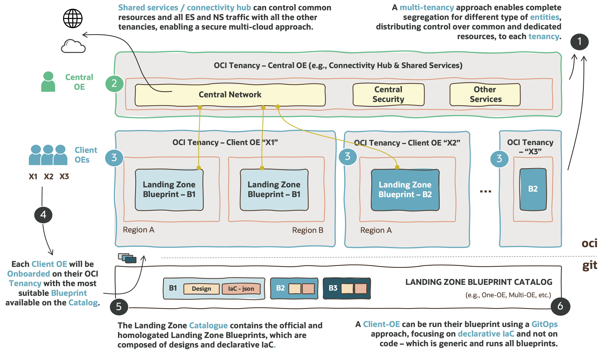
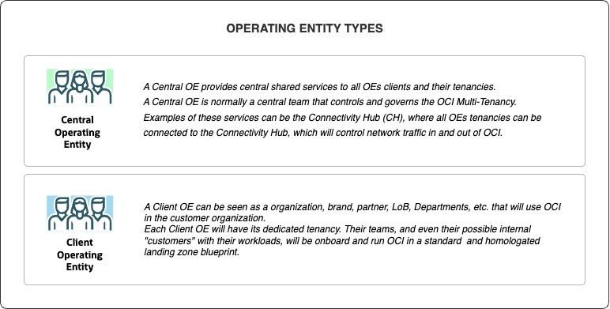
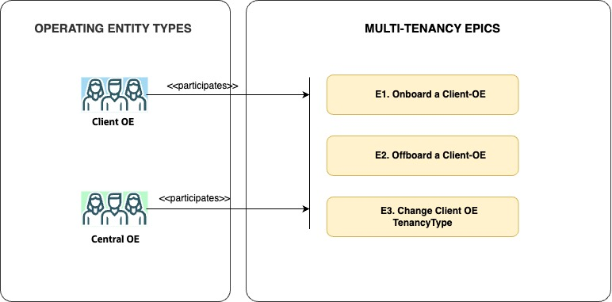
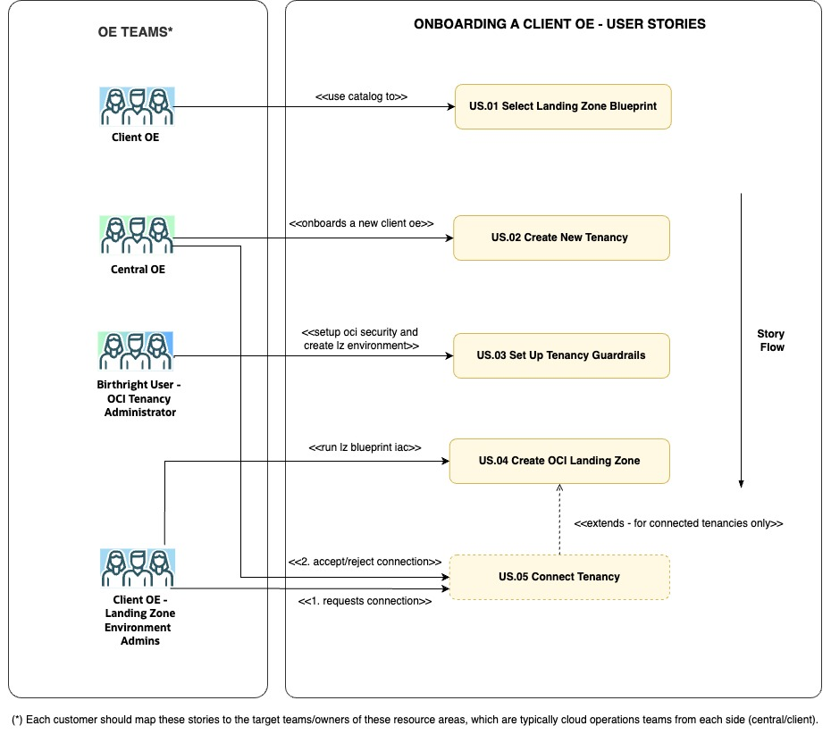
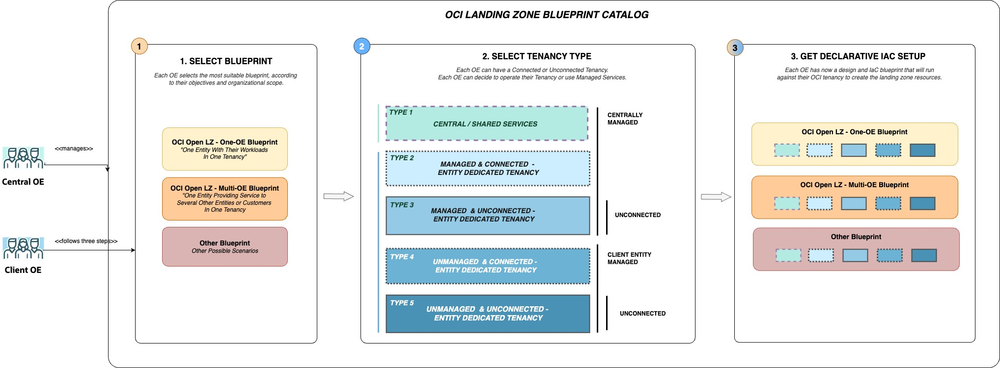
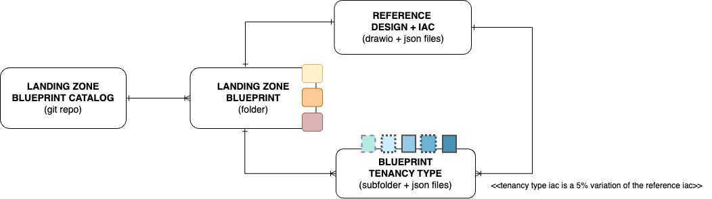
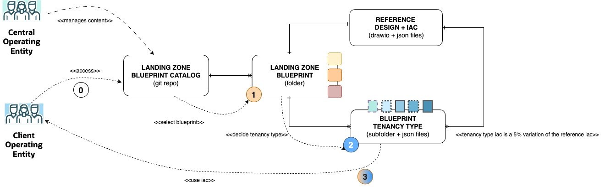

# **The OCI Open LZ &ndash; Multi-Tenancy [Blueprint](#)**

### A Blueprint to Simplify the Onboarding of All Your Organizations, Business Units, and Subsidiaries into OCI

&nbsp; 

**Table of Contents**

[1. Introduction](#1-introduction) 
[2. Multi-Tenancy Epics](#2-multi-tenancy-epics) 
[3. Epic 1 - Onboarding a Client OE](#3-epic-1---onboarding-a-client-oe) 
[4. Epic 2 - Offboarding a Client OE](#4-epic-2---offboarding-a-client-oe) 
[5. Epic 3 - Change Client-OE Tenancy Type](#5-epic-3---change-client-oe-tenancy-type) 

&nbsp; 

# **1. Introduction**

The OCI Open LZ is a set of public and open assets to onboard OCI, available in a dedicated [Git Repository](https://github.com/oci-landing-zones/oci-landing-zone-operating-entities), containing several design **blueprints**, **IaC** configuration **examples**, and **enablement** activities.

This document is a subset of the OCI Open LZ, and it provides an executive summary of the **Multi-Tenancy Blueprint**. 

&nbsp; 

## **1.1 Purpose**

The purpose of this document is to:
1. Provide a **multi-tenancy design** ready to onboard organization units (OU) and its functional divisions with their teams and projects. These OUs will be identified as **Client Operating Entities (OE)**, as there is an operating team (customer or partner) responsible for managing a set of resources.
2. Present the repeatable **onboarding design** of **Client Operating Entities** into their tenancies, leveraging central and shared services - managed by a **Central Operating Entity**.
3. **Enable customers, partners**, and the **general IT community** to **create landing zones** with lower efforts through a comprehensive Oracle Cloud Infrastructure (OCI) reference architecture. To support this objective, all the architecture diagrams are provided in a reusable format.
4. **Provide tailoring guidelines** to help adjust the model. This asset can be used directly, tailored, or used as inspiration to create a new one - as it is not a prescribed solution.

&nbsp; 
&nbsp; 

## **1.2 Vision**

The OCI Multi-Tenancy Landing Zone is a secure cloud environment, designed with best practices to simplify the **onboarding of organization units** (e.g., Line-of-Business, Operating Entities, OpCos, Subsidiaries, Brands, Products, Departments, etc.) into **several OCI tenancies** that can be **interconnected** and use **shared services**, and enable the continuous operations of their cloud resources. This blueprint expands the One-OE and Multi-OE blueprints and key entities to simplify large organizational deployments. Find below some of its key characteristics.

&nbsp; 

&nbsp; 

&nbsp; 

| # | CHARACTERISTICS| DESCRIPTION   | 
|---|---|---|
| 1 | **Multi-Tenancy Multi-Entity** | There are two types of OEs in this blueprint, the ones that provide central shared services to their clients and the clients themselves. The former is a **Central Operating Entity (OE)** which is normally part of a central IT responsibility, while  the latter are organizations, LoBs, brands, products, or partner teams that will use OCI with their tenancies - identified as **Client Operating Entities**. There can be several Client OEs in the Multi-Tenancy.
| 2 | **Central Operating Entity** | A Central OE provides central shared services to all OE customers and their tenancies. A central OE is normally a central team that controls and governs the OCI Multi-Tenancy. Examples of these services can be the Connectivity Hub (CH), where all OE tenancies can be connected to the CH, which will control network traffic in and out of OCI.
| 3 | **Client Operating Entities**|  A Client OE can be seen as an organization, brand, partner, LoB, product, department, etc. that will use OCI in the customer organization. Each Client OE will have its dedicated tenancy. Their teams, and even their possible internal "customers" with their workloads, will onboard and run OCI in a standard and homologated landing zone blueprint.
| 4 | **Secure Onboarding** | This design proposes a high-level workflow to guide the secure onboarding of each Client OE into OCI, from the tenancy activation to the landing zone creation. The key activities of the onboarding process are presented as user stories and start with the selection of the most suitable Landing Zone Blueprint available in a Catalog for a Client OE. Furthermore, the offboarding will also be included in future versions.
| 5 | **Blueprint Catalog** | This element provides an official and homologated set of Landing Zones Blueprints. Each Client OE can choose the most suitable blueprint available in the catalog. In this Multi-Tenancy design, the One-OE or Multi-OE Blueprints are used, but in a customer scenario, these options can be adjusted to any other Landing Zone Blueprints. It is recommended that all tenancies follow a blueprint standard, to reduce governance and operational costs, and avoid unsecured tenancies that can pose a threat to the Multi-Tenancy construct.
| 6 | **Cloud Native Operating Model** | Each Landing Zone blueprint can be operated with a complete GitOps operating model on day two, using control version repositories as the single source of truth for operations and code. The OCI Open LZ uses a 100% declarative Infrastructure as Code (IaC) approach, with IaC configurations on git-versioned repositories, where an OE will focus on declarative IaC and not on code. The code is generic and runs all blueprints.

&nbsp; 

If **cloud landing zones** are analogous to **airports**, the OCI Open LZ [Multi-Tenancy Blueprint](#) is a connected set of highly secure and scalable airports providing service to a country, covering a set of areas (Tenancies) where each has the possibility of having different terminals (Environments) with dedicated security posture (domestic, international, etc.) and potentially operated by different teams, where communication between those terminals and airports is highly controlled and secured. 

&nbsp; 

&nbsp; 

# **2. Multi-Tenancy Epics**

There are two types of personas in the [Multi-Tenancy Blueprint](#), the Central OE and Client OEs. These teams are conceptual and reflect the nature of the role of who centrally serves and governs, and who uses these services and owns resources. These entities are presented in the following diagram, at light green and light blue, respectively.

&nbsp; 

&nbsp; 

Each entity type has its scope, responsibilities, and possible subteams. For the scope of the multi-tenancy, these teams will participate in a set of significant epics:
1. **[Onboarding a Client OE](#3-epic-1---onboarding-a-client-oe)**: It's the most common story and describes the steps involved in repeatedly onboarding new Client OEs into the multi-tenancy.
2. **Offboarding a Client OE**: This story can happen when an organization or sub-organization moves out of the multi-tenancy (e.g., organization sell-off, merge, etc.).
3. **Change Client OE Tenancy Type**: This story can happen when an existing Client OE requires a tenancy type change (e.g., from unconnected to a centrally connected tenancy).

&nbsp; 

&nbsp; 

The next chapters will present each of the elements along with their user stories.

&nbsp; 

# 3. Epic #1 - Onboarding a Client OE

Welcome to epic one, the most-significant story in the multi-tenancy, containing five major steps described as user stories. Find below the diagram and their description.

&nbsp; 

&nbsp; 

> [!NOTE]
> Note that the **onboarding process of the Central OE** into an **OCI Parent Tenancy** and the creation of their **Central/Shared Services Tenancies** are not presented in the diagram, as the former is a one-off initiative - ideally with an empty tenancy - while the latter can follow the same process as depicted into the user stories, having the Central OE as the unique persona with their subteams.

&nbsp; 

| # | STORY NAME | STORY STATEMENT AND DESCRIPTION|  KEY ARTIFACTS
|:-:|---|---|--|
| **E1.S1** | [**Select Landing Zone Blueprint**](#31-select-landing-zone-blueprint) | ***As a** "Client OE", **we want to** select the Landing Zone Blueprint **so that** we can onboard OCI with the right size/shape according to our organization structure and workload scope.*   The **Client OE** team can self-serve, be advised, or even be prescribed a blueprint by the Central OE team. This is not depicted in the diagram for simplification purposes. All the blueprints should be available in the **blueprint catalog**, which homologates them for use in the enterprise. Blueprints can be **connected/unconnected** regarding central connectivity, or **managed/unmanaged** regarding tenancy day two operations responsibility.   After this step, the Central OE will create the tenancy with **User Story 02**. | **a. Catalog for Landing Zone Blueprints**
| **E1.S2** | **Create New Tenancy** | ***As** "Central OE - Central OCI Administrators", **we want to** create new tenancies **so that** new Client OE can be onboarded into OCI with governance and security*.     The **Central OE** team will select the Client OE Administrator (who will receive the tenancy onboarding mail) and decide if the new tenancy will join the OCI Organization Management governance rules (quotas, tags, regions).  The outcome of this story is an email to the new "**tenancy birthright user**", which is a member of the "Central/Client OE - Tenancy Administrators", that will execute **User Story 03**. For connected tenancy cases, the CIDR range will be centrally defined and shared with the Client-OE team.  Note that this story assumes parent tenancy and shared service tenancy exists. | **a. Tenancy** **b. Birthright User**
| **E1.S3** | **Set Up Tenancy Guardrails** | ***As the** "Birthright User - Tenancy Administrators", **I want to** set up the guardrails of new tenancies  **so that** the Landing Zone Operating Entities teams can have secure Landing Zone Environments to set up their landing zones and place their resources.*     The **Birthright User - Tenancy Administrator** is responsible for the OCI Tenancy that will create the break glass users, groups, and policies at the root level, and create one or several Landing Zone Environments (LZE). Note this person can belong to the Client OE team for **unconnected** tenancies or the Central OE for **connected** tenancies, and it will not intervene in day two operations on that tenancy. Each Landing Zone Environment created will have a dedicated administrator group executing  **User Story 04**. For more details on the Landing Zone Environment please review the [One-OE Blueprint](/blueprints/one-oe/design/readme.md#2-functional-view). | **a. Birthright User** **b. Tenancy  c. Groups  d. Policies**  **e. Landing Zone Environment**
| **E1.S4** | **Create OCI Landing Zone** | **As** "Client OE - Landing Zone Environment Admins", **we want to** create the landing zone resources in our tenancy **so that** it can start being used by our workloads and teams.   This story is where the **Client OE - Landing Zone Environment Admins** will run the IaC associated with the OCI Landing Zone Blueprint. As examples refer to the [One-OE](/blueprints/one-oe/) and [Multi-OE](/blueprints/multi-oe/) Blueprints, which could potentially be part of the catalog. | **a. Landing Zone Blueprint**
| **E1.S5** | **Connect Tenancy** | **As** "Client OE - Landing Zone Environment Admins", **we want to** request central connectivity capabilities **so that** our resources can access be accessed by resources outside our tenancy in a controlled and secured manner.   The **Client OE - Landing Zone Environment Admins** will be responsible to request access to central connectivity so the tenancy has connectity to the multi-cloud and potential external resources. The **Central OE** will be responsible for accepting or rejecting the request, depending on the Client OE tenancy type. This story can be seen as an extension to the previous one, only applicable to **connected tenancy types**. | **a. Policies**

&nbsp;

&nbsp; 

## 3.1 Select Landing Zone Blueprint

&nbsp; 

The Landing Zone Blueprint Catalog is the key element in this story, and it has three important concepts associated to it:

1. **Landing Zone Blueprints**: These are the core elements of the catalog, a set of homologated blueprints that each Client OE will choose from. Each blueprint is documented and has a landing zone design and is runnable with Infrastructure-as-Code (IaC).
2. **Tenancy Types**: As part of the Blueprints Catalog, there will be available several tenancy types flavors for each Blueprint, such as centrally connected, unconnected, managed, or unmanaged, which are the same blueprints with minor design differences in terms of security, network, and operations. At onboarding type, each Client OE has to choose the Landing Zone Blueprint and its Tenancy Type. A Client OE has to **decide** on the tenancy type.
3. **Tenancy Type IaC**: This is the pre-defined declarative IaC that matches the blueprint and tenancy type selections.

&nbsp; 

&nbsp; 

The **Central OE is responsible for the Catalog**, which is a conceptual element in this design and should contain a repository with guidance on the required decisions. This git repository, the [Operating Entities Landing Zone](https://github.com/oci-landing-zones/oci-landing-zone-operating-entities), can be seen as an example of a catalog, or a part of it.

The **Client OE will have to make two decisions** and use the blueprint IaC later in [(E1.S4) Create OCI Landing Zone](#34-create-oci-landing-zone). 

1. **Decide on The Blueprint**: The first decision is about the blueprint model. In this example, we would have the One-OE and Multi-OE blueprints. The criteria for choosing Multi-OE would be if this Clien OE would also onboard several of its sub-organizations (e.g., Departments, Products, etc.), otherwise, it would choose the One-OE which is a simpler model. The content of each catalog (number and type blueprint) can change from customer to customer, depending on their objectives, making it possible to have *N* or just one blueprint available.   
2. **Decide on the Tenancy Type**: For the second decision it is important to introduce **two concepts that can be combined** (described in the diagram above in step 2 with blue tones):  
     a. **Connectivity**: A tenancy can be **connected** to the Central OE tenancies to consume shared services and have north-south and east-west traffic control, or be **unconnected**, handling their own connectivity needs without leveraging shared elements in the multi-tenancy.  
     b. **Management**: A tenancy can be **managed** by the Central OE team, for cases where the Client OE doesn't have the skills or capacity to do so, or **unmanaged**, where the Client OE is fully responsible for the management and operations of their own tenancy.   

&nbsp; 

The diagram below presents an Entity-Relationship Diagram (ERD) clarifying the relations among elements:
- A **Catalog** can have one to several **Blueprints**.
- One **Blueprint** is composed of a reference Landing Zone **Design** with its declarative **IaC**.
- One **Blueprint** can be used in several **Tenancy Types** (Connected/Unconnected, Managed/Unmanaged), which is a flavor of the original blueprint.
- A **Blueprint Tenancy Typ**e has the same design and IaC as the original Blueprint with minor changes in the IaC regarding connectivity elements.

&nbsp; 

&nbsp; 

Find below the same diagram with the decision flow and both entity types, following the same code color for steps 1, 2, and 3 that of the first diagram of this story.

&nbsp; 

&nbsp; 

Summing all the elements and decisions presented in this story, the multi-tenancy will have the following tenancy architecture, when the Central OE owns the tenancies with green tones, and the Client OEs will own tenancies with blue tones according their type.
&nbsp; 

&nbsp; 

&nbsp; 

&nbsp; 

## 3.2 Create New Tenancy

This story will be added soon. Reach out for more details.

&nbsp; 

&nbsp; 

## 3.3 Set Up Tenancy Guardrails

This story will be added soon. Reach out for more details.

&nbsp; 

&nbsp; 

## 3.4 Create OCI Landing Zone

This story will be added soon. Reach out for more details.

&nbsp; 

&nbsp; 

## 3.5 Connect OCI Tenancy

This story will be added soon. Reach out for more details.

&nbsp; 

&nbsp;

# 4. Epic 2 - Offboarding a Client OE

This epic will be added soon. Reach out for more details.

&nbsp; 

&nbsp;

# 5. Epic 3 - Change Client-OE Tenancy Type

This epic will be added soon. Reach out for more details.

&nbsp; 

&nbsp;

# License

Copyright (c) 2024 Oracle and/or its affiliates.

Licensed under the Universal Permissive License (UPL), Version 1.0.

See [LICENSE](/LICENSE.txt) for more details.
