# **The OCI Open LZ &ndash; One-OE [Blueprint](#)**

### A Blueprint to Simplify the Onboarding of Organizations, Business Units, and Subsidiaries into OCI

&nbsp; 

**Table of Contents**

[1. Introduction](#1-introduction) 
[2. Functional View](#2-functional-view) 
[3. Security View](#3-security-view) 
[4. Network View](#4-network-view) 
[5. Operations View](#5-operations-view) 
[6. Runtime View](#6-runtime-view)

&nbsp; 

# **1. Introduction**

The OCI Open LZ is a set of public and open assets to onboard OCI, available in a dedicated [Git Repository](https://github.com/oracle-quickstart/terraform-oci-open-lz), containing several design **blueprints**, **IaC** configuration **examples**, and **enablement** activities.

This document is a subset of the OCI Open LZ, and it provides an executive summary of the **One-OE blueprint**. The complete blueprint will be available soon in detail in the PDF format and supported by a [Drawio](/blueprints/one-oe/design/OCI_Open_LZ_One-OE-Blueprint.drawio) containing all design diagrams, for reuse while tailoring new landing zones.

For more approaches and assets on OCI Landing Zones refer to the [OCI Landing Zone Framework](https://github.com/oracle-devrel/technology-engineering/blob/main/landing-zones/README.md).

&nbsp; 

## **1.1 Purpose**
The purpose of this document is to:

1. Provide a **landing zone design** ready to **onboard one organization unit (OU)** with their teams, platforms, and projects. The OU will be identified as an **Operating Entity (OE)**, as there is an operating team (customer or partner) responsible for the management of a set of resources.
2. Provide a **cloud-native operating model** to simplify and scale **day two operations**.
3. **Enable customers, partners**, and the **general IT community** to **create their landing zones** with lower efforts through a comprehensive Oracle Cloud Infrastructure (OCI) reference architecture. To support this objective, all the architecture diagrams are provided in a reusable format.
4. **Provide tailoring guidelines** to help adjust the model. This asset can be used directly, tailored, or used as inspiration to create a new one - as it is not a prescribed solution.

&nbsp; 
&nbsp; 

## **1.2 Vision**

The **OCI Open LZ**, the **Op**erating **En**tities **L**anding **Z**one, is a secure cloud environment, designed with best practices to simplify the **onboarding** of organization units (e.g., Line-of-Business, Operating Entities, OpCos, Subsidiaries, Departments, etc.) into OCI and enable the **continuous operations** of their cloud resources. 

The **One-OE blueprint** is designed to simplify the onboarding and running of OCI for one operating entity, and it’s presented with a repeatable and guided design approach, that can be used as a reference for different business needs. Find below some of its key characteristics.

The following diagram presents its seven key characteristics.

&nbsp; 

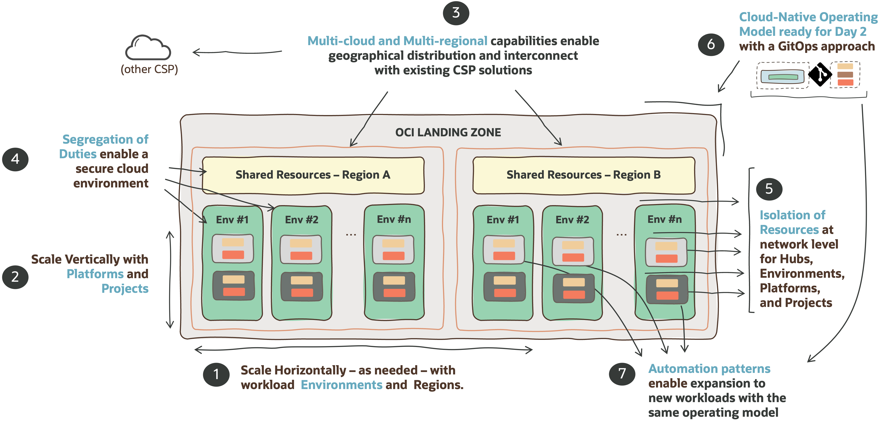

&nbsp; 

| # | CHARACTERISTICS| DESCRIPTION   | 
|---|---|---|
| 1 | **Enterprise Organization / Horizontal Scaling**| The Landing Zone blueprint is designed to simplify the OCI onboarding of an enterprise organization and its workload environments, with their teams, platforms, and projects.
| 2 | **Project-Driven Structure / Vertical Scaling** | The Landing Zone blueprint is ready to onboard several types of in form of Projects and Platforms. Platforms can be cross-environment or dedicated to an environment.
| 3 | **Multi-Cloud / Multi-Region** | The Landing Zone blueprint can exist in several OCI regions and be connected to other landing zones in other CSPs. It can also participate in a Multi-tenancy Landing Zone.
| 4 | **Segregation of Duties**  | The Landing Zone blueprint elements are segregated in terms of identity and access management. There is a segregation of resources for shared services elements and environments. Each of these elements and sub-elements can have dedicated owners.
| 5 | **Isolation of Resources**| The Landing Zone blueprint has an isolation of resources at the network level. The network structure is organized by environments (production and non-production) and resources in those environments are isolated at the platform or project level, with their own security posture.
| 6 | **Cloud Native Operating Model** | The Landing Zone blueprint can be operated with a complete GitOps operating model on day 2, using control version repositories as the single source of truth for operations and code. The OCI Open LZ uses a 100% declarative Infrastructure as Code (IaC) approach, with IaC configurations on git-versioned repositories.
| 7 | **Automation Patterns** | The Landing Zone blueprint has a set of operations scenarios for provisioning and changing resources, providing the building blocks to design and automate any other repeatable operations.

&nbsp; 

If **cloud landing zones** are analogous to **airports**, the OCI Open LZ [One-OE Blueprint](#) is a highly secure and scalable airport with the possibility of having different terminals (Environments) with dedicated security posture (domestic, international, etc.) and potentially operated by different teams, where communication between those terminals, inside or outside the airport, is highly controlled and secured. 

&nbsp; 

## **1.3 Scope and Organization**

This One-OE Blueprint is presented with several design views built on top of each other, as an incremental and repeatable approach, that can be used and tailored by any customer or partner setting up an OCI Landing Zone. Each view is explored in a dedicated chapter:
1.	The **Functional View** presents the key concepts and user stories used in the design. 
2.	The **Security View** presents the core building blocks of the tenancy organization and security design. 
3.	The **Network View**, designed on top of the security, presents how network elements are structured, segregated, and connected to communicate with each other. 
4.	The **Operations Vie**w presents the dynamic elements with monitoring and an operating model ready for day 1 and day 2 operations – for provisioning and changing the OCI resources. 
5.	The **Runtime View** presents the executable elements with the operations artifacts to demonstrate how day 2 operations can run using IaC configurations.

This approach and its views provide a consistent design to simplify the onboarding of OCI with an existing blueprint, that can be changed and tailored toward different objectives. Note the order in which these views are presented is itself a best practice, and it's crucial to reproduce the approach with lower efforts and less rework. Therefore, changing security elements will impact the network elements, and any change in these will impact operations. Any change in the operations view will naturally impact the runtime elements.

&nbsp; 

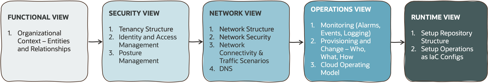

&nbsp; 

While the previous diagram presents the recommended steps of the journey to create a landing zone, the diagram below presents the layered perspective to emphasize that each inner layers impact the design or considerations of any outer layer.

&nbsp; 

&nbsp; 

Before proceeding, it’s highly recommended OCI foundational knowledge of its core services and resources, such as Compartments, Groups, Policies, DRG, VCNs, Subnets, Route tables, Security Lists, Network Security Groups, among others. For the operations view it’s recommended intermediate knowledge of version control systems, pipelines, and infrastructure-as-code (IaC).

&nbsp; 
&nbsp; 

# **2. Functional View**
The Landing Zone blueprint has a set of **functional elements** that are **key building blocks** used throughout this document – with the same code color – and ultimately are used to aggregate and operate a set of OCI resources. These elements are presented in the following diagram it’s crucial to understand them to understand the whole design. All elements are presented in detail in the [OCI Open LZ One-OE Drawio - Functional Tabs](/blueprints/one-oe/design/OCI_Open_LZ_One-OE-Blueprint.drawio).  

&nbsp; 

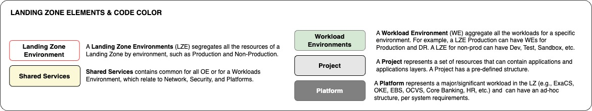

&nbsp; 

The following diagram and table present the union between the personas and functional elements presented in the previous sections – in the form of user stories. The user stories identified match the building blocks, having two common stories between different personas: Shared Services and Platforms. Functionally and technically, they are the same, but in different areas of the landing zone, with different scopes, and different ownership. 
 
&nbsp; 

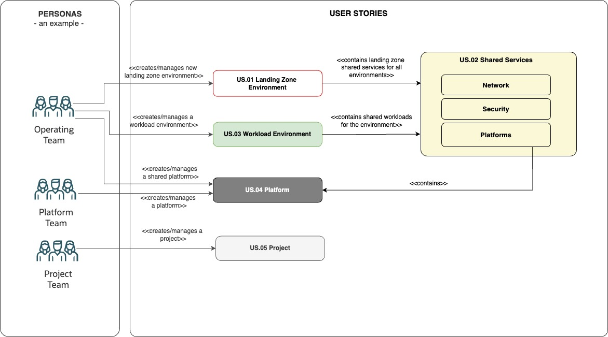

&nbsp; 

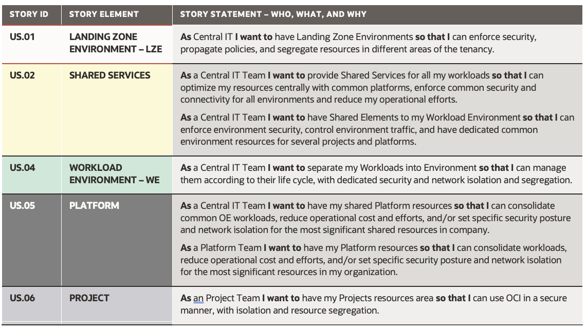

&nbsp; 

Note that the mapping of the stories and personas to the final cloud operations teams will vary and will depend on the customer's operational reality. Each of these teams and possible sub-teams will also need to match OCI Groups described in the next chapter.

&nbsp; 
&nbsp; 

# **3. Security View**
This chapter presents the following elements:
1. **Tenancy Structure** presents the compartment structure to support resource grouping, separation of duties, and budget control and billing.
2. **Identity and Access Management** defines the groups, dynamic groups, and policies for the related duties and compartments.
3. **Posture Management** describes the additional configurations for native security tooling to set a strong security posture.

&nbsp; 

The diagram below presents the tenancy structure for Levels 1 and 2:
- The white and red framed elements (L1) represent the Landing Zone Environment (LZE). 
- The pale-yellow elements (L2) represent Shared Elements in a tenancy. 
- The green elements (L2) represent the Workload Environments (WE). 

Note that the Production Landing Zone has three Workload Environments: Production, Disaster Recovery, and Pre-production. The Non-Production Landing Zone has four Workload Environments: User Acceptant Test, Testing, Development, and Sandbox. Note that the proposed LZE and WE can and should be adjusted to existing practices.

&nbsp; 

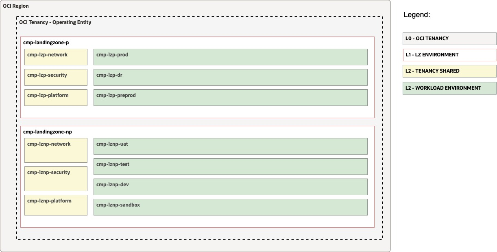

&nbsp; 

The following diagram presents the tenancy structure up to L5, introducing the **Platform** and **Project** elements – with grey colors – in the design. Notice that each Workload Environment will also have the **shared element** concept, including network, security, and platform elements for all workloads in the environment – depicted in a stronger yellow color. Cross-environment **Platforms** will remain in the Landing Zone Environment shared platform compartment, while **Platforms** that provide service for a specific environment will remain inside that environment platform shared compartment, with all its possible **layers**. All other types of workloads will remain in **project** structures with their related layers. A **project** can be a complete set of workloads with all the layers or just one layer. Note that the Platform and Projects presented in the diagram below are just examples

&nbsp; 

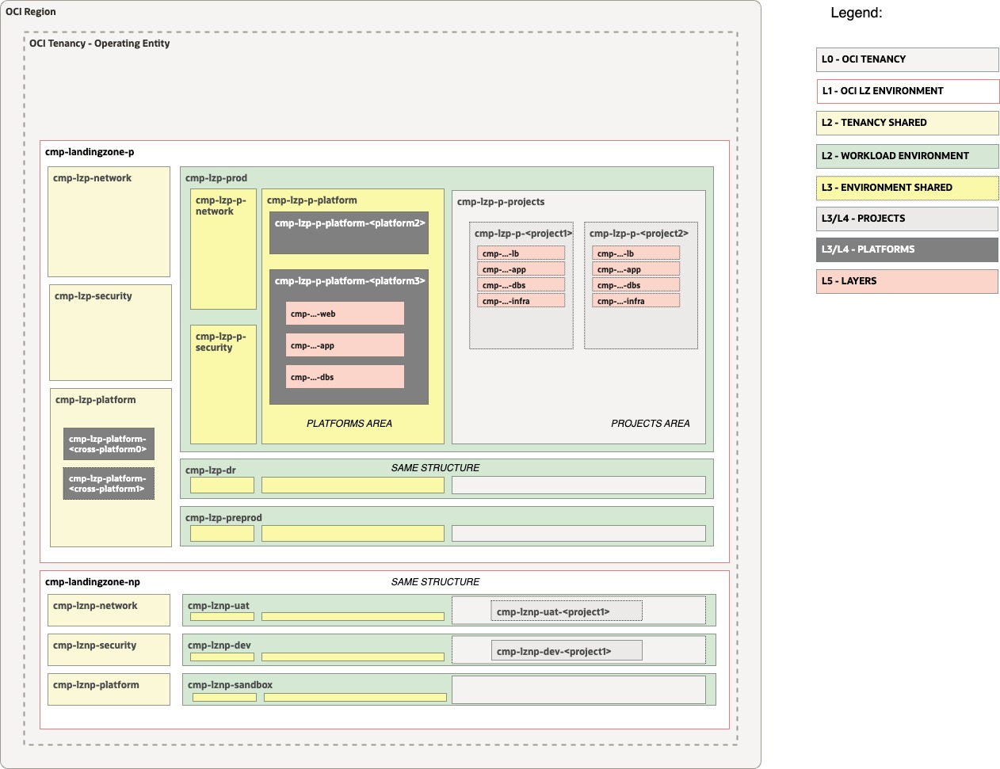

&nbsp; 

The next two diagrams depict the **security zones** of the landing zones and the general **security posture**. For more details on the tenancy structure levels (L3-L5), related IAM with OCI Groups and Policies, and security posture applied to each element refer to the [OCI Open LZ One-OE Drawio - Security Tabs](/blueprints/one-oe/design/OCI_Open_LZ_One-OE-Blueprint.drawio). 

&nbsp; 

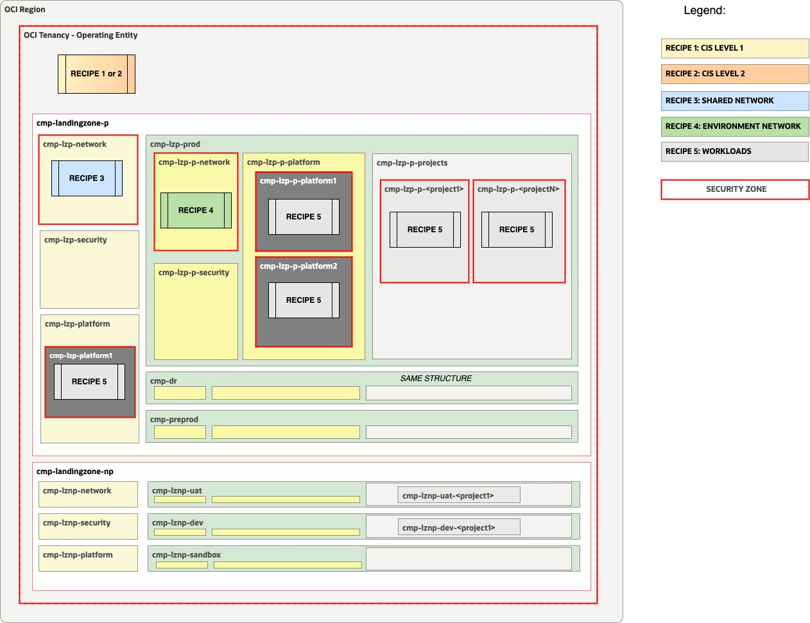

&nbsp; 

The **One-OE blueprint** proposes the **strongest security posture** using all OCI capabilities, including **Compartments**, **Groups**, **Policies**, **Identity Domains**, **Cloud Guard**, **Security Zones**, **Quotas**, **Network Security** (the areas are presented in the next chapter), **Events**, **Logging**, **Alarms**, **Notifications**, **Bastions**, **Vaults**, and **Vulnerability Scanning**. The diagram below presents an executive summary of these and their scope of use, matching to compartments.

&nbsp; 

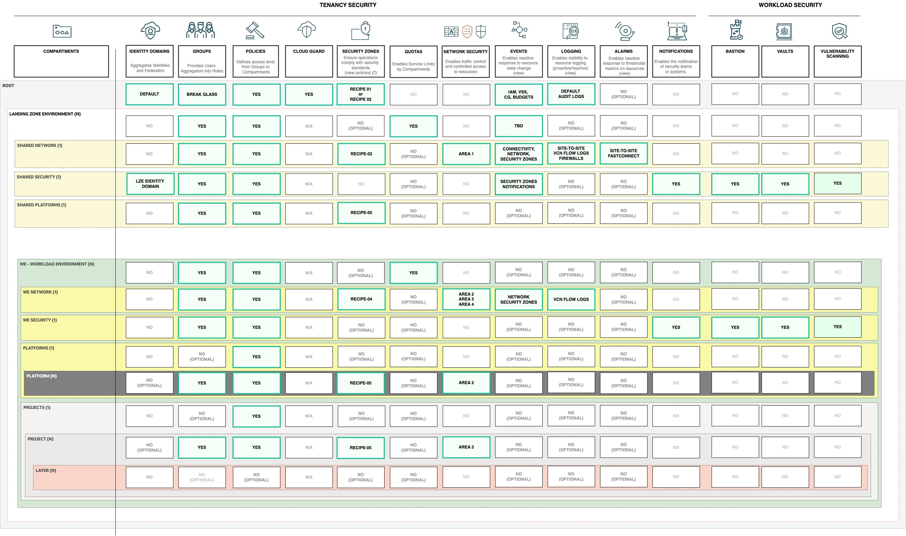

&nbsp; 

&nbsp; 

# **4. Network View**

This chapter presents all the network elements of the OCI Open LZ One-OE Blueprint, and it’s organized into five sections:
1. **Network Structure** presents all the most significant network components, their relations, and objectives.
2. **Network Security** presents the network areas and their related security posture.
3. **Network Connectivity** presents how the landing zone can be connected to on-premises and other cloud providers and describes the most significant network traffic (the network use cases) with a north-south and east-west pattern.
4. **DNS** presents the naming resolution use cases and how DNS zones and records are solved to handle domain DNS queries.

&nbsp; 

The following diagram and table present the network structure of the One-OE blueprint. Note the network areas identified, **Hub**, **Platforms**, **Projects**, and **Sandbox**. Each of these areas will have its network security posture.

&nbsp; 

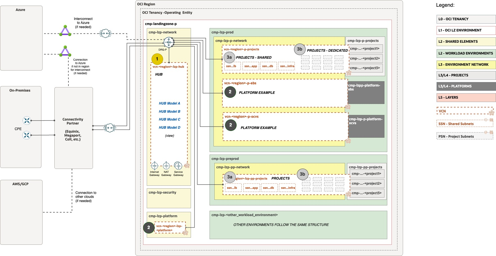

&nbsp; 

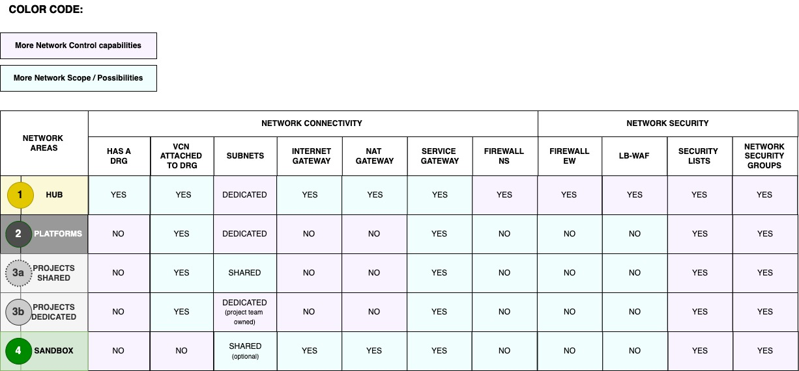

&nbsp; 

There are several possible **hub models** that can be used and they are described in the [OCI Open LZ One-OE Drawio - Network Tabs](/blueprints/one-oe/design/OCI_Open_LZ_One-OE-Blueprint.drawio). The One-OE Blueprint uses **[Hub Model A](/addons/oci-hub-models/hub_a/readme.md)** for **Network Area 1,** and it's depicted below in **structure** and **routing**. 

&nbsp; 

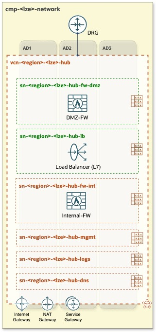

&nbsp; 

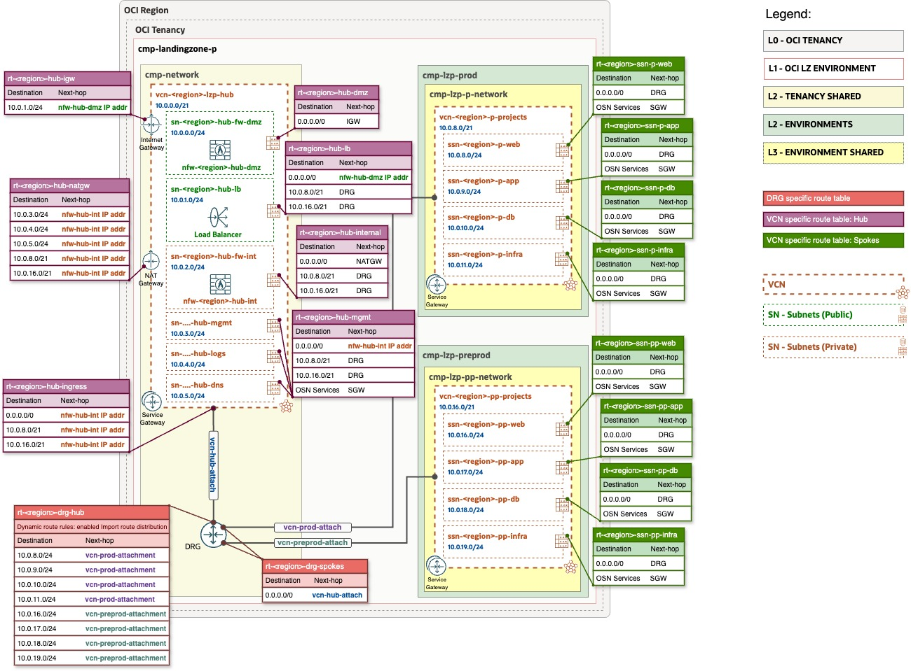

&nbsp; 

For more details on the network design refer to the [OCI Open LZ One-OE Drawio - Network Tabs](/blueprints/one-oe/design/OCI_Open_LZ_One-OE-Blueprint.drawio). 

&nbsp; 
&nbsp; 

# **5. Operations View**

This chapter will be added soon.

&nbsp; 
&nbsp; 

# **6. Runtime View**
This chapter will be added soon.

&nbsp; 
&nbsp; 

# License

Copyright (c) 2024 Oracle and/or its affiliates.

Licensed under the Universal Permissive License (UPL), Version 1.0.

See [LICENSE](/LICENSE.txt) for more details.
