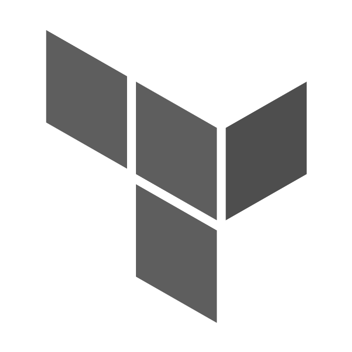
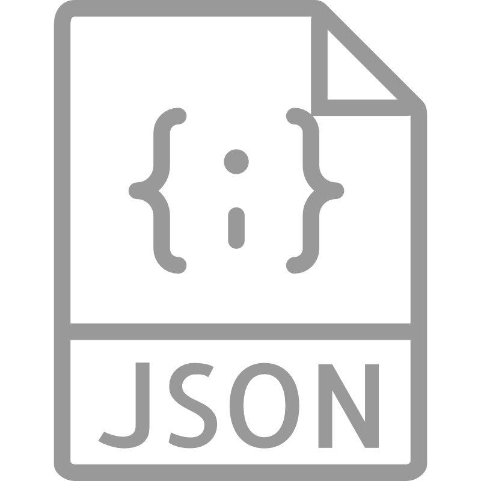

# **The OCI Open LZ &ndash; [One-OE Blueprint](#)**

### Simplifying the Onboarding of Organizations, Business Units, and Subsidiaries into OCI

&nbsp; 

Welcome to the **OCI Open LZ One-OE Blueprint**. 

This model onboards **one Operating Entity (OE)** with its **environments**, **platforms**, and **projects** in **one tenancy**. It fits any organizational scope, such as one Organization Unit, LoB, OpCo, Department, or Partner. Find below the assets available to guide your design and deployment activities.

&nbsp; 

| # | Description | Format   | Status |  
|---|---|:-:|---|
| 1 | High-level Design - MD |    |  [Available](/blueprints/one-oe/design/readme.md) |
| 2 | High-level Design - Drawio |  | [Available](https://github.com/oci-landing-zones/oci-landing-zone-operating-entities/blob/content/blueprints/one-oe/design/OCI_Open_LZ_One-OE-Blueprint.drawio)
| 3 | High-level Design - PDF |  | *Available Soon* |
| 4 | One-stack Deployment with Declarative IaC - Terraform + JSON|  | [Available](/blueprints/one-oe/runtime/one-stack/readme.md) |
| 5 | Multi-stack Deployment for Distributed IaC Operations - Terraform + JSON |    | *Available Soon* |

&nbsp; 

&nbsp; 

# License

Copyright (c) 2025 Oracle and/or its affiliates.

Licensed under the Universal Permissive License (UPL), Version 1.0.

See [LICENSE](/LICENSE.txt) for more details.
