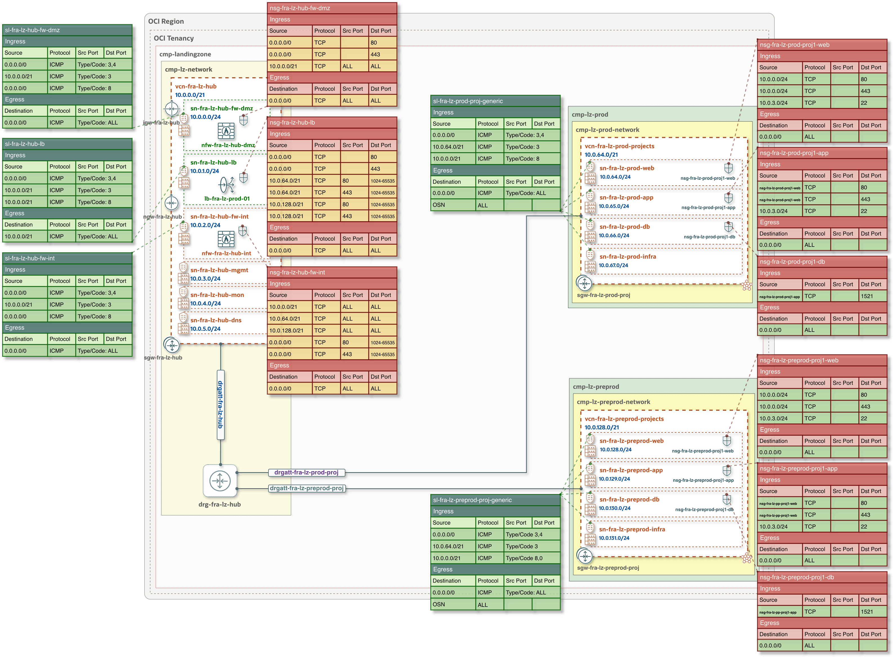
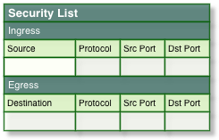
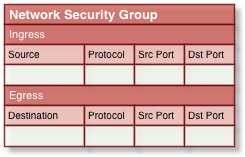
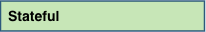
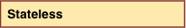

## **[One-OE + Hub A: Security Lists and Network Security Groups](#)**
### Overview
This document describes the Security List (SL) and Network Security Group (NSG) configurations defined in the One-OE Landing Zone JSON templates. The configured SL and NSG rules provide the minimum network access required to support the defined deployment models and their associated network flows, in accordance with the principle of least-privilege.

Within the Hub VCN, the NSGs associated with the OCI Network Firewalls and public Load Balancer are configured with stateless rules. This follows Oracle’s recommendation to use stateless rules for subnets with high traffic volumes, helping to avoid the connection-tracking limitations associated with stateful rules.

For additional information, see: [Stateful compared to Stateless rules](https://docs.oracle.com/en-us/iaas/Content/Network/Concepts/securityrules.htm#stateful)

&nbsp;

### The diagram represents the Security List and NSG configuration for the [One-OE + Hub A deployment](https://github.com/oci-landing-zones/oci-landing-zone-operating-entities/blob/master/blueprints/one-oe/runtime/one-stack/one_oe_hub_a.md)

&nbsp;

&nbsp;

| Legend&nbsp;&nbsp;&nbsp;&nbsp;&nbsp;&nbsp;&nbsp;&nbsp;&nbsp;&nbsp;&nbsp;&nbsp;&nbsp;&nbsp;&nbsp;&nbsp;&nbsp;&nbsp;&nbsp;&nbsp;&nbsp;&nbsp;&nbsp;&nbsp;&nbsp;&nbsp;           | Description and configuration details |
|:-|:-|
|  | **Security List** with Ingress and Egress rules, associated with the respective subnets in the Hub and Spoke VCNs and configured exclusively with stateful rules.  The diagram uses the exact SL naming convention defined in the JSON configuration templates. |
|  | **Network Security Group** with Ingress and Egress rules, associated with the OCI Network Firewalls and public Load Balancer, and configured to be associated with workloads when they are onboarded to the respective Spoke VCN tiers.  The diagram uses the exact NSG naming convention defined in the JSON configuration templates. |
| | **Stateful** security rules.  These can be defined in either a Security List or a Network Security Group. |
|  | **Stateless** security rules.  These can be defined in either a Security List or a Network Security Group. |

&nbsp;

### Important information and considerations for SL and NSG configuration:

- The One-OE Landing Zone follows [OCI Security Rules best practices](https://docs.oracle.com/en-us/iaas/Content/Network/Concepts/securityrules.htm#best-practices) by using Network Security Groups (NSGs) as the primary control for main workload traffic flows, grouping resources with the same security posture and applying rules at the vNIC level.

- In the [One-OE + Hub A deployment](https://github.com/oci-landing-zones/oci-landing-zone-operating-entities/blob/master/blueprints/one-oe/runtime/one-stack/one_oe_hub_a.md), stateless rules are configured only on NSGs associated with the Network Firewalls and Load Balancers within the Hub VCN. All other Security Lists and NSGs are configured with stateful rules.

- If both [stateful and stateless rules](https://docs.oracle.com/en-us/iaas/Content/Network/Concepts/securityrules.htm#stateful) are configured and traffic matches both rule types in the same direction, the stateless rule takes precedence and the connection is not tracked. In this case, a corresponding rule in the opposite direction is required to allow the return traffic.

- For stateless rules, make sure to configure the corresponding rules for return traffic using the required ephemeral port range. 
   Example: Stateless NSG rule associated with the public Load Balancer: 
   `Ingress | Source: 10.0.64.0/21 | Protocol: TCP | Source port: 80 | Destination port: 1024-65535` 
   this allows the return flow for a health check initiated by the Load Balancer and returned by the prod backend servers.

- The JSON templates do not include dedicated NSG configurations for the **mgmt**, **mon**, and **dns** tiers within the Hub VCN; the same applies to the **infra** tier in the Spokes. These NSGs should be defined and applied as needed based on the specific connectivity, security, and workload requirements.

- To avoid overloading the diagram, it does not depict the generic Security List: `sl-fra-lz-hub-mgmt` associated with the **mgmt**, **mon**, and **dns** subnets within the Hub VCN.

- By design, the One-OE Landing Zone intends East-West communication between environments to be centrally controlled by the Network Firewall in the Hub. In addition, the Security List and NSG configuration at the Spoke level does not allow direct inter-environment traffic.

- The Spoke APP and DB tier NSGs define ingress rules that reference the upstream tier NSG as the source, enforcing controlled tier-to-tier communication based on NSG membership rather than IP/CIDR ranges.
 Example: Prod app tier NSG `nsg-fra-lz-prod-proj1-app`, which contains the following rule:
 `Ingress | Source: nsg-fra-lz-prod-proj1-web | Protocol: TCP | Source port: ALL | Destination port: 80` 

&nbsp;

&nbsp;
#### References:
- [Security Rules: Security Lists and NSGs](https://docs.oracle.com/en-us/iaas/Content/Network/Concepts/securityrules.htm)
- [OCI Network Firewall: Important Considerations](https://docs.oracle.com/en-us/iaas/Content/network-firewall/firewall-create.htm)

&nbsp;

# License 

Copyright (c) 2026 Oracle and/or its affiliates.

Licensed under the Universal Permissive License (UPL), Version 1.0.

See [LICENSE](/LICENSE.txt) for more details.