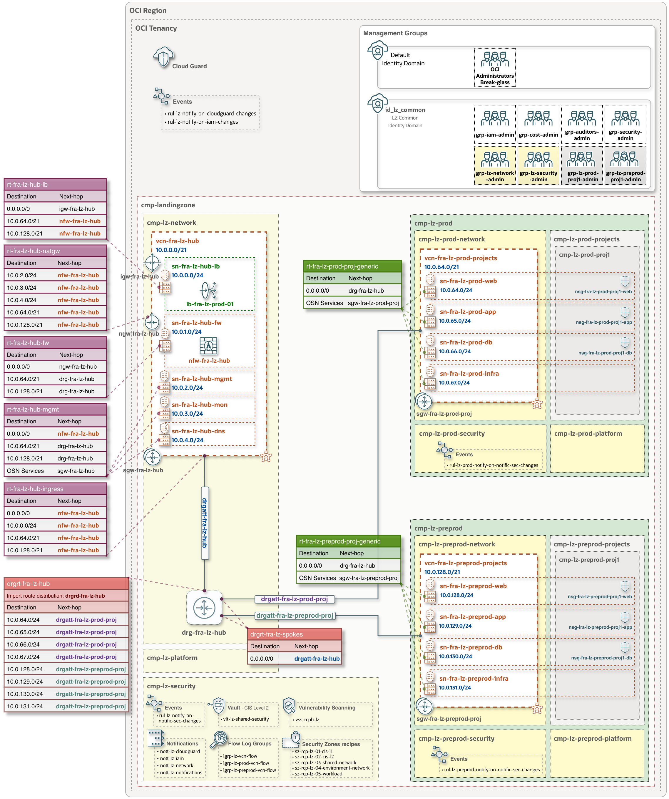

 
 # **One-OE + Hub B: One-Stack Deployment**
 
 ### Overview
 This document provides a detailed overview of the One-OE Landing Zone with [**Hub B addon**](/addons/oci-hub-models/hub_b/readme.md), including its components and deployment guidance.

&nbsp; 

 ### Deployment diagram

The diagram provides a comprehensive visual representation of the key OCI resources - such as Identity Domains, groups, compartments, IP CIDR ranges, and route table configurations - including their exact naming conventions, as defined in the One-OE JSON configurations.

&nbsp; 

> [!NOTE]
> *In the JSON configurations, the default OCI region is set to Frankfurt, and this is reflected in the naming conventions (e.g., vcn-**fra**-lz-hub). For deployments in other regions, the JSON configurations must be updated accordingly to ensure that the resource names align with the target region.*

&nbsp;

Two deployment options are available: One-Stack deployment with **CIS Level 1** and **CIS Level 2** security controls.

- **CIS Level 1** is recommended in scenarios where:
  - CIS Level 1 Security Controls meet your security requirements.
  - You are exploring or testing configurations and need to deploy and tear down environments quickly.
  - You are creating a proof-of-concept (PoC) environment.

- **CIS Level 2** is recommended in scenarios where:
  - Your security requirements mandate CIS Level 2 Security Controls (for example, deploying a Vault to manage your encryption keys and force the encryption of all your data with them, block storage, object storage, etc.).

&nbsp; 

---

 ### Input configurations for **CIS Level 1** 

| JSON configurations | Configuration-defined components | 
|:-|:-|
| **IAM configuration**  [oneoe_iam.json](oneoe_iam.json) | • Compartments  • Identity Domain  • IAM groups and policies |
| **Governance configuration**  [oneoe_governance.json](oneoe_governance.json)| • Tag namespace   • Tag key definition|
| **Network configuration** for   **Step 1**: [oneoe_network_hub_b_pre.json](oneoe_network_hub_b_pre.json)   and  **Step 2**: [oneoe_network_hub_b.json](oneoe_network_hub_b.json) | • [Hub B](/addons/oci-hub-models/hub_b/readme.md) VCN with associated subnets   • OCI Network Firewall and firewall policy   • Internet, NAT and Service Gateways  • Dynamic Routing Gateway (DRG)  • Route Tables with corresponding route rules  • Two Spoke VCNs (Prod and PreProd) with private-only subnets   • Service gateways in the Spoke VCNs  • Security Lists (SLs) and Network Security Groups (NSGs)   • Public Load Balancer with listener and backend sets ([free tier LBaaS](https://docs.oracle.com/en-us/iaas/Content/FreeTier/freetier_topic-Always_Free_Resources.htm#loadbalancing) - for example purposes) |
| **Security configuration** for   **Step 1**: [oneoe_security_cis1_pre.json](oneoe_security_cis1_pre.json)  and  **Step 2**: [oneoe_security_cis1.json](oneoe_security_cis1.json)   | • Cloud Guard  • Security Zones  • Vulnerability Scanning |
| **Observability configuration** for  **Step 1**: [oneoe_observability_cis1_pre.json](oneoe_observability_cis1_pre.json)  and  **Step 2**: [oneoe_observability_cis1.json](oneoe_observability_cis1.json) &nbsp;&nbsp;&nbsp;&nbsp;&nbsp;&nbsp;&nbsp;&nbsp;&nbsp;&nbsp;&nbsp;&nbsp;&nbsp;&nbsp;&nbsp;&nbsp;&nbsp;&nbsp;&nbsp;&nbsp;&nbsp;&nbsp;&nbsp;&nbsp;&nbsp; | • Events  • Alarms  • Logging  • Notifications |

&nbsp;

### Deploy with OCI Resource Manager (ORM) - **CIS Level 1**

#### Step 1: 
  Click &nbsp; [](https://cloud.oracle.com/resourcemanager/stacks/create?zipUrl=https://github.com/oci-landing-zones/terraform-oci-modules-orchestrator/archive/refs/tags/v2.0.5.zip&zipUrlVariables={"input_config_files_urls":"https://raw.githubusercontent.com/oci-landing-zones/oci-landing-zone-operating-entities/master/blueprints/one-oe/runtime/one-stack/oneoe_iam.json,https://raw.githubusercontent.com/oci-landing-zones/oci-landing-zone-operating-entities/master/blueprints/one-oe/runtime/one-stack/oneoe_network_hub_b_pre.json,https://raw.githubusercontent.com/oci-landing-zones/oci-landing-zone-operating-entities/master/blueprints/one-oe/runtime/one-stack/oneoe_observability_cis1_pre.json,https://raw.githubusercontent.com/oci-landing-zones/oci-landing-zone-operating-entities/master/blueprints/one-oe/runtime/one-stack/oneoe_security_cis1_pre.json,https://raw.githubusercontent.com/oci-landing-zones/oci-landing-zone-operating-entities/master/blueprints/one-oe/runtime/one-stack/oneoe_governance.json"}) 

And follow these steps:
  1. Accept terms, wait for the configuration to load.
  2. Set the working directory to “rms-facade”.
  3. Set the stack name you prefer.
  4. Set the terraform version to 1.5.x. Click Next.
  5. Accept the default files. Click Next. Optionally, replace with your json/yaml config files.
  6. Un-check run apply. Click Create.
  
#### Step 2: 
  The following updates, or only those relevant to your deployment - should be performed after the **Step 1** stack and all Landing Zone components have been deployed. This phase involves updating the **Step 1** ORM stack to complete Network routing, add additional Security Zone Recipes, and enable Network Flow Logs. All required updates can be applied in a single operation by replacing the corresponding configuration files as described below.
  

  1. **Network - Routing**: 
     - Use the [oneoe_network_hub_b.json](oneoe_network_hub_b.json) configuration file and update all fields labeled "OCI NFW PRIVATE IP OCID" with the Private IP OCID of the OCI Network Firewall deployed in Step 1.
     - After updating the file, edit the ORM stack and replace the previous [oneoe_network_hub_b_pre.json](oneoe_network_hub_b_pre.json) network configuration with [oneoe_network_hub_b.json](oneoe_network_hub_b.json). This updated JSON file now includes the Private IP (OCID) of the OCI Network Firewall and ensures it is referenced correctly in the associated route tables.
  
  2. **Security - Security Zones, Vulnerability Scanning Service**:  
    Use the configuration [oneoe_security_cis1.json](oneoe_security_cis1.json) to complete the security implementation by adding the following components:
      - Security Zone Targets to apply more restrictive Security Zone Recipes to the following compartments: Hub network compartment, Production network compartment, and Project 1 workload compartment. 
      - Vulnerability Scanning on all Host targets within the Landing Zone enclosing compartment.
    
  3. **Observability - Flow Logs**: 
     - Use the configuration [oneoe_observability_cis1.json](oneoe_observability_cis1.json) to enable flow logs for your VCNs and Subnets.  Note that by default, VCN and Subnet flow logs are not deployed. The first 10 GB of log storage per month is free. This configuration creates a log group for the shared network and for each network environment. Actual log storage usage will depend on the amount of traffic in your VCNs and subnets, which may exceed the free monthly quota.

&nbsp; 

Once all required updates are applied, rerun the ORM stack.

&nbsp;

---

 ### Input configurations for **CIS Level 2** 

| JSON configurations | Configuration-defined components | 
|:-|:-|
| **IAM configuration**  [oneoe_iam.json](oneoe_iam.json) | • Compartments  • Identity Domain  • IAM groups and policies |
| **Governance configuration**  [oneoe_governance.json](oneoe_governance.json)| • Tag namespace   • Tag key definition|
| **Network configuration** for   **Step 1**: [oneoe_network_hub_b_pre.json](oneoe_network_hub_b_pre.json)   and  **Step 2**: [oneoe_network_hub_b.json](oneoe_network_hub_b.json) | • [Hub B](/addons/oci-hub-models/hub_b/readme.md) VCN with associated subnets   • OCI Network Firewall and firewall policy   • Internet, NAT and Service Gateways  • Dynamic Routing Gateway (DRG)  • Route Tables with corresponding route rules  • Two Spoke VCNs (Prod and PreProd) with private-only subnets   • Service gateways in the Spoke VCNs  •  Security Lists (SLs) and Network Security Groups (NSGs)   • Public Load Balancer with listener and backend sets ([free tier LBaaS](https://docs.oracle.com/en-us/iaas/Content/FreeTier/freetier_topic-Always_Free_Resources.htm#loadbalancing) - for example purposes) |
| **Security configuration** for   **Step 1**: [oneoe_security_cis2_pre.json](oneoe_security_cis2_pre.json)  and  **Step 2**: [oneoe_security_cis2.json](oneoe_security_cis2.json)   | • Cloud Guard  • Security Zones  • Vulnerability Scanning  • Vault and Software Key |
| **Observability configuration** for  **Step 1**: [oneoe_observability_cis2_pre.json](oneoe_observability_cis2_pre.json)  and  **Step 2**: [oneoe_observability_cis2.json](oneoe_observability_cis2.json) &nbsp;&nbsp;&nbsp;&nbsp;&nbsp;&nbsp;&nbsp;&nbsp;&nbsp;&nbsp;&nbsp;&nbsp;&nbsp;&nbsp;&nbsp;&nbsp;&nbsp;&nbsp;&nbsp;&nbsp;&nbsp;&nbsp;&nbsp;&nbsp;&nbsp; | • Events  • Alarms  • Logging  • Notifications |

&nbsp;

### Deploy with OCI Resource Manager (ORM) - **CIS Level 2**

#### Step 1: 
  Click &nbsp; [](https://cloud.oracle.com/resourcemanager/stacks/create?zipUrl=https://github.com/oci-landing-zones/terraform-oci-modules-orchestrator/archive/refs/tags/v2.0.5.zip&zipUrlVariables={"input_config_files_urls":"https://raw.githubusercontent.com/oci-landing-zones/oci-landing-zone-operating-entities/master/blueprints/one-oe/runtime/one-stack/oneoe_iam.json,https://raw.githubusercontent.com/oci-landing-zones/oci-landing-zone-operating-entities/master/blueprints/one-oe/runtime/one-stack/oneoe_network_hub_b_pre.json,https://raw.githubusercontent.com/oci-landing-zones/oci-landing-zone-operating-entities/master/blueprints/one-oe/runtime/one-stack/oneoe_observability_cis2_pre.json,https://raw.githubusercontent.com/oci-landing-zones/oci-landing-zone-operating-entities/master/blueprints/one-oe/runtime/one-stack/oneoe_security_cis2_pre.json,https://raw.githubusercontent.com/oci-landing-zones/oci-landing-zone-operating-entities/master/blueprints/one-oe/runtime/one-stack/oneoe_governance.json"}) 

And follow these steps:
  1. Accept terms, wait for the configuration to load.
  2. Set the working directory to “rms-facade”.
  3. Set the stack name you prefer.
  4. Set the terraform version to 1.5.x. Click Next.
  5. Accept the default files. Click Next. Optionally, replace with your json/yaml config files.
  6. Un-check run apply. Click Create.

#### Step 2: 
Follow the same procedure described in [Deploy with OCI Resource Manager (ORM) - CIS Level 1: Step 2](#step-2), using the JSON configuration files specific to CIS Level 2.

---

&nbsp;

# License

Copyright (c) 2026 Oracle and/or its affiliates.

Licensed under the Universal Permissive License (UPL), Version 1.0.

See [LICENSE](/LICENSE.txt) for more details.

 