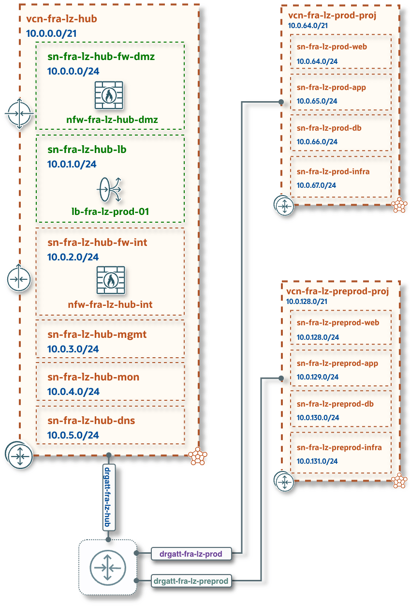
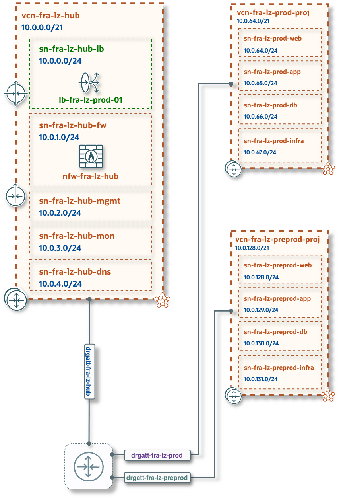
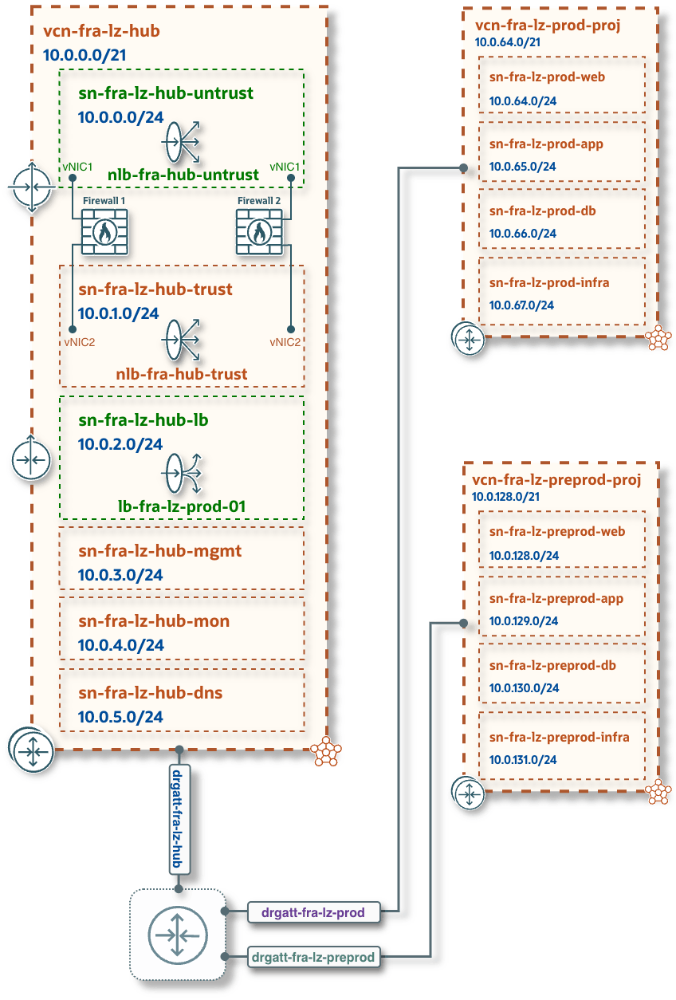
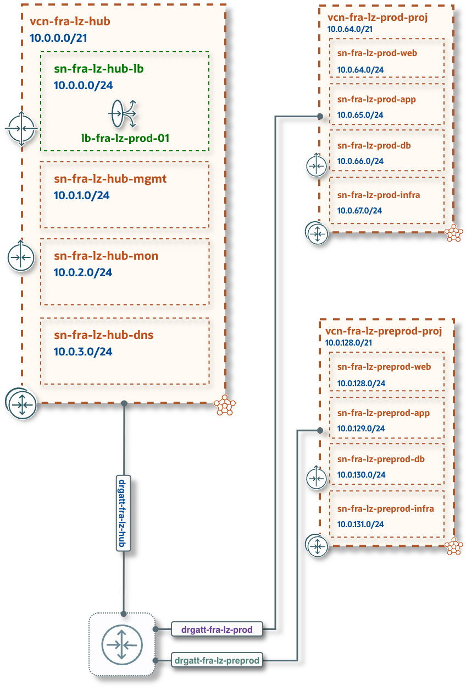

# **OCI Operating Entities Landing Zone**
## **[One-OE Blueprint](#) &ndash; One-Stack Deployment**

&nbsp; 

### Overview
This document provides a set of deployment options for creating a One Operating Entity (One-OE) Landing Zone on Oracle Cloud Infrastructure (OCI).
Each option represents a predefined architecture pattern that combines core identity, networking, security, and monitoring components to support standardized multi-environment deployments.

The deployment menu includes several Hub architectures, each with distinct network and firewall configurations. These options enable you to choose the configuration that aligns with your security requirements, cost constraints, and workload needs.

&nbsp; 

### One-OE Landing Zone Deployment Menu

| [**One-OE + Hub A**](one_oe_hub_a.md) | [**One-OE + Hub B**](one_oe_hub_b.md) | [**One-OE + Hub C**](one_oe_hub_c.md) | [**One-OE + Hub E**](one_oe_hub_e.md) |
|:-|:-|:-|:-|
|  |  |  |  |
| **Main components:**  • Compartments, Identity Domain, IAM groups, policies  • [**Hub A**](/addons/oci-hub-models/hub_a/readme.md) with two OCI Network Firewalls  • Public Load Balancer  • DRG, Route Tables  • Two workload environments with dedicated Spoke VCNs  • Cloud Guard, Security Zones, Vulnerability Scanning  • Events, Alarms, Logging, Notifications&nbsp;&nbsp;&nbsp;&nbsp;&nbsp;&nbsp;&nbsp;&nbsp;&nbsp;&nbsp;       | **Main components:**  • Compartments, Identity Domain, IAM groups, policies  • [**Hub B**](/addons/oci-hub-models/hub_b/readme.md) with one OCI Network Firewall  • Public Load Balancer  • DRG, Route Tables  • Two workload environments with dedicated Spoke VCNs  • Cloud Guard, Security Zones, Vulnerability Scanning  • Events, Alarms, Logging, Notifications&nbsp;&nbsp;&nbsp;&nbsp;&nbsp;&nbsp;&nbsp;&nbsp;&nbsp;&nbsp;       | **Main components:**  • Compartments, Identity Domain, IAM groups, policies  • [**Hub C**](/addons/oci-hub-models/hub_c/readme.md) with two Network Load Balancers  • Public Load Balancer  • DRG, Route Tables  • Two workload environments with dedicated Spoke VCNs  • Cloud Guard, Security Zones, Vulnerability Scanning  • Events, Alarms, Logging, Notifications    *Note: configuration does not include third-party Firewalls*&nbsp;&nbsp;&nbsp;&nbsp;&nbsp;&nbsp;&nbsp;&nbsp;&nbsp;&nbsp;&nbsp;&nbsp;  | **Main components:**  • Compartments, Identity Domain, IAM groups, policies  • [**Hub E**](/addons/oci-hub-models/hub_e/readme.md)  • Public Load Balancer  • DRG, Route Tables  • Two workload environments with dedicated Spoke VCNs  • Cloud Guard, Security Zones, Vulnerability Scanning  • Events, Alarms, Logging, Notifications&nbsp;&nbsp;&nbsp;&nbsp;&nbsp;&nbsp;&nbsp;&nbsp;&nbsp;&nbsp;        |
| **Cost:** includes the [price](https://www.oracle.com/cloud/networking/network-firewall/pricing/) of **two** [OCI Network Firewalls](https://www.oracle.com/cloud/networking/network-firewall/)    | **Cost:** includes the [price](https://www.oracle.com/cloud/networking/network-firewall/pricing/) of **one** [OCI Network Firewall](https://www.oracle.com/cloud/networking/network-firewall/)    | **Cost:** free  *(cost of third-party Firewalls must be accounted for separately)* | **Cost:** free     | 
| [Overview and Deployment](one_oe_hub_a.md)  | [Overview and Deployment](one_oe_hub_b.md) | [Overview and Deployment](one_oe_hub_c.md) | [Overview and Deployment](one_oe_hub_e.md) |

&nbsp; 

&nbsp; 

Review the [known issues](known_issues.md) for any potential problems, and feel free to contact us.

&nbsp; 

# License

Copyright (c) 2026 Oracle and/or its affiliates.

Licensed under the Universal Permissive License (UPL), Version 1.0.

See [LICENSE](/LICENSE.txt) for more details.
