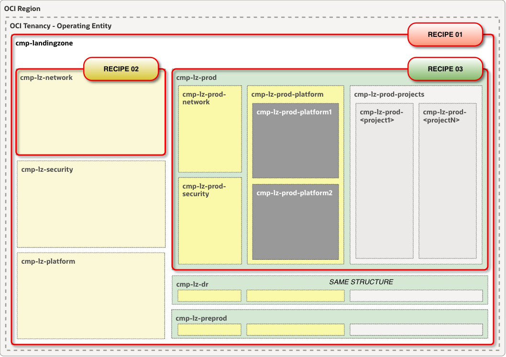

## **[Security Zone Recipes for CIS Level 2](#)**
### Overview
The One-OE Landing Zone implements a subset of the **CIS Level 2** controls through a set of layered Security Zone recipes. Each recipe builds upon the controls defined in the previous recipe and introduces additional security restrictions.

This document provides the list of Security Zone recipes assigned to One-OE Landing Zone compartments based on their security requirements. These assignments help establish a consistent and scalable security posture across the compartment hierarchy.

&nbsp;
#### [Security Zone](https://docs.oracle.com/en-us/iaas/Content/security-zone/using/security-zones.htm) and [Recipe](https://docs.oracle.com/en-us/iaas/Content/security-zone/using/managing-recipes.htm) assignment across the [One-OE](https://github.com/oci-landing-zones/oci-landing-zone-operating-entities/tree/master/blueprints/one-oe) Landing Zone compartment hierarchy

&nbsp;

> [!IMPORTANT]
> - These Security Zone recipes provide a minimum baseline of security controls for **CIS Level 2** environments. Additional Security Zone policies and controls should be implemented to align with organizational security requirements, compliance obligations, and risk tolerance.
>
> - Security Zone policies are enforced based on the recipe assigned to the Security Zone associated with a compartment. When a child compartment is assigned a different Security Zone, only the policies defined in that Security Zone's recipe are enforced for resources within the child compartment.

&nbsp;

### ** - CIS Level 2**

| Category           | DENY policy and description                                                                                                       |
|--------------------|-----------------------------------------------------------------------------------------------------------------------------------|
| Deny public access | **public_buckets** Object Storage buckets in a security zone can't be public.                                                  |
| Deny public access | **db_instance_public_access** Databases in a security zone can't be assigned to public subnets. They must use private subnets. |
| Require encryption | **boot_volume_without_​vault_key** Boot volumes in the security zone must use a customer-managed master encryption key in the Vault service. They can't use the default encryption key managed by Oracle. |
| Require encryption | **block_volume_without_vault_key** Block volumes in a security zone must use a customer-managed master encryption key in the Vault service. They can't use the default encryption key managed by Oracle. |
| Require encryption | **buckets_without_vault_key** Object Storage buckets in a security zone must use a customer-managed master encryption key in the Vault service. They can't use the default encryption key managed by Oracle. |
| Require encryption | **file_system_without_vault_key** File systems in the security zone must use a customer-managed master encryption key in the Vault service. They can't use the default encryption key managed by Oracle. |

&nbsp;

### ****
| Category              | DENY policy and description                                                                                                                    |
|-----------------------|------------------------------------------------------------------------------------------------------------------------------------------------|
| Includes              | **RECIPE 01**                                                                                                                                  |
| Restrict modification | **delete_VCN** You can't delete a VCN in the security zone.                                                                                 |
| Restrict movement     | **subnet_in_security_zone_move_to_compartment_not_in_security_zone** You can't move a subnet in a security zone to a compartment that is not in the same security zone. |
| Restrict modification | **delete_vcn_security_list** You can't delete a VCN security list in the security zone.                                                     |
| Restrict modification | **delete_network_security_group** You can't delete a VCN network security group in the security zone.                                       |
> [!NOTE]
> **RECIPE 02** includes the 6 policies from **RECIPE 01** and adds 4 additional policies. In total, **RECIPE 02** contains 10 policies

&nbsp;

### ****
| Category              | DENY policy and description                                                                                                                                                             |
|-----------------------|-----------------------------------------------------------------------------------------------------------------------------------------------------------------------------------------|
| Includes              | **RECIPE 01**                                                                                                                                                                           |
| Includes              | **RECIPE 02**                                                                                                                                                                           |
| Deny public access    | **internet_gateway** You can't add an internet gateway to a VCN within the security zone.                                                                                            |
| Deny public access    | **public_load_balancer** Load balancers in a security zone can't be public. All load balancers must be private.                                                                      |
| Deny public access    | **public_subnets** Subnets in a security zone can't be public. All subnets must be private.                                                                                          |
| Deny public access    | **cloud_shell_public_network** Cloud Shell hosts in a security zone can't have public network access.                                                                                |
| Restrict movement     | **block_volume_in_security_zone_move_to_compartment_not_in_security_zone** You can't move a block volume in a security zone to a compartment that is not in the same security zone.  |
| Restrict movement     | **boot_volume_in_security_zone_move_to_compartment_not_in_security_zone** You can't move a boot volume in a security zone to a compartment that is not in the same security zone.    |
| Restrict movement     | **bucket_in_security_zone_move_to_compartment_not_in_security_zone** You can't move a bucket in the security zone to a compartment that's not in the same security zone.             |
| Restrict movement     | **attached_boot_volume_not_in_security_zone_move_to_compartment_in_security_zone** You can't move an attached boot volume that's not in a security zone to a compartment in a security zone. |
| Restrict movement     | **attached_block_volume_not_in_security_zone_move_to_compartment_in_security_zone** You can't move a block volume to the security zone if it's attached to a Compute instance that isn't in the same security zone. |
| Restrict movement     | **instance_not_in_security_zone_move_to_compartment_in_security_zone** You can't move an instance to the security zone from a compartment that's not in the same security zone.      |
| Restrict movement     | **instance_in_security_zone_move_to_compartment_not_in_security_zone** You can't move an instance in the security zone to a compartment that's not in the same security zone.        |
| Restrict movement     | **mount_target_in_security_zone_move_to_compartment_not_in_security_zone** You can't move a mount target in the security zone to a compartment that is not in the same security zone.|
| Restrict movement     | **file_system_in_security_zone_move_to_compartment_not_in_security_zone** You can't move a file system in the security zone to a compartment that is not in the same security zone.  |
| Restrict movement     | **db_instance_move_to_compartment_not_in_security_zone** You can't move a database in the security zone to a compartment that's not in the same security zone.                       |
| Restrict association  | **mount_target_not_in_security_zone_create_with_subnet_in_security_zone** You can't create a mount target that uses a subnet in a security zone if the mount target isn't in the same security zone. |
| Restrict association  | **file_system_not_in_security_zone_export_via_mount_target_in_security_zone** You can't export a file system through a mount target in a security zone if the file system isn't in the same security zone. |
| Restrict association  | **instance_not_in_security_zone_launch_from_boot_volume_in_security_zone** You can't launch a Compute instance using a boot volume in the security zone if the instance isn't in the same security zone. |
| Restrict association  | **instance_in_security_zone_launch_from_boot_volume_not_in_security_zone** You can't launch a Compute instance in the security zone if its boot volume isn't in the same security zone. |
| Restrict association  | **boot_volume_not_in_security_zone_attach_to_instance_in_security_zone** You can't attach a boot volume to a Compute instance in the security zone if the volume isn't in the same security zone. |
| Restrict association  | **boot_volume_in_security_zone_attach_to_instance_not_in_security_zone** You can't attach a boot volume in the security zone to a Compute instance that isn't in the same security zone. |
| Restrict association  | **block_volume_in_security_zone_attach_to_instance_not_in_security_zone** You can't attach a block storage volume in the security zone to a Compute instance that isn't in the same security zone. |
| Restrict association  | **block_volume_not_in_security_zone_attach_to_instance_in_security_zone** You can't attach a block storage volume to a Compute instance in the security zone if the volume isn't in the same security zone. |
> [!NOTE]
> **RECIPE 03** includes all policies from  **RECIPE 01** and **RECIPE 02** and adds 22 additional policies. In total, **RECIPE 03** contains 32 policies.

&nbsp;
&nbsp;

#### Reference:
- [Oracle Cloud Infrastructure Documentation - Security Zone Policies](https://docs.oracle.com/en-us/iaas/Content/security-zone/using/security-zone-policies.htm)

&nbsp;

# License 

Copyright (c) 2026 Oracle and/or its affiliates.

Licensed under the Universal Permissive License (UPL), Version 1.0.

See [LICENSE](/LICENSE.txt) for more details.
