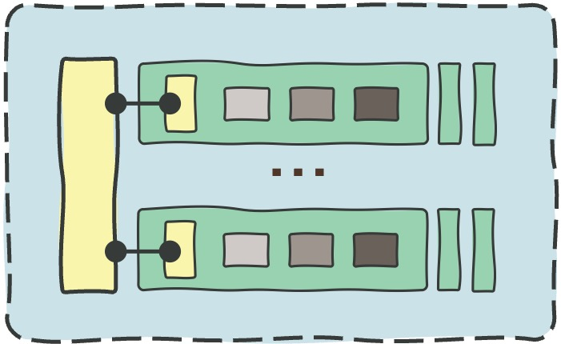
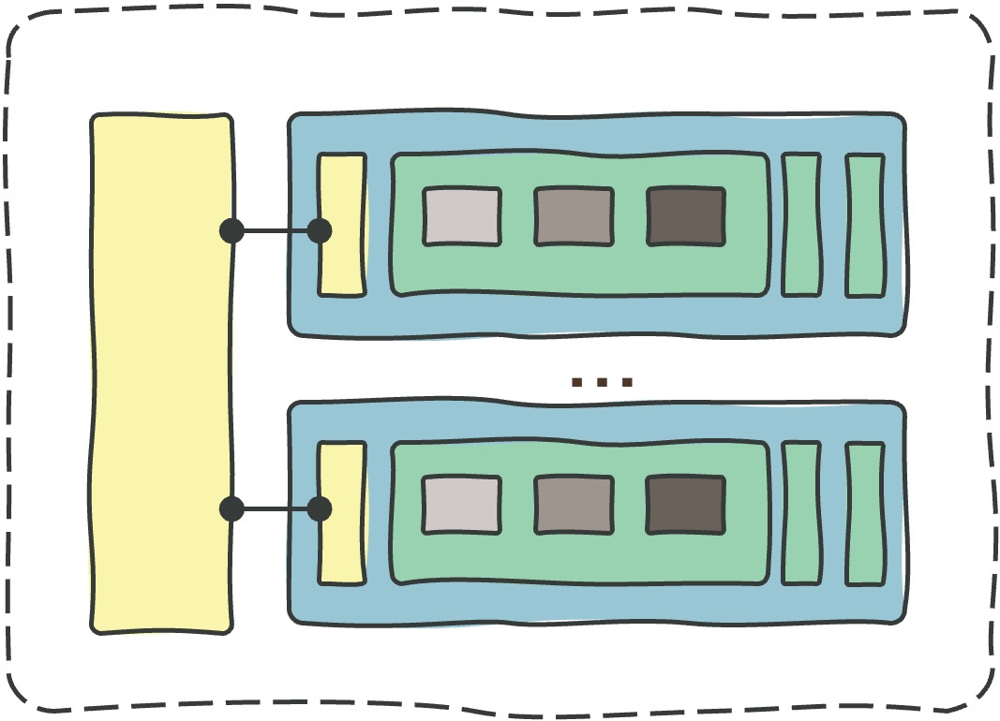
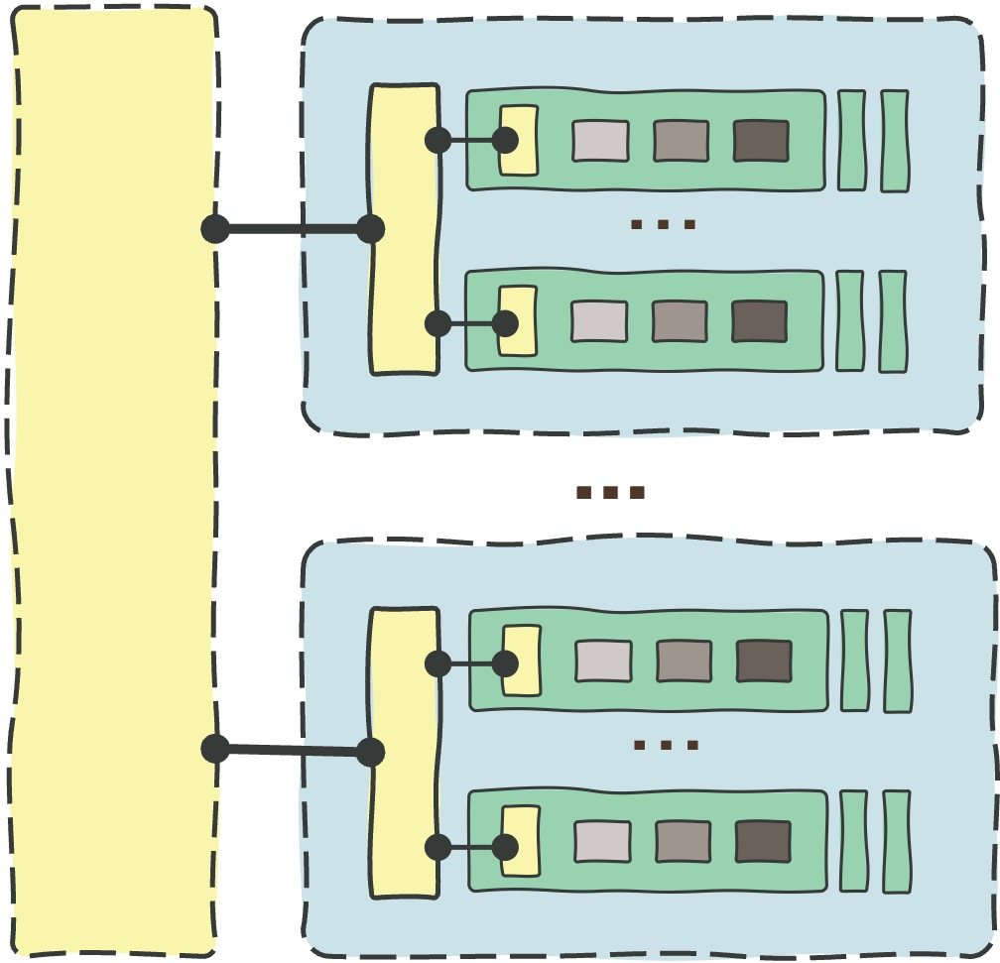

# **The OCI Open LZ &ndash; [Blueprints](#)**

&nbsp; 

Welcome to the **OCI Open LZ Blueprints**, a set of complete and runnable OCI landing zones that will help you onboard and run OCI. 

There are three blueprints available, choose the most suitable according to your objectives, review the design, and run the model. 

&nbsp; 

| Blueprint | Diagram | Size | Objective   | Organizational Scope | 
|:--:|---|:-:|---|---|
| [**One-OE**](/blueprints/one-oe/readme.md) | | **M** | A new model to onboard **[one](/blueprints/one-oe/readme.md) Operating Entity** with its environments, platforms, and projects in **one tenancy**.   | One OU, LoB, OpCo, or Department. 
| [**Multi-OE**](/blueprints/multi-oe/readme.md) | | **L** | Onboards **[multiple](/blueprints/multi-oe/readme.md) Operating Entities** with a shared services model, with OE-dedicated environments, platforms, and projects, sharing **one tenancy.** | Several OUs, LoBs, OpCos, or Departments. 
| [**Multi-Tenancy**](/blueprints/multi-tenancy/readme.md) | | **XL-XXL** | Uses the **One-OE** and **Multi-OE** to onboard all your organizations or customers into **several tenancies**, while **providing your** centralized services, shared services, managed services, cloud services, PaaS, or SaaS.  This blueprint is ideal for OCI DRCC and Alloy.| All Your Organizations, OUs, Partners, or Customers.

&nbsp; 

Note these blueprints can be used directly as OCI [**Standard Landing Zones**](https://github.com/oracle-devrel/technology-engineering/blob/main/landing-zones/standard_landing_zones/readme.md) or as a guide or starting point for a [**Tailored Design**](https://github.com/oracle-devrel/technology-engineering/blob/main/landing-zones/tailored_landing_zones/readme.md). You can also complement your Landing Zone with [**Addons**](/addons/readme.md) such as [Network Hub models](/addons/oci-hub-models/readme.md), or extend it with pluggable [**Workload Extensions**](/workload-extensions/readme.md) to reduce your time-to-production with OCI best practices. 

&nbsp; 

&nbsp; 

# License

Copyright (c) 2024 Oracle and/or its affiliates.

Licensed under the Universal Permissive License (UPL), Version 1.0.

See [LICENSE](/LICENSE.txt) for more details.
