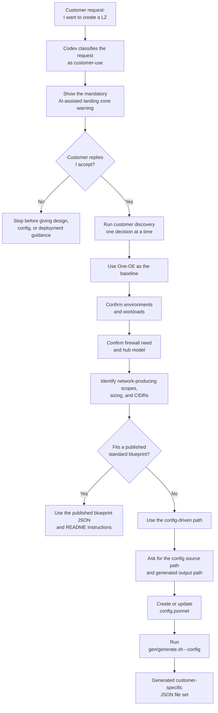

# Config-Driven Landing Zone Generation <!-- omit from toc -->

## **Table of Contents** <!-- omit from toc -->

- [**1. Overview**](#1-overview)
- [**2. When to use config-driven generation**](#2-when-to-use-config-driven-generation)
- [**3. AI-assisted authoring**](#3-ai-assisted-authoring)
- [**4. Source and generated files**](#4-source-and-generated-files)
- [**5. Generation workflow**](#5-generation-workflow)

&nbsp;

## **1. Overview**

Config-driven generation creates a customized Landing Zone file set from a single Jsonnet configuration file.

Use this approach when the published blueprint JSON files do not fully represent the required landing zone shape, such as custom environments, custom CIDR ranges, additional projects, platforms, or workload extensions.

The generator source of truth is under [`gen/`](/gen/). The generated JSON files are deployment inputs for the [OCI Landing Zone Orchestrator](https://github.com/oci-landing-zones/terraform-oci-modules-orchestrator).

&nbsp;

## **2. When to use config-driven generation**

Use config-driven generation for customized deployments, especially when the landing zone needs:

- custom environment names or a non-standard number of environments
- custom hub, spoke, platform, or extension CIDR ranges
- additional projects or shared project networks
- workload extensions across one or more environments
- multiple workload extensions in the same landing zone
- a generated customer-specific file set instead of the published JSON snapshots

For standard deployments that match an existing published blueprint, use the published runtime JSON files and their README instructions instead.

&nbsp;

## **3. AI-assisted authoring**

AI-assisted authoring can be used to draft and iterate on config-driven landing zone inputs.

Prerequisites:

1. Install a Jsonnet renderer:

   - `jsonnet` is required and must be available on `PATH`.
   - `jrsonnet` is optional and can be installed as a faster local renderer for developer generation loops.

2. Open the repository with the Codex surface you use:

   - With Codex CLI, clone the repository, change into the repository root, and start Codex from there:

     ```bash
     git clone https://github.com/oci-landing-zones/oci-landing-zone-operating-entities
     cd oci-landing-zone-operating-entities
     codex
     ```

   - With the Codex app, open the Codex app first, then clone the repository from the app or open the directory where the repository is already cloned.

   In both cases, make sure the active Codex workspace is the repository root: `oci-landing-zone-operating-entities`.

A local clone is enough for the AI assistant to inspect the generator source, schema behavior, examples, workload-extension contracts, and repository documentation before proposing a config file. OCI credentials are not required for authoring or generation; they are only needed later for Terraform validation or deployment against a tenancy.

`jsonnet` is required because the repository stores reusable landing zone logic as Jsonnet source files under `gen/`. The generator evaluates those sources, applies the customer config, and emits the JSON files consumed by the OCI Landing Zone Orchestrator. Without a Jsonnet renderer, the config can be authored but cannot be generated into deployable JSON.

For local authoring, `jrsonnet` can be used as an optional faster renderer and can be up to 10x faster than canonical `jsonnet` for Jsonnet-to-JSON generation, depending on the configuration size and workstation. The repository generation script automatically prefers `jrsonnet` for local runs when it is available, while CI/CD and compatibility-sensitive runs should use the canonical `jsonnet` renderer. If a local run fails with renderer-specific standard-library behavior, rerun with `JSONNET_BIN=jsonnet`.

AI-assisted results can vary depending on the model and reasoning effort selected in Codex, such as low, medium, high, or xhigh. Use stronger reasoning settings for complex landing zone design, workload-extension placement, CIDR planning, and security-sensitive decisions.

The AI-assisted flow starts with customer discovery. Codex should not jump directly from a request such as "I want to create a LZ" to a config file.



AI-generated configurations must be reviewed before use. Check the generated files for correctness, security, CIDR planning, IAM scope, workload-extension behavior, and regulatory or internal compliance before running any deployment.

&nbsp;

## **4. Source and generated files**

Keep the source config file and generated output directory explicit and separate.

| Item | Purpose | Example |
|---|---|---|
| Source config | Customer-reviewed Jsonnet input that describes the desired landing zone shape. | `config.jsonnet` |
| Generated output | JSON file set emitted by the generator and passed to the orchestrator. | `generated/` |

Do not hand-edit generated JSON files. If a generated file needs to change, update the source config or generator source, then regenerate the output.

&nbsp;

## **5. Generation workflow**

Run the generator from the repository root:

```bash
bash gen/generate.sh --config <config_file> <output_dir>
```

This command requires a Jsonnet renderer on `PATH`. Use canonical `jsonnet` for compatibility-sensitive runs and CI/CD.

Example:

```bash
bash gen/generate.sh --config /path/to/config.jsonnet /path/to/generated
```

The config-mode output commonly includes files such as:

- `network.json`
- `iam.json`
- `governance.json`
- `security_cis1.json`
- `security_cis2.json`
- `observability_cis1.json`
- `observability_cis2.json`

Some hub models that require staged network deployment also emit `network_pre.json`.

&nbsp;
&nbsp;

# License <!-- omit from toc -->

Copyright (c) 2026 Oracle and/or its affiliates.

Licensed under the Universal Permissive License (UPL), Version 1.0.

See [LICENSE](/LICENSE.txt) for more details.
