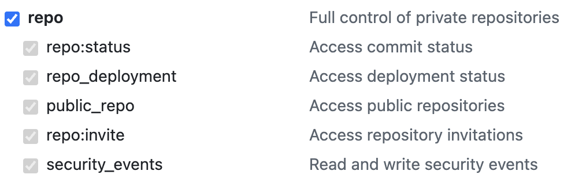
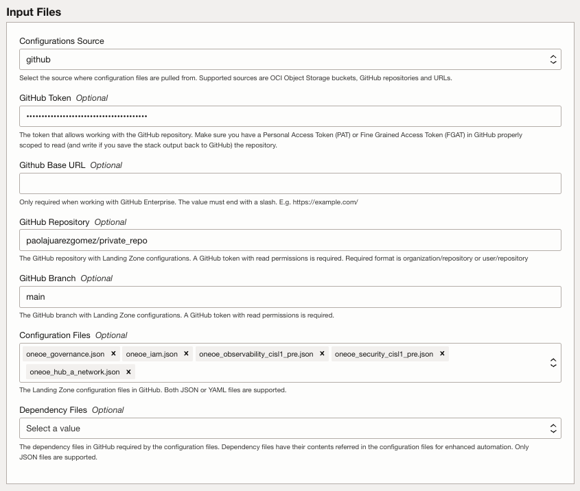

# ORM Best Practices for Operating Entities Landing Zone Deployments

## Overview

[Oracle Resource Manager](https://docs.oracle.com/en-us/iaas/Content/ResourceManager/Concepts/resourcemanager.htm) automates infrastructure deployment using Terraform with managed state handling, promotes consistency across environments through reusable version-controlled configurations, and is a free OCI service integrated with security and governance capabilities.

This document provides general best practices for using Oracle Resource Manager (ORM) with OCI Operating Entities Landing Zones across different scenarios. You can deploy a standalone [One-OE](https://github.com/oci-landing-zones/oci-landing-zone-operating-entities/tree/master/blueprints/one-oe) foundation prepared to onboard production and preproduction projects, or you can extend One-OE with workload extensions (WEs) such as EXACS, OCVS, or OKE. You can also include additional features and configurations through [add-ons](https://github.com/oci-landing-zones/oci-landing-zone-operating-entities/tree/master/addons).

As a best practice, manage each asset with a dedicated ORM stack to avoid monolithic systems.

Why:
  - Smaller stacks reduce blast radius.
  - Changes are easier to review, approve, and roll back.
  - Teams can own independent stacks.

## Key ORM Benefits

These are the main advantages of using ORM in OCI, especially for secure, consistent, and scalable Terraform operations across teams and environments.

  1. **Managed Terraform state in OCI**: Resource Manager stores and manages the stack state centrally in OCI, reducing local-state risks and improving team consistency.
  2. **Team-safe concurrency**: Resource Manager locks stack state so only one job runs per stack at a time.
  3. **Built-in drift detection**: compares real resources vs last applied stack configuration.
  4. **Centralized operations visibility**: plan/apply/destroy job history and logs are kept per stack.
  5. **API/CLI/SDK automation**: easy integration into CI/CD pipelines and platform workflows.
  6. **Native governance integration**: IAM policies control who can manage stacks/jobs.
  7. **Reusability at scale**: templates/private templates and stack creation from existing resources.

## Orchestrator Dependencies and Output

If you are running a Workload Extension (WE) with a multi-stack approach and you want to avoid maintaining dependency documents manually, you should enable the output feature in the first stack and use the orchestrator `output/dependencies` flow between stacks.

In this model, the first stack deploys One-OE with output enabled so that the orchestrator generates the key/OCID dependency files required by the second stack, such as `compartments_output.json`, `network_output.json`, or `tags_output.json`.

This is the recommended approach when you want to use cross-stack dependencies based on generated outputs instead of manually editing or maintaining dependency files.

In the second stack, include the generated dependency files in the **Dependencies Source for URL-based Configuration** field.

> Note: Official orchestrator reference for external dependencies and generated outputs: https://github.com/oci-landing-zones/terraform-oci-modules-orchestrator#external-dependencies

## Standard ORM Execution Flow for One-OE
1. Open stack creation from the one-click button .
2. Accept terms and wait until configuration is fully loaded.
3. Set stack metadata:
   - stack name,
   - Terraform version,
   - facade working directory.
4. Configure input files from a controlled source (URL, OCI bucket or private GitHub).
   
The Orchestrator provides an ORM Facade module allowing these three options:

| Configurations Source | Configuration Files Formats | Dependencies Sources | Dependency Files Formats | Requirements |
|----------------------|----------------------------|---------------------|-------------------------|--------------|
| Private GitHub repository | JSON, YAML | Same private GitHub repository | JSON | GitHub token with read/(write, if saving output) access permissions on the private GitHub repository. |
| Private OCI bucket | JSON, YAML | Same private OCI bucket | JSON | OCI IAM permissions to read/(write, if saving output) to the private OCI bucket. |
| Plain Public URLs | JSON, YAML | Private GitHub repository, private OCI bucket | JSON | URLs are reachable. Read/(write, if saving output) access permissions to private GitHub repository or private OCI bucket |

 By default, when you click the Deploy to Oracle Cloud button, ORM creates a new stack that includes the orchestrator code and links to the required JSON
  configuration files. These default JSON files point to the public Operating Entities GitHub repository.

  It is strongly recommended to maintain your own copy of these files. Two main options are available:

  **A. Store the files in an OCI Object Storage bucket**: suitable for PoCs, demos, and quick testing cycles. 
    
  **B. Store the files in a private GitHub repository**: recommended for teams that require version control, peer review, and controlled change management.

  The first option is faster for short-lived environments and POCs. For regular customization and ongoing operations, the second option is preferable because it provides better traceability, collaboration, and governance.

  The required steps for the second option are:

|    |
|-------------------|
| - **Create a private GitHub repository.** |
| - **Populate your repository** with the required JSON files from the Operating Entities repository and make any necessary customizations. |
| - **Generate a GitHub Personal Access Token:** Go to your GitHub account: Settings > Developer Settings > Personal Access Tokens > Tokens (Classic) > Generate New Token.    Select at minimum the **repo** scope to grant full control of private repositories. |
| - **Update the ORM stack configuration:**  • Edit your ORM stack and navigate to **Input Files** section • Under Configuration Source, select **GitHub** • Paste your GitHub token in the authentication field • Remove the pre-existing configuration file URLs and replace them with your private repository file paths      If you are using a private GitHub repository, leave the GitHub Base URL field empty, if you are using an organization account, set it to **api.github.com** and if you are using an enterprise account, use your company’s GitHub URL (e.g., company.github.com) |

5. Enable the output option if you are planning to run a Workload Extension (WE).
6. Disable automatic apply during stack creation.
7. Create stack and run `Plan`.
8. Review expected changes, then run `Apply` only if plan is validated.

## Workload Extension (WE) Multi-stack option

### Operation 1: Deploy Base One-OE
1. Deploy the base One-OE stack enabling output generation, or if you already have a One-oe stack, enable output and re-run the apply job.
2. Capture and store generated dependency artifacts.

### Operation 2: Deploy Workload Extension (WE)
1. Deploy the WE using a second dedicated stack.
2. Load WE-specific configuration files.
3. Attach dependency files generated in Operation 1.
4. Run `Plan`, validate impact, then run `Apply`.

This two-operation approach reduces coupling, clarifies ownership, and simplifies troubleshooting. Use a standardized **two-operation model** (`One-OE` first, `WE` second) with explicit dependencies and output artifacts. This is the safest default for scalable and repeatable ORM operations.

&nbsp; 

# License

Copyright (c) 2025 Oracle and/or its affiliates.

Licensed under the Universal Permissive License (UPL), Version 1.0.

See [LICENSE](/LICENSE.txt) for more details.
