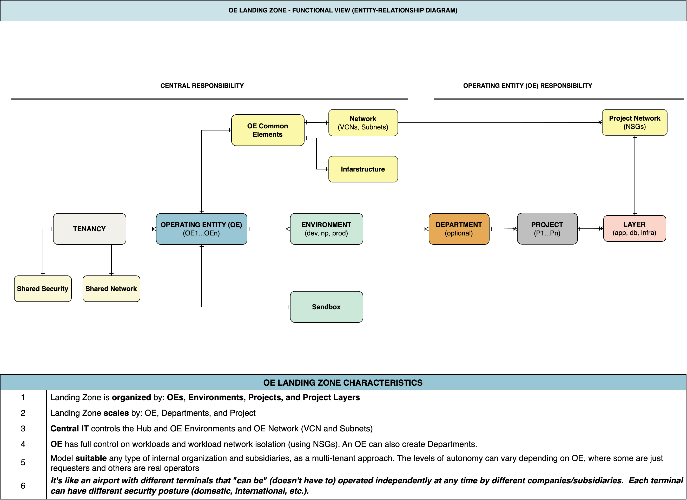
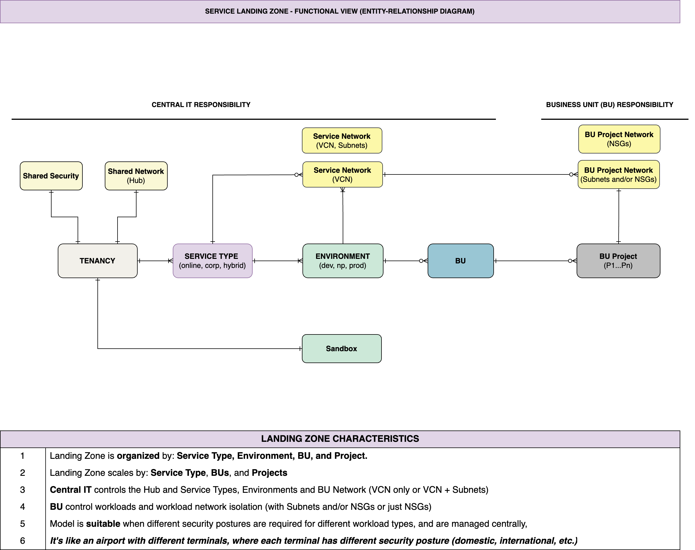
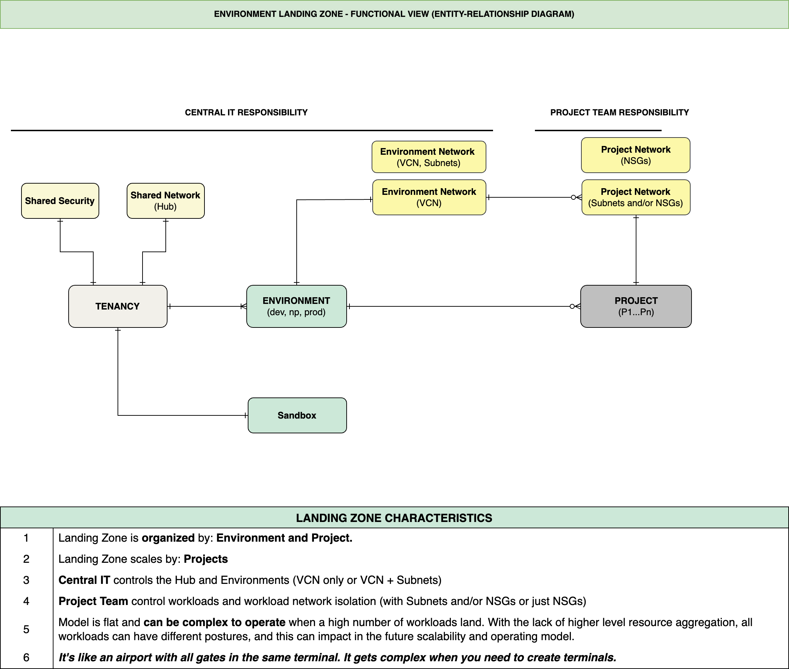
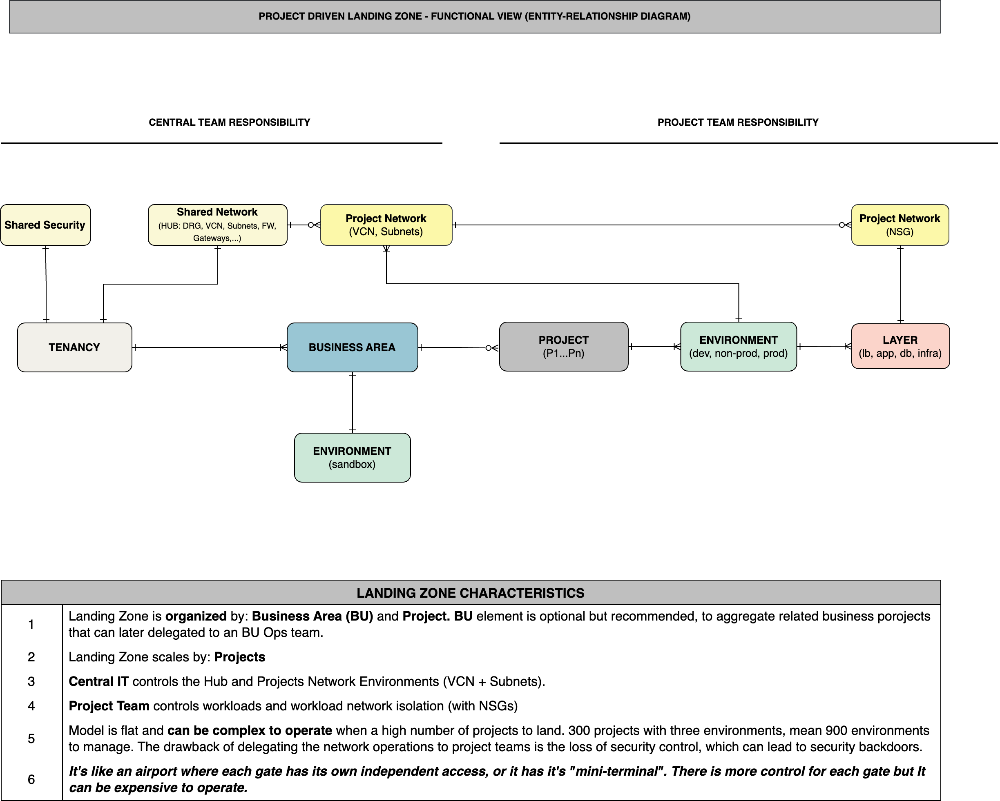

# OCI Landing Zone Models

## Overview

Welcome to the OCI Landing Zone Models.

The objective of this asset is to present the most-common landing zone models used with our costumers, as examples of landing zones tailored from the OCI Open LZ blueprint.

There are four landing zone models:
- Model 1 - The OE/BU Landing Zone
- Model 2 - The Service Landing Zone
- Model 3 - The Environment Landing Zone
- Model 4 - The Project Landing Zone

Note that others models exist, different or derivated from these ones. The objective is not to be exaustive, but to present different possible flavours.

Find available the [drawio file](/design/models/OCI_OpenLZ_Models.drawio) for further design activities on top of them.

&nbsp; 

## Model 1 - The OE/BU Landing Zone
&nbsp; 

&nbsp; 

## Model 2 - The Service Landing Zone
&nbsp; 

&nbsp; 

## Model 3 - The Environment Landing Zone
&nbsp; 

&nbsp; 

## Model 4 - The Project Landing Zone
&nbsp; 

&nbsp; 

&nbsp; 

# License

Copyright (c) 2023 Oracle and/or its affiliates.

Licensed under the Universal Permissive License (UPL), Version 1.0.

See [LICENSE](LICENSE) for more details.
