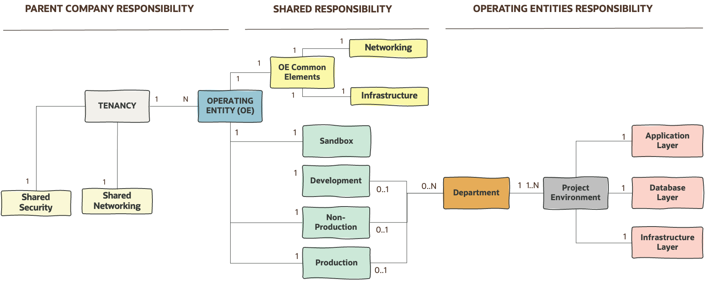
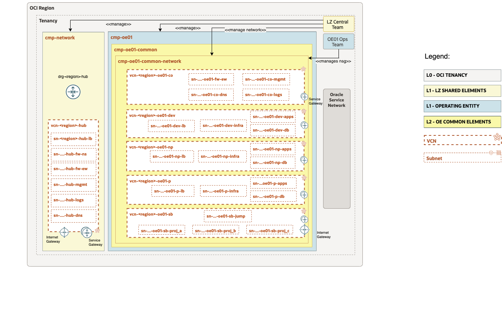

## Open LZ OE-02 Arhitecture Provisioning

### Arhitecture diagrams


Functional Diagram



Security Diagram


Network Diagram



### How to run the automation

- Change the directory to the ```terraform-oci-open-lz``` terraform module

- terraform init

```
terraform init
```

- terraform plan

```
terraform plan \
-var-file <YOUR_PATH>/oci-credentials.tfvars.json \
-var-file <YOUR_PATH>/open_lz_shared_security.auto.tfvars.json \
-var-file <YOUR_PATH>/open_lz_shared_network.auto.tfvars.json \
-state <YOUR_PATH>/terraform.tfstate \
/
```


- terraform apply

```
terraform apply \
-var-file <YOUR_PATH>/oci-credentials.tfvars.json \
-var-file <YOUR_PATH>/open_lz_shared_security.auto.tfvars.json \
-var-file <YOUR_PATH>/open_lz_shared_network.auto.tfvars.json \
-state <YOUR_PATH>/terraform.tfstate \
/
```


### Automation Output:

```


```