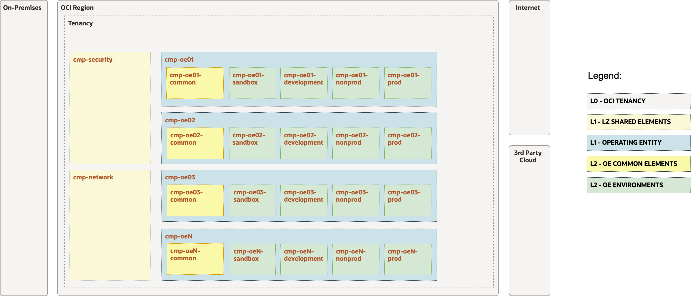

## Open LZ Shared Arhitecture Provisioning

### Arhitecture diagrams


Functional Diagram


Security Diagram



Network Diagram


### How to run the automation

- Change the directory to the ```terraform-oci-lzf-core``` terraform module

- terraform init

```
terraform init
```

- terraform plan

```
terraform plan \
-var-file <YOUR_PATH>/oci-credentials.tfvars.json \
-var-file <YOUR_PATH>/open_lz_shared_security.auto.tfvars.json \
-var-file <YOUR_PATH>/open_lz_shared_network.auto.tfvars.json \
-state <YOUR_PATH>/terraform.tfstate \
/
```


```
terraform129 plan \
-var-file /Users/COTUDOR/Work/VSCODE-Workspace/FY24/terraform-oci-lzf-templates/patterns/OELZ/templates/lz_ops_central_templates/OPEN-LZ-SHARED-VISION/oci-credentials.tfvars.json \
-var-file /Users/COTUDOR/Work/VSCODE-Workspace/FY24/terraform-oci-lzf-templates/patterns/OELZ/templates/lz_ops_central_templates/OPEN-LZ-SHARED-VISION/open_lz_shared_security.auto.tfvars.json \
-var-file /Users/COTUDOR/Work/VSCODE-Workspace/FY24/terraform-oci-lzf-templates/patterns/OELZ/templates/lz_ops_central_templates/OPEN-LZ-SHARED-VISION/open_lz_shared_network.auto.tfvars.json \
-state /Users/COTUDOR/Work/VSCODE-Workspace/FY24/terraform-oci-lzf-templates/patterns/OELZ/templates/lz_ops_central_templates/OPEN-LZ-SHARED-VISION/terraform.tfstate \
```

- terraform apply

```
terraform apply \
-var-file <YOUR_PATH>/oci-credentials.tfvars.json \
-var-file <YOUR_PATH>/open_lz_shared_security.auto.tfvars.json \
-var-file <YOUR_PATH>/open_lz_shared_network.auto.tfvars.json \
-state <YOUR_PATH>/terraform.tfstate \
/
```

```
terraform129 apply \
-var-file /Users/COTUDOR/Work/VSCODE-Workspace/FY24/terraform-oci-lzf-templates/patterns/OELZ/templates/lz_ops_central_templates/OPEN-LZ-SHARED-VISION/oci-credentials.tfvars.json \
-var-file /Users/COTUDOR/Work/VSCODE-Workspace/FY24/terraform-oci-lzf-templates/patterns/OELZ/templates/lz_ops_central_templates/OPEN-LZ-SHARED-VISION/open_lz_shared_security.auto.tfvars.json \
-var-file /Users/COTUDOR/Work/VSCODE-Workspace/FY24/terraform-oci-lzf-templates/patterns/OELZ/templates/lz_ops_central_templates/OPEN-LZ-SHARED-VISION/open_lz_shared_network.auto.tfvars.json \
-state /Users/COTUDOR/Work/VSCODE-Workspace/FY24/terraform-oci-lzf-templates/patterns/OELZ/templates/lz_ops_central_templates/OPEN-LZ-SHARED-VISION/terraform.tfstate \
/
```


### Automation Output:


```
Apply complete! Resources: 32 added, 0 changed, 0 destroyed.

Outputs:

compartments = {
  "CMP-NETWORK-KEY" = {
    "compartment_id" = "ocid1.tenancy.oc1..."
    "defined_tags" = tomap({
      "CCA_Basic_Tag.email" = "oracleidentitycloudservice/firstname.lastname@email.comm"
    })
    "description" = "Vision Shared Network Compartment"
    "enable_delete" = true
    "freeform_tags" = tomap({
      "openlz" = "openlz-shared"
      "openlz-cmp" = "network"
      "openlz-customer" = "vision"
    })
    "id" = "ocid1.compartment.oc1..."
    "inactive_state" = tostring(null)
    "is_accessible" = true
    "name" = "cmp-network"
    "state" = "ACTIVE"
    "time_created" = "2023-06-09 14:55:05.947 +0000 UTC"
    "timeouts" = null /* object */
  }
  "CMP-SECURITY-KEY" = {
    "compartment_id" = "ocid1.tenancy.oc1..."
    "defined_tags" = tomap({
      "CCA_Basic_Tag.email" = "oracleidentitycloudservice/firstname.lastname@email.comm"
    })
    "description" = "Vision Shared Security Compartment"
    "enable_delete" = true
    "freeform_tags" = tomap({
      "openlz" = "openlz-shared"
      "openlz-cmp" = "security"
      "openlz-customer" = "vision"
    })
    "id" = "ocid1.compartment.oc1..aaaaaaaate5vpahpsmxpf76z6zntzr2pqp52tggck7hcwujnbp2b4xw7x3xq"
    "inactive_state" = tostring(null)
    "is_accessible" = true
    "name" = "cmp-security"
    "state" = "ACTIVE"
    "time_created" = "2023-06-09 12:04:29.138 +0000 UTC"
    "timeouts" = null /* object */
  }
}
groups = {}
memberships = {}
provisioned_networking_resources = {
  "dhcp_options" = {
    "VCN-FRANKFURT-HUB-DHCP-OPTION-01-KEY" = {
      "compartment_id" = "ocid1.compartment.oc1..."
      "defined_tags" = tomap({
        "CCA_Basic_Tag.email" = "oracleidentitycloudservice/firstname.lastname@email.comm"
      })
      "dhcp_options_key" = "VCN-FRANKFURT-HUB-DHCP-OPTION-01-KEY"
      "display_name" = "vcn_frankfurt_hub_dhcp_option_01"
      "domain_name_type" = "CUSTOM_DOMAIN"
      "freeform_tags" = tomap({})
      "id" = "ocid1.dhcpoptions.oc1.eu-frankfurt-1.aaaaaaaau5dj7pwps7j64wkrxkfpdxvljw2ri5acg644yeyzd7vsugbv3oya"
      "network_configuration_category" = "shared"
      "options" = toset([
        {
          "custom_dns_servers" = tolist([
            "192.168.0.3",
            "192.168.0.4",
          ])
          "search_domain_names" = tolist([])
          "server_type" = "CustomDnsServer"
          "type" = "DomainNameServer"
        },
        {
          "custom_dns_servers" = tolist([])
          "search_domain_names" = tolist([
            "test.com",
          ])
          "server_type" = ""
          "type" = "SearchDomain"
        },
      ])
      "state" = "AVAILABLE"
      "time_created" = "2023-06-09 14:55:14.485 +0000 UTC"
      "timeouts" = null /* object */
      "vcn_id" = "ocid1.vcn.oc1.eu-frankfurt-1.amaaaaaattkvkkiaiux3xwliowsohwdh7ut7aov6esabybdscfnhwaxu7d7a"
      "vcn_key" = "VCN-FRANKFURT-HUB-KEY"
      "vcn_name" = "vcn_frankfurt_hub"
    }
    "VCN-FRANKFURT-HUB-DHCP-OPTION-02-KEY" = {
      "compartment_id" = "ocid1.compartment.oc1..."
      "defined_tags" = tomap({
        "CCA_Basic_Tag.email" = "oracleidentitycloudservice/firstname.lastname@email.comm"
      })
      "dhcp_options_key" = "VCN-FRANKFURT-HUB-DHCP-OPTION-02-KEY"
      "display_name" = "vcn_frankfurt_hub_dhcp_option_02"
      "domain_name_type" = "CUSTOM_DOMAIN"
      "freeform_tags" = tomap({})
      "id" = "ocid1.dhcpoptions.oc1.eu-frankfurt-1.aaaaaaaal7bldaoyq272g2gdr225bjawmyfc5xivlpmpy7c3ezmlit6pcrfa"
      "network_configuration_category" = "shared"
      "options" = toset([
        {
          "custom_dns_servers" = tolist([
            "10.0.0.3",
            "10.0.0.4",
          ])
          "search_domain_names" = tolist([])
          "server_type" = "CustomDnsServer"
          "type" = "DomainNameServer"
        },
        {
          "custom_dns_servers" = tolist([])
          "search_domain_names" = tolist([
            "test.com",
          ])
          "server_type" = ""
          "type" = "SearchDomain"
        },
      ])
      "state" = "AVAILABLE"
      "time_created" = "2023-06-09 14:55:14.517 +0000 UTC"
      "timeouts" = null /* object */
      "vcn_id" = "ocid1.vcn.oc1.eu-frankfurt-1.amaaaaaattkvkkiaiux3xwliowsohwdh7ut7aov6esabybdscfnhwaxu7d7a"
      "vcn_key" = "VCN-FRANKFURT-HUB-KEY"
      "vcn_name" = "vcn_frankfurt_hub"
    }
  }
  "drg_attachments" = {
    "DRG-FRANKFURT-HUB-VCN-FRANKFURT-HUB-KEY" = {
      "compartment_id" = "ocid1.compartment.oc1..."
      "defined_tags" = tomap({})
      "display_name" = "drg_frankfurt_hub_vcn_frankfurt_hub"
      "drg_id" = "ocid1.drg.oc1.eu-frankfurt-1.aaaaaaaavs7pujyzovq4t57monidxnebsml3svysfeq3kfylmrqctccqz7xq"
      "drg_name" = "drg-frankfurt-hub"
      "drg_route_table_id" = "ocid1.drgroutetable.oc1.eu-frankfurt-1.aaaaaaaa6pg6hqf7oyzhnooio7i7drt4qo3xyyuw7vccecqo4h6smdeyiapq"
      "drg_route_table_key" = "CANNOT BE DETERMINED - ROUTE TABLE CREATED OUTSIDE THIS AUTOMATION"
      "drg_route_table_name" = "CANNOT BE DETERMINED - ROUTE TABLE CREATED OUTSIDE THIS AUTOMATION"
      "drga_key" = "DRG-FRANKFURT-HUB-VCN-FRANKFURT-HUB-KEY"
      "export_drg_route_distribution_id" = tostring(null)
      "freeform_tags" = tomap({})
      "id" = "ocid1.drgattachment.oc1.eu-frankfurt-1.aaaaaaaaytyca57a3mc44rsfteuzhvk3hioeax44vliygiqdxt4sj7xaoota"
      "is_cross_tenancy" = false
      "network_configuration_category" = "shared"
      "network_details" = tolist([
        {
          "attached_resource_key" = "VCN-FRANKFURT-HUB-KEY"
          "attached_resource_name" = "vcn_frankfurt_hub"
          "id" = "ocid1.vcn.oc1.eu-frankfurt-1.amaaaaaattkvkkiaiux3xwliowsohwdh7ut7aov6esabybdscfnhwaxu7d7a"
          "ipsec_connection_id" = ""
          "route_table_id" = ""
          "route_table_key" = tostring(null)
          "route_table_name" = tostring(null)
          "type" = "VCN"
          "vcn_route_type" = "SUBNET_CIDRS"
        },
      ])
      "remove_export_drg_route_distribution_trigger" = tobool(null)
      "route_table_id" = tostring(null)
      "route_table_key" = tostring(null)
      "route_table_name" = tostring(null)
      "state" = "ATTACHED"
      "time_created" = "2023-06-09 14:55:40.99 +0000 UTC"
      "timeouts" = null /* object */
      "vcn_id" = "ocid1.vcn.oc1.eu-frankfurt-1.amaaaaaattkvkkiaiux3xwliowsohwdh7ut7aov6esabybdscfnhwaxu7d7a"
      "vcn_key" = "VCN-FRANKFURT-HUB-KEY"
      "vcn_name" = "vcn_frankfurt_hub"
    }
  }
  "drg_route_distributions" = {}
  "drg_route_distributions_statements" = {}
  "drg_route_table_route_rules" = {}
  "drg_route_tables" = {}
  "dynamic_routing_gateways" = {
    "DRG-FRANKFURT-HUB-KEY" = {
      "compartment_id" = "ocid1.compartment.oc1..."
      "default_drg_route_tables" = tolist([
        {
          "ipsec_tunnel" = "ocid1.drgroutetable.oc1.eu-frankfurt-1.aaaaaaaa6edo7cbnbaqy5ppanwihla7sodrqhpelqqavoeufufh36oyxbnbq"
          "remote_peering_connection" = "ocid1.drgroutetable.oc1.eu-frankfurt-1.aaaaaaaa6edo7cbnbaqy5ppanwihla7sodrqhpelqqavoeufufh36oyxbnbq"
          "vcn" = "ocid1.drgroutetable.oc1.eu-frankfurt-1.aaaaaaaa6pg6hqf7oyzhnooio7i7drt4qo3xyyuw7vccecqo4h6smdeyiapq"
          "virtual_circuit" = "ocid1.drgroutetable.oc1.eu-frankfurt-1.aaaaaaaa6edo7cbnbaqy5ppanwihla7sodrqhpelqqavoeufufh36oyxbnbq"
        },
      ])
      "default_export_drg_route_distribution_id" = "ocid1.drgroutedistribution.oc1.eu-frankfurt-1.aaaaaaaafaortd4lojyl6pmtii6i7qp6sniiqeau6rk536lfsk7667xchn6q"
      "defined_tags" = tomap({
        "CCA_Basic_Tag.email" = "oracleidentitycloudservice/firstname.lastname@email.comm"
      })
      "display_name" = "drg-frankfurt-hub"
      "freeform_tags" = tomap({})
      "id" = "ocid1.drg.oc1.eu-frankfurt-1.aaaaaaaavs7pujyzovq4t57monidxnebsml3svysfeq3kfylmrqctccqz7xq"
      "network_configuration_category" = "shared"
      "redundancy_status" = "NOT_AVAILABLE"
      "state" = "AVAILABLE"
      "time_created" = "2023-06-09 14:55:13.183 +0000 UTC"
      "timeouts" = null /* object */
    }
  }
  "internet_gateways" = {
    "IG-FRANKFURT-HUB-KEY" = {
      "compartment_id" = "ocid1.compartment.oc1..."
      "defined_tags" = tomap({
        "CCA_Basic_Tag.email" = "oracleidentitycloudservice/firstname.lastname@email.comm"
      })
      "display_name" = "ig_frankfurt_hub"
      "enabled" = true
      "freeform_tags" = tomap({})
      "id" = "ocid1.internetgateway.oc1.eu-frankfurt-1.aaaaaaaa3cqsytci6k27uwrgam7a6e5awca3v2sawsfrs6xkx4rfqsarfdra"
      "igw_key" = "IG-FRANKFURT-HUB-KEY"
      "network_configuration_category" = "shared"
      "route_table_id" = tostring(null)
      "route_table_key" = tostring(null)
      "route_table_name" = null
      "state" = "AVAILABLE"
      "time_created" = "2023-06-09 14:55:39.852 +0000 UTC"
      "timeouts" = null /* object */
      "vcn_id" = "ocid1.vcn.oc1.eu-frankfurt-1.amaaaaaattkvkkiaiux3xwliowsohwdh7ut7aov6esabybdscfnhwaxu7d7a"
      "vcn_key" = "VCN-FRANKFURT-HUB-KEY"
      "vcn_name" = "vcn_frankfurt_hub"
    }
  }
  "local_peering_gateways" = {}
  "nat_gateways" = {}
  "network_security_groups" = {
    "NSG-01-HUB-VCN-KEY" = {
      "compartment_id" = "ocid1.compartment.oc1..."
      "defined_tags" = tomap({
        "CCA_Basic_Tag.email" = "oracleidentitycloudservice/firstname.lastname@email.comm"
      })
      "display_name" = "networksecuritygroup20230609145514"
      "freeform_tags" = tomap({})
      "id" = "ocid1.networksecuritygroup.oc1.eu-frankfurt-1.aaaaaaaaujqunmgknyfrx5crj7k3hheetsbh2aj6xvm3kx2stpdefsxwjzlq"
      "network_configuration_category" = "shared"
      "nsg_key" = "NSG-01-HUB-VCN-KEY"
      "state" = "AVAILABLE"
      "time_created" = "2023-06-09 14:55:14.415 +0000 UTC"
      "timeouts" = null /* object */
      "vcn_id" = "ocid1.vcn.oc1.eu-frankfurt-1.amaaaaaattkvkkiaiux3xwliowsohwdh7ut7aov6esabybdscfnhwaxu7d7a"
      "vcn_key" = "VCN-FRANKFURT-HUB-KEY"
      "vcn_name" = "vcn_frankfurt_hub"
    }
    "NSG-02-HUB-VCN-KEY" = {
      "compartment_id" = "ocid1.compartment.oc1..."
      "defined_tags" = tomap({
        "CCA_Basic_Tag.email" = "oracleidentitycloudservice/firstname.lastname@email.comm"
      })
      "display_name" = "networksecuritygroup20230609145514"
      "freeform_tags" = tomap({})
      "id" = "ocid1.networksecuritygroup.oc1.eu-frankfurt-1.aaaaaaaabywgnq2mjkiyhkrkyczuvavy6xa6edeij6dbonaxf4zzpdrq4zoa"
      "network_configuration_category" = "shared"
      "nsg_key" = "NSG-02-HUB-VCN-KEY"
      "state" = "AVAILABLE"
      "time_created" = "2023-06-09 14:55:14.612 +0000 UTC"
      "timeouts" = null /* object */
      "vcn_id" = "ocid1.vcn.oc1.eu-frankfurt-1.amaaaaaattkvkkiaiux3xwliowsohwdh7ut7aov6esabybdscfnhwaxu7d7a"
      "vcn_key" = "VCN-FRANKFURT-HUB-KEY"
      "vcn_name" = "vcn_frankfurt_hub"
    }
  }
  "network_security_groups_egress_rules" = {
    "NSG-01-HUB-VCN-KEY.anywhere" = {
      "description" = "egress to 0.0.0.0/0 over TCP"
      "destination" = "0.0.0.0/0"
      "destination_type" = "CIDR_BLOCK"
      "direction" = "EGRESS"
      "icmp_options" = tolist([])
      "id" = "E52F38"
      "is_valid" = true
      "network_configuration_category" = "shared"
      "network_security_group_id" = "ocid1.networksecuritygroup.oc1.eu-frankfurt-1.aaaaaaaaujqunmgknyfrx5crj7k3hheetsbh2aj6xvm3kx2stpdefsxwjzlq"
      "network_security_group_key" = "NSG-01-HUB-VCN-KEY"
      "network_security_group_name" = "networksecuritygroup20230609145514"
      "protocol" = "6"
      "source" = tostring(null)
      "source_type" = ""
      "stateless" = false
      "tcp_options" = tolist([
        {
          "destination_port_range" = tolist([])
          "source_port_range" = tolist([])
        },
      ])
      "time_created" = "2023-06-09 14:55:15.528 +0000 UTC"
      "timeouts" = null /* object */
      "udp_options" = tolist([])
      "vcn_key" = "VCN-FRANKFURT-HUB-KEY"
      "vcn_name" = "vcn_frankfurt_hub"
    }
    "NSG-02-HUB-VCN-KEY.anywhere" = {
      "description" = "egress to 0.0.0.0/0 over TCP"
      "destination" = "0.0.0.0/0"
      "destination_type" = "CIDR_BLOCK"
      "direction" = "EGRESS"
      "icmp_options" = tolist([])
      "id" = "FA927A"
      "is_valid" = true
      "network_configuration_category" = "shared"
      "network_security_group_id" = "ocid1.networksecuritygroup.oc1.eu-frankfurt-1.aaaaaaaabywgnq2mjkiyhkrkyczuvavy6xa6edeij6dbonaxf4zzpdrq4zoa"
      "network_security_group_key" = "NSG-02-HUB-VCN-KEY"
      "network_security_group_name" = "networksecuritygroup20230609145514"
      "protocol" = "6"
      "source" = tostring(null)
      "source_type" = ""
      "stateless" = false
      "tcp_options" = tolist([
        {
          "destination_port_range" = tolist([])
          "source_port_range" = tolist([])
        },
      ])
      "time_created" = "2023-06-09 14:55:15.237 +0000 UTC"
      "timeouts" = null /* object */
      "udp_options" = tolist([])
      "vcn_key" = "VCN-FRANKFURT-HUB-KEY"
      "vcn_name" = "vcn_frankfurt_hub"
    }
  }
  "network_security_groups_ingress_rules" = {
    "NSG-01-HUB-VCN-KEY.ssh_22" = {
      "description" = "ingress from 0.0.0.0/0 over TCP22"
      "destination" = tostring(null)
      "destination_type" = ""
      "direction" = "INGRESS"
      "icmp_options" = tolist([])
      "id" = "4D6A06"
      "is_valid" = true
      "network_configuration_category" = "shared"
      "network_security_group_id" = "ocid1.networksecuritygroup.oc1.eu-frankfurt-1.aaaaaaaaujqunmgknyfrx5crj7k3hheetsbh2aj6xvm3kx2stpdefsxwjzlq"
      "network_security_group_key" = "NSG-01-HUB-VCN-KEY"
      "network_security_group_name" = "networksecuritygroup20230609145514"
      "protocol" = "6"
      "source" = "0.0.0.0/0"
      "source_type" = "CIDR_BLOCK"
      "stateless" = false
      "tcp_options" = tolist([
        {
          "destination_port_range" = tolist([
            {
              "max" = 22
              "min" = 22
            },
          ])
          "source_port_range" = tolist([])
        },
      ])
      "time_created" = "2023-06-09 14:55:15.662 +0000 UTC"
      "timeouts" = null /* object */
      "udp_options" = tolist([])
      "vcn_key" = "VCN-FRANKFURT-HUB-KEY"
      "vcn_name" = "vcn_frankfurt_hub"
    }
    "NSG-02-HUB-VCN-KEY.http_8080" = {
      "description" = "ingress from 0.0.0.0/0 over HTTP8080"
      "destination" = tostring(null)
      "destination_type" = ""
      "direction" = "INGRESS"
      "icmp_options" = tolist([])
      "id" = "B758CB"
      "is_valid" = true
      "network_configuration_category" = "shared"
      "network_security_group_id" = "ocid1.networksecuritygroup.oc1.eu-frankfurt-1.aaaaaaaabywgnq2mjkiyhkrkyczuvavy6xa6edeij6dbonaxf4zzpdrq4zoa"
      "network_security_group_key" = "NSG-02-HUB-VCN-KEY"
      "network_security_group_name" = "networksecuritygroup20230609145514"
      "protocol" = "6"
      "source" = "0.0.0.0/0"
      "source_type" = "CIDR_BLOCK"
      "stateless" = false
      "tcp_options" = tolist([
        {
          "destination_port_range" = tolist([
            {
              "max" = 80
              "min" = 80
            },
          ])
          "source_port_range" = tolist([])
        },
      ])
      "time_created" = "2023-06-09 14:55:15.645 +0000 UTC"
      "timeouts" = null /* object */
      "udp_options" = tolist([])
      "vcn_key" = "VCN-FRANKFURT-HUB-KEY"
      "vcn_name" = "vcn_frankfurt_hub"
    }
    "NSG-02-HUB-VCN-KEY.ssh_22" = {
      "description" = "ingress from 0.0.0.0/0 over TCP22"
      "destination" = tostring(null)
      "destination_type" = ""
      "direction" = "INGRESS"
      "icmp_options" = tolist([])
      "id" = "BF3EFF"
      "is_valid" = true
      "network_configuration_category" = "shared"
      "network_security_group_id" = "ocid1.networksecuritygroup.oc1.eu-frankfurt-1.aaaaaaaabywgnq2mjkiyhkrkyczuvavy6xa6edeij6dbonaxf4zzpdrq4zoa"
      "network_security_group_key" = "NSG-02-HUB-VCN-KEY"
      "network_security_group_name" = "networksecuritygroup20230609145514"
      "protocol" = "6"
      "source" = "0.0.0.0/0"
      "source_type" = "CIDR_BLOCK"
      "stateless" = false
      "tcp_options" = tolist([
        {
          "destination_port_range" = tolist([
            {
              "max" = 22
              "min" = 22
            },
          ])
          "source_port_range" = tolist([])
        },
      ])
      "time_created" = "2023-06-09 14:55:15.412 +0000 UTC"
      "timeouts" = null /* object */
      "udp_options" = tolist([])
      "vcn_key" = "VCN-FRANKFURT-HUB-KEY"
      "vcn_name" = "vcn_frankfurt_hub"
    }
  }
  "oci_network_firewall_network_firewall_policies" = {}
  "oci_network_firewall_network_firewalls" = {}
  "remote_peering_connections" = {}
  "route_tables" = {
    "DEFAULT_ROUTE_TABLE_FOR_VCN_FRANKFURT_HUB-KEY" = {
      "compartment_id" = "ocid1.compartment.oc1..."
      "defined_tags" = tomap({
        "CCA_Basic_Tag.email" = "oracleidentitycloudservice/firstname.lastname@email.comm"
      })
      "display_name" = "Default Route Table for vcn_frankfurt_hub"
      "freeform_tags" = tomap({})
      "id" = "ocid1.routetable.oc1.eu-frankfurt-1.aaaaaaaajxxba5uykvqjbx6vxw63fv2wszmh4cs4rjfaf3b3vh4pcu5o7nrq"
      "network_configuration_category" = "shared"
      "route_rules" = tolist([])
      "route_table_key" = "DEFAULT_ROUTE_TABLE_FOR_VCN_FRANKFURT_HUB-KEY"
      "state" = "AVAILABLE"
      "time_created" = "2023-06-09 14:55:13.348 +0000 UTC"
      "vcn_id" = "ocid1.vcn.oc1.eu-frankfurt-1.amaaaaaattkvkkiaiux3xwliowsohwdh7ut7aov6esabybdscfnhwaxu7d7a"
      "vcn_key" = "VCN-FRANKFURT-HUB-KEY"
      "vcn_name" = "vcn_frankfurt_hub"
    }
    "RT-01-HUB-VCN-KEY" = {
      "compartment_id" = "ocid1.compartment.oc1..."
      "defined_tags" = tomap({
        "CCA_Basic_Tag.email" = "oracleidentitycloudservice/firstname.lastname@email.comm"
      })
      "display_name" = "rt_01_hub_vcn"
      "freeform_tags" = tomap({})
      "id" = "ocid1.routetable.oc1.eu-frankfurt-1.aaaaaaaa74yhefdquus527dlirlvpu5ax2zbzdgyiu6x3deozncwvdfhyofa"
      "network_configuration_category" = "shared"
      "route_rules" = toset([
        {
          "cidr_block" = ""
          "description" = "Route for IPSec VPN"
          "destination" = "148.20.57.8/29"
          "destination_type" = "CIDR_BLOCK"
          "network_entity_id" = "ocid1.drg.oc1.eu-frankfurt-1.aaaaaaaavs7pujyzovq4t57monidxnebsml3svysfeq3kfylmrqctccqz7xq"
          "route_type" = ""
        },
        {
          "cidr_block" = ""
          "description" = "Route for internet access"
          "destination" = "0.0.0.0/0"
          "destination_type" = "CIDR_BLOCK"
          "network_entity_id" = "ocid1.internetgateway.oc1.eu-frankfurt-1.aaaaaaaa3cqsytci6k27uwrgam7a6e5awca3v2sawsfrs6xkx4rfqsarfdra"
          "route_type" = ""
        },
      ])
      "route_table_key" = "RT-01-HUB-VCN-KEY"
      "state" = "AVAILABLE"
      "time_created" = "2023-06-09 14:56:23.157 +0000 UTC"
      "timeouts" = null /* object */
      "vcn_id" = "ocid1.vcn.oc1.eu-frankfurt-1.amaaaaaattkvkkiaiux3xwliowsohwdh7ut7aov6esabybdscfnhwaxu7d7a"
      "vcn_key" = "VCN-FRANKFURT-HUB-KEY"
      "vcn_name" = "vcn_frankfurt_hub"
    }
    "RT-02-HUB-VCN-KEY" = {
      "compartment_id" = "ocid1.compartment.oc1..."
      "defined_tags" = tomap({
        "CCA_Basic_Tag.email" = "oracleidentitycloudservice/firstname.lastname@email.comm"
      })
      "display_name" = "rt_02_hub_vcn"
      "freeform_tags" = tomap({})
      "id" = "ocid1.routetable.oc1.eu-frankfurt-1.aaaaaaaatwmzfms534atm2uljoqz5ovsoheowta4a2lnwvbxlbn3j6o26xpa"
      "network_configuration_category" = "shared"
      "route_rules" = toset([
        {
          "cidr_block" = ""
          "description" = "Route for sgw"
          "destination" = "oci-fra-objectstorage"
          "destination_type" = "SERVICE_CIDR_BLOCK"
          "network_entity_id" = "ocid1.servicegateway.oc1.eu-frankfurt-1.aaaaaaaaowfhprxzlapplkcs6qvhzytg2avfhnrdj36wdu5tpvw7qe4g2zvq"
          "route_type" = ""
        },
      ])
      "route_table_key" = "RT-02-HUB-VCN-KEY"
      "state" = "AVAILABLE"
      "time_created" = "2023-06-09 14:56:23.237 +0000 UTC"
      "timeouts" = null /* object */
      "vcn_id" = "ocid1.vcn.oc1.eu-frankfurt-1.amaaaaaattkvkkiaiux3xwliowsohwdh7ut7aov6esabybdscfnhwaxu7d7a"
      "vcn_key" = "VCN-FRANKFURT-HUB-KEY"
      "vcn_name" = "vcn_frankfurt_hub"
    }
  }
  "route_tables_attachments" = {
    "SN-FRANKFURT-HUB-FW-EW-KEY" = {
      "id" = "ocid1.subnet.oc1.eu-frankfurt-1.aaaaaaaawt2nuqbuevr2qdfmm54kfiwugksw7mn5qvdspzb7wtvcxsinrq7a/ocid1.routetable.oc1.eu-frankfurt-1.aaaaaaaatwmzfms534atm2uljoqz5ovsoheowta4a2lnwvbxlbn3j6o26xpa"
      "network_configuration_category" = "shared"
      "route_table_id" = "ocid1.routetable.oc1.eu-frankfurt-1.aaaaaaaatwmzfms534atm2uljoqz5ovsoheowta4a2lnwvbxlbn3j6o26xpa"
      "route_table_key" = "RT-02-HUB-VCN-KEY"
      "route_table_name" = "rt_02_hub_vcn"
      "rta_key" = "SN-FRANKFURT-HUB-FW-EW-KEY"
      "subnet_id" = "ocid1.subnet.oc1.eu-frankfurt-1.aaaaaaaawt2nuqbuevr2qdfmm54kfiwugksw7mn5qvdspzb7wtvcxsinrq7a"
      "subnet_key" = "SN-FRANKFURT-HUB-FW-EW-KEY"
      "subnet_name" = "sn_frankfurt_hub_fw_ew"
      "timeouts" = null /* object */
      "vcn_key" = "VCN-FRANKFURT-HUB-KEY"
      "vcn_name" = "vcn_frankfurt_hub"
    }
    "SN-FRANKFURT-HUB-FW-LOGS-DNS" = {
      "id" = "ocid1.subnet.oc1.eu-frankfurt-1.aaaaaaaazbkstn2ubukffod6w4262ctf4dokkmobc3w7xc2hl46nibcchtbq/ocid1.routetable.oc1.eu-frankfurt-1.aaaaaaaatwmzfms534atm2uljoqz5ovsoheowta4a2lnwvbxlbn3j6o26xpa"
      "network_configuration_category" = "shared"
      "route_table_id" = "ocid1.routetable.oc1.eu-frankfurt-1.aaaaaaaatwmzfms534atm2uljoqz5ovsoheowta4a2lnwvbxlbn3j6o26xpa"
      "route_table_key" = "RT-02-HUB-VCN-KEY"
      "route_table_name" = "rt_02_hub_vcn"
      "rta_key" = "SN-FRANKFURT-HUB-FW-LOGS-DNS"
      "subnet_id" = "ocid1.subnet.oc1.eu-frankfurt-1.aaaaaaaazbkstn2ubukffod6w4262ctf4dokkmobc3w7xc2hl46nibcchtbq"
      "subnet_key" = "SN-FRANKFURT-HUB-FW-LOGS-DNS"
      "subnet_name" = "sn_frankfurt_hub_dns"
      "timeouts" = null /* object */
      "vcn_key" = "VCN-FRANKFURT-HUB-KEY"
      "vcn_name" = "vcn_frankfurt_hub"
    }
    "SN-FRANKFURT-HUB-FW-LOGS-KEY" = {
      "id" = "ocid1.subnet.oc1.eu-frankfurt-1.aaaaaaaaljkxjvjijz65gvriy65jvb7x5zxo5xo6mmf5smj2tdy7zb7ylhsq/ocid1.routetable.oc1.eu-frankfurt-1.aaaaaaaatwmzfms534atm2uljoqz5ovsoheowta4a2lnwvbxlbn3j6o26xpa"
      "network_configuration_category" = "shared"
      "route_table_id" = "ocid1.routetable.oc1.eu-frankfurt-1.aaaaaaaatwmzfms534atm2uljoqz5ovsoheowta4a2lnwvbxlbn3j6o26xpa"
      "route_table_key" = "RT-02-HUB-VCN-KEY"
      "route_table_name" = "rt_02_hub_vcn"
      "rta_key" = "SN-FRANKFURT-HUB-FW-LOGS-KEY"
      "subnet_id" = "ocid1.subnet.oc1.eu-frankfurt-1.aaaaaaaaljkxjvjijz65gvriy65jvb7x5zxo5xo6mmf5smj2tdy7zb7ylhsq"
      "subnet_key" = "SN-FRANKFURT-HUB-FW-LOGS-KEY"
      "subnet_name" = "sn_frankfurt_hub_logs"
      "timeouts" = null /* object */
      "vcn_key" = "VCN-FRANKFURT-HUB-KEY"
      "vcn_name" = "vcn_frankfurt_hub"
    }
    "SN-FRANKFURT-HUB-FW-MGMT-KEY" = {
      "id" = "ocid1.subnet.oc1.eu-frankfurt-1.aaaaaaaascddzfrinnvucfqnnbf5rrotefpab55wqfvbhskmbn5qmnxfrk2q/ocid1.routetable.oc1.eu-frankfurt-1.aaaaaaaatwmzfms534atm2uljoqz5ovsoheowta4a2lnwvbxlbn3j6o26xpa"
      "network_configuration_category" = "shared"
      "route_table_id" = "ocid1.routetable.oc1.eu-frankfurt-1.aaaaaaaatwmzfms534atm2uljoqz5ovsoheowta4a2lnwvbxlbn3j6o26xpa"
      "route_table_key" = "RT-02-HUB-VCN-KEY"
      "route_table_name" = "rt_02_hub_vcn"
      "rta_key" = "SN-FRANKFURT-HUB-FW-MGMT-KEY"
      "subnet_id" = "ocid1.subnet.oc1.eu-frankfurt-1.aaaaaaaascddzfrinnvucfqnnbf5rrotefpab55wqfvbhskmbn5qmnxfrk2q"
      "subnet_key" = "SN-FRANKFURT-HUB-FW-MGMT-KEY"
      "subnet_name" = "sn_frankfurt_hub_mgmt"
      "timeouts" = null /* object */
      "vcn_key" = "VCN-FRANKFURT-HUB-KEY"
      "vcn_name" = "vcn_frankfurt_hub"
    }
    "SN-FRANKFURT-HUB-FW-NS-KEY" = {
      "id" = "ocid1.subnet.oc1.eu-frankfurt-1.aaaaaaaazn6occky2qtncg7ukudiveogvzk4ch4a2hygjtrtyneyn6joot2q/ocid1.routetable.oc1.eu-frankfurt-1.aaaaaaaatwmzfms534atm2uljoqz5ovsoheowta4a2lnwvbxlbn3j6o26xpa"
      "network_configuration_category" = "shared"
      "route_table_id" = "ocid1.routetable.oc1.eu-frankfurt-1.aaaaaaaatwmzfms534atm2uljoqz5ovsoheowta4a2lnwvbxlbn3j6o26xpa"
      "route_table_key" = "RT-02-HUB-VCN-KEY"
      "route_table_name" = "rt_02_hub_vcn"
      "rta_key" = "SN-FRANKFURT-HUB-FW-NS-KEY"
      "subnet_id" = "ocid1.subnet.oc1.eu-frankfurt-1.aaaaaaaazn6occky2qtncg7ukudiveogvzk4ch4a2hygjtrtyneyn6joot2q"
      "subnet_key" = "SN-FRANKFURT-HUB-FW-NS-KEY"
      "subnet_name" = "sn_frankfurt_hub_fw_ns"
      "timeouts" = null /* object */
      "vcn_key" = "VCN-FRANKFURT-HUB-KEY"
      "vcn_name" = "vcn_frankfurt_hub"
    }
    "SN-FRANKFURT-HUB-LB-KEY" = {
      "id" = "ocid1.subnet.oc1.eu-frankfurt-1.aaaaaaaaaxwhugbby6h2suqezia6nhptotabvpg5ob2qx3svenclw2cqil6a/ocid1.routetable.oc1.eu-frankfurt-1.aaaaaaaa74yhefdquus527dlirlvpu5ax2zbzdgyiu6x3deozncwvdfhyofa"
      "network_configuration_category" = "shared"
      "route_table_id" = "ocid1.routetable.oc1.eu-frankfurt-1.aaaaaaaa74yhefdquus527dlirlvpu5ax2zbzdgyiu6x3deozncwvdfhyofa"
      "route_table_key" = "RT-01-HUB-VCN-KEY"
      "route_table_name" = "rt_01_hub_vcn"
      "rta_key" = "SN-FRANKFURT-HUB-LB-KEY"
      "subnet_id" = "ocid1.subnet.oc1.eu-frankfurt-1.aaaaaaaaaxwhugbby6h2suqezia6nhptotabvpg5ob2qx3svenclw2cqil6a"
      "subnet_key" = "SN-FRANKFURT-HUB-LB-KEY"
      "subnet_name" = "sn_frankfurt_hub_lb"
      "timeouts" = null /* object */
      "vcn_key" = "VCN-FRANKFURT-HUB-KEY"
      "vcn_name" = "vcn_frankfurt_hub"
    }
  }
  "security_lists" = {
    "SECLIST-01-HUB-VCN-KEY" = {
      "compartment_id" = "ocid1.compartment.oc1..."
      "defined_tags" = tomap({
        "CCA_Basic_Tag.email" = "oracleidentitycloudservice/firstname.lastname@email.comm"
      })
      "display_name" = "seclist_01_hub_vcn"
      "egress_security_rules" = toset([
        {
          "description" = "egress to 0.0.0.0/0 over ALL protocols"
          "destination" = "0.0.0.0/0"
          "destination_type" = "CIDR_BLOCK"
          "icmp_options" = tolist([])
          "protocol" = "all"
          "stateless" = false
          "tcp_options" = tolist([])
          "udp_options" = tolist([])
        },
        {
          "description" = "egress to 0.0.0.0/0 over any protocol"
          "destination" = "0.0.0.0/0"
          "destination_type" = "CIDR_BLOCK"
          "icmp_options" = tolist([])
          "protocol" = "all"
          "stateless" = false
          "tcp_options" = tolist([])
          "udp_options" = tolist([])
        },
      ])
      "freeform_tags" = tomap({})
      "id" = "ocid1.securitylist.oc1.eu-frankfurt-1.aaaaaaaaa43zebdokxgqxtbota6ymftegqz4iq52754iejwfpwqs5xpimvua"
      "ingress_security_rules" = toset([
        {
          "description" = "ingress from 0.0.0.0/0 over TCP22"
          "icmp_options" = tolist([])
          "protocol" = "6"
          "source" = "0.0.0.0/0"
          "source_type" = "CIDR_BLOCK"
          "stateless" = false
          "tcp_options" = tolist([
            {
              "max" = 22
              "min" = 22
              "source_port_range" = tolist([])
            },
          ])
          "udp_options" = tolist([])
        },
      ])
      "network_configuration_category" = "shared"
      "sec_list_key" = "SECLIST-01-HUB-VCN-KEY"
      "state" = "AVAILABLE"
      "time_created" = "2023-06-09 14:55:14.497 +0000 UTC"
      "timeouts" = null /* object */
      "vcn_id" = "ocid1.vcn.oc1.eu-frankfurt-1.amaaaaaattkvkkiaiux3xwliowsohwdh7ut7aov6esabybdscfnhwaxu7d7a"
      "vcn_key" = "VCN-FRANKFURT-HUB-KEY"
      "vcn_name" = "vcn_frankfurt_hub"
    }
    "SECLIST-02-HUB-VCN-KEY" = {
      "compartment_id" = "ocid1.compartment.oc1..."
      "defined_tags" = tomap({
        "CCA_Basic_Tag.email" = "oracleidentitycloudservice/firstname.lastname@email.comm"
      })
      "display_name" = "seclist_02_hub_vcn"
      "egress_security_rules" = toset([
        {
          "description" = "egress to 0.0.0.0/0 over TCP"
          "destination" = "0.0.0.0/0"
          "destination_type" = "CIDR_BLOCK"
          "icmp_options" = tolist([])
          "protocol" = "6"
          "stateless" = false
          "tcp_options" = tolist([])
          "udp_options" = tolist([])
        },
      ])
      "freeform_tags" = tomap({})
      "id" = "ocid1.securitylist.oc1.eu-frankfurt-1.aaaaaaaabn6p52i3cqv6saxav4d66xxkly6enk6vqfvmgbvrvqj4m3fsvfqa"
      "ingress_security_rules" = toset([
        {
          "description" = "ingress from 0.0.0.0/0 over HTTP8080"
          "icmp_options" = tolist([])
          "protocol" = "6"
          "source" = "0.0.0.0/0"
          "source_type" = "CIDR_BLOCK"
          "stateless" = false
          "tcp_options" = tolist([
            {
              "max" = 80
              "min" = 80
              "source_port_range" = tolist([])
            },
          ])
          "udp_options" = tolist([])
        },
        {
          "description" = "ingress from 0.0.0.0/0 over TCP22"
          "icmp_options" = tolist([])
          "protocol" = "6"
          "source" = "0.0.0.0/0"
          "source_type" = "CIDR_BLOCK"
          "stateless" = false
          "tcp_options" = tolist([])
          "udp_options" = tolist([])
        },
      ])
      "network_configuration_category" = "shared"
      "sec_list_key" = "SECLIST-02-HUB-VCN-KEY"
      "state" = "AVAILABLE"
      "time_created" = "2023-06-09 14:55:14.563 +0000 UTC"
      "timeouts" = null /* object */
      "vcn_id" = "ocid1.vcn.oc1.eu-frankfurt-1.amaaaaaattkvkkiaiux3xwliowsohwdh7ut7aov6esabybdscfnhwaxu7d7a"
      "vcn_key" = "VCN-FRANKFURT-HUB-KEY"
      "vcn_name" = "vcn_frankfurt_hub"
    }
  }
  "service_gateways" = {
    "SG-FRANKFURT-HUB-KEY" = {
      "block_traffic" = false
      "compartment_id" = "ocid1.compartment.oc1..."
      "defined_tags" = tomap({
        "CCA_Basic_Tag.email" = "oracleidentitycloudservice/firstname.lastname@email.comm"
      })
      "display_name" = "sg_frankfurt_hub"
      "freeform_tags" = tomap({})
      "id" = "ocid1.servicegateway.oc1.eu-frankfurt-1.aaaaaaaaowfhprxzlapplkcs6qvhzytg2avfhnrdj36wdu5tpvw7qe4g2zvq"
      "network_configuration_category" = "shared"
      "route_table_id" = tostring(null)
      "route_table_key" = tostring(null)
      "route_table_name" = null
      "services" = toset([
        {
          "service_id" = "ocid1.service.oc1.eu-frankfurt-1.aaaaaaaalblrg4eycfxwohulzwwq63btwptzs2hva3muxfan5ro5x7glehtq"
          "service_name" = "OCI FRA Object Storage"
        },
      ])
      "sgw-key" = "SG-FRANKFURT-HUB-KEY"
      "state" = "AVAILABLE"
      "time_created" = "2023-06-09 14:55:40.495 +0000 UTC"
      "timeouts" = null /* object */
      "vcn_id" = "ocid1.vcn.oc1.eu-frankfurt-1.amaaaaaattkvkkiaiux3xwliowsohwdh7ut7aov6esabybdscfnhwaxu7d7a"
      "vcn_key" = "VCN-FRANKFURT-HUB-KEY"
      "vcn_name" = "vcn_frankfurt_hub"
    }
  }
  "subnets" = {
    "SN-FRANKFURT-HUB-FW-EW-KEY" = {
      "availability_domain" = tostring(null)
      "cidr_block" = "192.168.2.0/24"
      "compartment_id" = "ocid1.compartment.oc1..."
      "defined_tags" = tomap({
        "CCA_Basic_Tag.email" = "oracleidentitycloudservice/firstname.lastname@email.comm"
      })
      "dhcp_options_id" = "ocid1.dhcpoptions.oc1.eu-frankfurt-1.aaaaaaaaikuluec6vjw3qh3soujr44tyrqbcjqzxrvodkrltufmeqkqmon7q"
      "dhcp_options_key" = "default_dhcp_options"
      "dhcp_options_name" = "default_dhcp_options"
      "display_name" = "sn_frankfurt_hub_fw_ew"
      "dns_label" = "hubfwew"
      "freeform_tags" = tomap({})
      "id" = "ocid1.subnet.oc1.eu-frankfurt-1.aaaaaaaawt2nuqbuevr2qdfmm54kfiwugksw7mn5qvdspzb7wtvcxsinrq7a"
      "ipv6cidr_block" = tostring(null)
      "ipv6cidr_blocks" = tolist([])
      "ipv6virtual_router_ip" = tostring(null)
      "network_configuration_category" = "shared"
      "prohibit_internet_ingress" = true
      "prohibit_public_ip_on_vnic" = true
      "route_table_id" = "ocid1.routetable.oc1.eu-frankfurt-1.aaaaaaaatwmzfms534atm2uljoqz5ovsoheowta4a2lnwvbxlbn3j6o26xpa"
      "route_table_key" = "RT-02-HUB-VCN-KEY"
      "route_table_name" = "rt_02_hub_vcn"
      "security_lists" = {
        "ocid1.securitylist.oc1.eu-frankfurt-1.aaaaaaaabn6p52i3cqv6saxav4d66xxkly6enk6vqfvmgbvrvqj4m3fsvfqa" = {
          "display_name" = "seclist_02_hub_vcn"
          "sec_list_key" = "SECLIST-02-HUB-VCN-KEY"
        }
      }
      "state" = "AVAILABLE"
      "subnet_domain_name" = "hubfwew.hub.oraclevcn.com"
      "subnet_key" = "SN-FRANKFURT-HUB-FW-EW-KEY"
      "time_created" = "2023-06-09 14:55:17.711 +0000 UTC"
      "timeouts" = null /* object */
      "vcn_id" = "ocid1.vcn.oc1.eu-frankfurt-1.amaaaaaattkvkkiaiux3xwliowsohwdh7ut7aov6esabybdscfnhwaxu7d7a"
      "vcn_key" = "VCN-FRANKFURT-HUB-KEY"
      "vcn_name" = "vcn_frankfurt_hub"
      "virtual_router_ip" = "192.168.2.1"
      "virtual_router_mac" = "00:00:17:2F:D3:CA"
    }
    "SN-FRANKFURT-HUB-FW-LOGS-DNS" = {
      "availability_domain" = tostring(null)
      "cidr_block" = "192.168.5.0/24"
      "compartment_id" = "ocid1.compartment.oc1..."
      "defined_tags" = tomap({
        "CCA_Basic_Tag.email" = "oracleidentitycloudservice/firstname.lastname@email.comm"
      })
      "dhcp_options_id" = "ocid1.dhcpoptions.oc1.eu-frankfurt-1.aaaaaaaaikuluec6vjw3qh3soujr44tyrqbcjqzxrvodkrltufmeqkqmon7q"
      "dhcp_options_key" = "default_dhcp_options"
      "dhcp_options_name" = "default_dhcp_options"
      "display_name" = "sn_frankfurt_hub_dns"
      "dns_label" = "hubdns"
      "freeform_tags" = tomap({})
      "id" = "ocid1.subnet.oc1.eu-frankfurt-1.aaaaaaaazbkstn2ubukffod6w4262ctf4dokkmobc3w7xc2hl46nibcchtbq"
      "ipv6cidr_block" = tostring(null)
      "ipv6cidr_blocks" = tolist([])
      "ipv6virtual_router_ip" = tostring(null)
      "network_configuration_category" = "shared"
      "prohibit_internet_ingress" = true
      "prohibit_public_ip_on_vnic" = true
      "route_table_id" = "ocid1.routetable.oc1.eu-frankfurt-1.aaaaaaaatwmzfms534atm2uljoqz5ovsoheowta4a2lnwvbxlbn3j6o26xpa"
      "route_table_key" = "RT-02-HUB-VCN-KEY"
      "route_table_name" = "rt_02_hub_vcn"
      "security_lists" = {
        "ocid1.securitylist.oc1.eu-frankfurt-1.aaaaaaaabn6p52i3cqv6saxav4d66xxkly6enk6vqfvmgbvrvqj4m3fsvfqa" = {
          "display_name" = "seclist_02_hub_vcn"
          "sec_list_key" = "SECLIST-02-HUB-VCN-KEY"
        }
      }
      "state" = "AVAILABLE"
      "subnet_domain_name" = "hubdns.hub.oraclevcn.com"
      "subnet_key" = "SN-FRANKFURT-HUB-FW-LOGS-DNS"
      "time_created" = "2023-06-09 14:55:16.377 +0000 UTC"
      "timeouts" = null /* object */
      "vcn_id" = "ocid1.vcn.oc1.eu-frankfurt-1.amaaaaaattkvkkiaiux3xwliowsohwdh7ut7aov6esabybdscfnhwaxu7d7a"
      "vcn_key" = "VCN-FRANKFURT-HUB-KEY"
      "vcn_name" = "vcn_frankfurt_hub"
      "virtual_router_ip" = "192.168.5.1"
      "virtual_router_mac" = "00:00:17:2F:D3:CA"
    }
    "SN-FRANKFURT-HUB-FW-LOGS-KEY" = {
      "availability_domain" = tostring(null)
      "cidr_block" = "192.168.4.0/24"
      "compartment_id" = "ocid1.compartment.oc1..."
      "defined_tags" = tomap({
        "CCA_Basic_Tag.email" = "oracleidentitycloudservice/firstname.lastname@email.comm"
      })
      "dhcp_options_id" = "ocid1.dhcpoptions.oc1.eu-frankfurt-1.aaaaaaaaikuluec6vjw3qh3soujr44tyrqbcjqzxrvodkrltufmeqkqmon7q"
      "dhcp_options_key" = "default_dhcp_options"
      "dhcp_options_name" = "default_dhcp_options"
      "display_name" = "sn_frankfurt_hub_logs"
      "dns_label" = "hublogs"
      "freeform_tags" = tomap({})
      "id" = "ocid1.subnet.oc1.eu-frankfurt-1.aaaaaaaaljkxjvjijz65gvriy65jvb7x5zxo5xo6mmf5smj2tdy7zb7ylhsq"
      "ipv6cidr_block" = tostring(null)
      "ipv6cidr_blocks" = tolist([])
      "ipv6virtual_router_ip" = tostring(null)
      "network_configuration_category" = "shared"
      "prohibit_internet_ingress" = true
      "prohibit_public_ip_on_vnic" = true
      "route_table_id" = "ocid1.routetable.oc1.eu-frankfurt-1.aaaaaaaatwmzfms534atm2uljoqz5ovsoheowta4a2lnwvbxlbn3j6o26xpa"
      "route_table_key" = "RT-02-HUB-VCN-KEY"
      "route_table_name" = "rt_02_hub_vcn"
      "security_lists" = {
        "ocid1.securitylist.oc1.eu-frankfurt-1.aaaaaaaabn6p52i3cqv6saxav4d66xxkly6enk6vqfvmgbvrvqj4m3fsvfqa" = {
          "display_name" = "seclist_02_hub_vcn"
          "sec_list_key" = "SECLIST-02-HUB-VCN-KEY"
        }
      }
      "state" = "AVAILABLE"
      "subnet_domain_name" = "hublogs.hub.oraclevcn.com"
      "subnet_key" = "SN-FRANKFURT-HUB-FW-LOGS-KEY"
      "time_created" = "2023-06-09 14:55:17.427 +0000 UTC"
      "timeouts" = null /* object */
      "vcn_id" = "ocid1.vcn.oc1.eu-frankfurt-1.amaaaaaattkvkkiaiux3xwliowsohwdh7ut7aov6esabybdscfnhwaxu7d7a"
      "vcn_key" = "VCN-FRANKFURT-HUB-KEY"
      "vcn_name" = "vcn_frankfurt_hub"
      "virtual_router_ip" = "192.168.4.1"
      "virtual_router_mac" = "00:00:17:2F:D3:CA"
    }
    "SN-FRANKFURT-HUB-FW-MGMT-KEY" = {
      "availability_domain" = tostring(null)
      "cidr_block" = "192.168.3.0/24"
      "compartment_id" = "ocid1.compartment.oc1..."
      "defined_tags" = tomap({
        "CCA_Basic_Tag.email" = "oracleidentitycloudservice/firstname.lastname@email.comm"
      })
      "dhcp_options_id" = "ocid1.dhcpoptions.oc1.eu-frankfurt-1.aaaaaaaaikuluec6vjw3qh3soujr44tyrqbcjqzxrvodkrltufmeqkqmon7q"
      "dhcp_options_key" = "default_dhcp_options"
      "dhcp_options_name" = "default_dhcp_options"
      "display_name" = "sn_frankfurt_hub_mgmt"
      "dns_label" = "hubmgmt"
      "freeform_tags" = tomap({})
      "id" = "ocid1.subnet.oc1.eu-frankfurt-1.aaaaaaaascddzfrinnvucfqnnbf5rrotefpab55wqfvbhskmbn5qmnxfrk2q"
      "ipv6cidr_block" = tostring(null)
      "ipv6cidr_blocks" = tolist([])
      "ipv6virtual_router_ip" = tostring(null)
      "network_configuration_category" = "shared"
      "prohibit_internet_ingress" = true
      "prohibit_public_ip_on_vnic" = true
      "route_table_id" = "ocid1.routetable.oc1.eu-frankfurt-1.aaaaaaaatwmzfms534atm2uljoqz5ovsoheowta4a2lnwvbxlbn3j6o26xpa"
      "route_table_key" = "RT-02-HUB-VCN-KEY"
      "route_table_name" = "rt_02_hub_vcn"
      "security_lists" = {
        "ocid1.securitylist.oc1.eu-frankfurt-1.aaaaaaaabn6p52i3cqv6saxav4d66xxkly6enk6vqfvmgbvrvqj4m3fsvfqa" = {
          "display_name" = "seclist_02_hub_vcn"
          "sec_list_key" = "SECLIST-02-HUB-VCN-KEY"
        }
      }
      "state" = "AVAILABLE"
      "subnet_domain_name" = "hubmgmt.hub.oraclevcn.com"
      "subnet_key" = "SN-FRANKFURT-HUB-FW-MGMT-KEY"
      "time_created" = "2023-06-09 14:55:16.861 +0000 UTC"
      "timeouts" = null /* object */
      "vcn_id" = "ocid1.vcn.oc1.eu-frankfurt-1.amaaaaaattkvkkiaiux3xwliowsohwdh7ut7aov6esabybdscfnhwaxu7d7a"
      "vcn_key" = "VCN-FRANKFURT-HUB-KEY"
      "vcn_name" = "vcn_frankfurt_hub"
      "virtual_router_ip" = "192.168.3.1"
      "virtual_router_mac" = "00:00:17:2F:D3:CA"
    }
    "SN-FRANKFURT-HUB-FW-NS-KEY" = {
      "availability_domain" = tostring(null)
      "cidr_block" = "192.168.1.0/24"
      "compartment_id" = "ocid1.compartment.oc1..."
      "defined_tags" = tomap({
        "CCA_Basic_Tag.email" = "oracleidentitycloudservice/firstname.lastname@email.comm"
      })
      "dhcp_options_id" = "ocid1.dhcpoptions.oc1.eu-frankfurt-1.aaaaaaaaikuluec6vjw3qh3soujr44tyrqbcjqzxrvodkrltufmeqkqmon7q"
      "dhcp_options_key" = "default_dhcp_options"
      "dhcp_options_name" = "default_dhcp_options"
      "display_name" = "sn_frankfurt_hub_fw_ns"
      "dns_label" = "hubfwns"
      "freeform_tags" = tomap({})
      "id" = "ocid1.subnet.oc1.eu-frankfurt-1.aaaaaaaazn6occky2qtncg7ukudiveogvzk4ch4a2hygjtrtyneyn6joot2q"
      "ipv6cidr_block" = tostring(null)
      "ipv6cidr_blocks" = tolist([])
      "ipv6virtual_router_ip" = tostring(null)
      "network_configuration_category" = "shared"
      "prohibit_internet_ingress" = true
      "prohibit_public_ip_on_vnic" = true
      "route_table_id" = "ocid1.routetable.oc1.eu-frankfurt-1.aaaaaaaatwmzfms534atm2uljoqz5ovsoheowta4a2lnwvbxlbn3j6o26xpa"
      "route_table_key" = "RT-02-HUB-VCN-KEY"
      "route_table_name" = "rt_02_hub_vcn"
      "security_lists" = {
        "ocid1.securitylist.oc1.eu-frankfurt-1.aaaaaaaabn6p52i3cqv6saxav4d66xxkly6enk6vqfvmgbvrvqj4m3fsvfqa" = {
          "display_name" = "seclist_02_hub_vcn"
          "sec_list_key" = "SECLIST-02-HUB-VCN-KEY"
        }
      }
      "state" = "AVAILABLE"
      "subnet_domain_name" = "hubfwns.hub.oraclevcn.com"
      "subnet_key" = "SN-FRANKFURT-HUB-FW-NS-KEY"
      "time_created" = "2023-06-09 14:55:16.069 +0000 UTC"
      "timeouts" = null /* object */
      "vcn_id" = "ocid1.vcn.oc1.eu-frankfurt-1.amaaaaaattkvkkiaiux3xwliowsohwdh7ut7aov6esabybdscfnhwaxu7d7a"
      "vcn_key" = "VCN-FRANKFURT-HUB-KEY"
      "vcn_name" = "vcn_frankfurt_hub"
      "virtual_router_ip" = "192.168.1.1"
      "virtual_router_mac" = "00:00:17:2F:D3:CA"
    }
    "SN-FRANKFURT-HUB-LB-KEY" = {
      "availability_domain" = tostring(null)
      "cidr_block" = "10.0.0.0/24"
      "compartment_id" = "ocid1.compartment.oc1..."
      "defined_tags" = tomap({
        "CCA_Basic_Tag.email" = "oracleidentitycloudservice/firstname.lastname@email.comm"
      })
      "dhcp_options_id" = "ocid1.dhcpoptions.oc1.eu-frankfurt-1.aaaaaaaaikuluec6vjw3qh3soujr44tyrqbcjqzxrvodkrltufmeqkqmon7q"
      "dhcp_options_key" = "default_dhcp_options"
      "dhcp_options_name" = "default_dhcp_options"
      "display_name" = "sn_frankfurt_hub_lb"
      "dns_label" = "hublb"
      "freeform_tags" = tomap({})
      "id" = "ocid1.subnet.oc1.eu-frankfurt-1.aaaaaaaaaxwhugbby6h2suqezia6nhptotabvpg5ob2qx3svenclw2cqil6a"
      "ipv6cidr_block" = tostring(null)
      "ipv6cidr_blocks" = tolist([])
      "ipv6virtual_router_ip" = tostring(null)
      "network_configuration_category" = "shared"
      "prohibit_internet_ingress" = false
      "prohibit_public_ip_on_vnic" = false
      "route_table_id" = "ocid1.routetable.oc1.eu-frankfurt-1.aaaaaaaa74yhefdquus527dlirlvpu5ax2zbzdgyiu6x3deozncwvdfhyofa"
      "route_table_key" = "RT-01-HUB-VCN-KEY"
      "route_table_name" = "rt_01_hub_vcn"
      "security_lists" = {
        "ocid1.securitylist.oc1.eu-frankfurt-1.aaaaaaaaa43zebdokxgqxtbota6ymftegqz4iq52754iejwfpwqs5xpimvua" = {
          "display_name" = "seclist_01_hub_vcn"
          "sec_list_key" = "SECLIST-01-HUB-VCN-KEY"
        }
      }
      "state" = "AVAILABLE"
      "subnet_domain_name" = "hublb.hub.oraclevcn.com"
      "subnet_key" = "SN-FRANKFURT-HUB-LB-KEY"
      "time_created" = "2023-06-09 14:55:15.712 +0000 UTC"
      "timeouts" = null /* object */
      "vcn_id" = "ocid1.vcn.oc1.eu-frankfurt-1.amaaaaaattkvkkiaiux3xwliowsohwdh7ut7aov6esabybdscfnhwaxu7d7a"
      "vcn_key" = "VCN-FRANKFURT-HUB-KEY"
      "vcn_name" = "vcn_frankfurt_hub"
      "virtual_router_ip" = "10.0.0.1"
      "virtual_router_mac" = "00:00:17:2F:D3:CA"
    }
  }
  "vcns" = {
    "VCN-FRANKFURT-HUB-KEY" = {
      "byoipv6cidr_blocks" = tolist([])
      "byoipv6cidr_details" = tolist(null) /* of object */
      "cidr_block" = "10.0.0.0/18"
      "cidr_blocks" = tolist([
        "10.0.0.0/18",
        "192.168.0.0/18",
      ])
      "compartment_id" = "ocid1.compartment.oc1..."
      "default_dhcp_options_id" = "ocid1.dhcpoptions.oc1.eu-frankfurt-1.aaaaaaaaikuluec6vjw3qh3soujr44tyrqbcjqzxrvodkrltufmeqkqmon7q"
      "default_route_table_id" = "ocid1.routetable.oc1.eu-frankfurt-1.aaaaaaaajxxba5uykvqjbx6vxw63fv2wszmh4cs4rjfaf3b3vh4pcu5o7nrq"
      "default_security_list_id" = "ocid1.securitylist.oc1.eu-frankfurt-1.aaaaaaaalamlincjv54wn62vzljq7lixnvwss42g3kxbletn45wflh24ma3a"
      "defined_tags" = tomap({
        "CCA_Basic_Tag.email" = "oracleidentitycloudservice/firstname.lastname@email.comm"
      })
      "display_name" = "vcn_frankfurt_hub"
      "dns_label" = "hub"
      "freeform_tags" = tomap({})
      "id" = "ocid1.vcn.oc1.eu-frankfurt-1.amaaaaaattkvkkiaiux3xwliowsohwdh7ut7aov6esabybdscfnhwaxu7d7a"
      "ipv6cidr_blocks" = tolist([])
      "ipv6private_cidr_blocks" = tolist([])
      "is_ipv6enabled" = false
      "is_oracle_gua_allocation_enabled" = tobool(null)
      "network_configuration_category" = "shared"
      "state" = "AVAILABLE"
      "time_created" = "2023-06-09 14:55:13.348 +0000 UTC"
      "timeouts" = null /* object */
      "vcn_domain_name" = "hub.oraclevcn.com"
      "vcn_key" = "VCN-FRANKFURT-HUB-KEY"
    }
  }
}
```