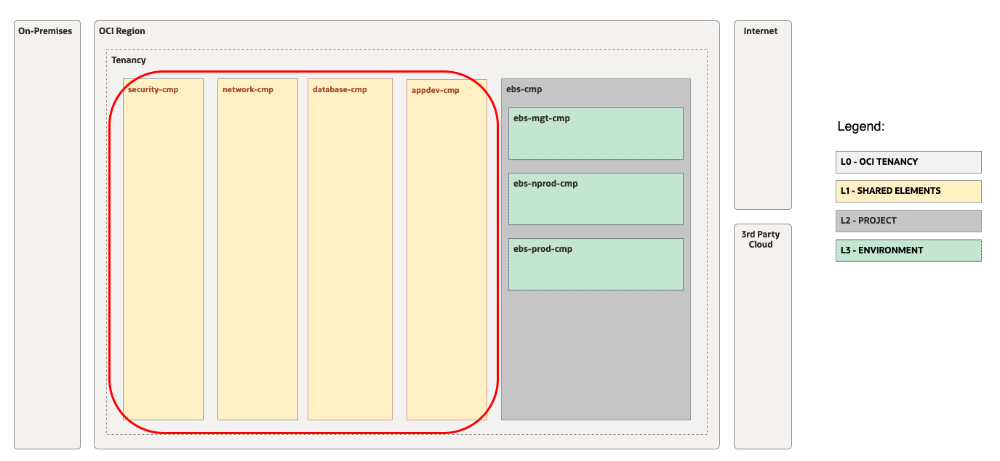
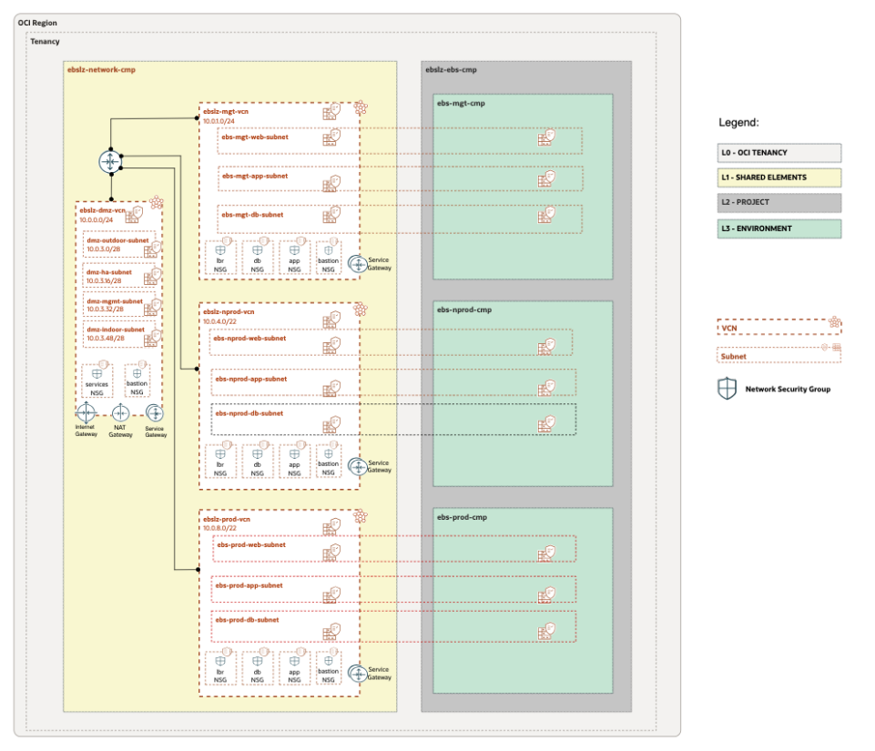

# CIS LZ.

## **Table of Contents**

[1. Summary](#1-summary) 
[2. CIS EBS Overview ](#2-CIS-EBS-Overview) 

&nbsp; 

## **1. Summary**

| |  |
|---|---| 
| **OP. ID** | OP.01 |
| **OP. NAME** | Deploy CIS LZ  | 
| **OBJECTIVE** | Deploy Network and Security core resources for an EBS LZ using CIS LZ solution |
| **TARGET RESOURCES** | - **Security**: Core Compartments, Groups, Policies, OCI Security services  - **Network**: Hub VCN, subnets, SL, NSG |
| **DETAILS** |  For more details refer to the [OCI Open LZ Design document](../../../design/OCI_Open_LZ.pdf) |
| **PRE-ACTIVITIES** | Review [CIS Overview](#2-CIS-EBS-Overview) |
| **POST-ACTIVITIES** | OP.02 |
| **RUN WITH ORM** |  . Check this [template](EBS_CIS.pdf) to select the proper values|
| **CONFIG & RUN - TERRAFORM CLI** | Go to CIS LZ GitHub Repo [https://github.com/oracle-quickstart/oci-cis-landingzone-quickstart](https://github.com/oracle-quickstart/oci-cis-landingzone-quickstart) |

&nbsp; 

## **2. CIS EBS Overview**

The outcome should cover the design shown in the next diagrams.

