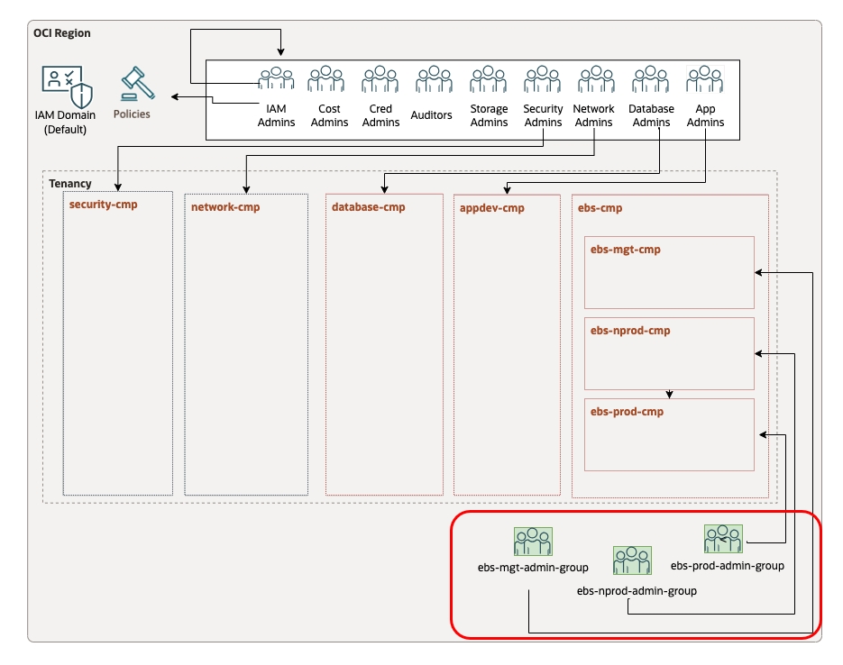

# Open LZ EBS extension Pattern.

## **Table of Contents**

[1. Summary](#1-summary)</br>
[2. Setup Terraform Authentication](#2-setup-terraform-authentication)</br>
[3. Setup IAM Configuration](#3-setup-iam-configuration)</br>
[4. Setup Network Configuration](#4-setup-network-configuration)</br>
[5. Run the Configurations (TF Plan & Apply)](#5-run-the-configurations)</br>
[6. Known Issues](#6-Known-issues)</br>


&nbsp; 

## **1. Summary**

| |  |
|---|---| 
| **OP. ID** | OP.02 |
| **OP. NAME** | Deploy EBS resources | 
| **OBJECTIVE** | Cover specific EBS network and security layers |
| **TARGET RESOURCES** | - **Security**: Compartments, Groups, Policies</br>- **Network**: Spoke VCNs, Route tables, Security Lists  |
| **IAM CONFIGURATION**| [ebs_identity_cmp_grp_pl_v1.auto.tfvars.json](/examples/oci-ebs-lz/op02-deploy-Open-EBS-pattern/json/ebs_identity_cmp_grp_pl_v1.auto.tfvars.json)|
| **NETWORK CONFIGURATION** |[ebs_network_rt_sl_v1.auto.tfvars.json](/examples/oci-ebs-lz/op02-deploy-Open-EBS-pattern/json/ebs_network_rt_sl_v1.auto.tfvars.json) |
| **DETAILS** |  For more details refer to the [OCI Open LZ Design document](../../../design/OCI_Open_LZ.pdf) |
| **PRE-ACTIVITIES** | OP.01. Deploy CIS LZ  |
| **POST-ACTIVITIES** | Deploy EBS workload |
| **RUN WITH ORM** | TBC|
| **CONFIG & RUN - TERRAFORM CLI** | Follow the steps below. |

&nbsp; 

## **2. Setup Terraform Authentication**

For authenticating against the OCI tenancy terraform execute the following [instructions](common_terraform_authentication.md).


&nbsp; 

## **3. Setup IAM Configuration**

For configuring and running the Open LZ EBS extension IAM layer use the following JSON file: [ebs_identity_cmp_grp_pl_v1.auto.tfvars.json](/examples/oci-ebs-lz/op02-deploy-Open-EBS-pattern/json/ebs_identity_cmp_grp_pl_v1.auto.tfvars.json) You can customize this configuration to fit your exact OCI IAM topology.

This configuration file will cover the following three categories of resources described in the next sections.

This configuration file will require changes to the resources to reference the OCIDs of the CIS Landing Zone which were deployed in OP01.
Search for the values indicated below and replace with the correct OCIDs:

| Resource | OCID Text to Replace | Description |
|---|---|---|
| Containing Compartment | ocid1.compartment.oc1..aaaaaaaaxxxx | The containing compartment, if there is no containing compartment then replace with the root compartment
| Root Compartment | ocid1.tenancy.oc1..aaaaaaaaxxxx | The root compartment OCID for the tenancy

&nbsp; 

###  **3.1. Compartments**

The diagram below identifies the compartments in the scope of this operation.
&nbsp; 

&nbsp; 

The corresponding json configuration for the compartment topology described above is: 

```
Example of a compartment structure creation:

{
    "compartments_configuration": {
        "enable_delete": "true",
        "default_parent_ocid": "ocid1.compartment.oc1..aaaaaaaaxzexampleocid",
        "compartments": {
            "CMP-EBS-KEY": {
                "name": "ebslz-ebs-cmp",
                "description": "EBS compartment for all resources related to EBS",
                "parent_id": "ocid1.compartment.oc1..aaaaaaaaxzexampleocid",
                "defined_tags": null,
                "freeform_tags": null,
                "children": {
                    "CMP-EBS-PROD-KEY": {
                        "name": "esblz-ebs-prod-cmp",
                        "description": "EBS prod compartment",
                        "defined_tags": null,
                        "freeform_tags": {}
                    },
                    "CMP-EBS-NONPROD-KEY": {
                        "name": "esblz-ebs-nprod-cmp",
                        "description": "EBS non prod compartment",
                        "defined_tags": null,
                        "freeform_tags": {}
                    },
                    "CMP-EBS-MNGMT-KEY": {
                        "name": "esblz-ebs-mgt-cmp",
                        "description": "EBS management compartment",
                        "defined_tags": null,
                        "freeform_tags": {}
                    }
                }
            }
        }
    },

```

For extended documentation please refer to the [Identity & Access Management CIS Terraform module compartments example](https://github.com/oracle-quickstart/terraform-oci-cis-landing-zone-iam/blob/main/compartments/examples/vision/input.auto.tfvars.template).

&nbsp; 

### **3.2 Groups**

The diagram below identifies the groups in the scope of this operation.

&nbsp; 

&nbsp; 

Example of a group creation:
```

   "groups_configuration": {
        "default_defined_tags": null,
        "default_freeform_tags": null,
        "groups": {
            "ebslz-ebs-prod-admin-group": {
                "name": "ebslz-ebs-prod-admin-group",
                "description": "EBS extension group for ebs prod management"
            },
            "ebslz-ebs-nprod-admin-group": {
                "name": "ebslz-ebs-nprod-admin-group",
                "description": "EBS extension group for ebs Non prod management"
            },
            "ebslz-ebs-mgt-admin-group": {
                "name": "cislz-ebs-mgt-admin-group",
                "description": "EBS extension group for ebs management"
            }
        }
    },

```

This automation provides fully supports any kind of OCI IAM Groups topology to be specified in the json format. 
For an example of such configuration and for extended documentation please refer to the [Identity & Access Management CIS Terraform module groups example](https://github.com/oracle-quickstart/terraform-oci-cis-landing-zone-iam/blob/main/groups/examples/vision/input.auto.tfvars.template).

&nbsp; 


### **3.3 Policies**

Example of policy creation:
```
"policies_configuration": {
        "supplied_policies": {
            "ebslz-ebs-prod-admin-policy": {
                "name": "ebslz-ebs-prod-admin-policy",
                "description": "ebs policy",
                "compartment_ocid": "ocid1.CISParentcompartment.oc1..aaaaaaaaxzexampleocid",
                "statements": [
                    "allow group ebslz-ebs-prod-admin-group to read all-resources in compartment ebslz-ebs-cmp:ebslz-ebs-prod-cmp",
                    "allow group ebslz-ebs-prod-admin-group to manage instance-family in compartment ebslz-ebs-cmp:ebslz-ebs-prod-cmp",
                    "allow group ebslz-ebs-prod-admin-group to manage database-family in compartment ebslz-ebs-cmp:ebslz-ebs-prod-cmp",
                    "allow group ebslz-ebs-prod-admin-group to manage load-balancers in compartment ebslz-ebs-cmp:ebslz-ebs-prod-cmp",
                    "allow group ebslz-ebs-prod-admin-group to manage volume-family in compartment ebslz-ebs-cmp:ebslz-ebs-prod-cmp",
                    "allow group ebslz-ebs-prod-admin-group to manage tag-namespaces in compartment ebslz-ebs-cmp:ebslz-ebs-prod-cmp",
                    "allow group ebslz-ebs-prod-admin-group to read all-resources in compartment ebslz-ebs-cmp:ebslz-ebs-prod-cmp",
                    "allow group ebslz-ebs-prod-admin-group to manage alarms in compartment ebslz-ebs-cmp:ebslz-ebs-prod-cmp",
                    "allow group ebslz-ebs-prod-admin-group to manage metrics in compartment ebslz-ebs-cmp:ebslz-ebs-prod-cmp",
                    "allow group ebslz-ebs-prod-admin-group to manage object-family in compartment ebslz-ebs-cmp:ebslz-ebs-prod-cmp",
                    "allow group ebslz-ebs-prod-admin-group to manage orm-stacks in compartment ebslz-ebs-cmp:ebslz-ebs-prod-cmp",
                    "allow group ebslz-ebs-prod-admin-group to manage orm-jobs in compartment ebslz-ebs-cmp:ebslz-ebs-prod-cmp",
                    "allow group ebslz-ebs-prod-admin-group to manage orm-config-source-providers in compartment ebslz-ebs-cmp:ebslz-ebs-prod-cmp",
                    "allow group ebslz-ebs-prod-admin-group to read audit-events in compartment ebslz-ebs-cmp:ebslz-ebs-prod-cmp",
                    "allow group ebslz-ebs-prod-admin-group to read work-requests in compartment ebslz-ebs-cmp:ebslz-ebs-prod-cmp",
                    "allow group ebslz-ebs-prod-admin-group to manage bastion-session in compartment ebslz-ebs-cmp:ebslz-ebs-prod-cmp",
                    "allow group ebslz-ebs-prod-admin-group to read instance-agent-plugins in compartment ebslz-ebs-cmp:ebslz-ebs-prod-cmp",
                    "allow group ebslz-ebs-prod-admin-group to manage functions-family in compartment ebslz-ebs-cmp:ebslz-ebs-prod-cmp",
                    "allow group ebslz-ebs-prod-admin-group to manage api-gateway-family in compartment ebslz-ebs-cmp:ebslz-ebs-prod-cmp",
                    "allow group ebslz-ebs-prod-admin-group to manage ons-family in compartment ebslz-ebs-cmp:ebslz-ebs-prod-cmp",
                    "allow group ebslz-ebs-prod-admin-group to manage streams in compartment ebslz-ebs-cmp:ebslz-ebs-prod-cmp",
                    "allow group ebslz-ebs-prod-admin-group to manage cluster-family in compartment ebslz-ebs-cmp:ebslz-ebs-prod-cmp",
                    "allow group ebslz-ebs-prod-admin-group to manage logs in compartment ebslz-ebs-cmp:ebslz-ebs-prod-cmp",
                    "allow group ebslz-ebs-prod-admin-group to manage object-family in compartment ebslz-ebs-cmp:ebslz-ebs-prod-cmp",
                    "allow group ebslz-ebs-prod-admin-group to manage repos in compartment ebslz-ebs-cmp:ebslz-ebs-prod-cmp",
                    "allow group ebslz-ebs-prod-admin-group to manage cloudevents-rules in compartment ebslz-ebs-cmp:ebslz-ebs-prod-cmp",
                    "allow group ebslz-ebs-prod-admin-group to manage alarms in compartment ebslz-ebs-cmp:ebslz-ebs-prod-cmp",
                    "allow group ebslz-ebs-prod-admin-group to manage metrics in compartment ebslz-ebs-cmp:ebslz-ebs-prod-cmp",
                    "allow group ebslz-ebs-prod-admin-group to manage logs in compartment ebslz-ebs-cmp:ebslz-ebs-prod-cmp",
                    "allow group ebslz-ebs-prod-admin-group to read instance-images in compartment ebslz-ebs-cmp:ebslz-ebs-prod-cmp",
                    "allow group ebslz-ebs-prod-admin-group to read app-catalog-listing in compartment ebslz-ebs-cmp:ebslz-ebs-prod-cmp"
                ]
            },
            "ebslz-ebs-nprod-admin-policy": {
                "name": "ebslz-ebs-nprod-admin-policy",
                "description": "ebs non prod policy",
                "compartment_ocid": "ocid1.CISParentcompartment.oc1..aaaaaaaaxzexampleocid",
                "statements": [
                    "allow group ebslz-ebs-nprod-admin-group to read all-resources in compartment ebslz-ebs-cmp:ebslz-ebs-nprod-cmp",
                    "allow group ebslz-ebs-nprod-admin-group to manage instance-family in compartment ebslz-ebs-cmp:ebslz-ebs-nprod-cmp",
                    "allow group ebslz-ebs-nprod-admin-group to manage database-family in compartment ebslz-ebs-cmp:ebslz-ebs-nprod-cmp",
                    "allow group ebslz-ebs-nprod-admin-group to manage load-balancers in compartment ebslz-ebs-cmp:ebslz-ebs-nprod-cmp",
                    "allow group ebslz-ebs-nprod-admin-group to manage volume-family in compartment ebslz-ebs-cmp:ebslz-ebs-nprod-cmp",
                    "allow group ebslz-ebs-nprod-admin-group to manage tag-namespaces in compartment ebslz-ebs-cmp:ebslz-ebs-nprod-cmp",
                    "allow group ebslz-ebs-nprod-admin-group to read all-resources in compartment ebslz-ebs-cmp:ebslz-ebs-nprod-cmp",
                    "allow group ebslz-ebs-nprod-admin-group to manage alarms in compartment ebslz-ebs-cmp:ebslz-ebs-nprod-cmp",
                    "allow group ebslz-ebs-nprod-admin-group to manage metrics in compartment ebslz-ebs-cmp:ebslz-ebs-nprod-cmp",
                    "allow group ebslz-ebs-nprod-admin-group to manage object-family in compartment ebslz-ebs-cmp:ebslz-ebs-nprod-cmp",
                    "allow group ebslz-ebs-nprod-admin-group to manage orm-stacks in compartment ebslz-ebs-cmp:ebslz-ebs-nprod-cmp",
                    "allow group ebslz-ebs-nprod-admin-group to manage orm-jobs in compartment ebslz-ebs-cmp:ebslz-ebs-nprod-cmp",
                    "allow group ebslz-ebs-nprod-admin-group to manage orm-config-source-providers in compartment ebslz-ebs-cmp:ebslz-ebs-nprod-cmp",
                    "allow group ebslz-ebs-nprod-admin-group to read audit-events in compartment ebslz-ebs-cmp:ebslz-ebs-nprod-cmp",
                    "allow group ebslz-ebs-nprod-admin-group to read work-requests in compartment ebslz-ebs-cmp:ebslz-ebs-nprod-cmp",
                    "allow group ebslz-ebs-nprod-admin-group to manage bastion-session in compartment ebslz-ebs-cmp:ebslz-ebs-nprod-cmp",
                    "allow group ebslz-ebs-nprod-admin-group to read instance-agent-plugins in compartment ebslz-ebs-cmp:ebslz-ebs-nprod-cmp",
                    "allow group ebslz-ebs-nprod-admin-group to manage functions-family in compartment ebslz-ebs-cmp:ebslz-ebs-nprod-cmp",
                    "allow group ebslz-ebs-nprod-admin-group to manage api-gateway-family in compartment ebslz-ebs-cmp:ebslz-ebs-nprod-cmp",
                    "allow group ebslz-ebs-nprod-admin-group to manage ons-family in compartment ebslz-ebs-cmp:ebslz-ebs-nprod-cmp",
                    "allow group ebslz-ebs-nprod-admin-group to manage streams in compartment ebslz-ebs-cmp:ebslz-ebs-nprod-cmp",
                    "allow group ebslz-ebs-nprod-admin-group to manage cluster-family in compartment ebslz-ebs-cmp:ebslz-ebs-nprod-cmp",
                    "allow group ebslz-ebs-nprod-admin-group to manage logs in compartment ebslz-ebs-cmp:ebslz-ebs-nprod-cmp",
                    "allow group ebslz-ebs-nprod-admin-group to manage object-family in compartment ebslz-ebs-cmp:ebslz-ebs-nprod-cmp",
                    "allow group ebslz-ebs-nprod-admin-group to manage repos in compartment ebslz-ebs-cmp:ebslz-ebs-nprod-cmp",
                    "allow group ebslz-ebs-nprod-admin-group to manage cloudevents-rules in compartment ebslz-ebs-cmp:ebslz-ebs-nprod-cmp",
                    "allow group ebslz-ebs-nprod-admin-group to read instance-images in compartment ebslz-ebs-cmp:ebslz-ebs-nprod-cmp",
                    "allow group ebslz-ebs-nprod-admin-group to read app-catalog-listing in compartment ebslz-ebs-cmp:ebslz-ebs-nprod-cmp"
                ]
            },
            "ebslz-ebs-mgt-admin-policy": {
                "name": "ebslz-ebs-mgt-admin-policy",
                "description": "ebs mngmt policy",
                "compartment_ocid": "ocid1.CISParentcompartment.oc1..aaaaaaaaxzexampleocid",
                "statements": [
                    "allow group ebslz-ebs-mgt-admin-group to read all-resources in compartment ebslz-ebs-cmp:ebslz-ebs-mgt-cmp",
                    "allow group ebslz-ebs-mgt-admin-group to manage instance-family in compartment ebslz-ebs-cmp:ebslz-ebs-mgt-cmp",
                    "allow group ebslz-ebs-mgt-admin-group to manage database-family in compartment ebslz-ebs-cmp:ebslz-ebs-mgt-cmp",
                    "allow group ebslz-ebs-mgt-admin-group to manage load-balancers in compartment ebslz-ebs-cmp:ebslz-ebs-mgt-cmp",
                    "allow group ebslz-ebs-mgt-admin-group to manage volume-family in compartment ebslz-ebs-cmp:ebslz-ebs-mgt-cmp",
                    "allow group ebslz-ebs-mgt-admin-group to manage tag-namespaces in compartment ebslz-ebs-cmp:ebslz-ebs-mgt-cmp",
                    "allow group ebslz-ebs-mgt-admin-group to read all-resources in compartment ebslz-ebs-cmp:ebslz-ebs-mgt-cmp",
                    "allow group ebslz-ebs-mgt-admin-group to manage alarms in compartment ebslz-ebs-cmp:ebslz-ebs-mgt-cmp",
                    "allow group ebslz-ebs-mgt-admin-group to manage metrics in compartment ebslz-ebs-cmp:ebslz-ebs-mgt-cmp",
                    "allow group ebslz-ebs-mgt-admin-group to manage object-family in compartment ebslz-ebs-cmp:ebslz-ebs-mgt-cmp",
                    "allow group ebslz-ebs-mgt-admin-group to manage orm-stacks in compartment ebslz-ebs-cmp:ebslz-ebs-mgt-cmp",
                    "allow group ebslz-ebs-mgt-admin-group to manage orm-jobs in compartment ebslz-ebs-cmp:ebslz-ebs-mgt-cmp",
                    "allow group ebslz-ebs-mgt-admin-group to manage orm-config-source-providers in compartment ebslz-ebs-cmp:ebslz-ebs-mgt-cmp",
                    "allow group ebslz-ebs-mgt-admin-group to read audit-events in compartment ebslz-ebs-cmp:ebslz-ebs-mgt-cmp",
                    "allow group ebslz-ebs-mgt-admin-group to read work-requests in compartment ebslz-ebs-cmp:ebslz-ebs-mgt-cmp",
                    "allow group ebslz-ebs-mgt-admin-group to manage bastion-session in compartment ebslz-ebs-cmp:ebslz-ebs-mgt-cmp",
                    "allow group ebslz-ebs-mgt-admin-group to read instance-agent-plugins in compartment ebslz-ebs-cmp:ebslz-ebs-mgt-cmp",
                    "allow group ebslz-ebs-mgt-admin-group to manage functions-family in compartment ebslz-ebs-cmp:ebslz-ebs-mgt-cmp",
                    "allow group ebslz-ebs-mgt-admin-group to manage api-gateway-family in compartment ebslz-ebs-cmp:ebslz-ebs-mgt-cmp",
                    "allow group ebslz-ebs-mgt-admin-group to manage ons-family in compartment ebslz-ebs-cmp:ebslz-ebs-mgt-cmp",
                    "allow group ebslz-ebs-mgt-admin-group to manage streams in compartment ebslz-ebs-cmp:ebslz-ebs-mgt-cmp",
                    "allow group ebslz-ebs-mgt-admin-group to manage cluster-family in compartment ebslz-ebs-cmp:ebslz-ebs-mgt-cmp",
                    "allow group ebslz-ebs-mgt-admin-group to manage logs in compartment ebslz-ebs-cmp:ebslz-ebs-mgt-cmp",
                    "allow group ebslz-ebs-mgt-admin-group to manage object-family in compartment ebslz-ebs-cmp:ebslz-ebs-mgt-cmp",
                    "allow group ebslz-ebs-mgt-admin-group to manage repos in compartment ebslz-ebs-cmp:ebslz-ebs-mgt-cmp",
                    "allow group ebslz-ebs-mgt-admin-group to manage cloudevents-rules in compartment ebslz-ebs-cmp:ebslz-ebs-mgt-cmp",
                    "allow group ebslz-ebs-mgt-admin-group to read app-catalog-listing in compartment ebslz-ebs-cmp:ebslz-ebs-mgt-cmp"
                ]
            },
            "ebslz-ebs-network-admin-policy": {
                "name": "ebslz-ebs-network-admin-policy",
                "description": "ebs neetwork policy",
                "compartment_ocid": "ocid1.CISParentcompartment.oc1..aaaaaaaaxzexampleocid",
                "statements": [
                    "allow group ebslz-ebs-mgt-admin-group, ebslz-ebs-prod-admin-group, ebslz-ebs-nprod-admin-group to read virtual-network-family in compartment ebslz1-network-cmp",
                    "allow group ebslz-ebs-mgt-admin-group, ebslz-ebs-prod-admin-group, ebslz-ebs-nonprod-admin-groupto use vnics in compartment ebslz1-network-cmp",
                    "allow group ebslz-ebs-mgt-admin-group, ebslz-ebs-prod-admin-group, ebslz-ebs-nprod-admin-group to manage private-ips in compartment ebslz1-network-cmp",
                    "allow group ebslz-ebs-mgt-admin-group, ebslz-ebs-prod-admin-group, ebslz-ebs-nonprod-admin-groupto use subnets in compartment ebslz1-network-cmp",
                    "allow group ebslz-ebs-mgt-admin-group, ebslz-ebs-prod-admin-group, ebslz-ebs-nprod-admin-group to use network-security-groups in compartment ebslz1-network-cmp"
                ]
            },
            "ebslz-ebs-security-admin-policy": {
                "name": "ebslz-ebs-security-admin-policy",
                "description": "ebs security policy",
                "compartment_ocid": "ocid1.CISParentcompartment.oc1..aaaaaaaaxzexampleocid",
                "statements": [
                    "allow group ebslz-ebs-mgt-admin-group, ebslz-ebs-prod-admin-group, ebslz-ebs-nprod-admin-group to read vss-family in compartment ebslz1-security-cmp",
                    "allow group ebslz-ebs-mgt-admin-group, ebslz-ebs-prod-admin-group, ebslz-ebs-nprod-admin-group to use vaults in compartment ebslz1-security-cmp",
                    "allow group ebslz-ebs-mgt-admin-group, ebslz-ebs-prod-admin-group, ebslz-ebs-nprod-admin-group to read logging-family in compartment ebslz1-security-cmp",
                    "allow group ebslz-ebs-mgt-admin-group, ebslz-ebs-prod-admin-group, ebslz-ebs-nprod-admin-group to use bastion in compartment ebslz1-security-cmp",
                    "allow group ebslz-ebs-mgt-admin-group, ebslz-ebs-prod-admin-group, ebslz-ebs-nprod-admin-group to manage bastion-session in compartment ebslz1-security-cmp",
                    "allow group ebslz-ebs-mgt-admin-group, ebslz-ebs-prod-admin-group, ebslz-ebs-nprod-admin-group to inspect keys in compartment ebslz1-security-cmp",
                    "allow group ebslz-ebs-mgt-admin-group, ebslz-ebs-prod-admin-group, ebslz-ebs-nprod-admin-group to manage cloudevents-rules in compartment ebslz1-security-cmp",
                    "allow group ebslz-ebs-mgt-admin-group, ebslz-ebs-prod-admin-group, ebslz-ebs-nprod-admin-group to manage alarms in compartment ebslz1-security-cmp",
                    "allow group ebslz-ebs-mgt-admin-group, ebslz-ebs-prod-admin-group, ebslz-ebs-nprod-admin-group to manage metrics in compartment ebslz1-security-cmp",
                    "allow group ebslz-ebs-mgt-admin-group, ebslz-ebs-prod-admin-group, ebslz-ebs-nprod-admin-group to read instance-agent-plugins in compartment ebslz1-security-cmp"
                ]
            },
            "ebslz-ebs-root-admin-policy": {
                "name": "ebslz-ebs-root-admin-policy",
                "description": "ebs root policy",
                "compartment_ocid": ""ocid1.rootcompartment.oc1..aaaaaaaaxzexampleocid",
                "statements": [
                    "allow group ebslz-ebs-mgt-admin-group, ebslz-ebs-prod-admin-group, ebslz-ebs-nprod-admin-group to inspect compartments in tenancy",
                    "allow group ebslz-ebs-mgt-admin-group, ebslz-ebs-prod-admin-group, ebslz-ebs-nprod-admin-group to inspect users in tenancy",
                    "allow group ebslz-ebs-mgt-admin-group, ebslz-ebs-prod-admin-group, ebslz-ebs-nprod-admin-group to inspect groups in tenancy",
                    "allow group ebslz-ebs-mgt-admin-group, ebslz-ebs-prod-admin-group, ebslz-ebs-nprod-admin-group to use tag-namespaces in tenancy where target.tag-namespace.name='Oracle-Tags'",
                    "allow group ebslz-ebs-mgt-admin-group, ebslz-ebs-prod-admin-group, ebslz-ebs-nprod-admin-group to use tag-namespaces in tenancy where target.tag-namespace.name='Operations'",
                    "allow group ebslz-ebs-mgt-admin-group, ebslz-ebs-prod-admin-group, ebslz-ebs-nprod-admin-group to use cloud-shell in tenancy",
                    "allow group ebslz-ebs-mgt-admin-group, ebslz-ebs-prod-admin-group, ebslz-ebs-nprod-admin-group to read usage-budgets in tenancy",
                    "allow group ebslz-ebs-mgt-admin-group, ebslz-ebs-prod-admin-group, ebslz-ebs-nprod-admin-group to read usage-reports in tenancy",
                    "allow group ebslz-ebs-mgt-admin-group, ebslz-ebs-prod-admin-group, ebslz-ebs-nprod-admin-group to manage app-catalog-listing in tenancy",
                    "allow group ebslz-ebs-mgt-admin-group, ebslz-ebs-prod-admin-group, ebslz-ebs-nprod-admin-group to inspect dynamic-groups in tenancy"
                ]
            }
        }
    }

```

**Note**: For each policy select your desired compartment_ocid

This automation fully supports any type of OCI IAM Policy to be specified in the json format. 
For an example of such configuration and for extended documentation please refer to the [Identity & Access Management CIS Terraform module policies examples](https://github.com/oracle-quickstart/terraform-oci-cis-landing-zone-iam/tree/main/policies/examples).


&nbsp; 

## **4. Setup Network Configuration**


For configuring and running the Open LZ EBS extension Network layer use the following JSON file: [ebs_network_rt_sl_v1.auto.tfvars.json](ebs_network_rt_sl_v1.auto.tfvars.json)

This configuration file will require changes to the resources to reference the OCIDs of the CIS Landing Zone which were deployed in OP01.
Search for the values indicated below and replace with the correct OCIDs:

| Resource | OCID Text to Replace | Description |
|---|---|---|
| VCN | ocid1.vcn.oc1.eu-frankfurt-1.xxxx | The OCID of the Hub VCN deployed by CIS ebslz-dmz-vcn
| Network Compartment | ocid1.compartment.oc1..aaaaaaaaxxxxxx | The OCID of the CIS Network Compartment ebslz-network-cmp
| Service Gateway | ocid1.servicegateway.oc1.eu-frankfurt-1.aaaaaaaxxxxxxx | The OCID of the Hub Service Gateway deployed by CIS 
| Internet Gateway | ocid1.internetgateway.oc1.eu-frankfurt-1.aaaaaaaxxxxxx | The OCID of the Hub Internet Gateway deployed by CIS 
| Dynamic Routing Gateway | ocid1.drg.oc1.eu-frankfurt-1.aaaaaaaxxxxxx | The OCID of the Hub DRG deployed by CIS 
| DRG Route Table | ocid1.drgroutetable.oc1.eu-frankfurt-1.aaaaaaaxxxxxx | The OCID of the Hub DRG VCN Route Table deployed by CIS "Autogenerated Drg Route Table for VCN attachments"

&nbsp; 

This configuration covers the following networking diagram. 

&nbsp; 


For complete documentation and a larger set of examples on configuring an OCI networking topology using this json terraform automation approach please refer to the [OCI CIS Terraform Networking Module](https://github.com/oracle-quickstart/terraform-oci-cis-landing-zone-networking) documentation and examples.

The network layer covers the next resources:

###  **4.1. Spoke VCNs**

OCI defines network resources in a hierarchy. This means that subnets, route tables, security lists, or gateways will depend on a specific VCN.
We will create three Spokes VCNs (VCN.02,VCN.03,VCN.04)

Example of a VCN creation:

```

      "vcns": {
                    "VCN-FRANKFURT-MGT-KEY": {
                        "compartment_id": "ocid1.CISNetworkcompartment.oc1..aaaaaaaaxzexampleocid",
                        "block_nat_traffic": true,
                        "cidr_blocks": [
                            "10.1.1.0/24"
                        ],
                        "display_name": "ebslz-mgt-vcn",
                        "dns_label": "ebsmgtvcnfra",
                        "is_attach_drg": false,
                        "is_create_igw": false,
                        "is_ipv6enabled": false,
                        "is_oracle_gua_allocation_enabled": false,
                        "route_tables": {},
                        "security_lists": {},
                        "subnets": {},
                        "vcn_specific_gateways": {},
                }
```
**Note**: 
* Change compartment_ocid with the ocid of the network compartment. **ebslz-network-cmp ( CMP-02 )**


###  **4.2. Subnets**

We will create a three-layer configuration, adding three subnets per vcn.

Example of a Subnet creation:

```
 "subnets": {
                            "SN-FRANKFURT-MGT-LB-KEY": {
                                "compartment_id": "ocid1.CISNetworkcompartment.oc1..aaaaaaaaxzexampleocid",
                                "availability_domain": null,
                                "cidr_block": "10.1.1.0/26",
                                "dhcp_options_key": "default_dhcp_options",
                                "display_name": "ebslz-mgt-web-subnet",
                                "dns_label": null,
                                "prohibit_internet_ingress": true,
                                "prohibit_public_ip_on_vnic": true,
                                "route_table_key": "RT-MGT-WEB-VCN-KEY",
                                "security_list_keys": [
                                    "SL-MGT-WEB-VCN-KEY"
                                ]
                            }
                        },

```
**Note**: 
* Change compartment_ocid with the ocid of the network compartment. **ebslz-network-cmp ( CMP-02 )**
* Add route_table_key and security_list_keys to assign the desired route tables and security list to each subnet.


###  **4.3. Gateways**

We will add a SG per spoke VCN.

Example of a Service Gateway creation:

```

     "vcn_specific_gateways": {
                            "service_gateways": {
                                "SG-FRANKFURT-HUB-KEY": {
                                    "compartment_id": "ocid1.CISNetworkcompartment.oc1..aaaaaaaaxzexampleocid",
                                    "display_name": "ebslz-mgt-vcn-sgw"
                                }
                            }
                        }


```
**Note**: Change compartment_ocid with the ocid of the network compartment. **ebslz-network-cmp ( CMP-02 )**


###  **4.4. Security Lists**

We will create one SL per subnet. (SL.5,SL.6,SL.7,SL.8,SL.9,SL.10,SL.11,SL.12,SL.13)

Example of a Security List creation:

```

 "security_lists": {
                            "SL-MGT-WEB-VCN-KEY": {
                                "compartment_id": "ocid1.CISNetworkcompartment.oc1..aaaaaaaaxzexampleocid",
                                "display_name": "ebslz-mgt-web-subnet-security-list",
                                "egress_rules": [
                                    {
                                        "description": "egress to 0.0.0.0/0 over ALL protocols",
                                        "dst": "0.0.0.0/0",
                                        "dst_type": "CIDR_BLOCK",
                                        "protocol": "ALL",
                                        "stateless": false
                                    }
                                ],
                                "freeform_tags": null,
                                "ingress_rules": [
                                    {
                                        "description": "ingress from 0.0.0.0/0 over TCP22",
                                        "dst_port_max": 22,
                                        "dst_port_min": 22,
                                        "protocol": "TCP",
                                        "src": "0.0.0.0/0",
                                        "src_type": "CIDR_BLOCK",
                                        "stateless": false
                                    }
                                ]
                            }
                        },

```
**Note**: Change compartment_ocid with the ocid of the network compartment. **ebslz-network-cmp ( CMP-02 )**


###  **4.5. Route Tables**

We need to create Route tables in the spoke VCNs (RT.9, RT.10, RT.11, RT.12, RT.13, RT.14, RT.15, RT.16, RT.17):

Example of a Route table creation:

```
     "route_tables": {
                            "RT-MGT-WEB-VCN-KEY": {
                                "compartment_id": "ocid1.CISNetworkcompartment.oc1..aaaaaaaaxzexampleocid",
                                "display_name": "ebslz-mgt-web-subnet-rtable",
                                "route_rules": {
                                    "drg_route": {
                                        "description": "test",
                                        "destination": "0.0.0.0/0",
                                        "destination_type": "CIDR_BLOCK",
                                        "network_entity_id": "ocid1.drg.oc1.aaaaaaaaxzexampleocid"
                                    }
                                }
                            }
                        },

```
**Note**: 
* Change compartment_ocid with the ocid of the network compartment. **ebslz-network-cmp ( CMP-02 )**
* Change network_entity_id in route rules to the corresponding service gateways ids or drg ids.


Also, we need to inject route tables in the Hub VCN (RT.5, RT.6, RT.7, RT.8): 

Example of a Route table injection:

```
        "inject_into_existing_vcns": {
                    "VCN-FRANKFURT-HUB-KEY": {
                        "vcn_id": "ocid1.vcn..oc1..aaaaaaaaxzexampleocid",
                        "route_tables": {
                            "RT-DMZ-MGMT-KEY": {
                                "compartment_id": "ocid1.CISNetworkcompartment.oc1..aaaaaaaaxzexampleocid",
                                "display_name": "ebslz-dmz-mgmt-subnet-rtable",
                                "defined_tags": null,
                                "freeform_tags": null,
                                "route_rules": {
                                    "sgw_route": {
                                        "network_entity_id":"ocid1.servicegateway.oc1.aaaaaaaaxzexampleocid",
                                        "description": "Route for sgw",
                                        "destination": "oci-fra-objectstorage",
                                        "destination_type": "SERVICE_CIDR_BLOCK"
                                    },
                                    "igw_route": {
                                        "description": "Traffic destined to 0.0.0.0/0 CIDR range goes to Internet Gateway.",
                                        "destination": "0.0.0.0/0",
                                        "destination_type": "CIDR_BLOCK",
                                        "network_entity_id": "ocid1.internetgateway.oc1.aaaaaaaaxzexampleocid"
                                    },
                                    "drg_route_1": {
                                        "description": "Traffic destined to ebs-mgt-vcn VCN goes to DRG.",
                                        "destination": "10.0.1.0/24",
                                        "destination_type": "CIDR_BLOCK",
                                        "network_entity_id": "ocid1.drg.oc1.aaaaaaaaxzexampleocid"
                                    },
                                    "drg_route_2": {
                                        "description": "Traffic destined to ebs-nprod-vcn VCN goes to DRG.",
                                        "destination": "10.0.4.0/22",
                                        "destination_type": "CIDR_BLOCK",
                                        "network_entity_id": "ocid1.drg.oc1.aaaaaaaaxzexampleocid"
                                    },
                                    "drg_route_3": {
                                        "description": "Traffic destined to ebs-prod-vcn VCN goes to DRG.",
                                        "destination": "10.0.8.0/22",
                                        "destination_type": "CIDR_BLOCK",
                                        "network_entity_id": "ocid1.drg.oc1.aaaaaaaaxzexampleocid"
                                    }
                                }
                            },

```

**Note**: 
* Change compartment_ocid with the ocid of the network compartment. **ebslz-network-cmp ( CMP-02 )**
* Change vcn_ocid with the ocid of the Hub VCN.
* Change network_entity_id in route rules to the corresponding internet gateways, service gateways ids or drg ids.


###  **4.6. DRG Attachements **

We need to add new DRG attachments (DRGA.02, DRGA.03, DRGA.04) to the DRG ( DRG.01) created by de CIS LZ (OP#01)

Example of a DRG attachment creation:

```
    "inject_into_existing_drgs": {
          "DRG-FRANKFURT-KEY":
            {
                  "drg_id": "ocid1.drg.oc1.eu-frankfurt-1.aaaaaaaxxxxxx",                                    
                  "drg_attachments": 
                  {
                     "DRG-FRANKFURT-VCN-FRANKFURT-MGT-KEY":
                     {
                        "defined_tags": null,
                        "display_name": "ebslz-mgt-vcn-drg-attachment",
                        "freeform_tags": null,
                        "drg_route_table_id": "ocid1.drgroutetable.oc1.eu-frankfurt-1.aaaaaaaxxxxxx",
                        "drg_route_table_name": null,
                        "network_details": 
                         {
                            "attached_resource_id": null,
                            "attached_resource_key": "VCN-FRANKFURT-MGT-KEY",
                            "type": "VCN",
                            "route_table_id": null,
                            "route_table_name": null,
                            "vcn_route_type": null
                         }
                   }
                }
            }

        }

```

## **5. Run the Configurations**
&nbsp; 

### **5.1 Clone this Git repo to your Machine**

```
git clone git@github.com:oracle-quickstart/terraform-oci-open-lz.git
```

For referring to a specific module version, append *ref=\<version\>* to the *source* attribute value. Example: git clone git@github.com:oracle-quickstart/terraform-oci-open-lz.git?ref=v1.0.0

&nbsp; 

###  **5.2 Change the Directory to the Terraform Orchestrator Module**

 Change the directory to the [```terraform-oci-open-lz/orchestrator```](../../../../orchestrator/) terraform orchestrator module.

&nbsp; 

 ### **5.3 Run ```terraform init```**

Run terraform init to download all the required external terraform providers and terraform modules. See [command example](./tf_init_output_example.out) for more details on the expected output.

&nbsp; 

 ### **5.4 Run ```terraform plan```**

Run terraform plan with the IAM and Network configuration.

```
terraform plan \
-var-file ../examples/oci-ebs-lz/json/oci-credentials.tfvars.json \
-var-file ../examples/oci-ebs-lz/json/ebs_identity_cmp_grp_pl_v1.auto.tfvars.json \
-var-file ../examples/oci-ebs-lz/json/ebs_network_rt_sl_v1.auto.tfvars.json \
-state ../examples/oci-ebs-lz/terraform.tfstate
```

After the execution please analyze the output of the command above and check if it corresponds to your desired configuration.

Note that the ```terraform.tfstate``` file is generated in the configuration location and not in the terraform code location. This is the expected configuration as the terraform automation can support any number of configurations and the **state file** will belong to the configuration and not to the code.
  
The ideal scenario regarding the **state file** will be for each configuration to have a corresponding OCI Object Storage location for the state file. For more details on the Terraform state file recommended configuration please refer to the following [documentation](https://docs.oracle.com/en-us/iaas/Content/API/SDKDocs/terraformUsingObjectStore.htm).

&nbsp; 

### **5.5 Run ```terraform apply```**

Run terraform plan with the IAM and Network configuration. After  its execution the configured resources will be provisioned or updated on OCI.

```
terraform apply \
-var-file ../examples/oci-ebs-lz/json/oci-credentials.tfvars.json \
-var-file ../examples/oci-ebs-lz/json/ebs_identity_cmp_grp_pl_v1.auto.tfvars.json \
-var-file ../examples/oci-ebs-lz/json/ebs_network_rt_sl_v1.auto.tfvars.json \
-state ../examples/oci-ebs-lz/terraform.tfstate

```

Depending on your json configuration configurations the output of the ```terraform apply``` should be identical or similar to this [example](./tf_apply_output_example.out).

## **6. Known Issues**

### **6.5 ```Policy error```**

```
400-InvalidParameter, Compartment {ebslz-ebs-cmp:ebslz-ebs-nprod-cmp} does not exist or is not part of the policy compartment subtree
│ Suggestion: Please update the parameter(s) in the Terraform config as per error message Compartment {ebslz-ebs-cmp:ebslz-ebs-nprod-cmp} does not exist or is not part of the policy compartment subtree
│ Documentation: https://registry.terraform.io/providers/oracle/oci/latest/docs/resources/identity_policy 
│ API Reference: https://docs.oracle.com/iaas/api/#/en/identity/20160918/Policy/CreatePolicy 
│ Request Target: POST https://identity.eu-frankfurt-1.oci.oraclecloud.com/20160918/policies 
│ Provider version: 5.15.0, released on 2023-10-04. This provider is 2 Update(s) behind to current. 
│ Service: Identity Policy 
│ Operation Name: CreatePolicy 
│ OPC request ID: 33ff328d7fe0175638e619bc27211854/3CD31809CBAC9EE12C6BE5D040D4D4E7/582906BF0BCFBB09FC88552AC6275DF7 
│ 
│ 
│   with module.cislz_policies.oci_identity_policy.these["ebslz-ebs-nprod-admin-policy"],
│   on .terraform/modules/cislz_policies/policies/main.tf line 22, in resource "oci_identity_policy" "these":
│   22: resource "oci_identity_policy" "these" {
│ 
```
**Analysis:**
The compartment associated to the policy is not available during policy creation.

**workaround:**
Re-run the apply job.
