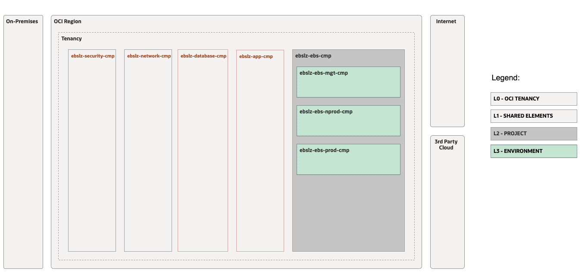
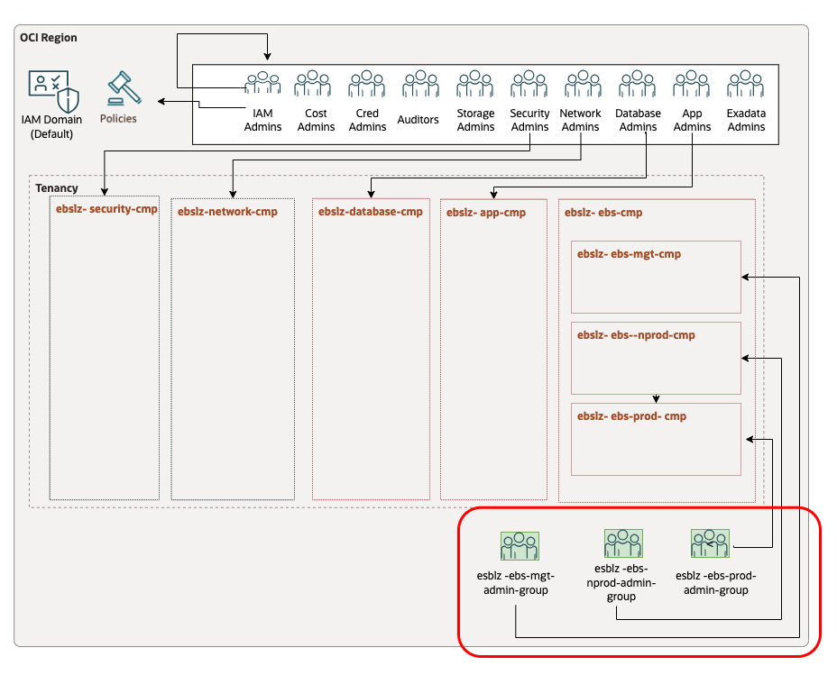
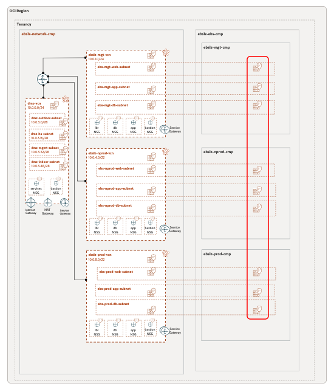

# OCI EBS Landing Zone

## **Table of Contents**

1. [Summary](#1-summary)</br>
2. [Review the Design](#2-review-the-design)</br>
3. [Setup IAM Configuration](#3-setup-iam-configuration)</br>
4. [Setup Network Configuration](#4-setup-network-configuration)</br>
5. [Run with ORM](#5-run-configurations-with-orm) or 6. [Run with Terraform CLI](#6-run-configurations-with-terraform-cli)</br>
6. [Known Issues](#7-known-issues)</br>


&nbsp; 

## **1. Summary**

| |  |
|---|---| 
| **OP. ID** | OP.EBS.01 |
| **OP. NAME** | Manage EBS Landing Resources | 
| **OBJECTIVE** | - Create compartments and IAM for EBS. </br>- Injecct into CIS LZ network Route Tables and Security List. |
| **TARGET RESOURCES** | - **Security**: Compartments, Groups, Policies</br>- **Network**: Route tables, Security Lists  |
| **IAM CONFIGURATION**| [ebs_identity_cmp_grp_pl_v1.auto.tfvars.json](ebs_identity_cmp_grp_pl_v1.auto.tfvars.json)|
| **NETWORK CONFIGURATION** |[ebs_network_rt_sl_v1.auto.tfvars.json](ebs_network_rt_sl_v1.auto.tfvars.json) |
| **DETAILS** |  This EBS setup is an extension of the CIS OCI Landing Zone. |
| **PRE-ACTIVITIES** | Deploy [CIS OCI Landing Zone](https://github.com/oracle-devrel/technology-engineering/blob/main/landing-zones/standard_landing_zones/cis_lz_v2/cis_landing_zone_v2.md).  |
| **ACTIVITIES** | [a. Review the Design](#2-review-the-design)</br>[b. Setup IAM Configuration](#3-setup-iam-configuration) </br>[c. Setup Network Configuration](#4-setup-network-configuration)</br>d. [Run with ORM](#5-run-configurations-with-orm) or with [Terraform CLI](#6-run-configurations-with-terraform-cli) . |
| **POST-ACTIVITIES** | EBS Landing Zone is ready. Install EBS. |


&nbsp; 

## **2. Review the Design**

To be updated soon with drawio.

&nbsp; 

## **3. Setup IAM Configuration**

For configuring and running the Open LZ EBS extension IAM layer use the following JSON file: [ebs_identity_cmp_grp_pl_v1.auto.tfvars.json](ebs_identity_cmp_grp_pl_v1.auto.tfvars.json) You can customize this configuration to fit your exact OCI IAM topology.

This configuration file will cover the following three categories of resources described in the next sections.

&nbsp; 

###  **3.1. Compartments**

The diagram below identifies the compartments in the scope of this operation.
&nbsp; 

&nbsp; 

The corresponding json configuration for the compartment topology described above is: 

```
...
{
    "compartments_configuration": {
        "enable_delete": "true",
        "default_parent_ocid": "ocid1.compartment.oc1..aaaaaaaaxzexampleocid",
        "compartments": {
            "CMP-EBS-KEY": {
                "name": "ebslz-ebs-cmp",
                "description": "EBS compartment for all resources related to EBS",
                "parent_id": "ocid1.compartment.oc1..aaaaaaaaxzexampleocid",
                "defined_tags": null,
                "freeform_tags": null,
                "children": {
                    "CMP-EBS-PROD-KEY": {
                        "name": "esblz-ebs-prod-cmp",
                        "description": "EBS prod compartment",
                        "defined_tags": null,
                        "freeform_tags": {}
                    },
                    "CMP-EBS-NONPROD-KEY": {
                        "name": "esblz-ebs-nprod-cmp",
                        "description": "EBS non prod compartment",
                        "defined_tags": null,
                        "freeform_tags": {}
                    },
                    "CMP-EBS-MNGMT-KEY": {
                        "name": "esblz-ebs-mgt-cmp",
                        "description": "EBS management compartment",
                        "defined_tags": null,
                        "freeform_tags": {}
                    }
                }
            }
        }
    },
...
```

For extended documentation please refer to the [Identity & Access Management CIS Terraform module compartments example](https://github.com/oracle-quickstart/terraform-oci-cis-landing-zone-iam/blob/main/compartments/examples/vision/input.auto.tfvars.template).

&nbsp; 

### **3.2 Groups**

The diagram below identifies the groups in the scope of this operation.

&nbsp; 

&nbsp; 

```
...
   "groups_configuration": {
        "default_defined_tags": null,
        "default_freeform_tags": null,
        "groups": {
            "ebslz-ebs-prod-admin-group": {
                "name": "ebslz-ebs-prod-admin-group",
                "description": "EBS extension group for ebs prod management"
            },
            "ebslz-ebs-nprod-admin-group": {
                "name": "ebslz-ebs-nprod-admin-group",
                "description": "EBS extension group for ebs Non prod management"
            },
            "ebslz-ebs-mgt-admin-group": {
                "name": "cislz-ebs-mgt-admin-group",
                "description": "EBS extension group for ebs management"
            }
        }
    },
...
```

This automation provides fully supports any kind of OCI IAM Groups topology to be specified in the json format. 
For an example of such configuration and for extended documentation please refer to the [Identity & Access Management CIS Terraform module groups example](https://github.com/oracle-quickstart/terraform-oci-cis-landing-zone-iam/blob/main/groups/examples/vision/input.auto.tfvars.template).

&nbsp; 


### **3.3 Policies**


**Note**: For each policy select your desired compartment_ocid

```
...

"policies_configuration": {
        "supplied_policies": {
            "ebslz-ebs-prod-admin-policy": {
                "name": "ebslz-ebs-prod-admin-policy",
                "description": "ebs policy",
                "compartment_ocid": "ocid1.CISParentcompartment.oc1..aaaaaaaaxzexampleocid",
                "statements": [
                    "allow group ebslz-ebs-prod-admin-group to read all-resources in compartment ebslz-ebs-cmp:ebslz-ebs-prod-cmp",
                    "allow group ebslz-ebs-prod-admin-group to manage instance-family in compartment ebslz-ebs-cmp:ebslz-ebs-prod-cmp",
                    "allow group ebslz-ebs-prod-admin-group to manage database-family in compartment ebslz-ebs-cmp:ebslz-ebs-prod-cmp",
                    "allow group ebslz-ebs-prod-admin-group to manage load-balancers in compartment ebslz-ebs-cmp:ebslz-ebs-prod-cmp",
                    "allow group ebslz-ebs-prod-admin-group to manage volume-family in compartment ebslz-ebs-cmp:ebslz-ebs-prod-cmp",
                    "allow group ebslz-ebs-prod-admin-group to manage tag-namespaces in compartment ebslz-ebs-cmp:ebslz-ebs-prod-cmp",
                    "allow group ebslz-ebs-prod-admin-group to read all-resources in compartment ebslz-ebs-cmp:ebslz-ebs-prod-cmp",
                    "allow group ebslz-ebs-prod-admin-group to manage alarms in compartment ebslz-ebs-cmp:ebslz-ebs-prod-cmp",
                    "allow group ebslz-ebs-prod-admin-group to manage metrics in compartment ebslz-ebs-cmp:ebslz-ebs-prod-cmp",
                    "allow group ebslz-ebs-prod-admin-group to manage object-family in compartment ebslz-ebs-cmp:ebslz-ebs-prod-cmp",
                    "allow group ebslz-ebs-prod-admin-group to manage orm-stacks in compartment ebslz-ebs-cmp:ebslz-ebs-prod-cmp",
                    "allow group ebslz-ebs-prod-admin-group to manage orm-jobs in compartment ebslz-ebs-cmp:ebslz-ebs-prod-cmp",
                    "allow group ebslz-ebs-prod-admin-group to manage orm-config-source-providers in compartment ebslz-ebs-cmp:ebslz-ebs-prod-cmp",
                    "allow group ebslz-ebs-prod-admin-group to read audit-events in compartment ebslz-ebs-cmp:ebslz-ebs-prod-cmp",
                    "allow group ebslz-ebs-prod-admin-group to read work-requests in compartment ebslz-ebs-cmp:ebslz-ebs-prod-cmp",
                    "allow group ebslz-ebs-prod-admin-group to manage bastion-session in compartment ebslz-ebs-cmp:ebslz-ebs-prod-cmp",
                    "allow group ebslz-ebs-prod-admin-group to read instance-agent-plugins in compartment ebslz-ebs-cmp:ebslz-ebs-prod-cmp",
                    "allow group ebslz-ebs-prod-admin-group to manage functions-family in compartment ebslz-ebs-cmp:ebslz-ebs-prod-cmp",
                    "allow group ebslz-ebs-prod-admin-group to manage api-gateway-family in compartment ebslz-ebs-cmp:ebslz-ebs-prod-cmp",
                    "allow group ebslz-ebs-prod-admin-group to manage ons-family in compartment ebslz-ebs-cmp:ebslz-ebs-prod-cmp",
                    "allow group ebslz-ebs-prod-admin-group to manage streams in compartment ebslz-ebs-cmp:ebslz-ebs-prod-cmp",
                    "allow group ebslz-ebs-prod-admin-group to manage cluster-family in compartment ebslz-ebs-cmp:ebslz-ebs-prod-cmp",
                    "allow group ebslz-ebs-prod-admin-group to manage logs in compartment ebslz-ebs-cmp:ebslz-ebs-prod-cmp",
                    "allow group ebslz-ebs-prod-admin-group to manage object-family in compartment ebslz-ebs-cmp:ebslz-ebs-prod-cmp",
                    "allow group ebslz-ebs-prod-admin-group to manage repos in compartment ebslz-ebs-cmp:ebslz-ebs-prod-cmp",
                    "allow group ebslz-ebs-prod-admin-group to manage cloudevents-rules in compartment ebslz-ebs-cmp:ebslz-ebs-prod-cmp",
                    "allow group ebslz-ebs-prod-admin-group to manage alarms in compartment ebslz-ebs-cmp:ebslz-ebs-prod-cmp",
                    "allow group ebslz-ebs-prod-admin-group to manage metrics in compartment ebslz-ebs-cmp:ebslz-ebs-prod-cmp",
                    "allow group ebslz-ebs-prod-admin-group to manage logs in compartment ebslz-ebs-cmp:ebslz-ebs-prod-cmp",
                    "allow group ebslz-ebs-prod-admin-group to read instance-images in compartment ebslz-ebs-cmp:ebslz-ebs-prod-cmp",
                    "allow group ebslz-ebs-prod-admin-group to read app-catalog-listing in compartment ebslz-ebs-cmp:ebslz-ebs-prod-cmp"
                ]
            },
            "ebslz-ebs-nprod-admin-policy": {
                "name": "ebslz-ebs-nprod-admin-policy",
                "description": "ebs non prod policy",
                "compartment_ocid": "ocid1.CISParentcompartment.oc1..aaaaaaaaxzexampleocid",
                "statements": [
                    "allow group ebslz-ebs-nprod-admin-group to read all-resources in compartment ebslz-ebs-cmp:ebslz-ebs-nprod-cmp",
                    "allow group ebslz-ebs-nprod-admin-group to manage instance-family in compartment ebslz-ebs-cmp:ebslz-ebs-nprod-cmp",
                    "allow group ebslz-ebs-nprod-admin-group to manage database-family in compartment ebslz-ebs-cmp:ebslz-ebs-nprod-cmp",
                    "allow group ebslz-ebs-nprod-admin-group to manage load-balancers in compartment ebslz-ebs-cmp:ebslz-ebs-nprod-cmp",
                    "allow group ebslz-ebs-nprod-admin-group to manage volume-family in compartment ebslz-ebs-cmp:ebslz-ebs-nprod-cmp",
                    "allow group ebslz-ebs-nprod-admin-group to manage tag-namespaces in compartment ebslz-ebs-cmp:ebslz-ebs-nprod-cmp",
                    "allow group ebslz-ebs-nprod-admin-group to read all-resources in compartment ebslz-ebs-cmp:ebslz-ebs-nprod-cmp",
                    "allow group ebslz-ebs-nprod-admin-group to manage alarms in compartment ebslz-ebs-cmp:ebslz-ebs-nprod-cmp",
                    "allow group ebslz-ebs-nprod-admin-group to manage metrics in compartment ebslz-ebs-cmp:ebslz-ebs-nprod-cmp",
                    "allow group ebslz-ebs-nprod-admin-group to manage object-family in compartment ebslz-ebs-cmp:ebslz-ebs-nprod-cmp",
                    "allow group ebslz-ebs-nprod-admin-group to manage orm-stacks in compartment ebslz-ebs-cmp:ebslz-ebs-nprod-cmp",
                    "allow group ebslz-ebs-nprod-admin-group to manage orm-jobs in compartment ebslz-ebs-cmp:ebslz-ebs-nprod-cmp",
                    "allow group ebslz-ebs-nprod-admin-group to manage orm-config-source-providers in compartment ebslz-ebs-cmp:ebslz-ebs-nprod-cmp",
                    "allow group ebslz-ebs-nprod-admin-group to read audit-events in compartment ebslz-ebs-cmp:ebslz-ebs-nprod-cmp",
                    "allow group ebslz-ebs-nprod-admin-group to read work-requests in compartment ebslz-ebs-cmp:ebslz-ebs-nprod-cmp",
                    "allow group ebslz-ebs-nprod-admin-group to manage bastion-session in compartment ebslz-ebs-cmp:ebslz-ebs-nprod-cmp",
                    "allow group ebslz-ebs-nprod-admin-group to read instance-agent-plugins in compartment ebslz-ebs-cmp:ebslz-ebs-nprod-cmp",
                    "allow group ebslz-ebs-nprod-admin-group to manage functions-family in compartment ebslz-ebs-cmp:ebslz-ebs-nprod-cmp",
                    "allow group ebslz-ebs-nprod-admin-group to manage api-gateway-family in compartment ebslz-ebs-cmp:ebslz-ebs-nprod-cmp",
                    "allow group ebslz-ebs-nprod-admin-group to manage ons-family in compartment ebslz-ebs-cmp:ebslz-ebs-nprod-cmp",
                    "allow group ebslz-ebs-nprod-admin-group to manage streams in compartment ebslz-ebs-cmp:ebslz-ebs-nprod-cmp",
                    "allow group ebslz-ebs-nprod-admin-group to manage cluster-family in compartment ebslz-ebs-cmp:ebslz-ebs-nprod-cmp",
                    "allow group ebslz-ebs-nprod-admin-group to manage logs in compartment ebslz-ebs-cmp:ebslz-ebs-nprod-cmp",
                    "allow group ebslz-ebs-nprod-admin-group to manage object-family in compartment ebslz-ebs-cmp:ebslz-ebs-nprod-cmp",
                    "allow group ebslz-ebs-nprod-admin-group to manage repos in compartment ebslz-ebs-cmp:ebslz-ebs-nprod-cmp",
                    "allow group ebslz-ebs-nprod-admin-group to manage cloudevents-rules in compartment ebslz-ebs-cmp:ebslz-ebs-nprod-cmp",
                    "allow group ebslz-ebs-nprod-admin-group to read instance-images in compartment ebslz-ebs-cmp:ebslz-ebs-nprod-cmp",
                    "allow group ebslz-ebs-nprod-admin-group to read app-catalog-listing in compartment ebslz-ebs-cmp:ebslz-ebs-nprod-cmp"
                ]
            },
            "ebslz-ebs-mgt-admin-policy": {
                "name": "ebslz-ebs-mgt-admin-policy",
                "description": "ebs mngmt policy",
                "compartment_ocid": "ocid1.CISParentcompartment.oc1..aaaaaaaaxzexampleocid",
                "statements": [
                    "allow group ebslz-ebs-mgt-admin-group to read all-resources in compartment ebslz-ebs-cmp:ebslz-ebs-mgt-cmp",
                    "allow group ebslz-ebs-mgt-admin-group to manage instance-family in compartment ebslz-ebs-cmp:ebslz-ebs-mgt-cmp",
                    "allow group ebslz-ebs-mgt-admin-group to manage database-family in compartment ebslz-ebs-cmp:ebslz-ebs-mgt-cmp",
                    "allow group ebslz-ebs-mgt-admin-group to manage load-balancers in compartment ebslz-ebs-cmp:ebslz-ebs-mgt-cmp",
                    "allow group ebslz-ebs-mgt-admin-group to manage volume-family in compartment ebslz-ebs-cmp:ebslz-ebs-mgt-cmp",
                    "allow group ebslz-ebs-mgt-admin-group to manage tag-namespaces in compartment ebslz-ebs-cmp:ebslz-ebs-mgt-cmp",
                    "allow group ebslz-ebs-mgt-admin-group to read all-resources in compartment ebslz-ebs-cmp:ebslz-ebs-mgt-cmp",
                    "allow group ebslz-ebs-mgt-admin-group to manage alarms in compartment ebslz-ebs-cmp:ebslz-ebs-mgt-cmp",
                    "allow group ebslz-ebs-mgt-admin-group to manage metrics in compartment ebslz-ebs-cmp:ebslz-ebs-mgt-cmp",
                    "allow group ebslz-ebs-mgt-admin-group to manage object-family in compartment ebslz-ebs-cmp:ebslz-ebs-mgt-cmp",
                    "allow group ebslz-ebs-mgt-admin-group to manage orm-stacks in compartment ebslz-ebs-cmp:ebslz-ebs-mgt-cmp",
                    "allow group ebslz-ebs-mgt-admin-group to manage orm-jobs in compartment ebslz-ebs-cmp:ebslz-ebs-mgt-cmp",
                    "allow group ebslz-ebs-mgt-admin-group to manage orm-config-source-providers in compartment ebslz-ebs-cmp:ebslz-ebs-mgt-cmp",
                    "allow group ebslz-ebs-mgt-admin-group to read audit-events in compartment ebslz-ebs-cmp:ebslz-ebs-mgt-cmp",
                    "allow group ebslz-ebs-mgt-admin-group to read work-requests in compartment ebslz-ebs-cmp:ebslz-ebs-mgt-cmp",
                    "allow group ebslz-ebs-mgt-admin-group to manage bastion-session in compartment ebslz-ebs-cmp:ebslz-ebs-mgt-cmp",
                    "allow group ebslz-ebs-mgt-admin-group to read instance-agent-plugins in compartment ebslz-ebs-cmp:ebslz-ebs-mgt-cmp",
                    "allow group ebslz-ebs-mgt-admin-group to manage functions-family in compartment ebslz-ebs-cmp:ebslz-ebs-mgt-cmp",
                    "allow group ebslz-ebs-mgt-admin-group to manage api-gateway-family in compartment ebslz-ebs-cmp:ebslz-ebs-mgt-cmp",
                    "allow group ebslz-ebs-mgt-admin-group to manage ons-family in compartment ebslz-ebs-cmp:ebslz-ebs-mgt-cmp",
                    "allow group ebslz-ebs-mgt-admin-group to manage streams in compartment ebslz-ebs-cmp:ebslz-ebs-mgt-cmp",
                    "allow group ebslz-ebs-mgt-admin-group to manage cluster-family in compartment ebslz-ebs-cmp:ebslz-ebs-mgt-cmp",
                    "allow group ebslz-ebs-mgt-admin-group to manage logs in compartment ebslz-ebs-cmp:ebslz-ebs-mgt-cmp",
                    "allow group ebslz-ebs-mgt-admin-group to manage object-family in compartment ebslz-ebs-cmp:ebslz-ebs-mgt-cmp",
                    "allow group ebslz-ebs-mgt-admin-group to manage repos in compartment ebslz-ebs-cmp:ebslz-ebs-mgt-cmp",
                    "allow group ebslz-ebs-mgt-admin-group to manage cloudevents-rules in compartment ebslz-ebs-cmp:ebslz-ebs-mgt-cmp",
                    "allow group ebslz-ebs-mgt-admin-group to read app-catalog-listing in compartment ebslz-ebs-cmp:ebslz-ebs-mgt-cmp"
                ]
            },
            "ebslz-ebs-network-admin-policy": {
                "name": "ebslz-ebs-network-admin-policy",
                "description": "ebs neetwork policy",
                "compartment_ocid": "ocid1.CISParentcompartment.oc1..aaaaaaaaxzexampleocid",
                "statements": [
                    "allow group ebslz-ebs-mgt-admin-group, ebslz-ebs-prod-admin-group, ebslz-ebs-nprod-admin-group to read virtual-network-family in compartment ebslz1-network-cmp",
                    "allow group ebslz-ebs-mgt-admin-group, ebslz-ebs-prod-admin-group, ebslz-ebs-nonprod-admin-groupto use vnics in compartment ebslz1-network-cmp",
                    "allow group ebslz-ebs-mgt-admin-group, ebslz-ebs-prod-admin-group, ebslz-ebs-nprod-admin-group to manage private-ips in compartment ebslz1-network-cmp",
                    "allow group ebslz-ebs-mgt-admin-group, ebslz-ebs-prod-admin-group, ebslz-ebs-nonprod-admin-groupto use subnets in compartment ebslz1-network-cmp",
                    "allow group ebslz-ebs-mgt-admin-group, ebslz-ebs-prod-admin-group, ebslz-ebs-nprod-admin-group to use network-security-groups in compartment ebslz1-network-cmp"
                ]
            },
            "ebslz-ebs-security-admin-policy": {
                "name": "ebslz-ebs-security-admin-policy",
                "description": "ebs security policy",
                "compartment_ocid": ""ocid1.CISParentcompartment.oc1..aaaaaaaaxzexampleocid",
                "statements": [
                    "allow group ebslz-ebs-mgt-admin-group, ebslz-ebs-prod-admin-group, ebslz-ebs-nprod-admin-group to read vss-family in compartment ebslz1-security-cmp",
                    "allow group ebslz-ebs-mgt-admin-group, ebslz-ebs-prod-admin-group, ebslz-ebs-nprod-admin-group to use vaults in compartment ebslz1-security-cmp",
                    "allow group ebslz-ebs-mgt-admin-group, ebslz-ebs-prod-admin-group, ebslz-ebs-nprod-admin-group to read logging-family in compartment ebslz1-security-cmp",
                    "allow group ebslz-ebs-mgt-admin-group, ebslz-ebs-prod-admin-group, ebslz-ebs-nprod-admin-group to use bastion in compartment ebslz1-security-cmp",
                    "allow group ebslz-ebs-mgt-admin-group, ebslz-ebs-prod-admin-group, ebslz-ebs-nprod-admin-group to manage bastion-session in compartment ebslz1-security-cmp",
                    "allow group ebslz-ebs-mgt-admin-group, ebslz-ebs-prod-admin-group, ebslz-ebs-nprod-admin-group to inspect keys in compartment ebslz1-security-cmp",
                    "allow group ebslz-ebs-mgt-admin-group, ebslz-ebs-prod-admin-group, ebslz-ebs-nprod-admin-group to manage cloudevents-rules in compartment ebslz1-security-cmp",
                    "allow group ebslz-ebs-mgt-admin-group, ebslz-ebs-prod-admin-group, ebslz-ebs-nprod-admin-group to manage alarms in compartment ebslz1-security-cmp",
                    "allow group ebslz-ebs-mgt-admin-group, ebslz-ebs-prod-admin-group, ebslz-ebs-nprod-admin-group to manage metrics in compartment ebslz1-security-cmp",
                    "allow group ebslz-ebs-mgt-admin-group, ebslz-ebs-prod-admin-group, ebslz-ebs-nprod-admin-group to read instance-agent-plugins in compartment ebslz1-security-cmp"
                ]
            },
            "ebslz-ebs-root-admin-policy": {
                "name": "cislz-ebs-root-admin-policy",
                "description": "ebs root policy",
                "compartment_ocid": ""ocid1.rootcompartment.oc1..aaaaaaaaxzexampleocid",
                "statements": [
                    "allow group ebslz-ebs-mgt-admin-group, ebslz-ebs-prod-admin-group, ebslz-ebs-nprod-admin-group to inspect compartments in tenancy",
                    "allow group ebslz-ebs-mgt-admin-group, ebslz-ebs-prod-admin-group, ebslz-ebs-nprod-admin-group to inspect users in tenancy",
                    "allow group ebslz-ebs-mgt-admin-group, ebslz-ebs-prod-admin-group, ebslz-ebs-nprod-admin-group to inspect groups in tenancy",
                    "allow group ebslz-ebs-mgt-admin-group, ebslz-ebs-prod-admin-group, ebslz-ebs-nprod-admin-group to use tag-namespaces in tenancy where target.tag-namespace.name='Oracle-Tags'",
                    "allow group ebslz-ebs-mgt-admin-group, ebslz-ebs-prod-admin-group, ebslz-ebs-nprod-admin-group to use tag-namespaces in tenancy where target.tag-namespace.name='Operations'",
                    "allow group ebslz-ebs-mgt-admin-group, ebslz-ebs-prod-admin-group, ebslz-ebs-nprod-admin-group to use cloud-shell in tenancy",
                    "allow group ebslz-ebs-mgt-admin-group, ebslz-ebs-prod-admin-group, ebslz-ebs-nprod-admin-group to read usage-budgets in tenancy",
                    "allow group ebslz-ebs-mgt-admin-group, ebslz-ebs-prod-admin-group, ebslz-ebs-nprod-admin-group to read usage-reports in tenancy",
                    "allow group ebslz-ebs-mgt-admin-group, ebslz-ebs-prod-admin-group, ebslz-ebs-nprod-admin-group to manage app-catalog-listing in tenancy",
                    "allow group ebslz-ebs-mgt-admin-group, ebslz-ebs-prod-admin-group, ebslz-ebs-nprod-admin-group to inspect dynamic-groups in tenancy"
                ]
            }
        }
    }

  
...
```

This automation fully supports any type of OCI IAM Policy to be specified in the json format. 
For an example of such configuration and for extended documentation please refer to the [Identity & Access Management CIS Terraform module policies examples](https://github.com/oracle-quickstart/terraform-oci-cis-landing-zone-iam/tree/main/policies/examples).


&nbsp; 

## **4. Setup Network Configuration**


For configuring and running the Open LZ EBS extension Network layer use the following JSON file: [ebs_network_rt_sl_v1.auto.tfvars.json](ebs_network_rt_sl_v1.auto.tfvars.json)
This configuration covers the following networking diagram. We are deploying Table routes and Security Lists.

&nbsp; 



For complete documentation and a larger set of examples on configuring an OCI networking topology using this json terraform automation approach please refer to the [OCI CIS Terraform Networking Module](https://github.com/oracle-quickstart/terraform-oci-cis-landing-zone-networking) documentation and examples.

**Note:**
&nbsp; 
* change compartment_id with the OCID of the network cmp (created with CIS LZ in ##OP01)
* change all vcn_id for the corresponding vcn of each route table.
* change network_entity_id in route rules to the corresponding service gateways ids or drg ids.

&nbsp; 

## **5. Run Configurations with ORM**
&nbsp; 
| |  |
|---|---| 
| 1 |  [](https://cloud.oracle.com/resourcemanager/stacks/create?zipUrl=https://github.com/oracle-quickstart/terraform-oci-open-lz/archive/refs/heads/master.zip&zipUrlVariables={"input_config_files_urls":"https://raw.githubusercontent.com/oracle-quickstart/terraform-oci-open-lz/master/examples/oci-ebs-lz/ebs_identity_cmp_grp_pl_v1.auto.tfvars.json,https://raw.githubusercontent.com/oracle-quickstart/terraform-oci-open-lz/master/examples/oci-ebs-lz/ebs_identity_cmp_grp_pl_v1.auto.tfvars.json"}) |
| 2 |  Accept terms,  wait for the configuration to load. 
| 3 |  Set the working directory to “orm-facade”. | 
| 4 | Set the stack name to "OP.EBS.01 - Manage EBS Landing Resources". | 
| 5 | Set the terraform version to 1.2.x. Click Next. | 
| 6 | Accept the defaul configurations. Click Next. Optionally, replace with your json/yaml config files. | 
| 7 | Un-check run apply. Click Create.| 


&nbsp; 


## **6. Run Configurations with Terraform CLI**
&nbsp; 

### **6.1. Setup Terraform Authentication**

For authenticating against the OCI tenancy terraform execute the following [instructions](../common_terraform_authentication.md).


&nbsp; 


### **6.2 Clone this Git repo to your Machine**

```
git clone git@github.com:oracle-quickstart/terraform-oci-open-lz.git
```

For referring to a specific module version, append *ref=\<version\>* to the *source* attribute value. Example: git clone git@github.com:oracle-quickstart/terraform-oci-open-lz.git?ref=v1.0.0

&nbsp; 

###  **6.3 Change the Directory to the Terraform Orchestrator Module**

 Change the directory to the [```terraform-oci-open-lz/orchestrator```](../../../../orchestrator/) terraform orchestrator module.

&nbsp; 

 ### **6.4 Run ```terraform init```**

Run terraform init to download all the required external terraform providers and terraform modules. See [command example](./tf_init_output_example.out) for more details on the expected output.

&nbsp; 

 ### **6.5 Run ```terraform plan```**

Run terraform plan with the IAM and Network configuration.

```
terraform plan \
-var-file ../examples/oci-ebs-lz/oci-credentials.tfvars.json \
-var-file ../examples/oci-ebs-lz/ebs_identity_cmp_grp_pl_v1.auto.tfvars.json \
-var-file ../examples/oci-ebs-lz/ebs_network_rt_sl_v1.auto.tfvars.json \
-state ../examples/oci-ebs-lz/terraform.tfstate
```

After the execution please analyze the output of the command above and check if it corresponds to your desired configuration.

Note that the ```terraform.tfstate``` file is generated in the configuration location and not in the terraform code location. This is the expected configuration as the terraform automation can support any number of configurations and the **state file** will belong to the configuration and not to the code.
  
The ideal scenario regarding the **state file** will be for each configuration to have a corresponding OCI Object Storage location for the state file. For more details on the Terraform state file recommended configuration please refer to the following [documentation](https://docs.oracle.com/en-us/iaas/Content/API/SDKDocs/terraformUsingObjectStore.htm).

&nbsp; 

### **6.6 Run ```terraform apply```**

Run terraform plan with the IAM and Network configuration. After  its execution the configured resources will be provisioned or updated on OCI.

```
terraform apply \
-var-file ../examples/oci-ebs-lz/oci-credentials.tfvars.json \
-var-file ../examples/oci-ebs-lz/ebs_identity_cmp_grp_pl_v1.auto.tfvars.json \
-var-file ../examples/oci-ebs-lz/ebs_network_rt_sl_v1.auto.tfvars.json \
-state ../examples/oci-ebs-lz/terraform.tfstate

```

Depending on your json configuration configurations the output of the ```terraform apply``` should be identical or similar to this [example](./tf_apply_output_example.out).

## **7. Known Issues**

### **7.1 ```Policy error```**

```
400-InvalidParameter, Compartment {ebslz-ebs-cmp:ebslz-ebs-nprod-cmp} does not exist or is not part of the policy compartment subtree
│ Suggestion: Please update the parameter(s) in the Terraform config as per error message Compartment {ebslz-ebs-cmp:ebslz-ebs-nprod-cmp} does not exist or is not part of the policy compartment subtree
│ Documentation: https://registry.terraform.io/providers/oracle/oci/latest/docs/resources/identity_policy 
│ API Reference: https://docs.oracle.com/iaas/api/#/en/identity/20160918/Policy/CreatePolicy 
│ Request Target: POST https://identity.eu-frankfurt-1.oci.oraclecloud.com/20160918/policies 
│ Provider version: 5.15.0, released on 2023-10-04. This provider is 2 Update(s) behind to current. 
│ Service: Identity Policy 
│ Operation Name: CreatePolicy 
│ OPC request ID: 33ff328d7fe0175638e619bc27211854/3CD31809CBAC9EE12C6BE5D040D4D4E7/582906BF0BCFBB09FC88552AC6275DF7 
│ 
│ 
│   with module.cislz_policies.oci_identity_policy.these["ebslz-ebs-nprod-admin-policy"],
│   on .terraform/modules/cislz_policies/policies/main.tf line 22, in resource "oci_identity_policy" "these":
│   22: resource "oci_identity_policy" "these" {
│ 
```
**Analysis:**
The compartment associated to the policy is not available during policy creation.

**workaround:**
Re-run the apply job.
