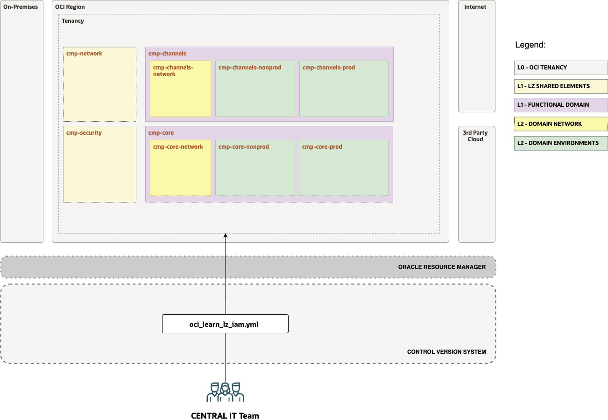

# OCI Learn LZ - Exercise #1 - Tenancy Structure

## **Table of Contents**

[1. Objective](#1-objective) 
[2. View Initial Design and Configuration](#2-view-the-initial-configuration) 
[3. Complete the Configuration](#3-complete-the-configuration) 
[4. Version the Configuration](#4-version-your-configuration) 
[5. Run the Configuration](#5-run-your-configuration-with-orm) 

&nbsp; 

## 1. Objective 

Welcome to the **Open Learn LZ** Exercise #1. 

The main objective is to **create**, **version**, and **run** the IaC configurations for the OCI Learn LZ Tenancy Structure.

In this exercise, you will create the tenancy structure IaC configuration for the missing domains. Your IT Central Team colleagues already started this, **your mission is to finish the configuration.** 

&nbsp; 

## 2. View the Initial Configuration

Your objective is to review the initial tenancy structure created by your team, containing part of the **channels** domain.

&nbsp; 

| ACTIVITY | DESCRIPTION   | 
|---|---|
| 1 | Open the [Drawio design](/examples/oci-learn-lz/OCI_Learn_LZ.drawio) file, and select tab "SEC - EXERCISE #1" |
| 2 | Enable the Layer "STEP 1 - TEMPLATE". Make sure the STEP 2 layers is disabled. |
| 3 | Review the tenancy structure design that is already created. The image below presents it. |
| 4 | Review the tenancy structure IaC related configuration in oci-learn-lz/exercise1/config-yaml/[oci_learn_lz_iam_initial.yml](/examples/oci-learn-lz/exercise1/config_yaml/oci_learn_lz_iam_final.yml). |

&nbsp; 

&nbsp; 

## 3. Complete the Configuration

Your objective is to update the tenancy structure with a missing application **core systems domain**, and finalize the **channels** domain.

&nbsp; 

| ACTIVITY | DESCRIPTION   | 
|---|---|
| 1 | Open the [Drawio design](/examples/oci-learn-lz/OCI_Learn_LZ.drawio) file, and select tab "SEC - EXERCISE #1" |
| 2 | Enable the Layer "STEP 2 - EXERCISE". Make sure the STEP 1 layers is enabled. |
| 3 | Review the target tenancy structure design with the two domains. The image below presents it. |
| 4 | Update the final tenancy structure IaC related configuration and save it as "**oci_learn_lz_iam_updated.yml**". |

&nbsp; 

&nbsp; 

## 4. Version your Configuration

Your objective is to commit to your operations git repository the new configuration.

&nbsp; 

| ACTIVITY | DESCRIPTION   | 
|---|---|
| 1 | Commit to you operations git repository the new IaC IAM configuration file (**oci_learn_lz_iam_updated.yml**). The image below is a high-level representations of this. |

&nbsp; 

&nbsp; 

## 5. Run your Configuration with ORM

Your objective is to run your new configuration with ORM. The image below contains the high-level automation mechanism, which is based on an ORM Stack that is linked to your versioned configuration file(s).

&nbsp; 

| ACTIVITY | DESCRIPTION   | 
|---|---| 
| **1** | [](https://cloud.oracle.com/resourcemanager/stacks/create?zipUrl=https://github.com/oracle-quickstart/terraform-oci-open-lz/archive/refs/heads/master.zip&zipUrlVariables={"input_config_files_urls":"https://raw.githubusercontent.com/oracle-quickstart/terraform-oci-open-lz/master/examples/oci-open-lz/op01_manage_shared_services/open_lz_shared_identity.auto.tfvars.json,https://raw.githubusercontent.com/oracle-quickstart/terraform-oci-open-lz/master/examples/oci-open-lz/op01_manage_shared_services/open_lz_shared_network.auto.tfvars.json"}) |
| **2** | Accept terms,  wait for the configuration to load. |
| **3** | Set the working directory to “**orm-facade**”. | 
| **4** | Set the stack name you prefer. | 
| **5** | Set the terraform version to 1.2.x. Click Next. | 
| **6** | Accept the defaul configurations. Click Next.  |
| **7** | Delete the default configuration and update it with the **git raw link to you new IAM file**.|
| **8** | Un-check run apply. Click Create. |
| **9** | Run terraform Plan, and Terraform Apply |
| **10** | Review the created resources, they should match the design diagrams. |

&nbsp; 

&nbsp; 

&nbsp; 

After finalizing this exercise you have now a coherent set of artifacts: a design, a versioned configuration, OCI instantiated resources, and an ORM stack that contains the statefile.

You can proceed to [Exercise 2](/examples/oci-learn-lz/exercise2/readme.md).

&nbsp; 

# License

Copyright (c) 2023 Oracle and/or its affiliates.

Licensed under the Universal Permissive License (UPL), Version 1.0.

See [LICENSE](LICENSE) for more details.

