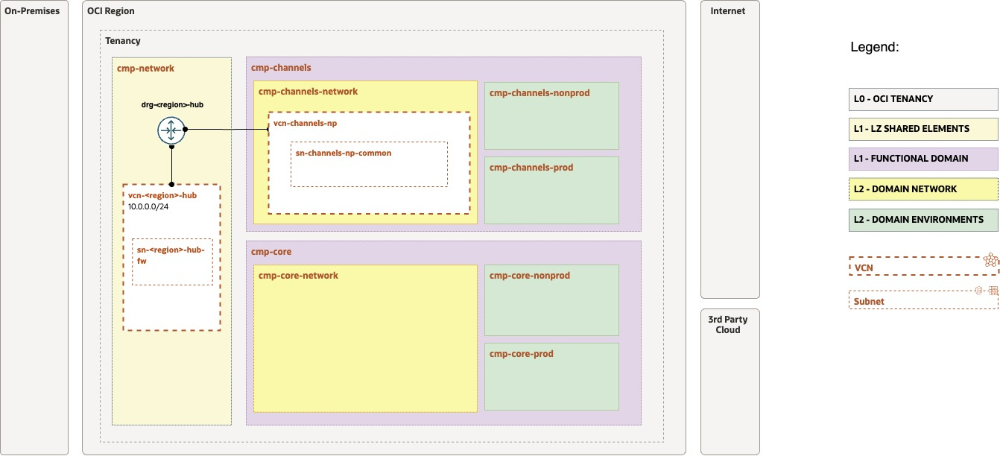
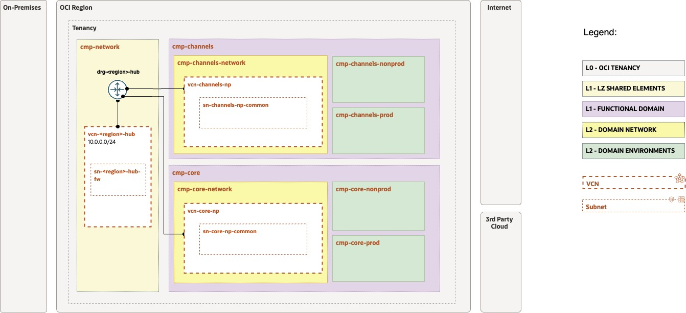
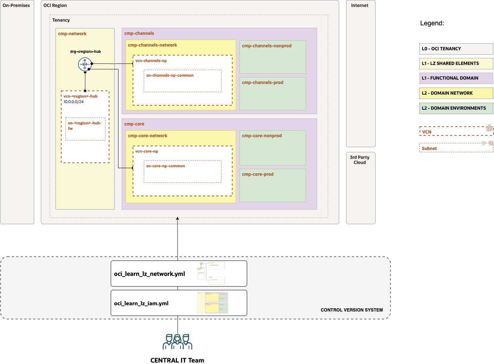
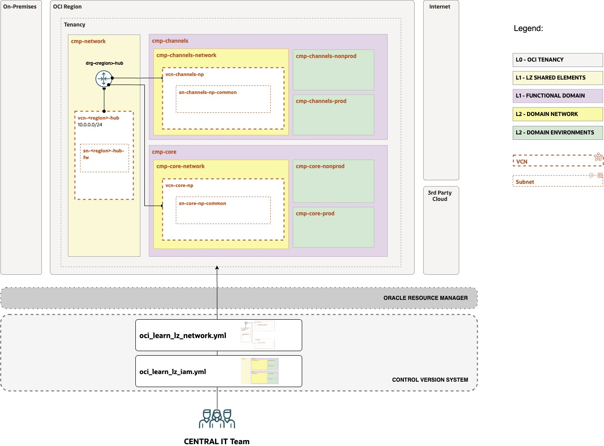

# OCI Learn LZ - Exercise #2 Network Structure

## **Table of Contents**

[1. Objective](#1-objective) 
[2. View Initial Design and Configuration](#2-view-the-initial-configuration) 
[3. Complete the Configuration](#3-complete-the-configuration) 
[4. Version the Configuration](#4-version-your-configuration) 
[5. Run the Configuration](#5-run-your-configuration-with-orm) 

&nbsp; 

## 1. Objective 

Welcome to the **Open Learn LZ** Exercise #2. 

The main objective is to **create**, **version**, and **run** the IaC configurations for the OCI Learn LZ Network Structure.

In this exercise, you will create the network structure IaC configuration that will contain the Hub and one Domain (Channels). Your IT Central Team colleagues already started this, **your mission is to finish the configuration.** 

&nbsp; 

## 2. View the Initial Configuration

Your objective is to review the initial network structure created by your team, containing the **hub elements**.

&nbsp; 

| ACTIVITY | DESCRIPTION   | 
|---|---|
| 1 | Open the [Drawio design](/examples/oci-learn-lz/OCI_Learn_LZ.drawio) file, and select tab "NET - EXERCISE #2" |
| 2 | Enable the Layer "STEP 1 - TEMPLATE". Make sure the STEP 2 layer is disabled. |
| 3 | Review the network structure design that is already created. The image below presents it. |
| 4 | Review the tenancy structure IaC related configuration in oci-learn-lz/exercise2/config-yaml/[oci_learn_lz_network_initial.yml](/examples/oci-learn-lz/exercise2/config_yaml/oci_learn_lz_network_initial.yml). |

&nbsp; 

&nbsp; 

## 3. Complete the Configuration

Your objective is to update the network structure and add the network elements for the application **channel domain**.

&nbsp; 

| ACTIVITY | DESCRIPTION   | 
|---|---|
| 1 | Open the [Drawio design](/examples/oci-learn-lz/OCI_Learn_LZ.drawio) file, and select tab "NET - EXERCISE #2" |
| 2 | Enable the Layer "STEP 2 - EXERCISE". Make sure the STEP 1 layer is enabled. |
| 3 | Review the target network structure design for the domain. The image below presents it. |
| 4 | Update the final network structure IaC related configuration and save it as "**oci_learn_lz_network_updated.yml**". |

&nbsp; 

&nbsp; 

## 4. Version your Configuration

Your objective is to commit the new IaC configuration to your operations git repository.

&nbsp; 

| ACTIVITY | DESCRIPTION   | 
|---|---|
| 1 | Commit to you operations git repository the new IaC Network configuration file (**oci_learn_lz_network_updated.yml**). The image belowcontains a high-level representations of this. |

&nbsp; 

&nbsp; 

## 5. Update and Run your ORM Stack  

Your objective is to update your ORM stack from exercise 1 with the network configuration. The image below contains the high-level automation mechanism, which is based on an ORM Stack that is linked to your versioned configuration file(s).

&nbsp; 

| ACTIVITY | DESCRIPTION   | 
|---|---| 
| **1** | Edit the ORM Stack created on Exercise #1. |
| **2** | Don't change any value on the first screen. Click Next.  |
| **3** | Add the new network configuration by copying and pasting the **git raw url** of the **oci_learn_lz_network_updated.yml**.  **NOTE**: Do not delete the existing IAM configuration, this is an incremental operation on resources. |
| **4** | Run terraform Plan, and Terraform Apply |
| **5** | Review the created resources, they should match the design diagrams. |

&nbsp; 

&nbsp; 

&nbsp; 

After finalizing this exercise you have now a coherent set of artifacts: a design, a versioned configuration, OCI instantiated resources, and an ORM stack that contains the state file.

Thank you for executing these exercises. More follow-up exercises will be added soon, for new domains and north-south and east-west communications. Don't hesitate to reach out for any related topic.

&nbsp; 

# License

Copyright (c) 2023 Oracle and/or its affiliates.

Licensed under the Universal Permissive License (UPL), Version 1.0.

See [LICENSE](LICENSE) for more details.

