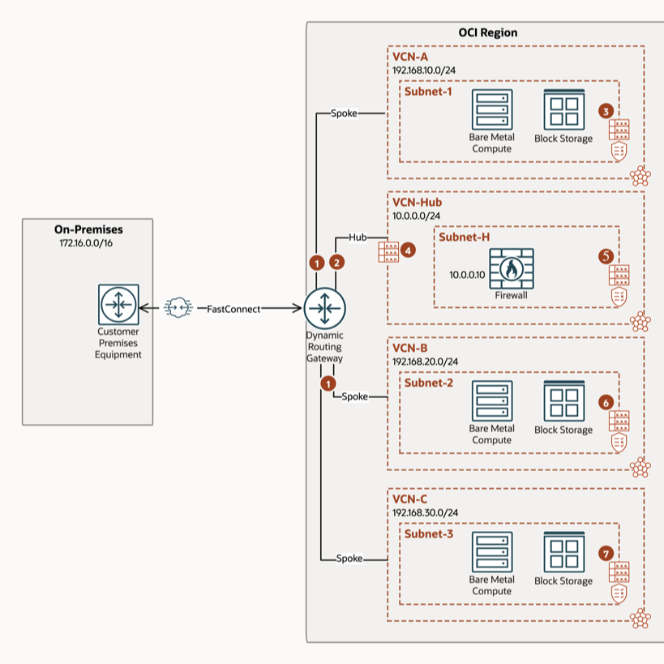

<!-- BEGIN_TF_DOCS -->
# Transit routing with a DRG hub and a network virtual appliance in an attached VCN 

## Description

This is an example for a "***Transit routing with a DRG hub and a network virtual appliance in an attached VCN***" instantiation of the ```terraform-oci-cis-landing-zone-networking``` networking core module.

For detailed description of the ```terraform-oci-cis-landing-zone-networking``` networking core module please refer to the core module specific [README.md](../../README.md) and [SPEC.md](../../SPEC.md).

This example shows a DRG acting as a hub and an attached VCN with a firewall.

For a complete example documentation please access this [OCI Documentation link](https://docs.public.oneportal.content.oci.oraclecloud.com/en-us/iaas/Content/Network/Tasks/scenario_g.htm#scenario_g__onramp_example).

## Diagram of the provisioned networking topology



## Instantiation

For clarity and proper separation and isolation we've separated the input parameters into 2 files by leveraging terraform ```*.auto.tfvars``` feature:

- [terraform.tfvars](./terraform.tfvars.template)


- [network_configuration.auto.tfvars](./network_configuration.auto.tfvars)

### Using the Module with ORM**

For an ad-hoc use where you can select your resources, follow these guidelines:
1. [](https://cloud.oracle.com/resourcemanager/stacks/create?zipUrl=https://github.com/oracle-quickstart/terraform-oci-open-lz/archive/refs/heads/master.zip&zipUrlVariables={"input_config_files_urls":"https://raw.githubusercontent.com/oracle-quickstart/terraform-oci-open-lz/master/examples/oci-learn-lz/op00_manage_lz/final_config/oci_learn_lz_initial_identity.yml,https://raw.githubusercontent.com/oracle-quickstart/terraform-oci-open-lz/master/examples/oci-learn-lz/op00_manage_lz/final_config/oci_learn_lz_initial_network_no_nfw.yml"})

2. Accept terms,  wait for the configuration to load. 
3. Set the working directory to “orm-facade”. 
4. Set the stack name you prefer.
5. Set the terraform version to 1.2.x. Click Next. 
6. Add your json/yaml configuration files. Click Next.
8. Un-check run apply. Click Create.

## Know Issues

### Gaps

#### No coverage for DRG Route Table dynamic(BGP) route rules

Currently, the ```terraform-oci-cis-landing-zone-networking``` terraform OCI networking module does not cover ```DrgRouteDistribution``` and ```DrgRouteDistributionStatements``` and, consequently, the creation of dynamic route rules inside the DRG Route Tables is not supported yet. 

The above gap it is on the roadmap and it will be covered.

Until it gets covered the only workaround available is to provision this configuration in 2 steps:

- STEP 1: Run this automation with the ```DRG-RT-HUB-KEY``` DRG Route Table containing no route rules.
- STEP 2: After STEP 1 is performed succesfully, go to the OCI Console and populate the ```DRG-RT-HUB-KEY``` with the corresponding BGP discovered dynamic route rules.

### Limitations

#### Provisioning of the Private IP Route Rules in 2 steps

In order to avoid a cycle in the Terraform dependency graph, cycle created in between the folloiwng nodes: [```oci_core_subnet.these```, ```oci_core_route_table.*all*``` and ```oci_network_firewall_network_firewall.these```], the provisioning of route tables route rules that target private IPs need to be performed in 2 steps.

For our specific use-case, covered in this example, those stepts will be:

- STEP 1: Run this automation with ```VCN-H-INGRESS-RT-KEY``` VCN Route Table containing no route rules. 
- STEP 2: After STEP 1 is performed succesfully perform the following:
    - Add the following ```route_rules``` to the ```VCN-H-INGRESS-RT-KEY``` VCN Route Table:
      ```
      ON-PREMISES-TO-NFW-PrivateIP-KEY = {
                  network_entity_id = "ocid1.privateip....." 
                  description       = "Route for fwd-ing traffic that has as destination the on-premises through the NFW"
                  destination       = "172.16.0.0/16"
                  destination_type  = "CIDR_BLOCK"
                }
        VCN-A-TO-NFW-PrivateIP-KEY = {
                  network_entity_id = "ocid1.privateip....."
                  description       = "Route for fwd-ing traffic that has as destination the VCN-A through the NFW"
                  destination       = "192.168.10.0/24"
                  destination_type  = "CIDR_BLOCK"
                }
        VCN-B-TO-NFW-PrivateIP-KEY = {
                  network_entity_id = "ocid1.privateip....."
                  description       = "Route for fwd-ing traffic that has as destination the VCN-B through the NFW"
                  destination       = "192.168.20.0/24"
                  destination_type  = "CIDR_BLOCK"
                }
        VCN-C-TO-NFW-PrivateIP-KEY = {
                  network_entity_id = "ocid1.privateip....."
                  description       = "Route for fwd-ing traffic that has as destination the VCN-C through the NFW"
                  destination       = "192.168.30.0/24"
                  destination_type  = "CIDR_BLOCK"
                }
      ```
    - copy the NFW private IP OCID: ```ipv4address_ocid``` from the output of the terraform apply you run in STEP 1 and replace the ```"ocid1.privateip....."``` in the above route rules with the new private ip OCID.
    - Run ```terraform apply``` against the updated configuration.


